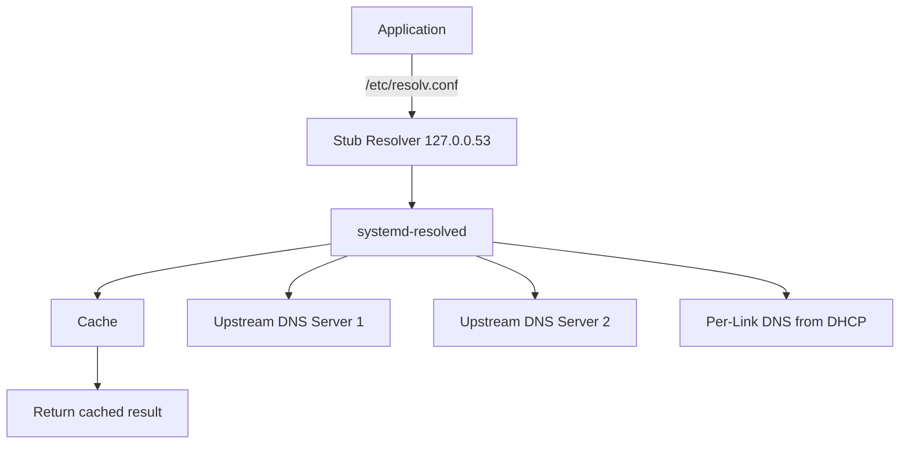

# How to Use Ansible to Manage systemd-resolved

Author: [nawazdhandala](https://www.github.com/nawazdhandala)

Tags: Ansible, systemd-resolved, DNS, Linux, Networking

Description: Learn how to configure systemd-resolved with Ansible for DNS resolution, including custom DNS servers, DNSSEC, DNS-over-TLS, and split-horizon DNS.

---

systemd-resolved is the DNS resolver service that ships with systemd. It provides DNS name resolution, DNSSEC validation, DNS-over-TLS support, and a local caching stub resolver. On modern Ubuntu, Fedora, and Arch Linux systems, it is the default DNS resolver. Configuring it correctly across your fleet with Ansible ensures consistent DNS behavior, proper security settings, and correct resolution of internal domain names.

## How systemd-resolved Works

systemd-resolved runs as a system service and provides DNS resolution through multiple interfaces:



Applications send DNS queries to the stub resolver at 127.0.0.53 (configured in `/etc/resolv.conf`). systemd-resolved checks its cache first, then forwards to the configured upstream servers.

## Basic Configuration

The main configuration file is `/etc/systemd/resolved.conf`.

Deploy a basic resolved configuration:

```yaml
---
- name: Configure systemd-resolved
  hosts: all
  become: yes
  tasks:
    - name: Deploy resolved configuration
      ansible.builtin.template:
        src: resolved.conf.j2
        dest: /etc/systemd/resolved.conf
        owner: root
        group: root
        mode: '0644'
      notify: Restart resolved

    - name: Ensure systemd-resolved is running
      ansible.builtin.systemd:
        name: systemd-resolved
        state: started
        enabled: yes

  handlers:
    - name: Restart resolved
      ansible.builtin.systemd:
        name: systemd-resolved
        state: restarted
```

## The Configuration Template

A complete Jinja2 template covering all important resolved settings:

```ini
# /etc/systemd/resolved.conf
# Managed by Ansible - do not edit manually
[Resolve]

#-- DNS Servers --#

# Primary DNS servers
DNS={{ resolved_dns | join(' ') }}



# Fallback DNS servers (used when per-link servers are unavailable)
FallbackDNS={{ resolved_fallback_dns | join(' ') }}



# Search domains
Domains={{ resolved_domains | join(' ') }}


#-- Security --#
# DNSSEC validation: true, false, or allow-downgrade
DNSSEC={{ resolved_dnssec | default('allow-downgrade') }}

# DNS-over-TLS: true, false, or opportunistic
DNSOverTLS={{ resolved_dns_over_tls | default('opportunistic') }}

#-- Protocols --#
# Enable multicast DNS
MulticastDNS={{ resolved_multicast_dns | default('yes') }}

# Enable LLMNR (Link-Local Multicast Name Resolution)
LLMNR={{ resolved_llmnr | default('yes') }}

#-- Cache --#
# Enable DNS caching
Cache={{ resolved_cache | default('yes') }}

# Cache for negative responses (NXDOMAIN)
CacheFromLocalhost={{ resolved_cache_from_localhost | default('no') }}

#-- Stub Listener --#
# Run the local DNS stub listener on 127.0.0.53
DNSStubListener={{ resolved_stub_listener | default('yes') }}


ReadEtcHosts={{ resolved_read_etc_hosts }}

```

## Setting Custom DNS Servers

Configure specific DNS servers for your infrastructure.

Playbook with environment-specific DNS settings:

```yaml
---
- name: Configure DNS resolution
  hosts: all
  become: yes

  vars:
    # Internal DNS servers for corp network
    resolved_dns:
      - 10.0.1.53
      - 10.0.2.53
    # Public fallback if internal DNS is down
    resolved_fallback_dns:
      - 1.1.1.1
      - 8.8.8.8
      - 9.9.9.9
    # Search domains
    resolved_domains:
      - internal.example.com
      - example.com

  tasks:
    - name: Deploy resolved configuration
      ansible.builtin.template:
        src: resolved.conf.j2
        dest: /etc/systemd/resolved.conf
      notify: Restart resolved

  handlers:
    - name: Restart resolved
      ansible.builtin.systemd:
        name: systemd-resolved
        state: restarted
```

## Setting Up the Stub Resolver

For systemd-resolved to work as the system resolver, `/etc/resolv.conf` needs to point to the stub listener.

Configure /etc/resolv.conf to use the resolved stub:

```yaml
- name: Check current resolv.conf setup
  ansible.builtin.stat:
    path: /etc/resolv.conf
  register: resolv_stat

- name: Remove existing resolv.conf if not a symlink
  ansible.builtin.file:
    path: /etc/resolv.conf
    state: absent
  when: not resolv_stat.stat.islnk

- name: Create symlink to resolved stub
  ansible.builtin.file:
    src: /run/systemd/resolve/stub-resolv.conf
    dest: /etc/resolv.conf
    state: link
    force: yes
```

The symlink to `/run/systemd/resolve/stub-resolv.conf` contains:

```
nameserver 127.0.0.53
options edns0 trust-ad
search internal.example.com example.com
```

## Enabling DNS-over-TLS

DNS-over-TLS encrypts DNS queries between the resolver and upstream DNS servers, preventing eavesdropping and tampering.

Configure DNS-over-TLS with compatible servers:

```yaml
- name: Configure DNS-over-TLS
  ansible.builtin.template:
    src: resolved.conf.j2
    dest: /etc/systemd/resolved.conf
  vars:
    # Use DNS servers that support TLS
    resolved_dns:
      - "1.1.1.1#cloudflare-dns.com"
      - "1.0.0.1#cloudflare-dns.com"
      - "8.8.8.8#dns.google"
      - "8.8.4.4#dns.google"
    resolved_dns_over_tls: "yes"  # strict mode
    resolved_dnssec: "allow-downgrade"
  notify: Restart resolved
```

The `#hostname` syntax tells resolved which TLS hostname to verify when connecting to each server. Setting `DNSOverTLS=yes` means queries will fail rather than fall back to unencrypted if TLS is not available. Use `opportunistic` to allow fallback.

## Configuring DNSSEC

DNSSEC validates that DNS responses have not been tampered with.

Enable DNSSEC validation:

```yaml
- name: Enable DNSSEC
  ansible.builtin.template:
    src: resolved.conf.j2
    dest: /etc/systemd/resolved.conf
  vars:
    resolved_dnssec: "yes"  # strict validation
    resolved_dns:
      - 1.1.1.1
      - 8.8.8.8
  notify: Restart resolved
```

Options for DNSSEC:
- `yes`: Strict validation. Queries fail if DNSSEC validation fails.
- `allow-downgrade`: Validate when possible, but do not fail if the zone is not signed.
- `no`: No DNSSEC validation.

For most production environments, `allow-downgrade` is the safest default because many internal DNS zones are not DNSSEC-signed.

## Split-Horizon DNS

In corporate environments, you need different DNS servers for different domains. Internal domains should go to internal DNS, while everything else goes to public DNS.

Configure per-link DNS for split-horizon resolution:

```yaml
- name: Configure split-horizon DNS
  ansible.builtin.command: >
    resolvectl dns {{ item.interface }}
    {{ item.dns_servers | join(' ') }}
  loop:
    - interface: eth0
      dns_servers:
        - 10.0.1.53
        - 10.0.2.53

- name: Set per-link search domains
  ansible.builtin.command: >
    resolvectl domain {{ item.interface }}
    {{ item.domains | join(' ') }}
  loop:
    - interface: eth0
      domains:
        - "~internal.example.com"
        - "~corp.example.com"
```

The `~` prefix means "routing domain" - queries for these domains are routed to the DNS servers configured for this interface, but the domain is not added to the search path.

For a more persistent approach, use networkd or NetworkManager configuration:

```yaml
- name: Deploy networkd config with DNS settings
  ansible.builtin.copy:
    dest: /etc/systemd/network/10-eth0.network
    content: |
      [Match]
      Name=eth0

      [Network]
      DHCP=yes

      [DHCPv4]
      UseDNS=false

      [Network]
      DNS=10.0.1.53
      DNS=10.0.2.53
      Domains=~internal.example.com ~corp.example.com
    mode: '0644'
  notify: Restart networkd
```

## Disabling the Stub Listener

In some cases (like running a local DNS server), you need to disable the stub listener to free port 53.

Disable the stub listener for local DNS servers:

```yaml
- name: Disable resolved stub listener
  ansible.builtin.template:
    src: resolved.conf.j2
    dest: /etc/systemd/resolved.conf
  vars:
    resolved_stub_listener: "no"
  notify: Restart resolved

- name: Point resolv.conf to the full resolver instead
  ansible.builtin.file:
    src: /run/systemd/resolve/resolv.conf
    dest: /etc/resolv.conf
    state: link
    force: yes
```

Note the difference: `/run/systemd/resolve/resolv.conf` contains the actual upstream DNS servers, while `/run/systemd/resolve/stub-resolv.conf` points to the stub at 127.0.0.53.

## Verifying DNS Configuration

After deploying changes, verify everything works.

Verify DNS resolution and configuration:

```yaml
- name: Check resolved status
  ansible.builtin.command: resolvectl status
  register: resolved_status
  changed_when: false

- name: Display resolved status
  ansible.builtin.debug:
    var: resolved_status.stdout_lines

- name: Test DNS resolution
  ansible.builtin.command: "resolvectl query {{ item }}"
  register: dns_tests
  loop:
    - example.com
    - internal.example.com
    - google.com
  changed_when: false
  failed_when: false

- name: Show DNS test results
  ansible.builtin.debug:
    msg: "{{ item.item }}: {{ item.stdout_lines[0] | default('FAILED') }}"
  loop: "{{ dns_tests.results }}"
  loop_control:
    label: "{{ item.item }}"

- name: Check DNS cache statistics
  ansible.builtin.command: resolvectl statistics
  register: dns_stats
  changed_when: false

- name: Display cache statistics
  ansible.builtin.debug:
    var: dns_stats.stdout_lines
```

## Flushing the DNS Cache

Sometimes you need to clear the DNS cache after making changes.

Flush the systemd-resolved DNS cache:

```yaml
- name: Flush DNS cache
  ansible.builtin.command: resolvectl flush-caches
  changed_when: true

- name: Verify cache was flushed
  ansible.builtin.command: resolvectl statistics
  register: cache_stats
  changed_when: false
```

## Disabling Multicast DNS and LLMNR

On servers, you typically want to disable mDNS and LLMNR for security.

Harden resolved for server use:

```yaml
- name: Deploy server-hardened resolved config
  ansible.builtin.template:
    src: resolved.conf.j2
    dest: /etc/systemd/resolved.conf
  vars:
    resolved_multicast_dns: "no"
    resolved_llmnr: "no"
    resolved_dnssec: "allow-downgrade"
    resolved_dns_over_tls: "opportunistic"
    resolved_cache: "yes"
  notify: Restart resolved
```

## Summary

systemd-resolved is a capable DNS resolver that can handle caching, DNSSEC, DNS-over-TLS, and split-horizon resolution. Ansible makes it easy to deploy consistent DNS configuration across your fleet. The key decisions are: which upstream DNS servers to use, whether to enable DNSSEC and DNS-over-TLS, how to handle split-horizon for internal domains, and whether to keep or disable the stub listener. For production servers, disable mDNS and LLMNR, enable DNS-over-TLS at least in opportunistic mode, and use `allow-downgrade` for DNSSEC until all your zones are signed. Always verify resolution works after making changes, because broken DNS breaks everything.
