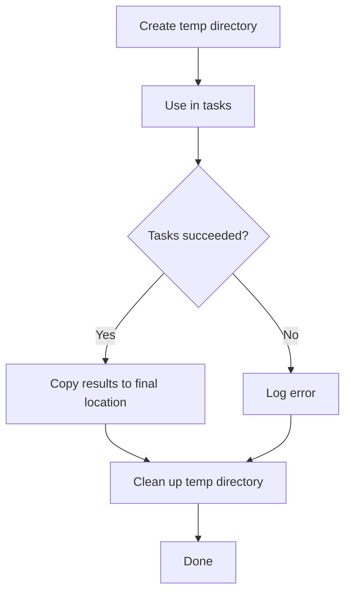

# How to Use Ansible to Manage Temporary Directories

Author: [nawazdhandala](https://www.github.com/nawazdhandala)

Tags: Ansible, File Management, DevOps, Automation

Description: How to create, use, and clean up temporary directories in Ansible playbooks using tempfile module and best practices.

---

Temporary directories come up constantly in Ansible work. You need a scratch space to download an installer, extract an archive, compile something from source, or stage files before moving them into place. Getting this right means your playbooks stay clean and your target hosts do not accumulate leftover junk in `/tmp`. This post covers how to properly create, use, and clean up temp directories with Ansible.

## The tempfile Module

Ansible has a dedicated `tempfile` module that creates temporary files and directories on remote hosts. It works like `mktemp` on the command line and returns the path of the created resource.

Here is the basic usage for creating a temporary directory:

```yaml
# Create a temporary directory on the remote host
- name: Create temp directory for build artifacts
  ansible.builtin.tempfile:
    state: directory
    prefix: myapp_build_
    suffix: _tmp
  register: build_tmpdir

# Use the temp directory in subsequent tasks
- name: Download source archive to temp directory
  ansible.builtin.get_url:
    url: https://releases.example.com/myapp-2.5.0.tar.gz
    dest: "{{ build_tmpdir.path }}/myapp-2.5.0.tar.gz"
    mode: '0644'

- name: Extract source archive
  ansible.builtin.unarchive:
    src: "{{ build_tmpdir.path }}/myapp-2.5.0.tar.gz"
    dest: "{{ build_tmpdir.path }}"
    remote_src: yes
```

The `register` keyword captures the module output, and `build_tmpdir.path` gives you the full path to the created directory. The `prefix` and `suffix` parameters help you identify the directory in case you need to troubleshoot.

## Creating Temporary Files

For single files instead of directories, set `state: file`:

```yaml
# Create a temporary file for a database export
- name: Create temp file for SQL dump
  ansible.builtin.tempfile:
    state: file
    prefix: dbdump_
    suffix: .sql
  register: sql_tmpfile

- name: Export database to temp file
  ansible.builtin.command:
    cmd: "pg_dump -U postgres mydb -f {{ sql_tmpfile.path }}"
  changed_when: true
```

## Controlling the Base Directory

By default, `tempfile` creates items in the system's default temp directory (usually `/tmp`). You can override this with the `path` parameter, which is useful when `/tmp` has limited space or is mounted with `noexec`.

```yaml
# Create temp directory on a partition with more space
- name: Create temp directory on data partition
  ansible.builtin.tempfile:
    state: directory
    path: /data/tmp
    prefix: import_
  register: import_tmpdir
```

Make sure the base directory exists first:

```yaml
# Ensure the custom temp base directory exists
- name: Create custom temp base directory
  ansible.builtin.file:
    path: /data/tmp
    state: directory
    owner: root
    group: root
    mode: '1777'
```

The `1777` mode (with the sticky bit) matches the standard `/tmp` permissions, preventing users from deleting each other's temp files.

## Cleaning Up Temp Directories

The most important part of working with temp directories is cleaning them up. The `always` block in Ansible ensures cleanup runs even if earlier tasks fail.

```yaml
# Full workflow: create, use, and clean up a temp directory
- name: Build and deploy application
  hosts: build_servers
  tasks:
    - name: Create temp build directory
      ansible.builtin.tempfile:
        state: directory
        prefix: build_
      register: build_dir

    - name: Build application
      block:
        - name: Clone repository
          ansible.builtin.git:
            repo: https://github.com/example/myapp.git
            dest: "{{ build_dir.path }}/src"
            version: v2.5.0

        - name: Run build
          ansible.builtin.command:
            cmd: make build
            chdir: "{{ build_dir.path }}/src"

        - name: Copy artifact to release directory
          ansible.builtin.copy:
            src: "{{ build_dir.path }}/src/dist/myapp.tar.gz"
            dest: /opt/releases/myapp-v2.5.0.tar.gz
            remote_src: yes
            mode: '0644'

      always:
        # This runs whether the block succeeded or failed
        - name: Clean up temp build directory
          ansible.builtin.file:
            path: "{{ build_dir.path }}"
            state: absent
          when: build_dir.path is defined
```

The `when: build_dir.path is defined` guard prevents errors if the tempfile task itself failed.

## Managing Temp Directories Across Roles

When multiple roles need to share a temp directory, create it in the play-level pre_tasks and clean it up in post_tasks:

```yaml
# Share a temp directory across multiple roles
- name: Deploy application stack
  hosts: app_servers
  pre_tasks:
    - name: Create shared temp directory
      ansible.builtin.tempfile:
        state: directory
        prefix: deploy_
      register: deploy_tmpdir

  roles:
    - role: download_artifacts
      vars:
        artifact_dir: "{{ deploy_tmpdir.path }}"
    - role: configure_app
      vars:
        staging_dir: "{{ deploy_tmpdir.path }}"
    - role: deploy_app
      vars:
        source_dir: "{{ deploy_tmpdir.path }}"

  post_tasks:
    - name: Clean up shared temp directory
      ansible.builtin.file:
        path: "{{ deploy_tmpdir.path }}"
        state: absent
```

## Cleaning Up Old Temp Files

Over time, failed playbook runs can leave behind temp directories. A periodic cleanup task handles this:

```yaml
# Find and remove temp directories older than 24 hours
- name: Find stale temp directories
  ansible.builtin.find:
    paths: /tmp
    patterns: 'myapp_build_*,deploy_*,import_*'
    file_type: directory
    age: 1d
  register: stale_tmpdirs

- name: Remove stale temp directories
  ansible.builtin.file:
    path: "{{ item.path }}"
    state: absent
  loop: "{{ stale_tmpdirs.files }}"
  loop_control:
    label: "{{ item.path }}"
```

You can run this as a separate cleanup playbook on a schedule, or include it at the start of your deployment playbooks.

## Temp Directories for Compilation Workflows

Here is a complete example that downloads, compiles, and installs software using a temp directory:

```yaml
# Compile and install nginx from source using a temp directory
- name: Install nginx from source
  hosts: web_servers
  become: yes
  vars:
    nginx_version: "1.24.0"
  tasks:
    - name: Install build dependencies
      ansible.builtin.apt:
        name:
          - build-essential
          - libpcre3-dev
          - zlib1g-dev
          - libssl-dev
        state: present

    - name: Create temp build directory
      ansible.builtin.tempfile:
        state: directory
        prefix: nginx_build_
      register: nginx_tmpdir

    - name: Download and compile nginx
      block:
        - name: Download nginx source
          ansible.builtin.get_url:
            url: "https://nginx.org/download/nginx-{{ nginx_version }}.tar.gz"
            dest: "{{ nginx_tmpdir.path }}/nginx-{{ nginx_version }}.tar.gz"

        - name: Extract source
          ansible.builtin.unarchive:
            src: "{{ nginx_tmpdir.path }}/nginx-{{ nginx_version }}.tar.gz"
            dest: "{{ nginx_tmpdir.path }}"
            remote_src: yes

        - name: Configure nginx
          ansible.builtin.command:
            cmd: >
              ./configure
              --prefix=/etc/nginx
              --sbin-path=/usr/sbin/nginx
              --with-http_ssl_module
              --with-http_v2_module
            chdir: "{{ nginx_tmpdir.path }}/nginx-{{ nginx_version }}"

        - name: Compile nginx
          ansible.builtin.command:
            cmd: make -j{{ ansible_processor_vcpus }}
            chdir: "{{ nginx_tmpdir.path }}/nginx-{{ nginx_version }}"

        - name: Install nginx
          ansible.builtin.command:
            cmd: make install
            chdir: "{{ nginx_tmpdir.path }}/nginx-{{ nginx_version }}"

      always:
        - name: Remove temp build directory
          ansible.builtin.file:
            path: "{{ nginx_tmpdir.path }}"
            state: absent
          when: nginx_tmpdir.path is defined
```

## Temp Directory Lifecycle



## Tips and Gotchas

**Check disk space first.** If your temp operations involve large files, verify that the target partition has enough space before starting:

```yaml
# Check available disk space before creating temp files
- name: Check /tmp disk space
  ansible.builtin.command: df -BG /tmp --output=avail
  register: tmp_space
  changed_when: false

- name: Fail if insufficient space
  ansible.builtin.fail:
    msg: "Not enough space in /tmp. Available: {{ tmp_space.stdout_lines[1] | trim }}"
  when: (tmp_space.stdout_lines[1] | trim | regex_replace('G','') | int) < 5
```

**Use meaningful prefixes.** When you name your temp directories with a project-specific prefix, cleanup scripts can target them without accidentally deleting unrelated temp files.

**Do not hardcode temp paths.** Always use the `tempfile` module and register the result. Hardcoding `/tmp/mybuild` means two concurrent playbook runs will collide.

**Consider `ansible_remote_tmp`.** Ansible itself uses a remote temp directory for module execution. If the default `/tmp` is mounted `noexec`, set `ansible_remote_tmp` in your inventory or `ansible.cfg` to a directory that allows execution.

With these patterns in your toolkit, you can handle any temporary file workflow in Ansible while keeping your target hosts clean and your playbooks robust against failures.
