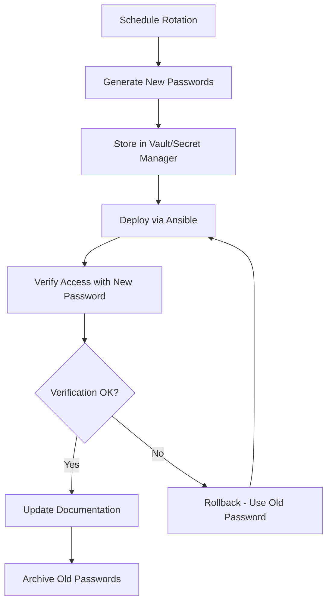

# How to Use Ansible to Manage the root Password

Author: [nawazdhandala](https://www.github.com/nawazdhandala)

Tags: Ansible, Security, Root Access, Password Management

Description: Learn how to securely manage and rotate the root password across Linux servers using Ansible with vault encryption and auditing practices.

---

Managing the root password is one of the most security-sensitive tasks in server administration. You need root access as a last resort for recovery, but that same access is what attackers target. The root password should be strong, unique per server (ideally), rotated regularly, and stored securely. Ansible can handle all of this, but you need to do it carefully. One mistake and you could lose root access to your entire fleet.

## Why Root Password Management Matters

Even if you use SSH keys and sudo for daily operations (which you should), the root password still matters. You need it for:

- Console access when SSH is down
- Single-user mode recovery
- Emergency break-glass scenarios
- BMC/IPMI console connections

If you set the root password once during provisioning and never change it, you have a static credential that gets stale and potentially compromised.

## Setting the Root Password with Ansible

The `user` module works for root just like any other user:

```yaml
# set-root-password.yml - Set the root password
- name: Set root password
  hosts: all
  become: yes
  vars_files:
    - vars/secrets.yml
  tasks:
    - name: Set root password
      ansible.builtin.user:
        name: root
        password: "{{ vault_root_password | password_hash('sha512', vault_root_salt) }}"
        update_password: always
        state: present
      no_log: yes
```

The vault file contains the encrypted password:

```yaml
# vars/secrets.yml (encrypted with ansible-vault)
vault_root_password: "SuperSecureRootPass!2024"
vault_root_salt: "rootsalt1234567"
```

## Per-Server Root Passwords

Using the same root password across all servers is a risk. If one server is compromised, the attacker has root on every server. Here is how to set unique root passwords per host:

```yaml
# unique-root-passwords.yml - Per-server root passwords
- name: Set unique root password per server
  hosts: all
  become: yes
  vars_files:
    - vars/secrets.yml
  tasks:
    - name: Set unique root password
      ansible.builtin.user:
        name: root
        password: "{{ vault_root_passwords[inventory_hostname] | password_hash('sha512', 'salt' + inventory_hostname) }}"
        update_password: always
        state: present
      no_log: yes
```

The vault file maps hostnames to passwords:

```yaml
# vars/secrets.yml (encrypted)
vault_root_passwords:
  web1.example.com: "UniquePassWeb1!2024"
  web2.example.com: "UniquePassWeb2!2024"
  db1.example.com: "UniquePassDB1!2024"
```

## Generating Random Root Passwords

For even better security, generate random passwords and store them centrally:

```yaml
# generate-root-passwords.yml - Generate and set random root passwords
- name: Generate and set random root passwords
  hosts: all
  become: yes
  tasks:
    # Generate a random password for each host
    - name: Generate random root password
      ansible.builtin.set_fact:
        new_root_password: "{{ lookup('password', '/dev/null length=24 chars=ascii_letters,digits,punctuation') }}"
      no_log: yes

    # Set the password
    - name: Set root password
      ansible.builtin.user:
        name: root
        password: "{{ new_root_password | password_hash('sha512', 'salt' + inventory_hostname) }}"
        update_password: always
        state: present
      no_log: yes

    # Store the password securely on the control node
    - name: Store password in secure location
      ansible.builtin.copy:
        content: "{{ inventory_hostname }}: {{ new_root_password }}"
        dest: "/root/secure-passwords/{{ inventory_hostname }}.txt"
        mode: '0600'
      delegate_to: localhost
      become: no
      no_log: yes
```

## Root Password Rotation Workflow

Here is the recommended workflow for root password rotation:



## Safe Root Password Rotation

The biggest risk with root password changes is getting locked out. Here is a safer approach with verification:

```yaml
# safe-root-rotation.yml - Rotate root password safely
- name: Safely rotate root password
  hosts: all
  become: yes
  serial: 1  # Process one server at a time
  vars_files:
    - vars/secrets.yml
  tasks:
    - name: Set new root password
      ansible.builtin.user:
        name: root
        password: "{{ vault_new_root_password | password_hash('sha512', vault_root_salt) }}"
        update_password: always
        state: present
      no_log: yes
      register: password_change

    # Verify we can still connect
    - name: Verify SSH connectivity after password change
      ansible.builtin.ping:
      when: password_change.changed

    # Verify sudo still works
    - name: Verify sudo access
      ansible.builtin.command: "whoami"
      become: yes
      register: sudo_check
      when: password_change.changed

    - name: Confirm sudo works
      ansible.builtin.assert:
        that:
          - sudo_check.stdout == "root"
        fail_msg: "sudo verification failed on {{ inventory_hostname }}"
      when: password_change.changed
```

The `serial: 1` directive processes one server at a time. If something goes wrong on the first server, you can fix it before the change propagates to the rest of your fleet.

## Locking and Unlocking Root

In some environments, root login is disabled entirely:

```yaml
# manage-root-access.yml - Lock/unlock root account
- name: Manage root account access
  hosts: all
  become: yes
  tasks:
    # Option 1: Lock root password (disable password login)
    - name: Lock root account
      ansible.builtin.user:
        name: root
        password_lock: yes

    # Option 2: Set root shell to nologin
    - name: Disable root login entirely
      ansible.builtin.user:
        name: root
        shell: /usr/sbin/nologin
      when: disable_root_login | default(false)
```

Be very careful with this. If you lock root and lose sudo access, you need console access to recover.

## Configuring sudo as Root Alternative

The best practice is to use sudo instead of direct root login:

```yaml
# setup-sudo.yml - Configure sudo access
- name: Set up sudo access
  hosts: all
  become: yes
  tasks:
    - name: Create admin group
      ansible.builtin.group:
        name: admins
        state: present

    - name: Add trusted users to admin group
      ansible.builtin.user:
        name: "{{ item }}"
        groups: admins
        append: yes
      loop:
        - alice
        - bob

    - name: Configure sudoers for admin group
      ansible.builtin.copy:
        dest: /etc/sudoers.d/admins
        content: |
          # Members of the admins group can run any command as root
          %admins ALL=(ALL:ALL) ALL
        mode: '0440'
        validate: 'visudo -cf %s'

    # Disable direct root SSH login
    - name: Disable root SSH login
      ansible.builtin.lineinfile:
        path: /etc/ssh/sshd_config
        regexp: '^#?PermitRootLogin'
        line: 'PermitRootLogin no'
      notify: restart sshd

  handlers:
    - name: restart sshd
      ansible.builtin.systemd:
        name: sshd
        state: restarted
```

## Root Password with HashiCorp Vault

For enterprise environments, integrate with a secrets manager:

```yaml
# root-password-hashicorp-vault.yml - Use HashiCorp Vault for root passwords
- name: Set root password from HashiCorp Vault
  hosts: all
  become: yes
  tasks:
    - name: Read root password from Vault
      ansible.builtin.set_fact:
        root_password: "{{ lookup('hashi_vault', 'secret=secret/data/servers/{{ inventory_hostname }}:root_password') }}"
      no_log: yes

    - name: Set root password
      ansible.builtin.user:
        name: root
        password: "{{ root_password | password_hash('sha512', inventory_hostname[:16]) }}"
        update_password: always
        state: present
      no_log: yes
```

## Auditing Root Password Age

Check how old root passwords are across your fleet:

```yaml
# audit-root-password.yml - Check root password age
- name: Audit root password age
  hosts: all
  become: yes
  tasks:
    - name: Get root password age
      ansible.builtin.command: "chage -l root"
      register: root_age
      changed_when: false

    - name: Display root password age info
      ansible.builtin.debug:
        msg: "{{ inventory_hostname }}: {{ root_age.stdout_lines }}"

    - name: Check if root password is older than 90 days
      ansible.builtin.shell: |
        last_change=$(chage -l root | grep "Last password change" | cut -d: -f2 | xargs)
        if [ "$last_change" = "never" ]; then
          echo "NEVER_SET"
        else
          last_epoch=$(date -d "$last_change" +%s 2>/dev/null || echo "0")
          now_epoch=$(date +%s)
          age_days=$(( (now_epoch - last_epoch) / 86400 ))
          echo "$age_days"
        fi
      register: password_age
      changed_when: false

    - name: Alert on old root passwords
      ansible.builtin.debug:
        msg: "WARNING: Root password on {{ inventory_hostname }} is {{ password_age.stdout }} days old"
      when: password_age.stdout | int > 90
```

## Best Practices

1. **Always use `no_log: yes`** when dealing with root passwords. Never let the password or hash appear in Ansible output.

2. **Use `serial: 1`** when rotating root passwords. Process servers one at a time so a failure does not affect the entire fleet.

3. **Store passwords in Ansible Vault or a secrets manager**. Never in plain text, not even in "private" repositories.

4. **Rotate root passwords regularly**. Quarterly at minimum, monthly for high-security environments.

5. **Verify access after changes**. Always test that you can still connect after changing the root password.

6. **Use unique passwords per server** if feasible. This limits the blast radius of a compromise.

7. **Prefer sudo over direct root login**. Use the root password only as a break-glass mechanism.

8. **Disable root SSH login**. Force all access through named user accounts with sudo.

Root password management is high-stakes work. Ansible makes it consistent and repeatable, but you need the discipline of proper encryption, verification, and testing to do it safely.
