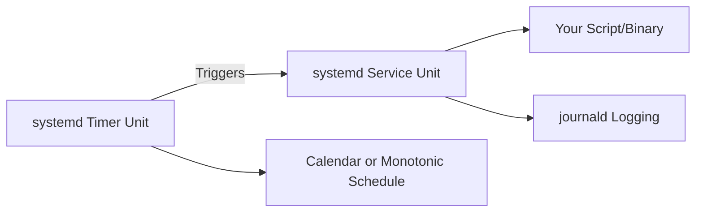

# How to Use Ansible to Manage Timer Units in systemd

Author: [nawazdhandala](https://www.github.com/nawazdhandala)

Tags: Ansible, systemd, Timers, Linux, Automation

Description: Learn how to create and manage systemd timer units with Ansible as a modern replacement for cron jobs with better logging and dependency control.

---

systemd timers are the modern replacement for cron jobs on Linux. They offer better logging through journald, dependency management, and the ability to trigger on events besides just time. Managing these timers with Ansible gives you version-controlled, repeatable scheduling across your entire fleet. In this guide, I will show you how to create, deploy, and manage systemd timer units using Ansible.

## Why systemd Timers Over Cron?

Before diving into the Ansible side, here is why you might prefer timers over cron:

- Each timer gets its own journal log stream, so you can inspect output with `journalctl -u mytask.service`
- Timers can depend on other units (wait for network, database, etc.)
- You get calendar event syntax that is more expressive than cron notation
- Missed timers can be caught up with `Persistent=true`
- You can set resource limits, sandboxing, and other systemd features on the triggered service



## How Timers Work

A systemd timer unit is always paired with a service unit. The timer defines when to run, and the service defines what to run. By convention, if you have `backup.timer`, it triggers `backup.service` (same name, different suffix).

## Creating the Service Unit

Let's start with the service unit that will be triggered by our timer. This is a oneshot service that runs a backup script.

Jinja2 template for the backup service unit:

```jinja2
# roles/systemd_timer/templates/backup.service.j2
[Unit]
Description={{ timer_description | default('Scheduled backup task') }}
After=network-online.target
Wants=network-online.target

[Service]
Type=oneshot
User={{ timer_user | default('root') }}
Group={{ timer_group | default('root') }}
ExecStart={{ timer_exec_start }}


Environment="{{ key }}={{ value }}"



# Logging
StandardOutput=journal
StandardError=journal
SyslogIdentifier={{ timer_name }}


Nice={{ timer_nice }}


IOSchedulingClass={{ timer_io_scheduling_class }}

```

## Creating the Timer Unit

Now the timer unit template. This is where you define the schedule.

Jinja2 template for the timer unit with calendar and monotonic options:

```jinja2
# roles/systemd_timer/templates/timer.j2
[Unit]
Description=Timer for {{ timer_description | default(timer_name) }}

[Timer]

# Calendar-based schedule (like cron)
OnCalendar={{ timer_on_calendar }}


# Run this many seconds after boot
OnBootSec={{ timer_on_boot_sec }}


# Run this often after the unit was last activated
OnUnitActiveSec={{ timer_on_unit_active_sec }}


# Run this often after the unit became inactive
OnUnitInactiveSec={{ timer_on_unit_inactive_sec }}


# Catch up on missed runs after downtime
Persistent={{ timer_persistent | default('true') }}

# Randomize delay to avoid thundering herd

RandomizedDelaySec={{ timer_randomized_delay_sec }}


# Accuracy (lower = more precise but more wake-ups)
AccuracySec={{ timer_accuracy_sec | default('1min') }}


# Override default unit to trigger
Unit={{ timer_unit }}


[Install]
WantedBy=timers.target
```

## The Ansible Role

Let's put together the complete role with tasks and handlers.

Role defaults for the timer configuration:

```yaml
# roles/systemd_timer/defaults/main.yml
---
timer_name: "backup"
timer_description: "Automated backup"
timer_user: "root"
timer_group: "root"
timer_on_calendar: "daily"
timer_persistent: "true"
timer_accuracy_sec: "1min"
timer_enabled: true
```

Task file that deploys both the service and timer:

```yaml
# roles/systemd_timer/tasks/main.yml
---
- name: Deploy the service unit file
  ansible.builtin.template:
    src: backup.service.j2
    dest: "/etc/systemd/system/{{ timer_name }}.service"
    owner: root
    group: root
    mode: '0644'
  notify: Reload systemd

- name: Deploy the timer unit file
  ansible.builtin.template:
    src: timer.j2
    dest: "/etc/systemd/system/{{ timer_name }}.timer"
    owner: root
    group: root
    mode: '0644'
  notify: Reload systemd

- name: Flush handlers to ensure daemon is reloaded
  ansible.builtin.meta: flush_handlers

- name: Enable and start the timer
  ansible.builtin.systemd:
    name: "{{ timer_name }}.timer"
    state: started
    enabled: "{{ timer_enabled }}"
    daemon_reload: yes
```

Handler for reloading systemd:

```yaml
# roles/systemd_timer/handlers/main.yml
---
- name: Reload systemd
  ansible.builtin.systemd:
    daemon_reload: yes
```

## Calendar Event Syntax

The `OnCalendar` directive supports a rich syntax. Here are common patterns:

| Schedule | OnCalendar Value |
|----------|-----------------|
| Every day at midnight | `daily` or `*-*-* 00:00:00` |
| Every hour | `hourly` or `*-*-* *:00:00` |
| Every 15 minutes | `*-*-* *:00/15:00` |
| Weekdays at 6 AM | `Mon..Fri *-*-* 06:00:00` |
| First of every month | `*-*-01 00:00:00` |
| Every Sunday at 2 AM | `Sun *-*-* 02:00:00` |
| Every 6 hours | `*-*-* 00/6:00:00` |

You can test calendar expressions on the command line:

```bash
# Validate a calendar expression and see next trigger times
systemd-analyze calendar "Mon..Fri *-*-* 06:00:00"
```

## Practical Example: Database Backup Timer

Let's use the role to deploy a PostgreSQL backup timer.

Playbook that deploys a daily database backup timer:

```yaml
---
- name: Deploy PostgreSQL backup timer
  hosts: db_servers
  become: yes
  roles:
    - role: systemd_timer
      vars:
        timer_name: pg-backup
        timer_description: "Daily PostgreSQL backup"
        timer_user: postgres
        timer_group: postgres
        timer_exec_start: /usr/local/bin/pg-backup.sh
        timer_on_calendar: "*-*-* 02:00:00"
        timer_randomized_delay_sec: "15min"
        timer_persistent: "true"
        timer_environment:
          PGHOST: localhost
          PGPORT: "5432"
          BACKUP_DIR: /var/backups/postgresql
```

And the backup script itself:

```yaml
    - name: Deploy backup script
      ansible.builtin.copy:
        dest: /usr/local/bin/pg-backup.sh
        mode: '0755'
        content: |
          #!/bin/bash
          set -euo pipefail
          TIMESTAMP=$(date +%Y%m%d_%H%M%S)
          DEST="${BACKUP_DIR}/backup_${TIMESTAMP}.sql.gz"
          mkdir -p "${BACKUP_DIR}"
          pg_dumpall | gzip > "${DEST}"
          # Keep only last 7 days of backups
          find "${BACKUP_DIR}" -name "backup_*.sql.gz" -mtime +7 -delete
          echo "Backup completed: ${DEST}"
```

## Deploying Multiple Timers

You can deploy several timers by including the role multiple times.

Deploy multiple scheduled tasks in a single playbook:

```yaml
---
- name: Deploy all scheduled tasks
  hosts: app_servers
  become: yes
  tasks:
    - name: Deploy log rotation timer
      ansible.builtin.include_role:
        name: systemd_timer
      vars:
        timer_name: log-cleanup
        timer_description: "Clean up old log files"
        timer_exec_start: "/usr/local/bin/cleanup-logs.sh"
        timer_on_calendar: "daily"
        timer_user: root

    - name: Deploy health check timer
      ansible.builtin.include_role:
        name: systemd_timer
      vars:
        timer_name: health-check
        timer_description: "Periodic health check"
        timer_exec_start: "/usr/local/bin/health-check.sh"
        timer_on_boot_sec: "60"
        timer_on_unit_active_sec: "5min"
        timer_user: monitoring
```

## Monitoring Timer Status

After deployment, you can verify timers are working with ad-hoc commands.

Check timer status across your fleet:

```yaml
- name: List all active timers
  ansible.builtin.command: systemctl list-timers --all --no-pager
  register: timer_list
  changed_when: false

- name: Display timer status
  ansible.builtin.debug:
    var: timer_list.stdout_lines

- name: Check if our specific timer is active
  ansible.builtin.command: "systemctl is-active {{ timer_name }}.timer"
  register: timer_active
  changed_when: false
  failed_when: false

- name: Check last run status
  ansible.builtin.command: "systemctl show {{ timer_name }}.service --property=Result"
  register: last_run
  changed_when: false

- name: Report failed timer
  ansible.builtin.debug:
    msg: "WARNING: Last run of {{ timer_name }} result: {{ last_run.stdout }}"
  when: "'success' not in last_run.stdout"
```

## Removing a Timer

If you need to clean up a timer, make sure to stop and disable it before removing the files.

Properly remove a systemd timer and its associated service:

```yaml
- name: Stop the timer
  ansible.builtin.systemd:
    name: "{{ timer_name }}.timer"
    state: stopped
    enabled: no
  ignore_errors: yes

- name: Remove timer unit file
  ansible.builtin.file:
    path: "/etc/systemd/system/{{ timer_name }}.timer"
    state: absent

- name: Remove service unit file
  ansible.builtin.file:
    path: "/etc/systemd/system/{{ timer_name }}.service"
    state: absent

- name: Reload systemd after removal
  ansible.builtin.systemd:
    daemon_reload: yes
```

## Summary

systemd timers give you everything cron does and more, with proper logging, dependency management, and catch-up for missed runs. By managing them through Ansible roles with Jinja2 templates, you get a consistent, version-controlled scheduling system across your infrastructure. The pattern is simple: template a service unit for what to run, template a timer unit for when to run it, and let Ansible handle the deployment and lifecycle management.
