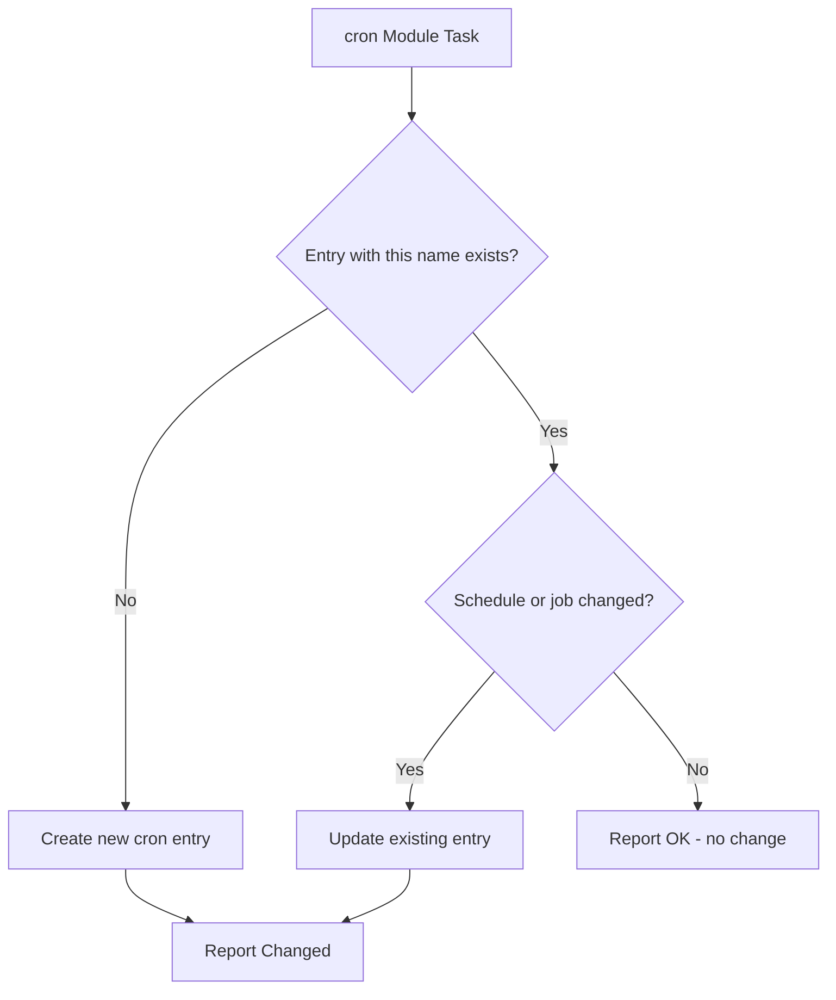

# How to Use Ansible to Manage User Crontabs

Author: [nawazdhandala](https://www.github.com/nawazdhandala)

Tags: Ansible, Cron, Automation, Linux, Scheduling

Description: Learn how to manage user crontab entries with the Ansible cron module, including creating, removing, and managing scheduled jobs per user.

---

Cron jobs are the workhorse of scheduled task automation on Linux. Backups, log rotation, data syncs, health checks, report generation - the list goes on. When you manage dozens of servers, keeping crontabs consistent becomes a real challenge. The Ansible `cron` module lets you manage individual cron entries across your fleet without touching the raw crontab file, and it does so idempotently.

## The Ansible cron Module Basics

The `cron` module manages individual entries in a user's crontab. Each entry is identified by a `name` parameter, which Ansible uses as a unique key:

```yaml
# basic-cron.yml - Create a simple cron job
- name: Create a basic cron job
  hosts: all
  become: yes
  tasks:
    - name: Run backup script every night at 2am
      ansible.builtin.cron:
        name: "nightly backup"
        user: root
        minute: "0"
        hour: "2"
        job: "/usr/local/bin/backup.sh >> /var/log/backup.log 2>&1"
```

The `name` field is required and serves as the identifier. Ansible writes it as a comment above the cron entry. If you run this playbook twice, Ansible recognizes the existing entry by its name and reports "ok" instead of creating a duplicate.

## Cron Schedule Parameters

The `cron` module accepts standard cron timing parameters:

```yaml
# cron-timing.yml - Various cron schedules
- name: Configure various cron schedules
  hosts: all
  become: yes
  tasks:
    # Every 5 minutes
    - name: Health check every 5 minutes
      ansible.builtin.cron:
        name: "health check"
        user: monitoring
        minute: "*/5"
        job: "/usr/local/bin/health-check.sh"

    # Every hour at minute 30
    - name: Hourly log rotation
      ansible.builtin.cron:
        name: "hourly log rotation"
        user: root
        minute: "30"
        job: "/usr/local/bin/rotate-logs.sh"

    # Every weekday at 6am
    - name: Weekday morning report
      ansible.builtin.cron:
        name: "morning report"
        user: reports
        minute: "0"
        hour: "6"
        weekday: "1-5"
        job: "/usr/local/bin/generate-report.sh"

    # First day of every month at midnight
    - name: Monthly cleanup
      ansible.builtin.cron:
        name: "monthly cleanup"
        user: root
        minute: "0"
        hour: "0"
        day: "1"
        job: "/usr/local/bin/monthly-cleanup.sh"
```

## Using special_time for Common Schedules

Instead of specifying individual time fields, use `special_time` for common patterns:

```yaml
# special-time.yml - Using special_time parameter
- name: Cron jobs with special_time
  hosts: all
  become: yes
  tasks:
    - name: Run at system reboot
      ansible.builtin.cron:
        name: "startup script"
        user: root
        special_time: reboot
        job: "/usr/local/bin/on-boot.sh"

    - name: Run daily
      ansible.builtin.cron:
        name: "daily digest"
        user: app
        special_time: daily
        job: "/opt/app/bin/daily-digest.sh"

    - name: Run weekly
      ansible.builtin.cron:
        name: "weekly report"
        user: reports
        special_time: weekly
        job: "/opt/reports/weekly.sh"

    - name: Run hourly
      ansible.builtin.cron:
        name: "hourly sync"
        user: sync
        special_time: hourly
        job: "/usr/local/bin/sync-data.sh"
```

Valid `special_time` values: `reboot`, `yearly`, `annually`, `monthly`, `weekly`, `daily`, `hourly`.

## Cron Job Lifecycle

Here is how Ansible manages cron entries:



## Managing Cron Jobs for Specific Users

Each user has their own crontab. Use the `user` parameter to manage crons for different users:

```yaml
# user-crontabs.yml - Manage crons for multiple users
- name: Manage user-specific cron jobs
  hosts: all
  become: yes
  tasks:
    # Application user's cron jobs
    - name: App data processing job
      ansible.builtin.cron:
        name: "data processing"
        user: appuser
        minute: "*/15"
        job: "/opt/app/bin/process-data.sh"

    # Database user's cron jobs
    - name: Database backup
      ansible.builtin.cron:
        name: "database backup"
        user: postgres
        minute: "0"
        hour: "1"
        job: "pg_dump mydb | gzip > /backup/db/mydb-$(date +\\%Y\\%m\\%d).sql.gz"

    # Monitoring user's cron jobs
    - name: Collect metrics
      ansible.builtin.cron:
        name: "collect metrics"
        user: prometheus
        minute: "*/1"
        job: "/opt/monitoring/collect.sh"
```

Note the escaped percent signs (`\\%`) in the database backup job. In crontab, the `%` character has special meaning (it is used as a newline), so it must be escaped when used in commands like `date +%Y%m%d`.

## Removing Cron Jobs

Set `state: absent` to remove a cron entry:

```yaml
# remove-cron.yml - Remove cron jobs
- name: Remove obsolete cron jobs
  hosts: all
  become: yes
  tasks:
    - name: Remove old backup job
      ansible.builtin.cron:
        name: "old backup script"
        user: root
        state: absent

    - name: Remove deprecated monitoring job
      ansible.builtin.cron:
        name: "legacy monitoring"
        user: monitoring
        state: absent
```

The `name` parameter must match exactly. Ansible uses it to find the entry to remove.

## Managing Cron Environment Variables

Cron jobs run in a minimal environment. You often need to set environment variables:

```yaml
# cron-env-vars.yml - Set cron environment variables
- name: Configure cron environment variables
  hosts: all
  become: yes
  tasks:
    # Set PATH for the user's crontab
    - name: Set PATH in crontab
      ansible.builtin.cron:
        name: PATH
        user: appuser
        env: yes
        job: "/usr/local/bin:/usr/bin:/bin:/opt/app/bin"

    # Set MAILTO to control cron output email
    - name: Set MAILTO in crontab
      ansible.builtin.cron:
        name: MAILTO
        user: appuser
        env: yes
        job: "ops@example.com"

    # Set SHELL
    - name: Set SHELL in crontab
      ansible.builtin.cron:
        name: SHELL
        user: appuser
        env: yes
        job: "/bin/bash"

    # Now add the actual cron job
    - name: Application cron job
      ansible.builtin.cron:
        name: "run application task"
        user: appuser
        minute: "*/10"
        job: "/opt/app/bin/task.sh"
```

When `env: yes` is set, the `name` becomes the variable name and `job` becomes the value. These environment variables are written at the top of the crontab.

## Disabling Cron Jobs Without Removing Them

Use `disabled: yes` to comment out a cron job temporarily:

```yaml
# disable-cron.yml - Temporarily disable cron jobs
- name: Temporarily disable cron jobs during maintenance
  hosts: all
  become: yes
  tasks:
    - name: Disable backup during maintenance
      ansible.builtin.cron:
        name: "nightly backup"
        user: root
        minute: "0"
        hour: "2"
        job: "/usr/local/bin/backup.sh"
        disabled: yes

    # Re-enable after maintenance
    - name: Re-enable backup after maintenance
      ansible.builtin.cron:
        name: "nightly backup"
        user: root
        minute: "0"
        hour: "2"
        job: "/usr/local/bin/backup.sh"
        disabled: no
```

When disabled, the cron entry is commented out with `#` but remains in the crontab. This is cleaner than removing and re-adding.

## Managing Cron Jobs with Loops

Create multiple cron jobs from a variable list:

```yaml
# cron-loop.yml - Manage multiple cron jobs with a loop
- name: Deploy cron jobs from variable list
  hosts: all
  become: yes
  vars:
    cron_jobs:
      - name: "database backup"
        user: postgres
        minute: "0"
        hour: "1"
        job: "/usr/local/bin/db-backup.sh"
      - name: "log cleanup"
        user: root
        minute: "30"
        hour: "3"
        job: "find /var/log -name '*.gz' -mtime +30 -delete"
      - name: "ssl cert check"
        user: root
        minute: "0"
        hour: "8"
        weekday: "1"
        job: "/usr/local/bin/check-certs.sh"
      - name: "disk usage alert"
        user: monitoring
        minute: "*/30"
        job: "/usr/local/bin/disk-alert.sh"
  tasks:
    - name: Deploy all cron jobs
      ansible.builtin.cron:
        name: "{{ item.name }}"
        user: "{{ item.user }}"
        minute: "{{ item.minute | default('*') }}"
        hour: "{{ item.hour | default('*') }}"
        day: "{{ item.day | default('*') }}"
        month: "{{ item.month | default('*') }}"
        weekday: "{{ item.weekday | default('*') }}"
        job: "{{ item.job }}"
        state: present
      loop: "{{ cron_jobs }}"
      loop_control:
        label: "{{ item.name }}"
```

## Using cron.d Instead of User Crontabs

For system-level cron jobs, you can deploy files to `/etc/cron.d/` instead of modifying user crontabs:

```yaml
# cron-d.yml - Deploy cron.d files
- name: Deploy system cron jobs to cron.d
  hosts: all
  become: yes
  tasks:
    - name: Deploy backup cron file
      ansible.builtin.copy:
        dest: /etc/cron.d/backup
        content: |
          # Managed by Ansible - do not edit manually
          SHELL=/bin/bash
          PATH=/usr/local/sbin:/usr/local/bin:/usr/sbin:/usr/bin:/sbin:/bin
          MAILTO=ops@example.com

          # Full backup at 1am
          0 1 * * * root /usr/local/bin/full-backup.sh >> /var/log/backup.log 2>&1
          # Incremental backup every 6 hours
          0 */6 * * * root /usr/local/bin/incr-backup.sh >> /var/log/backup.log 2>&1
        mode: '0644'
        owner: root
        group: root

    - name: Deploy monitoring cron file
      ansible.builtin.copy:
        dest: /etc/cron.d/monitoring
        content: |
          # Managed by Ansible
          SHELL=/bin/bash
          PATH=/usr/local/bin:/usr/bin:/bin

          # Health check every minute
          * * * * * monitoring /opt/monitoring/health-check.sh
          # Metrics collection every 5 minutes
          */5 * * * * monitoring /opt/monitoring/collect-metrics.sh
        mode: '0644'
        owner: root
        group: root
```

Files in `/etc/cron.d/` require a username field before the command (unlike user crontabs).

## Verifying Cron Configuration

Check that cron jobs are properly configured:

```yaml
# verify-cron.yml - Verify cron configuration
- name: Verify cron jobs
  hosts: all
  become: yes
  tasks:
    - name: List crontab for root user
      ansible.builtin.command: "crontab -l -u root"
      register: root_crontab
      changed_when: false
      failed_when: false

    - name: Display root crontab
      ansible.builtin.debug:
        msg: "{{ root_crontab.stdout_lines }}"

    - name: List crontab for app user
      ansible.builtin.command: "crontab -l -u appuser"
      register: app_crontab
      changed_when: false
      failed_when: false

    - name: Display app crontab
      ansible.builtin.debug:
        msg: "{{ app_crontab.stdout_lines }}"
```

## Best Practices

1. **Always set a `name`** for every cron entry. Without it, Ansible cannot manage the entry idempotently and will create duplicates.

2. **Redirect output** in your cron jobs. Use `>> /var/log/something.log 2>&1` to capture both stdout and stderr. Otherwise, cron sends email for every run.

3. **Escape percent signs** with `\\%` in crontab commands. The `%` character has special meaning in cron.

4. **Use `env: yes`** to set PATH and other variables at the top of the crontab. Cron's default PATH is very minimal.

5. **Prefer `/etc/cron.d/` for system jobs**. It keeps system cron jobs separate from user crontabs and is easier to manage with configuration management.

6. **Test timing with `special_time`** first, then switch to specific schedules once you have confirmed the job works.

7. **Set MAILTO** to control who gets cron output emails. Set it to empty string to disable emails entirely.

Cron management is a classic Ansible use case. The `cron` module is straightforward and reliable, and it prevents the drift that happens when people SSH into servers and add cron jobs by hand.
