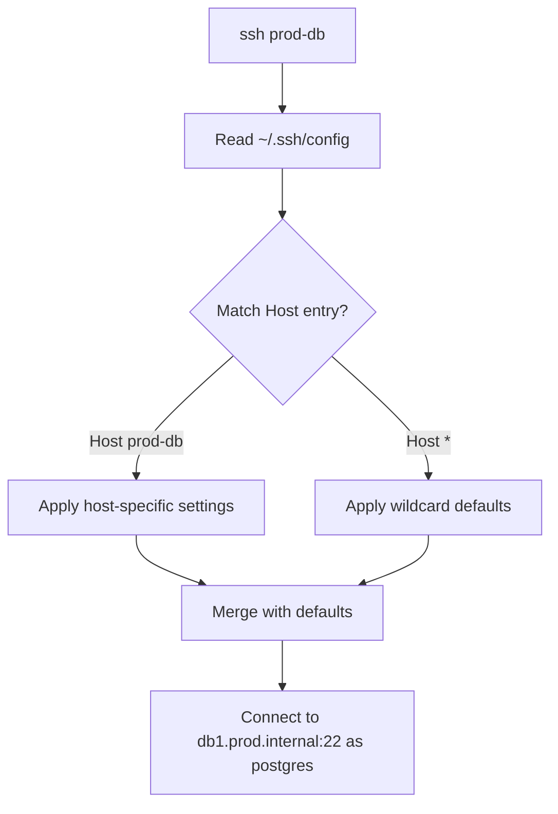

# How to Use Ansible to Manage User SSH Config

Author: [nawazdhandala](https://www.github.com/nawazdhandala)

Tags: Ansible, SSH, Configuration Management, DevOps

Description: Learn how to manage per-user SSH client configuration files with Ansible, including host aliases, jump hosts, and connection settings.

---

The SSH client configuration file (`~/.ssh/config`) is one of those files that makes daily work significantly easier once set up properly. Instead of typing `ssh -i ~/.ssh/special_key -p 2222 -J jumphost user@long.hostname.internal.example.com`, you just type `ssh myserver`. Managing these configs across a team or across multiple servers is where Ansible comes in.

## Understanding SSH Client Config

The SSH config file (`~/.ssh/config`) defines per-host connection settings. When you run `ssh hostname`, the SSH client checks this file for matching Host entries and applies the associated settings.

A basic example of what goes in this file:

```
Host myserver
    HostName 10.0.1.50
    User deploy
    Port 22
    IdentityFile ~/.ssh/id_ed25519
```

Now instead of `ssh deploy@10.0.1.50`, you just type `ssh myserver`.

## Deploying a Complete SSH Config

The simplest approach is to deploy the entire config file:

```yaml
# deploy-ssh-config.yml - Deploy complete SSH config
- name: Deploy SSH config for users
  hosts: all
  become: yes
  tasks:
    - name: Ensure .ssh directory exists for deploy user
      ansible.builtin.file:
        path: /home/deploy/.ssh
        state: directory
        owner: deploy
        group: deploy
        mode: '0700'

    - name: Deploy SSH config for deploy user
      ansible.builtin.copy:
        dest: /home/deploy/.ssh/config
        content: |
          # SSH Config - Managed by Ansible
          # Do not edit manually

          # Default settings for all hosts
          Host *
              ServerAliveInterval 60
              ServerAliveCountMax 3
              AddKeysToAgent yes
              IdentitiesOnly yes
              StrictHostKeyChecking accept-new

          # Production database
          Host prod-db
              HostName db1.prod.internal
              User postgres
              Port 22
              IdentityFile ~/.ssh/id_ed25519

          # Staging environment
          Host staging
              HostName 10.10.1.100
              User deploy
              IdentityFile ~/.ssh/id_ed25519

          # Jump host
          Host jumphost
              HostName jump.example.com
              User admin
              Port 2222
              IdentityFile ~/.ssh/id_ed25519
        owner: deploy
        group: deploy
        mode: '0600'
```

The `mode: '0600'` is important. SSH refuses to use a config file with overly permissive permissions.

## SSH Config Structure

Here is how the SSH client processes the config:



Host entries are processed in order. The first matching entry wins for each parameter. Wildcard (`Host *`) entries apply to all hosts but can be overridden by specific entries.

## Using Templates for Dynamic Config

For configs that vary per server or environment, use a Jinja2 template:

```yaml
# template-ssh-config.yml - Dynamic SSH config with templates
- name: Deploy dynamic SSH config
  hosts: all
  become: yes
  vars:
    ssh_hosts:
      - name: prod-db
        hostname: db1.prod.internal
        user: postgres
        port: 22
      - name: prod-web
        hostname: web1.prod.internal
        user: deploy
        port: 22
      - name: staging
        hostname: staging.internal
        user: deploy
        port: 22
      - name: jumphost
        hostname: jump.example.com
        user: admin
        port: 2222
    ssh_defaults:
      server_alive_interval: 60
      server_alive_count_max: 3
      strict_host_key_checking: accept-new
  tasks:
    - name: Deploy SSH config from template
      ansible.builtin.template:
        src: templates/ssh_config.j2
        dest: /home/deploy/.ssh/config
        owner: deploy
        group: deploy
        mode: '0600'
```

The template file (`templates/ssh_config.j2`):

```
# SSH Config - Generated by Ansible on {{ ansible_date_time.date }}
# Do not edit manually

Host *
    ServerAliveInterval {{ ssh_defaults.server_alive_interval }}
    ServerAliveCountMax {{ ssh_defaults.server_alive_count_max }}
    StrictHostKeyChecking {{ ssh_defaults.strict_host_key_checking }}
    IdentitiesOnly yes


Host {{ host.name }}
    HostName {{ host.hostname }}
    User {{ host.user }}
    Port {{ host.port }}
    IdentityFile ~/.ssh/id_ed25519

    ProxyJump {{ host.proxy_jump }}



```

## Configuring Jump Hosts (ProxyJump)

Jump hosts (bastion hosts) are a common pattern for accessing private networks:

```yaml
# ssh-jump-hosts.yml - Configure jump host access
- name: Configure SSH jump host access
  hosts: all
  become: yes
  tasks:
    - name: Deploy SSH config with jump host
      ansible.builtin.copy:
        dest: /home/deploy/.ssh/config
        content: |
          # Bastion / Jump Host
          Host bastion
              HostName bastion.example.com
              User admin
              Port 22
              IdentityFile ~/.ssh/id_ed25519

          # Internal servers accessed via bastion
          Host internal-*
              ProxyJump bastion
              User deploy
              IdentityFile ~/.ssh/id_ed25519

          Host internal-web1
              HostName 10.0.1.10

          Host internal-web2
              HostName 10.0.1.11

          Host internal-db1
              HostName 10.0.2.10
              User postgres
        owner: deploy
        group: deploy
        mode: '0600'
```

With this config, `ssh internal-web1` automatically tunnels through the bastion host. The `Host internal-*` pattern applies settings to all hosts matching that prefix.

## Adding Entries Without Replacing the Entire File

Sometimes you want to add or update a single host entry without replacing the whole config. Use `blockinfile`:

```yaml
# add-ssh-host.yml - Add a single host entry
- name: Add SSH host entry
  hosts: all
  become: yes
  tasks:
    - name: Ensure .ssh directory exists
      ansible.builtin.file:
        path: /home/deploy/.ssh
        state: directory
        owner: deploy
        group: deploy
        mode: '0700'

    - name: Ensure config file exists
      ansible.builtin.file:
        path: /home/deploy/.ssh/config
        state: touch
        owner: deploy
        group: deploy
        mode: '0600'
        modification_time: preserve
        access_time: preserve

    - name: Add new server to SSH config
      ansible.builtin.blockinfile:
        path: /home/deploy/.ssh/config
        marker: "# {mark} ANSIBLE MANAGED - new-server"
        block: |
          Host new-server
              HostName 10.0.3.50
              User deploy
              Port 22
              IdentityFile ~/.ssh/id_ed25519
        owner: deploy
        group: deploy
        mode: '0600'
```

The `marker` parameter creates unique start and end comments for each block, so you can manage multiple entries independently.

## Managing SSH Config for Multiple Users

Deploy different configs for different user roles:

```yaml
# multi-user-ssh-config.yml - SSH config for different users
- name: Manage SSH config for multiple users
  hosts: all
  become: yes
  vars:
    user_ssh_configs:
      - user: deploy
        hosts:
          - name: prod-app
            hostname: app.prod.internal
            proxy_jump: bastion
          - name: staging-app
            hostname: app.staging.internal
      - user: backup_agent
        hosts:
          - name: backup-target
            hostname: backup.storage.internal
            port: 22
          - name: offsite-backup
            hostname: offsite.example.com
            port: 2222
  tasks:
    - name: Ensure .ssh directories exist
      ansible.builtin.file:
        path: "/home/{{ item.user }}/.ssh"
        state: directory
        owner: "{{ item.user }}"
        group: "{{ item.user }}"
        mode: '0700'
      loop: "{{ user_ssh_configs }}"
      loop_control:
        label: "{{ item.user }}"

    - name: Deploy SSH configs
      ansible.builtin.template:
        src: templates/ssh_config.j2
        dest: "/home/{{ item.user }}/.ssh/config"
        owner: "{{ item.user }}"
        group: "{{ item.user }}"
        mode: '0600'
      loop: "{{ user_ssh_configs }}"
      loop_control:
        label: "{{ item.user }}"
      vars:
        ssh_hosts: "{{ item.hosts }}"
```

## Global SSH Client Configuration

For settings that should apply to all users system-wide, use `/etc/ssh/ssh_config` or `/etc/ssh/ssh_config.d/`:

```yaml
# global-ssh-config.yml - System-wide SSH client configuration
- name: Configure system-wide SSH client settings
  hosts: all
  become: yes
  tasks:
    - name: Deploy global SSH client config
      ansible.builtin.copy:
        dest: /etc/ssh/ssh_config.d/99-company.conf
        content: |
          # Company-wide SSH client settings
          # Managed by Ansible

          Host *
              # Keep connections alive
              ServerAliveInterval 60
              ServerAliveCountMax 3

              # Use stronger key exchange
              KexAlgorithms curve25519-sha256,curve25519-sha256@libssh.org

              # Preferred authentication methods
              PreferredAuthentications publickey

              # Disable forwarding by default
              ForwardAgent no
              ForwardX11 no

              # Hash known hosts for privacy
              HashKnownHosts yes

              # Automatically add new host keys
              StrictHostKeyChecking accept-new

          # Internal network settings
          Host *.internal *.prod.internal *.staging.internal
              StrictHostKeyChecking no
              UserKnownHostsFile /dev/null
              LogLevel ERROR
        mode: '0644'
```

## SSH Config for CI/CD Service Accounts

CI/CD systems often need SSH access to deploy code:

```yaml
# cicd-ssh-config.yml - SSH config for CI/CD service account
- name: Configure SSH for CI/CD
  hosts: cicd_servers
  become: yes
  vars:
    deploy_targets:
      - name: prod-web1
        hostname: 10.0.1.10
      - name: prod-web2
        hostname: 10.0.1.11
      - name: prod-web3
        hostname: 10.0.1.12
      - name: staging-web1
        hostname: 10.10.1.10
  tasks:
    - name: Create CI/CD user SSH directory
      ansible.builtin.file:
        path: /var/lib/jenkins/.ssh
        state: directory
        owner: jenkins
        group: jenkins
        mode: '0700'

    - name: Deploy CI/CD SSH config
      ansible.builtin.copy:
        dest: /var/lib/jenkins/.ssh/config
        content: |
          Host *
              StrictHostKeyChecking no
              UserKnownHostsFile /dev/null
              LogLevel ERROR
              ConnectTimeout 10
              ConnectionAttempts 3
              IdentityFile ~/.ssh/id_ed25519
              User deploy

          
          Host {{ target.name }}
              HostName {{ target.hostname }}
          
        owner: jenkins
        group: jenkins
        mode: '0600'
```

## Verifying SSH Config

After deploying, verify the configuration works:

```yaml
# verify-ssh-config.yml - Test SSH config
- name: Verify SSH configuration
  hosts: all
  become: yes
  become_user: deploy
  tasks:
    - name: Check SSH config syntax
      ansible.builtin.command: "ssh -G prod-db"
      register: ssh_config_check
      changed_when: false
      failed_when: false

    - name: Display resolved config for prod-db
      ansible.builtin.debug:
        msg: "{{ ssh_config_check.stdout_lines | select('match', '^(hostname|user|port|identityfile|proxyjump)') | list }}"
      when: ssh_config_check.rc == 0
```

The `ssh -G hostname` command resolves and displays the full configuration for a given host without connecting. It is a great way to verify your config is correct.

## Removing SSH Config Entries

To remove specific entries:

```yaml
# remove-ssh-entry.yml - Remove SSH config entry
- name: Remove SSH config entry
  hosts: all
  become: yes
  tasks:
    - name: Remove decommissioned server from SSH config
      ansible.builtin.blockinfile:
        path: /home/deploy/.ssh/config
        marker: "# {mark} ANSIBLE MANAGED - old-server"
        state: absent
```

## Best Practices

1. **Always set permissions to 0600** on SSH config files. SSH will warn or refuse to use files with broader permissions.

2. **Use `IdentitiesOnly yes`** in your global defaults. Without it, SSH tries every key in your agent, which can trigger account lockouts on servers that limit failed auth attempts.

3. **Use `ProxyJump` instead of `ProxyCommand`** for jump hosts. It is simpler and supports connection sharing.

4. **Set `ServerAliveInterval`** to prevent idle connections from being dropped by firewalls and load balancers.

5. **Use templates for dynamic configs** that vary by environment. Hard-coded configs do not scale.

6. **Manage the full file when possible**. Using `blockinfile` for individual entries is more fragile than deploying the complete file.

7. **Use `/etc/ssh/ssh_config.d/` for system-wide settings** that should apply regardless of user-specific configs.

SSH config management is a small but high-impact task. A well-configured SSH config saves time every day and makes server access more consistent across your team.
