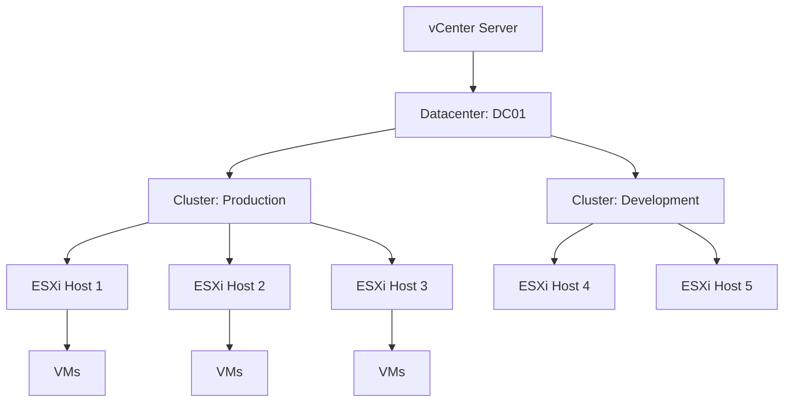

# How to Use Ansible to Manage VMware Clusters

Author: [nawazdhandala](https://www.github.com/nawazdhandala)

Tags: Ansible, VMware, Clusters, vSphere, High Availability

Description: Learn how to create and manage VMware vSphere clusters with Ansible including HA, DRS, and cluster configuration for production environments.

---

VMware clusters are the backbone of any vSphere environment. They group ESXi hosts together to provide High Availability (HA), Distributed Resource Scheduler (DRS), and resource management. Configuring clusters through the vSphere Client works fine for initial setup, but when you are managing multiple clusters across datacenters or need to ensure consistent settings, Ansible is the way to go. This guide covers creating clusters, configuring HA and DRS, and managing cluster-level settings.

## What is a VMware Cluster?

A cluster is a collection of ESXi hosts that share resources and management features.



## Creating a Cluster

Use the `community.vmware.vmware_cluster` module to create and configure clusters.

```yaml
# create-cluster.yml
---
- name: Create and configure VMware clusters
  hosts: localhost
  gather_facts: false

  module_defaults:
    group/community.vmware.vmware:
      hostname: "{{ vcenter_hostname }}"
      username: "{{ vcenter_username }}"
      password: "{{ vcenter_password }}"
      validate_certs: false

  vars:
    vcenter_hostname: "vcenter.example.com"
    vcenter_username: "administrator@vsphere.local"
    vcenter_password: "{{ vault_vcenter_password }}"

  tasks:
    - name: Create production cluster
      community.vmware.vmware_cluster:
        datacenter_name: "DC01"
        cluster_name: "Production"
        enable_ha: true
        enable_drs: true
        enable_vsan: false
      register: cluster_result

    - name: Display cluster creation result
      ansible.builtin.debug:
        msg: "Cluster '{{ cluster_result.result }}' configured"
```

## Configuring High Availability (HA)

HA restarts VMs on surviving hosts when a host fails. Proper HA configuration is critical for production workloads.

```yaml
# configure-ha.yml
---
- name: Configure cluster High Availability settings
  hosts: localhost
  gather_facts: false

  module_defaults:
    group/community.vmware.vmware:
      hostname: "{{ vcenter_hostname }}"
      username: "{{ vcenter_username }}"
      password: "{{ vcenter_password }}"
      validate_certs: false

  vars:
    vcenter_hostname: "vcenter.example.com"
    vcenter_username: "administrator@vsphere.local"
    vcenter_password: "{{ vault_vcenter_password }}"

  tasks:
    - name: Configure HA on the production cluster
      community.vmware.vmware_cluster_ha:
        datacenter: "DC01"
        cluster_name: "Production"
        enable: true
        # Host monitoring - detect host failures
        ha_host_monitoring: enabled
        # VM monitoring - restart VMs that crash
        ha_vm_monitoring: vmMonitoringOnly
        # VM restart priority
        ha_restart_priority: medium
        # Admission control - reserve capacity for failover
        slot_based_admission_control:
          failover_level: 1
        # Host isolation response
        host_isolation_response: powerOff
        # Advanced HA settings
        advanced_settings:
          das.ignoreRedundantNetWarning: "true"
          das.heartbeatDsPerHost: "2"
      register: ha_result

    - name: Report HA configuration status
      ansible.builtin.debug:
        msg: "HA configured: {{ ha_result.changed }}"
```

## Configuring DRS (Distributed Resource Scheduler)

DRS automatically balances VM workloads across hosts in the cluster by migrating VMs via vMotion.

```yaml
# configure-drs.yml
---
- name: Configure cluster DRS settings
  hosts: localhost
  gather_facts: false

  module_defaults:
    group/community.vmware.vmware:
      hostname: "{{ vcenter_hostname }}"
      username: "{{ vcenter_username }}"
      password: "{{ vcenter_password }}"
      validate_certs: false

  vars:
    vcenter_hostname: "vcenter.example.com"
    vcenter_username: "administrator@vsphere.local"
    vcenter_password: "{{ vault_vcenter_password }}"

  tasks:
    - name: Configure DRS on the production cluster
      community.vmware.vmware_cluster_drs:
        datacenter: "DC01"
        cluster_name: "Production"
        enable: true
        # Automation level: manual, partiallyAutomated, fullyAutomated
        drs_default_vm_behavior: fullyAutomated
        # Migration threshold (1=conservative, 5=aggressive)
        drs_vmotion_rate: 3
        # Enable predictive DRS (uses vRealize Operations metrics)
        predictive_drs: false
        # Advanced DRS settings
        advanced_settings:
          TryBalanceVmsPerHost: "1"
      register: drs_result

    - name: Report DRS configuration
      ansible.builtin.debug:
        msg: "DRS configured with automation level: fullyAutomated"
```

## Configuring Multiple Clusters

When managing an entire datacenter, define all clusters in variables and apply configurations in a loop.

```yaml
# configure-all-clusters.yml
---
- name: Configure all datacenter clusters
  hosts: localhost
  gather_facts: false

  module_defaults:
    group/community.vmware.vmware:
      hostname: "{{ vcenter_hostname }}"
      username: "{{ vcenter_username }}"
      password: "{{ vcenter_password }}"
      validate_certs: false

  vars:
    vcenter_hostname: "vcenter.example.com"
    vcenter_username: "administrator@vsphere.local"
    vcenter_password: "{{ vault_vcenter_password }}"

    # Define cluster configurations
    clusters:
      - name: "Production"
        ha_enabled: true
        drs_enabled: true
        drs_behavior: fullyAutomated
        drs_threshold: 3
        ha_failover_level: 1
        ha_restart_priority: high
      - name: "Development"
        ha_enabled: false
        drs_enabled: true
        drs_behavior: partiallyAutomated
        drs_threshold: 4
        ha_failover_level: 0
        ha_restart_priority: low
      - name: "Disaster-Recovery"
        ha_enabled: true
        drs_enabled: true
        drs_behavior: fullyAutomated
        drs_threshold: 2
        ha_failover_level: 1
        ha_restart_priority: high

  tasks:
    # Create/ensure all clusters exist
    - name: Ensure clusters exist
      community.vmware.vmware_cluster:
        datacenter_name: "DC01"
        cluster_name: "{{ item.name }}"
        enable_ha: "{{ item.ha_enabled }}"
        enable_drs: "{{ item.drs_enabled }}"
      loop: "{{ clusters }}"

    # Configure HA for clusters that have it enabled
    - name: Configure HA on applicable clusters
      community.vmware.vmware_cluster_ha:
        datacenter: "DC01"
        cluster_name: "{{ item.name }}"
        enable: true
        ha_host_monitoring: enabled
        ha_restart_priority: "{{ item.ha_restart_priority }}"
        slot_based_admission_control:
          failover_level: "{{ item.ha_failover_level }}"
      loop: "{{ clusters }}"
      when: item.ha_enabled

    # Configure DRS for all clusters
    - name: Configure DRS on all clusters
      community.vmware.vmware_cluster_drs:
        datacenter: "DC01"
        cluster_name: "{{ item.name }}"
        enable: "{{ item.drs_enabled }}"
        drs_default_vm_behavior: "{{ item.drs_behavior }}"
        drs_vmotion_rate: "{{ item.drs_threshold }}"
      loop: "{{ clusters }}"
      when: item.drs_enabled
```

## Gathering Cluster Information

Get details about existing clusters for reporting or auditing.

```yaml
# cluster-info.yml
---
- name: Gather cluster information
  hosts: localhost
  gather_facts: false

  module_defaults:
    group/community.vmware.vmware:
      hostname: "{{ vcenter_hostname }}"
      username: "{{ vcenter_username }}"
      password: "{{ vcenter_password }}"
      validate_certs: false

  vars:
    vcenter_hostname: "vcenter.example.com"
    vcenter_username: "administrator@vsphere.local"
    vcenter_password: "{{ vault_vcenter_password }}"

  tasks:
    - name: Get information about all clusters
      community.vmware.vmware_cluster_info:
        datacenter: "DC01"
      register: cluster_info

    - name: Display cluster summary
      ansible.builtin.debug:
        msg: >
          Cluster: {{ item.key }}
          Hosts: {{ item.value.hosts | length }}
          HA Enabled: {{ item.value.ha_enabled }}
          DRS Enabled: {{ item.value.drs_enabled }}
      loop: "{{ cluster_info.clusters | dict2items }}"
```

## Adding Hosts to a Cluster

Use the `vmware_host` module to add ESXi hosts to a cluster.

```yaml
# add-host-to-cluster.yml
- name: Add ESXi host to the production cluster
  community.vmware.vmware_host:
    hostname: "{{ vcenter_hostname }}"
    username: "{{ vcenter_username }}"
    password: "{{ vcenter_password }}"
    validate_certs: false
    datacenter: "DC01"
    cluster: "Production"
    esxi_hostname: "esxi-04.example.com"
    esxi_username: "root"
    esxi_password: "{{ vault_esxi_root_password }}"
    state: present
  no_log: true
```

## Cluster Maintenance Mode

When performing maintenance on cluster hosts, put them in maintenance mode first.

```yaml
# host-maintenance.yml
- name: Put ESXi host in maintenance mode
  community.vmware.vmware_maintenancemode:
    hostname: "{{ vcenter_hostname }}"
    username: "{{ vcenter_username }}"
    password: "{{ vcenter_password }}"
    validate_certs: false
    esxi_hostname: "esxi-01.example.com"
    timeout: 3600
    # DRS will migrate VMs off this host
    evacuate: true
    state: present

# After maintenance is complete
- name: Exit maintenance mode
  community.vmware.vmware_maintenancemode:
    hostname: "{{ vcenter_hostname }}"
    username: "{{ vcenter_username }}"
    password: "{{ vcenter_password }}"
    validate_certs: false
    esxi_hostname: "esxi-01.example.com"
    state: absent
```

Cluster management with Ansible brings infrastructure-as-code to the core of your VMware environment. Instead of clicking through settings in the vSphere Client and hoping you remembered every option, you define your cluster configurations in YAML files that can be version controlled, reviewed, and applied consistently across every cluster in your organization.
