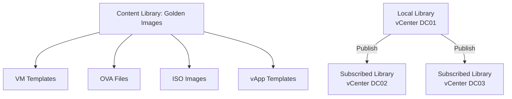
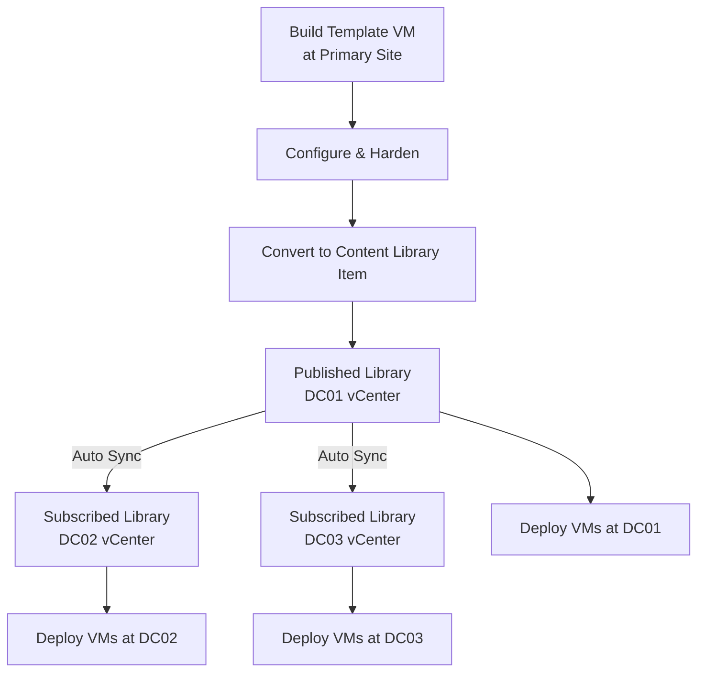

# How to Use Ansible to Manage VMware Content Libraries

Author: [nawazdhandala](https://www.github.com/nawazdhandala)

Tags: Ansible, VMware, Content Libraries, vSphere, Templates

Description: Learn how to create and manage VMware content libraries with Ansible for centralized template and ISO management across multiple vCenter instances.

---

Content libraries in vSphere are a centralized repository for VM templates, OVA/OVF files, ISOs, and other deployment artifacts. They solve a problem that every multi-datacenter VMware environment faces: how do you keep templates consistent and up to date across multiple vCenter instances? Instead of manually exporting and importing templates, content libraries handle replication automatically. Ansible lets you manage the full lifecycle of content libraries, from creation to item management to deploying VMs from library items.

## What Content Libraries Provide

Content libraries give you a catalog of versioned, replicable deployment items.



There are two types of content libraries:

- **Local library** - The primary source of content. Items are stored on a datastore attached to the local vCenter.
- **Subscribed library** - A read-only replica that syncs content from a published local library. Great for multi-site deployments.

## Creating a Local Content Library

The `community.vmware.vmware_content_library_manager` module manages content libraries.

```yaml
# create-content-library.yml
---
- name: Create a VMware content library
  hosts: localhost
  gather_facts: false

  module_defaults:
    group/community.vmware.vmware:
      hostname: "{{ vcenter_hostname }}"
      username: "{{ vcenter_username }}"
      password: "{{ vcenter_password }}"
      validate_certs: false

  vars:
    vcenter_hostname: "vcenter.example.com"
    vcenter_username: "administrator@vsphere.local"
    vcenter_password: "{{ vault_vcenter_password }}"

  tasks:
    - name: Create local content library for golden images
      community.vmware.vmware_content_library_manager:
        library_name: "Golden-Images"
        library_description: "Centralized repository for approved VM templates and ISOs"
        library_type: local
        datastore_name: "vsanDatastore"
        state: present
      register: lib_result

    - name: Display library creation result
      ansible.builtin.debug:
        msg: "Content library 'Golden-Images': {{ 'created' if lib_result.changed else 'already exists' }}"
```

## Creating a Published Library

To share content across vCenter instances, publish the local library.

```yaml
# create-published-library.yml
---
- name: Create a published content library
  hosts: localhost
  gather_facts: false

  module_defaults:
    group/community.vmware.vmware:
      hostname: "{{ vcenter_hostname }}"
      username: "{{ vcenter_username }}"
      password: "{{ vcenter_password }}"
      validate_certs: false

  vars:
    vcenter_hostname: "vcenter.example.com"
    vcenter_username: "administrator@vsphere.local"
    vcenter_password: "{{ vault_vcenter_password }}"

  tasks:
    - name: Create published content library
      community.vmware.vmware_content_library_manager:
        library_name: "Published-Templates"
        library_description: "Published library for multi-site template distribution"
        library_type: local
        datastore_name: "vsanDatastore"
        # Enable publishing so other vCenters can subscribe
        publish_info:
          published: true
          authentication_method: "NONE"
        state: present
      register: published_lib

    - name: Display publication URL
      ansible.builtin.debug:
        msg: "Library published. Other vCenters can subscribe to this library."
      when: published_lib.changed
```

## Creating a Subscribed Library

On a remote vCenter, create a subscribed library that syncs from the published one.

```yaml
# create-subscribed-library.yml
---
- name: Create a subscribed content library on remote vCenter
  hosts: localhost
  gather_facts: false

  vars:
    # This points to the REMOTE vCenter
    vcenter_hostname: "vcenter-dc02.example.com"
    vcenter_username: "administrator@vsphere.local"
    vcenter_password: "{{ vault_vcenter_dc02_password }}"
    # The publish URL from the source library
    source_publish_url: "https://vcenter.example.com:443/cls/vcsp/lib/library-uuid"

  tasks:
    - name: Create subscribed content library
      community.vmware.vmware_content_library_manager:
        hostname: "{{ vcenter_hostname }}"
        username: "{{ vcenter_username }}"
        password: "{{ vcenter_password }}"
        validate_certs: false
        library_name: "Synced-Templates"
        library_description: "Subscribed from DC01 published library"
        library_type: subscribed
        datastore_name: "vsanDatastore-DC02"
        subscription_url: "{{ source_publish_url }}"
        # Sync content on demand rather than automatically
        update_on_demand: true
        state: present
```

## Getting Content Library Information

List libraries and their contents for auditing.

```yaml
# content-library-info.yml
---
- name: Gather content library information
  hosts: localhost
  gather_facts: false

  module_defaults:
    group/community.vmware.vmware:
      hostname: "{{ vcenter_hostname }}"
      username: "{{ vcenter_username }}"
      password: "{{ vcenter_password }}"
      validate_certs: false

  vars:
    vcenter_hostname: "vcenter.example.com"
    vcenter_username: "administrator@vsphere.local"
    vcenter_password: "{{ vault_vcenter_password }}"

  tasks:
    - name: Get information about all content libraries
      community.vmware.vmware_content_library_info:
        library_name: "Golden-Images"
      register: lib_info

    - name: Display library details
      ansible.builtin.debug:
        msg: >
          Library: {{ lib_info.content_lib_details[0].library_name }}
          Type: {{ lib_info.content_lib_details[0].library_type }}
          Items: {{ lib_info.content_lib_details[0].library_item_count | default('unknown') }}
      when: lib_info.content_lib_details | length > 0
```

## Deploying VMs from Content Library Items

Deploy VMs directly from content library templates.

```yaml
# deploy-from-library.yml
---
- name: Deploy VM from a content library item
  hosts: localhost
  gather_facts: false

  module_defaults:
    group/community.vmware.vmware:
      hostname: "{{ vcenter_hostname }}"
      username: "{{ vcenter_username }}"
      password: "{{ vcenter_password }}"
      validate_certs: false

  vars:
    vcenter_hostname: "vcenter.example.com"
    vcenter_username: "administrator@vsphere.local"
    vcenter_password: "{{ vault_vcenter_password }}"

  tasks:
    - name: Deploy VM from content library template
      community.vmware.vmware_content_deploy_template:
        template: "rhel9-golden-template"
        content_library: "Golden-Images"
        name: "prod-web-10"
        datacenter: "DC01"
        cluster: "Production"
        folder: "/DC01/vm/Production/WebServers"
        datastore: "vsanDatastore"
        resource_pool: "RP-Production-Standard"
        state: poweredon
      register: deploy_result

    - name: Display deployment result
      ansible.builtin.debug:
        msg: "VM {{ deploy_result.vm_deploy_info.name }} deployed from content library"
      when: deploy_result.changed
```

## Deploying OVA from Content Library

Content libraries can also store OVA files for appliance deployments.

```yaml
# deploy-ova-from-library.yml
- name: Deploy OVA from content library
  community.vmware.vmware_content_deploy_ovf_template:
    hostname: "{{ vcenter_hostname }}"
    username: "{{ vcenter_username }}"
    password: "{{ vcenter_password }}"
    validate_certs: false
    ovf_template: "monitoring-appliance-v3"
    content_library: "Golden-Images"
    name: "monitoring-appliance-01"
    datacenter: "DC01"
    cluster: "Production"
    folder: "/DC01/vm/Infrastructure/Monitoring"
    datastore: "vsanDatastore"
    resource_pool: "RP-Infrastructure"
  register: ova_deploy
```

## Multi-Site Template Management Workflow

Here is the complete workflow for managing templates across multiple sites.



## Automating Template Updates in Content Libraries

When you update a template, push it to the content library and all subscribed libraries get the update.

```yaml
# update-library-template.yml
---
- name: Update template in content library
  hosts: localhost
  gather_facts: false

  module_defaults:
    group/community.vmware.vmware:
      hostname: "{{ vcenter_hostname }}"
      username: "{{ vcenter_username }}"
      password: "{{ vcenter_password }}"
      validate_certs: false

  vars:
    vcenter_hostname: "vcenter.example.com"
    vcenter_username: "administrator@vsphere.local"
    vcenter_password: "{{ vault_vcenter_password }}"
    template_name: "rhel9-golden-template"
    library_name: "Golden-Images"

  tasks:
    # Step 1: Deploy the existing template as a VM
    - name: Deploy template as a VM for updating
      community.vmware.vmware_content_deploy_template:
        template: "{{ template_name }}"
        content_library: "{{ library_name }}"
        name: "{{ template_name }}-update"
        datacenter: "DC01"
        cluster: "Production"
        folder: "/DC01/vm/Templates/Build"
        datastore: "vsanDatastore"
        state: poweredon
      register: update_vm

    - name: Wait for VM to be reachable
      ansible.builtin.wait_for:
        host: "{{ update_vm.vm_deploy_info.ip }}"
        port: 22
        timeout: 300
        delay: 30
      when: update_vm.changed

    - name: Add update VM to inventory
      ansible.builtin.add_host:
        name: "{{ update_vm.vm_deploy_info.ip }}"
        groups: template_update
      when: update_vm.changed

# Step 2: Apply updates
- name: Apply updates to template VM
  hosts: template_update
  become: true

  tasks:
    - name: Update all packages
      ansible.builtin.dnf:
        name: "*"
        state: latest
        update_cache: true

    - name: Clean up package cache
      ansible.builtin.command:
        cmd: dnf clean all
      changed_when: true

    - name: Shutdown VM
      ansible.builtin.command:
        cmd: shutdown -h now
      async: 0
      poll: 0
      ignore_errors: true
```

## Deleting Content Libraries

When a content library is no longer needed, remove it to free up datastore space.

```yaml
# delete-library.yml
- name: Delete deprecated content library
  community.vmware.vmware_content_library_manager:
    hostname: "{{ vcenter_hostname }}"
    username: "{{ vcenter_username }}"
    password: "{{ vcenter_password }}"
    validate_certs: false
    library_name: "Old-Templates"
    state: absent
```

## Best Practices

After working with content libraries across several production environments, here are the patterns that work:

1. **Use one primary library per template type.** Separate libraries for Linux templates, Windows templates, and appliances keep things organized.

2. **Version your templates.** Include the build date or version number in the template name so you can track which version is deployed where.

3. **Sync on demand for large items.** If your library contains large OVA files, configure subscribed libraries to sync on demand rather than automatically to avoid saturating your WAN links.

4. **Monitor library storage.** Content libraries can consume significant datastore space, especially with multiple template versions. Include library datastore usage in your capacity monitoring.

5. **Test before publishing.** Always validate a template works correctly at the primary site before publishing it to subscribed libraries at remote sites.

Content libraries bring enterprise-grade template management to VMware environments, and Ansible automates the operational tasks around them. The combination gives you a reliable, automated pipeline for distributing deployment artifacts across your entire infrastructure.
