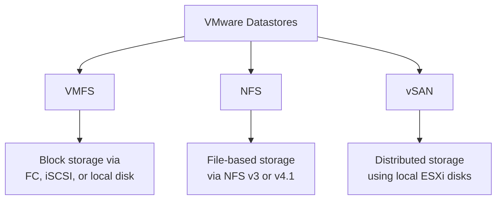

# How to Use Ansible to Manage VMware Datastores

Author: [nawazdhandala](https://www.github.com/nawazdhandala)

Tags: Ansible, VMware, Datastores, Storage, vSphere

Description: Learn how to manage VMware datastores with Ansible including creating NFS and VMFS datastores, monitoring capacity, and performing maintenance.

---

Datastores are where all your VM data lives in a VMware environment. Managing them well means VMs do not run out of space, performance stays consistent, and capacity planning is based on real data rather than guesswork. Ansible can automate datastore creation, mounting, monitoring, and maintenance across all your ESXi hosts. This guide covers the practical operations you will use day to day.

## VMware Datastore Types

VMware supports several datastore types, each with different characteristics.



Ansible can manage VMFS and NFS datastores directly. vSAN is configured at the cluster level.

## Mounting an NFS Datastore

NFS datastores are common for shared storage, backups, and ISO libraries.

```yaml
# mount-nfs-datastore.yml
---
- name: Mount NFS datastore on ESXi hosts
  hosts: localhost
  gather_facts: false

  module_defaults:
    group/community.vmware.vmware:
      hostname: "{{ vcenter_hostname }}"
      username: "{{ vcenter_username }}"
      password: "{{ vcenter_password }}"
      validate_certs: false

  vars:
    vcenter_hostname: "vcenter.example.com"
    vcenter_username: "administrator@vsphere.local"
    vcenter_password: "{{ vault_vcenter_password }}"

  tasks:
    - name: Mount NFS datastore on all hosts in the cluster
      community.vmware.vmware_host_datastore:
        esxi_hostname: "{{ item }}"
        datastore_name: "nfs-shared-01"
        datastore_type: nfs
        nfs_server: "nfs-server.example.com"
        nfs_path: "/exports/vmware/shared01"
        nfs_ro: false
        state: present
      loop:
        - "esxi-01.example.com"
        - "esxi-02.example.com"
        - "esxi-03.example.com"
      register: nfs_mount_results

    - name: Display mount results
      ansible.builtin.debug:
        msg: "{{ item.item }}: {{ 'mounted' if item.changed else 'already present' }}"
      loop: "{{ nfs_mount_results.results }}"
```

## Creating a VMFS Datastore

VMFS datastores are built on block storage devices. You need to identify the available LUNs first.

```yaml
# create-vmfs-datastore.yml
---
- name: Create VMFS datastore on a new LUN
  hosts: localhost
  gather_facts: false

  module_defaults:
    group/community.vmware.vmware:
      hostname: "{{ vcenter_hostname }}"
      username: "{{ vcenter_username }}"
      password: "{{ vcenter_password }}"
      validate_certs: false

  vars:
    vcenter_hostname: "vcenter.example.com"
    vcenter_username: "administrator@vsphere.local"
    vcenter_password: "{{ vault_vcenter_password }}"

  tasks:
    # First, rescan the HBAs to discover new LUNs
    - name: Rescan HBAs on ESXi host
      community.vmware.vmware_host_scanhba:
        esxi_hostname: "esxi-01.example.com"
        refresh_storage: true

    # Create the VMFS datastore on the discovered LUN
    - name: Create VMFS 6 datastore
      community.vmware.vmware_host_datastore:
        esxi_hostname: "esxi-01.example.com"
        datastore_name: "vmfs-data-01"
        datastore_type: vmfs
        vmfs_device_name: "naa.60000000000000001"
        vmfs_version: 6
        state: present
      register: vmfs_result

    - name: Report VMFS creation
      ansible.builtin.debug:
        msg: "VMFS datastore created: {{ vmfs_result.changed }}"
```

## Gathering Datastore Information

Monitor datastore capacity to prevent space issues before they cause outages.

```yaml
# datastore-info.yml
---
- name: Gather and report datastore information
  hosts: localhost
  gather_facts: false

  module_defaults:
    group/community.vmware.vmware:
      hostname: "{{ vcenter_hostname }}"
      username: "{{ vcenter_username }}"
      password: "{{ vcenter_password }}"
      validate_certs: false

  vars:
    vcenter_hostname: "vcenter.example.com"
    vcenter_username: "administrator@vsphere.local"
    vcenter_password: "{{ vault_vcenter_password }}"

  tasks:
    - name: Get information about all datastores
      community.vmware.vmware_datastore_info:
        datacenter: "DC01"
      register: datastore_info

    - name: Display datastore capacity report
      ansible.builtin.debug:
        msg: >
          {{ item.name }}:
          Type={{ item.type }},
          Capacity={{ (item.capacity / 1073741824) | round(1) }} GB,
          Free={{ (item.freeSpace / 1073741824) | round(1) }} GB,
          Used={{ ((item.capacity - item.freeSpace) / item.capacity * 100) | round(1) }}%
      loop: "{{ datastore_info.datastores }}"

    # Alert on datastores that are running low on space
    - name: Flag datastores with less than 20% free space
      ansible.builtin.debug:
        msg: "WARNING: {{ item.name }} is {{ ((item.capacity - item.freeSpace) / item.capacity * 100) | round(1) }}% full!"
      loop: "{{ datastore_info.datastores }}"
      when: ((item.capacity - item.freeSpace) / item.capacity * 100) > 80
```

## Datastore Maintenance Mode

Before removing or performing maintenance on a datastore, migrate VMs off of it first.

```yaml
# datastore-maintenance.yml
---
- name: Prepare datastore for maintenance
  hosts: localhost
  gather_facts: false

  module_defaults:
    group/community.vmware.vmware:
      hostname: "{{ vcenter_hostname }}"
      username: "{{ vcenter_username }}"
      password: "{{ vcenter_password }}"
      validate_certs: false

  vars:
    vcenter_hostname: "vcenter.example.com"
    vcenter_username: "administrator@vsphere.local"
    vcenter_password: "{{ vault_vcenter_password }}"
    source_datastore: "vmfs-old-01"
    target_datastore: "vmfs-new-01"

  tasks:
    # Find all VMs on the source datastore
    - name: Get VMs on the source datastore
      community.vmware.vmware_datastore_info:
        datacenter: "DC01"
        name: "{{ source_datastore }}"
      register: ds_info

    # Migrate each VM's storage to the new datastore
    - name: Storage vMotion VMs to the new datastore
      community.vmware.vmware_vmotion:
        vm_name: "{{ item }}"
        destination_datastore: "{{ target_datastore }}"
      loop: "{{ ds_info.datastores[0].virtual_machines | default([]) }}"
      when: ds_info.datastores[0].virtual_machines is defined
```

## Unmounting and Removing Datastores

After migrating all VMs, unmount the old datastore.

```yaml
# unmount-datastore.yml
- name: Unmount NFS datastore from all hosts
  community.vmware.vmware_host_datastore:
    hostname: "{{ vcenter_hostname }}"
    username: "{{ vcenter_username }}"
    password: "{{ vcenter_password }}"
    validate_certs: false
    esxi_hostname: "{{ item }}"
    datastore_name: "nfs-old-01"
    state: absent
  loop:
    - "esxi-01.example.com"
    - "esxi-02.example.com"
    - "esxi-03.example.com"
```

## Capacity Monitoring Playbook

Run this regularly to track datastore usage trends.

```yaml
# capacity-monitoring.yml
---
- name: Datastore capacity monitoring and alerting
  hosts: localhost
  gather_facts: true

  module_defaults:
    group/community.vmware.vmware:
      hostname: "{{ vcenter_hostname }}"
      username: "{{ vcenter_username }}"
      password: "{{ vcenter_password }}"
      validate_certs: false

  vars:
    vcenter_hostname: "vcenter.example.com"
    vcenter_username: "administrator@vsphere.local"
    vcenter_password: "{{ vault_vcenter_password }}"
    warning_threshold: 75
    critical_threshold: 90

  tasks:
    - name: Gather all datastore information
      community.vmware.vmware_datastore_info:
        datacenter: "DC01"
      register: all_datastores

    - name: Calculate usage for each datastore
      ansible.builtin.set_fact:
        datastore_usage: >-
          {{ datastore_usage | default([]) + [{
            'name': item.name,
            'type': item.type,
            'capacity_gb': (item.capacity / 1073741824) | round(1),
            'free_gb': (item.freeSpace / 1073741824) | round(1),
            'used_pct': ((item.capacity - item.freeSpace) / item.capacity * 100) | round(1)
          }] }}
      loop: "{{ all_datastores.datastores }}"

    - name: Report datastores at WARNING level
      ansible.builtin.debug:
        msg: "WARNING: {{ item.name }} at {{ item.used_pct }}% ({{ item.free_gb }} GB free)"
      loop: "{{ datastore_usage }}"
      when: item.used_pct >= warning_threshold and item.used_pct < critical_threshold

    - name: Report datastores at CRITICAL level
      ansible.builtin.debug:
        msg: "CRITICAL: {{ item.name }} at {{ item.used_pct }}% ({{ item.free_gb }} GB free)"
      loop: "{{ datastore_usage }}"
      when: item.used_pct >= critical_threshold

    # Fail the playbook if any datastore is critical
    - name: Fail if critical datastores found
      ansible.builtin.fail:
        msg: "Critical datastore capacity detected! Immediate action required."
      when: datastore_usage | selectattr('used_pct', 'ge', critical_threshold) | list | length > 0
```

## Bulk Datastore Operations Across All Hosts

When you need to mount a new datastore on every host in a cluster, get the host list dynamically.

```yaml
# mount-on-all-hosts.yml
- name: Get all hosts in the cluster
  community.vmware.vmware_host_info:
    hostname: "{{ vcenter_hostname }}"
    username: "{{ vcenter_username }}"
    password: "{{ vcenter_password }}"
    validate_certs: false
  register: host_info

- name: Mount NFS datastore on every host
  community.vmware.vmware_host_datastore:
    hostname: "{{ vcenter_hostname }}"
    username: "{{ vcenter_username }}"
    password: "{{ vcenter_password }}"
    validate_certs: false
    esxi_hostname: "{{ item.key }}"
    datastore_name: "nfs-new-share"
    datastore_type: nfs
    nfs_server: "nfs-server.example.com"
    nfs_path: "/exports/vmware/newshare"
    state: present
  loop: "{{ host_info.hosts | dict2items }}"
```

Datastore management is infrastructure work that directly impacts VM availability and performance. Automating it with Ansible means you can provision storage consistently, monitor capacity proactively, and perform migrations without the risk of manual errors. Build monitoring into your regular automation workflows and you will catch space issues long before they become outages.
