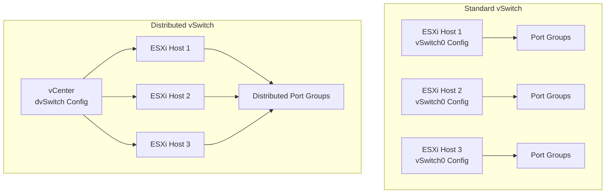

# How to Use Ansible to Manage VMware Distributed Switches

Author: [nawazdhandala](https://www.github.com/nawazdhandala)

Tags: Ansible, VMware, Distributed Switch, Networking, vSphere

Description: Learn how to create and manage VMware distributed virtual switches with Ansible for centralized network management across ESXi hosts.

---

Distributed virtual switches (dvSwitches) are the enterprise-grade networking solution in VMware vSphere. Unlike standard vSwitches that are configured per-host, a dvSwitch is managed centrally through vCenter and provides consistent network configuration across all connected ESXi hosts. This centralized management is exactly what Ansible excels at automating. In this guide, I will cover creating dvSwitches, adding hosts, configuring uplinks, and managing the network policies.

## Standard vSwitch vs Distributed vSwitch

Understanding the difference is important before deciding what to automate.



With standard vSwitches, you manage networking on each host independently. With a dvSwitch, you configure networking once and it applies everywhere.

## Creating a Distributed Switch

The `community.vmware.vmware_dvswitch` module creates and configures dvSwitches.

```yaml
# create-dvswitch.yml
---
- name: Create a VMware distributed switch
  hosts: localhost
  gather_facts: false

  module_defaults:
    group/community.vmware.vmware:
      hostname: "{{ vcenter_hostname }}"
      username: "{{ vcenter_username }}"
      password: "{{ vcenter_password }}"
      validate_certs: false

  vars:
    vcenter_hostname: "vcenter.example.com"
    vcenter_username: "administrator@vsphere.local"
    vcenter_password: "{{ vault_vcenter_password }}"

  tasks:
    - name: Create production distributed switch
      community.vmware.vmware_dvswitch:
        datacenter: "DC01"
        switch: "DSwitch-Production"
        version: "7.0.3"
        # Number of uplink ports per host
        uplink_quantity: 4
        uplink_prefix: "Uplink"
        # Discovery protocol settings
        discovery_protocol: lldp
        discovery_operation: both
        # MTU setting (9000 for jumbo frames)
        mtu: 9000
        # Multicast filtering mode
        multicast_filtering_mode: basic
        state: present
      register: dvs_result

    - name: Display distributed switch creation result
      ansible.builtin.debug:
        msg: "dvSwitch created: {{ dvs_result.changed }}"
```

## Adding ESXi Hosts to a Distributed Switch

After creating the dvSwitch, add hosts and assign their physical NICs as uplinks.

```yaml
# add-hosts-to-dvswitch.yml
---
- name: Add ESXi hosts to the distributed switch
  hosts: localhost
  gather_facts: false

  module_defaults:
    group/community.vmware.vmware:
      hostname: "{{ vcenter_hostname }}"
      username: "{{ vcenter_username }}"
      password: "{{ vcenter_password }}"
      validate_certs: false

  vars:
    vcenter_hostname: "vcenter.example.com"
    vcenter_username: "administrator@vsphere.local"
    vcenter_password: "{{ vault_vcenter_password }}"

    # Map ESXi hosts to their uplink physical NICs
    dvs_hosts:
      - name: "esxi-01.example.com"
        uplinks:
          - physical_nic: "vmnic2"
            uplink_name: "Uplink1"
          - physical_nic: "vmnic3"
            uplink_name: "Uplink2"
      - name: "esxi-02.example.com"
        uplinks:
          - physical_nic: "vmnic2"
            uplink_name: "Uplink1"
          - physical_nic: "vmnic3"
            uplink_name: "Uplink2"
      - name: "esxi-03.example.com"
        uplinks:
          - physical_nic: "vmnic2"
            uplink_name: "Uplink1"
          - physical_nic: "vmnic3"
            uplink_name: "Uplink2"

  tasks:
    - name: Add hosts to the distributed switch with uplink assignments
      community.vmware.vmware_dvs_host:
        esxi_hostname: "{{ item.name }}"
        switch_name: "DSwitch-Production"
        vmnics: "{{ item.uplinks | map(attribute='physical_nic') | list }}"
        state: present
      loop: "{{ dvs_hosts }}"
      register: host_add_results

    - name: Report host addition results
      ansible.builtin.debug:
        msg: "{{ item.item.name }}: {{ 'added' if item.changed else 'already present' }}"
      loop: "{{ host_add_results.results }}"
```

## Creating Distributed Port Groups

Port groups on a dvSwitch are configured once and available to all connected hosts.

```yaml
# create-dvs-portgroups.yml
---
- name: Create distributed port groups on the dvSwitch
  hosts: localhost
  gather_facts: false

  module_defaults:
    group/community.vmware.vmware:
      hostname: "{{ vcenter_hostname }}"
      username: "{{ vcenter_username }}"
      password: "{{ vcenter_password }}"
      validate_certs: false

  vars:
    vcenter_hostname: "vcenter.example.com"
    vcenter_username: "administrator@vsphere.local"
    vcenter_password: "{{ vault_vcenter_password }}"

    # Define all distributed port groups
    distributed_portgroups:
      - name: "DPG-VLAN100-Production"
        vlan_id: 100
        ports: 256
      - name: "DPG-VLAN200-Management"
        vlan_id: 200
        ports: 64
      - name: "DPG-VLAN300-DMZ"
        vlan_id: 300
        ports: 64
      - name: "DPG-VLAN400-iSCSI-A"
        vlan_id: 400
        ports: 32
      - name: "DPG-VLAN401-iSCSI-B"
        vlan_id: 401
        ports: 32
      - name: "DPG-VLAN500-Backup"
        vlan_id: 500
        ports: 32
      - name: "DPG-VLAN600-vMotion"
        vlan_id: 600
        ports: 32

  tasks:
    - name: Create each distributed port group
      community.vmware.vmware_dvs_portgroup:
        switch_name: "DSwitch-Production"
        portgroup_name: "{{ item.name }}"
        vlan_id: "{{ item.vlan_id }}"
        num_ports: "{{ item.ports }}"
        port_binding: static
        state: present
        network_policy:
          promiscuous: false
          forged_transmits: false
          mac_changes: false
      loop: "{{ distributed_portgroups }}"
      register: dpg_results

    - name: Report created port groups
      ansible.builtin.debug:
        msg: "{{ item.item.name }} (VLAN {{ item.item.vlan_id }}): {{ 'created' if item.changed else 'exists' }}"
      loop: "{{ dpg_results.results }}"
```

## Configuring Uplink Policies

Uplink policies determine how traffic is distributed across physical NICs and how failover works.

```yaml
# configure-uplink-policy.yml
- name: Configure uplink teaming on a distributed port group
  community.vmware.vmware_dvs_portgroup:
    hostname: "{{ vcenter_hostname }}"
    username: "{{ vcenter_username }}"
    password: "{{ vcenter_password }}"
    validate_certs: false
    switch_name: "DSwitch-Production"
    portgroup_name: "DPG-VLAN100-Production"
    vlan_id: 100
    num_ports: 256
    port_binding: static
    state: present
    teaming_policy:
      # Load balancing algorithm
      # Options: loadbalance_srcid, loadbalance_ip, loadbalance_srcmac,
      #          loadbalance_loadbased, failover_explicit
      load_balance_policy: loadbalance_loadbased
      # Use all uplinks actively
      inbound_policy: true
      notify_switches: true
      rolling_order: false
```

## Gathering Distributed Switch Information

Get details about existing dvSwitches for auditing or troubleshooting.

```yaml
# dvswitch-info.yml
---
- name: Gather distributed switch information
  hosts: localhost
  gather_facts: false

  module_defaults:
    group/community.vmware.vmware:
      hostname: "{{ vcenter_hostname }}"
      username: "{{ vcenter_username }}"
      password: "{{ vcenter_password }}"
      validate_certs: false

  vars:
    vcenter_hostname: "vcenter.example.com"
    vcenter_username: "administrator@vsphere.local"
    vcenter_password: "{{ vault_vcenter_password }}"

  tasks:
    - name: Get distributed switch details
      community.vmware.vmware_dvswitch_info:
        switch_name: "DSwitch-Production"
      register: dvs_info

    - name: Display dvSwitch configuration
      ansible.builtin.debug:
        msg: >
          Switch: {{ dvs_info.distributed_virtual_switches[0].name }}
          Version: {{ dvs_info.distributed_virtual_switches[0].version }}
          MTU: {{ dvs_info.distributed_virtual_switches[0].mtu }}
          Uplinks: {{ dvs_info.distributed_virtual_switches[0].uplink_portgroup }}
          Hosts: {{ dvs_info.distributed_virtual_switches[0].hosts | length }}
      when: dvs_info.distributed_virtual_switches | length > 0

    # Get port group details on the dvSwitch
    - name: Get distributed port group information
      community.vmware.vmware_dvs_portgroup_info:
        datacenter: "DC01"
        dvswitch: "DSwitch-Production"
      register: dpg_info

    - name: Display port groups
      ansible.builtin.debug:
        msg: "Port Group: {{ item.portgroup_name }} - VLAN: {{ item.vlan_info.vlan_id | default('trunk') }}"
      loop: "{{ dpg_info.dvs_portgroup_info['DSwitch-Production'] }}"
```

## Configuring Network I/O Control

Network I/O Control (NIOC) on a dvSwitch lets you prioritize different traffic types.

```yaml
# configure-nioc.yml
- name: Configure network resource pools on the dvSwitch
  community.vmware.vmware_dvswitch:
    hostname: "{{ vcenter_hostname }}"
    username: "{{ vcenter_username }}"
    password: "{{ vcenter_password }}"
    validate_certs: false
    datacenter: "DC01"
    switch: "DSwitch-Production"
    # Enable Network I/O Control
    network_policy:
      # These resource allocations help prioritize traffic
      # when the physical links are saturated
      vmotion:
        shares_level: high
      virtual_machine:
        shares_level: high
      iscsi:
        shares_level: high
      management:
        shares_level: normal
    state: present
```

## Complete dvSwitch Deployment Playbook

Here is a complete playbook that sets up a dvSwitch from scratch.

```yaml
# full-dvswitch-setup.yml
---
- name: Complete distributed switch deployment
  hosts: localhost
  gather_facts: false

  module_defaults:
    group/community.vmware.vmware:
      hostname: "{{ vcenter_hostname }}"
      username: "{{ vcenter_username }}"
      password: "{{ vcenter_password }}"
      validate_certs: false

  vars:
    vcenter_hostname: "vcenter.example.com"
    vcenter_username: "administrator@vsphere.local"
    vcenter_password: "{{ vault_vcenter_password }}"

  tasks:
    # Step 1: Create the dvSwitch
    - name: Create distributed switch
      community.vmware.vmware_dvswitch:
        datacenter: "DC01"
        switch: "DSwitch-Prod"
        version: "7.0.3"
        uplink_quantity: 2
        mtu: 9000
        discovery_protocol: lldp
        discovery_operation: both
        state: present

    # Step 2: Add hosts
    - name: Add ESXi hosts to dvSwitch
      community.vmware.vmware_dvs_host:
        esxi_hostname: "{{ item }}"
        switch_name: "DSwitch-Prod"
        vmnics:
          - vmnic2
          - vmnic3
        state: present
      loop:
        - "esxi-01.example.com"
        - "esxi-02.example.com"
        - "esxi-03.example.com"

    # Step 3: Create port groups
    - name: Create production port group
      community.vmware.vmware_dvs_portgroup:
        switch_name: "DSwitch-Prod"
        portgroup_name: "{{ item.name }}"
        vlan_id: "{{ item.vlan }}"
        num_ports: "{{ item.ports }}"
        port_binding: static
        state: present
        network_policy:
          promiscuous: false
          forged_transmits: false
          mac_changes: false
      loop:
        - { name: "DPG-Prod", vlan: 100, ports: 256 }
        - { name: "DPG-Mgmt", vlan: 200, ports: 64 }
        - { name: "DPG-vMotion", vlan: 600, ports: 32 }

    - name: Distributed switch deployment complete
      ansible.builtin.debug:
        msg: "dvSwitch 'DSwitch-Prod' deployed with hosts and port groups"
```

Distributed switches bring centralized, consistent networking to your VMware environment, and Ansible brings automation to that management. The combination eliminates the host-by-host configuration that makes standard vSwitches hard to manage at scale. Define your network topology once in Ansible, and apply it uniformly across your entire infrastructure.
