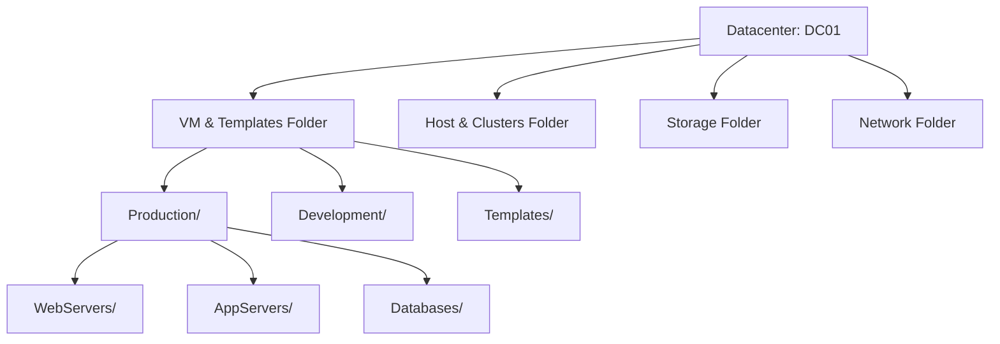

# How to Use Ansible to Manage VMware Folders

Author: [nawazdhandala](https://www.github.com/nawazdhandala)

Tags: Ansible, VMware, Folders, vSphere, Organization

Description: Learn how to create and manage VMware vSphere folders with Ansible to organize VMs, templates, and other objects in your datacenter hierarchy.

---

As VMware environments grow, the flat list of VMs in the vSphere inventory becomes impossible to navigate. Folders bring structure to the chaos by organizing VMs into logical groups based on environment, application, team, or any other classification that makes sense for your organization. Managing these folders manually through the vSphere Client is fine initially, but Ansible lets you define your entire folder structure as code, making it reproducible and self-documenting.

## VMware Folder Types

VMware has several types of folders, each for organizing different object types.



The VM & Templates folder type is the one you will work with most often. It organizes VMs and templates in the vSphere inventory.

## Creating VM Folders

The `community.vmware.vmware_folder` module creates folders in the vSphere inventory.

```yaml
# create-folders.yml
---
- name: Create VMware folder structure
  hosts: localhost
  gather_facts: false

  module_defaults:
    group/community.vmware.vmware:
      hostname: "{{ vcenter_hostname }}"
      username: "{{ vcenter_username }}"
      password: "{{ vcenter_password }}"
      validate_certs: false

  vars:
    vcenter_hostname: "vcenter.example.com"
    vcenter_username: "administrator@vsphere.local"
    vcenter_password: "{{ vault_vcenter_password }}"

  tasks:
    - name: Create top-level environment folders
      community.vmware.vmware_folder:
        datacenter_name: "DC01"
        folder_name: "{{ item }}"
        folder_type: vm
        state: present
      loop:
        - "Production"
        - "Staging"
        - "Development"
        - "Templates"
        - "Infrastructure"
      register: folder_results

    - name: Report created folders
      ansible.builtin.debug:
        msg: "{{ item.item }}: {{ 'created' if item.changed else 'already exists' }}"
      loop: "{{ folder_results.results }}"
```

## Creating Nested Folder Structures

For deeper organization, create nested folders by specifying the parent path.

```yaml
# create-nested-folders.yml
---
- name: Create nested folder hierarchy for production
  hosts: localhost
  gather_facts: false

  module_defaults:
    group/community.vmware.vmware:
      hostname: "{{ vcenter_hostname }}"
      username: "{{ vcenter_username }}"
      password: "{{ vcenter_password }}"
      validate_certs: false

  vars:
    vcenter_hostname: "vcenter.example.com"
    vcenter_username: "administrator@vsphere.local"
    vcenter_password: "{{ vault_vcenter_password }}"

    # Define the complete folder hierarchy
    # Order matters - parent folders must exist before children
    folder_hierarchy:
      # Production environment
      - "Production"
      - "Production/WebServers"
      - "Production/AppServers"
      - "Production/Databases"
      - "Production/Monitoring"
      - "Production/LoadBalancers"
      # Staging environment
      - "Staging"
      - "Staging/WebServers"
      - "Staging/AppServers"
      - "Staging/Databases"
      # Development environment
      - "Development"
      - "Development/Team-Alpha"
      - "Development/Team-Beta"
      - "Development/Sandbox"
      # Templates and infrastructure
      - "Templates"
      - "Templates/Linux"
      - "Templates/Windows"
      - "Templates/Build"
      - "Infrastructure"
      - "Infrastructure/DNS"
      - "Infrastructure/Monitoring"
      - "Infrastructure/Backup"

  tasks:
    - name: Create each folder in the hierarchy
      community.vmware.vmware_folder:
        datacenter_name: "DC01"
        folder_name: "{{ item }}"
        folder_type: vm
        state: present
      loop: "{{ folder_hierarchy }}"
```

## Using Folders When Creating VMs

When creating or cloning VMs, specify the full folder path to place them in the right location.

```yaml
# create-vm-in-folder.yml
- name: Create VM in a specific folder
  community.vmware.vmware_guest:
    hostname: "{{ vcenter_hostname }}"
    username: "{{ vcenter_username }}"
    password: "{{ vcenter_password }}"
    validate_certs: false
    name: "prod-web-05"
    template: "golden-rhel9-base"
    state: poweredon
    datacenter: "DC01"
    cluster: "Production"
    # Full path to the VM folder
    folder: "/DC01/vm/Production/WebServers"
    datastore: "vsanDatastore"
    hardware:
      memory_mb: 4096
      num_cpus: 2
```

The folder path format is important. It always starts with `/<datacenter>/vm/` followed by your custom folder path.

## Moving VMs Between Folders

As VMs change roles or environments, move them to the appropriate folder.

```yaml
# move-vm-to-folder.yml
---
- name: Move VMs to their correct folders
  hosts: localhost
  gather_facts: false

  module_defaults:
    group/community.vmware.vmware:
      hostname: "{{ vcenter_hostname }}"
      username: "{{ vcenter_username }}"
      password: "{{ vcenter_password }}"
      validate_certs: false

  vars:
    vcenter_hostname: "vcenter.example.com"
    vcenter_username: "administrator@vsphere.local"
    vcenter_password: "{{ vault_vcenter_password }}"

    # VMs that need to be reorganized
    vm_moves:
      - vm_name: "promoted-app-01"
        destination: "/DC01/vm/Production/AppServers"
      - vm_name: "decommissioned-web-03"
        destination: "/DC01/vm/Development/Sandbox"
      - vm_name: "new-monitoring-01"
        destination: "/DC01/vm/Infrastructure/Monitoring"

  tasks:
    - name: Move VMs to their target folders
      community.vmware.vmware_guest_move:
        datacenter: "DC01"
        name: "{{ item.vm_name }}"
        dest_folder: "{{ item.destination }}"
      loop: "{{ vm_moves }}"
      register: move_results

    - name: Report move operations
      ansible.builtin.debug:
        msg: "{{ item.item.vm_name }} -> {{ item.item.destination }}: {{ 'moved' if item.changed else 'already there' }}"
      loop: "{{ move_results.results }}"
```

## Folder-Based Inventory Organization

Use folders to build your Ansible dynamic inventory by mapping folder paths to Ansible groups.

```yaml
# vmware_inventory.yml - Dynamic inventory plugin configuration
plugin: community.vmware.vmware_vm_inventory
strict: false
hostname: "vcenter.example.com"
username: "administrator@vsphere.local"
password: "{{ lookup('env', 'VMWARE_PASSWORD') }}"
validate_certs: false

# Group VMs by their folder path
hostnames:
  - config.name

# Create Ansible groups based on VM folder paths
groups:
  production_web: "'Production/WebServers' in path"
  production_app: "'Production/AppServers' in path"
  production_db: "'Production/Databases' in path"
  staging: "'Staging' in path"
  development: "'Development' in path"
```

## Auditing Folder Structure

Check that your folder structure matches the expected hierarchy.

```yaml
# audit-folders.yml
---
- name: Audit VMware folder structure
  hosts: localhost
  gather_facts: false

  module_defaults:
    group/community.vmware.vmware:
      hostname: "{{ vcenter_hostname }}"
      username: "{{ vcenter_username }}"
      password: "{{ vcenter_password }}"
      validate_certs: false

  vars:
    vcenter_hostname: "vcenter.example.com"
    vcenter_username: "administrator@vsphere.local"
    vcenter_password: "{{ vault_vcenter_password }}"

  tasks:
    - name: Get all VM folder information
      community.vmware.vmware_folder_info:
        datacenter: "DC01"
      register: folder_info

    - name: Display folder hierarchy
      ansible.builtin.debug:
        msg: "Folder: {{ item.path }}"
      loop: "{{ folder_info.flat_folder_info }}"
      when: folder_info.flat_folder_info is defined
```

## Removing Empty Folders

Clean up folders that are no longer needed. The folder must be empty before removal.

```yaml
# remove-empty-folders.yml
- name: Remove deprecated folders
  community.vmware.vmware_folder:
    hostname: "{{ vcenter_hostname }}"
    username: "{{ vcenter_username }}"
    password: "{{ vcenter_password }}"
    validate_certs: false
    datacenter_name: "DC01"
    folder_name: "{{ item }}"
    folder_type: vm
    state: absent
  loop:
    - "Deprecated/OldProject"
    - "Deprecated"
```

## Automated Folder Creation for New Projects

When a new project or team spins up, create their folder structure automatically.

```yaml
# create-project-folders.yml
---
- name: Create folder structure for a new project
  hosts: localhost
  gather_facts: false

  module_defaults:
    group/community.vmware.vmware:
      hostname: "{{ vcenter_hostname }}"
      username: "{{ vcenter_username }}"
      password: "{{ vcenter_password }}"
      validate_certs: false

  vars:
    vcenter_hostname: "vcenter.example.com"
    vcenter_username: "administrator@vsphere.local"
    vcenter_password: "{{ vault_vcenter_password }}"
    project_name: "ProjectPhoenix"

    # Standard folder structure for every project
    project_folders:
      - "{{ project_name }}"
      - "{{ project_name }}/WebTier"
      - "{{ project_name }}/AppTier"
      - "{{ project_name }}/DataTier"
      - "{{ project_name }}/DevOps"

  tasks:
    - name: Create project folder structure
      community.vmware.vmware_folder:
        datacenter_name: "DC01"
        folder_name: "{{ item }}"
        folder_type: vm
        state: present
      loop: "{{ project_folders }}"

    - name: Report project setup
      ansible.builtin.debug:
        msg: "Folder structure created for project '{{ project_name }}' with {{ project_folders | length }} folders"
```

## Folder Naming Conventions

Establishing and enforcing naming conventions is just as important as creating the folders themselves. Here are some patterns that work well:

```yaml
# Good folder naming conventions
# Environment/Role pattern
# Production/WebServers
# Production/Databases
# Staging/AppServers

# Environment/Team pattern
# Development/Team-Alpha
# Development/Team-Beta

# Environment/Application pattern
# Production/ECommerce
# Production/InternalTools

# Bad patterns to avoid
# Do not use spaces: "Production Web Servers" -> "Production/WebServers"
# Do not go too deep: 5+ levels becomes unwieldy
# Do not mix patterns: Choose one convention and stick with it
```

A well-organized folder structure makes your VMware environment navigable, simplifies permissions management (vSphere permissions can be set at the folder level), and gives you a natural way to organize your Ansible inventory. Define the structure in code with Ansible, and it stays consistent even as the environment grows.
