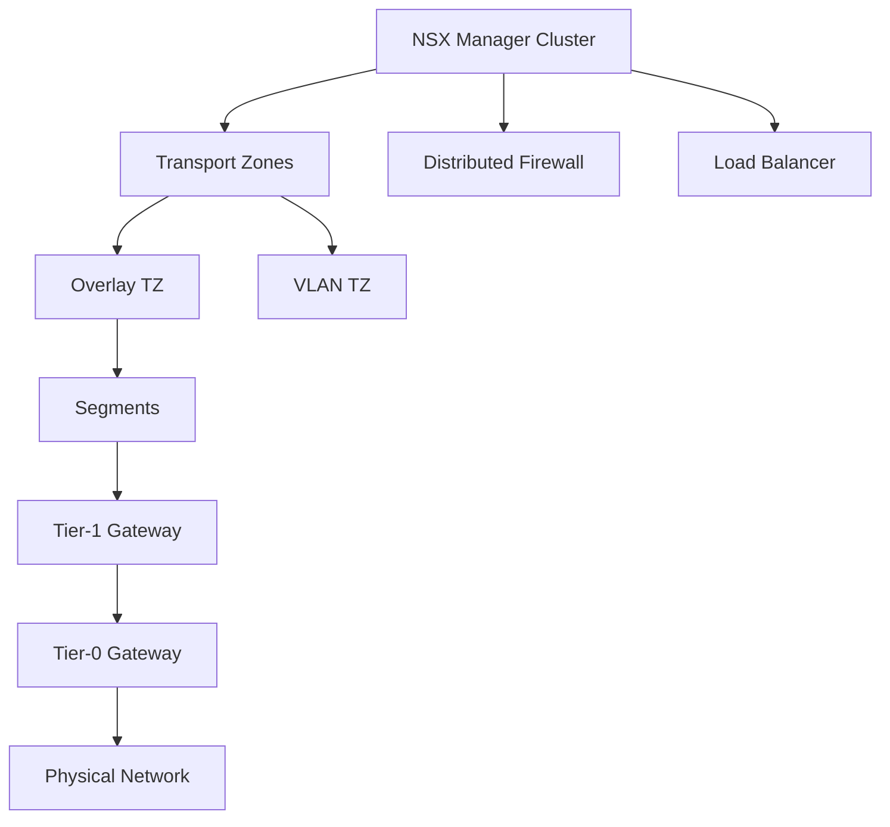

# How to Use Ansible to Manage VMware NSX

Author: [nawazdhandala](https://www.github.com/nawazdhandala)

Tags: Ansible, VMware, NSX, Networking, Software-Defined Networking

Description: Automate VMware NSX network virtualization management with Ansible playbooks for segments, firewalls, and load balancers.

---

VMware NSX is the backbone of software-defined networking in many enterprise environments. It handles microsegmentation, distributed firewalling, load balancing, and network overlays. Managing all of that through the NSX Manager GUI works fine for small environments, but once you have hundreds of segments and firewall rules, you need automation. Ansible fills that gap perfectly.

This guide covers how to use Ansible to manage NSX-T (now called NSX) components including transport zones, segments, firewall rules, and load balancers.

## Prerequisites

You need the following:

- Ansible 2.12 or newer
- The `vmware.ansible_for_nsxt` collection (VMware official) or the `community.vmware` collection
- NSX Manager 3.x or 4.x with API access
- An account with Enterprise Admin role on NSX

Install the NSX Ansible collection.

```bash
# Install the official VMware NSX-T Ansible collection
ansible-galaxy collection install vmware.ansible_for_nsxt

# Also install required Python libraries
pip install requests pyvmomi
```

## NSX Architecture Overview

Before jumping into playbooks, here is a quick refresher on NSX-T architecture.



## Connection Variables

All NSX modules need the manager connection details. I keep these in a vars file.

```yaml
# vars/nsx_connection.yml
---
nsx_manager: nsx-manager.lab.local
nsx_username: admin
nsx_password: "{{ vault_nsx_password }}"
nsx_validate_certs: false
```

## Managing Transport Zones

Transport zones define the reach of your overlay or VLAN networks. Here is how to create them.

```yaml
# playbooks/nsx-transport-zones.yml
---
- name: Manage NSX Transport Zones
  hosts: localhost
  gather_facts: false
  vars_files:
    - ../vars/nsx_connection.yml

  tasks:
    # Create an overlay transport zone for VM traffic
    - name: Create overlay transport zone
      vmware.ansible_for_nsxt.nsxt_transport_zones:
        hostname: "{{ nsx_manager }}"
        username: "{{ nsx_username }}"
        password: "{{ nsx_password }}"
        validate_certs: "{{ nsx_validate_certs }}"
        display_name: "tz-overlay-prod"
        description: "Production overlay transport zone"
        transport_type: "OVERLAY"
        host_switch_name: "nvds-prod"
        state: present
      register: overlay_tz

    # Create a VLAN transport zone for edge uplinks
    - name: Create VLAN transport zone for edges
      vmware.ansible_for_nsxt.nsxt_transport_zones:
        hostname: "{{ nsx_manager }}"
        username: "{{ nsx_username }}"
        password: "{{ nsx_password }}"
        validate_certs: "{{ nsx_validate_certs }}"
        display_name: "tz-vlan-edge"
        description: "VLAN transport zone for edge uplinks"
        transport_type: "VLAN"
        host_switch_name: "nvds-edge"
        state: present
```

## Creating NSX Segments

Segments are the logical switches in NSX. This is where your VMs connect.

```yaml
# playbooks/nsx-segments.yml
---
- name: Create NSX segments for application tiers
  hosts: localhost
  gather_facts: false
  vars_files:
    - ../vars/nsx_connection.yml

  vars:
    segments:
      - name: "seg-web-prod"
        gateway: "192.168.10.1/24"
        transport_zone: "tz-overlay-prod"
        description: "Production web tier"
      - name: "seg-app-prod"
        gateway: "192.168.20.1/24"
        transport_zone: "tz-overlay-prod"
        description: "Production application tier"
      - name: "seg-db-prod"
        gateway: "192.168.30.1/24"
        transport_zone: "tz-overlay-prod"
        description: "Production database tier"

  tasks:
    # Create each segment with a subnet gateway
    - name: Create NSX segments
      vmware.ansible_for_nsxt.nsxt_policy_segment:
        hostname: "{{ nsx_manager }}"
        username: "{{ nsx_username }}"
        password: "{{ nsx_password }}"
        validate_certs: "{{ nsx_validate_certs }}"
        display_name: "{{ item.name }}"
        description: "{{ item.description }}"
        transport_zone_display_name: "{{ item.transport_zone }}"
        subnets:
          - gateway_address: "{{ item.gateway }}"
        state: present
      loop: "{{ segments }}"
      loop_control:
        label: "{{ item.name }}"
```

## Configuring Tier-1 Gateways

Tier-1 gateways handle east-west routing between your segments. Each application environment usually gets its own Tier-1.

```yaml
# playbooks/nsx-tier1-gateway.yml
---
- name: Configure NSX Tier-1 Gateways
  hosts: localhost
  gather_facts: false
  vars_files:
    - ../vars/nsx_connection.yml

  tasks:
    # Create a Tier-1 gateway for the production environment
    - name: Create production Tier-1 gateway
      vmware.ansible_for_nsxt.nsxt_policy_tier1:
        hostname: "{{ nsx_manager }}"
        username: "{{ nsx_username }}"
        password: "{{ nsx_password }}"
        validate_certs: "{{ nsx_validate_certs }}"
        display_name: "t1-prod"
        description: "Production Tier-1 gateway"
        tier0_display_name: "t0-main"
        route_advertisement_types:
          - TIER1_CONNECTED
          - TIER1_NAT
        state: present

    # Connect segments to the Tier-1 gateway
    - name: Attach web segment to Tier-1
      vmware.ansible_for_nsxt.nsxt_policy_segment:
        hostname: "{{ nsx_manager }}"
        username: "{{ nsx_username }}"
        password: "{{ nsx_password }}"
        validate_certs: "{{ nsx_validate_certs }}"
        display_name: "seg-web-prod"
        connectivity_path: "/infra/tier-1s/t1-prod"
        subnets:
          - gateway_address: "192.168.10.1/24"
        state: present
```

## Managing Distributed Firewall Rules

The distributed firewall is one of the most powerful NSX features. It lets you create microsegmentation policies that are enforced at the virtual NIC level.

```yaml
# playbooks/nsx-firewall-rules.yml
---
- name: Configure NSX Distributed Firewall
  hosts: localhost
  gather_facts: false
  vars_files:
    - ../vars/nsx_connection.yml

  tasks:
    # Create security groups first
    - name: Create web servers security group
      vmware.ansible_for_nsxt.nsxt_policy_group:
        hostname: "{{ nsx_manager }}"
        username: "{{ nsx_username }}"
        password: "{{ nsx_password }}"
        validate_certs: "{{ nsx_validate_certs }}"
        display_name: "grp-web-servers"
        description: "Web server VMs"
        domain_id: "default"
        expression:
          - member_type: VirtualMachine
            resource_type: Condition
            key: Tag
            operator: EQUALS
            value: "web|tier"
        state: present

    - name: Create database servers security group
      vmware.ansible_for_nsxt.nsxt_policy_group:
        hostname: "{{ nsx_manager }}"
        username: "{{ nsx_username }}"
        password: "{{ nsx_password }}"
        validate_certs: "{{ nsx_validate_certs }}"
        display_name: "grp-db-servers"
        description: "Database server VMs"
        domain_id: "default"
        expression:
          - member_type: VirtualMachine
            resource_type: Condition
            key: Tag
            operator: EQUALS
            value: "database|tier"
        state: present

    # Create a firewall section with rules
    - name: Create application firewall policy
      vmware.ansible_for_nsxt.nsxt_policy_security_policy:
        hostname: "{{ nsx_manager }}"
        username: "{{ nsx_username }}"
        password: "{{ nsx_password }}"
        validate_certs: "{{ nsx_validate_certs }}"
        display_name: "pol-app-segmentation"
        description: "Application microsegmentation policy"
        domain_id: "default"
        category: "Application"
        rules:
          - display_name: "allow-web-to-app"
            description: "Allow web tier to talk to app tier"
            source_groups:
              - "/infra/domains/default/groups/grp-web-servers"
            destination_groups:
              - "/infra/domains/default/groups/grp-app-servers"
            services:
              - "/infra/services/HTTPS"
              - "/infra/services/HTTP"
            action: "ALLOW"
            sequence_number: 10
          - display_name: "allow-app-to-db"
            description: "Allow app tier to database tier"
            source_groups:
              - "/infra/domains/default/groups/grp-app-servers"
            destination_groups:
              - "/infra/domains/default/groups/grp-db-servers"
            services:
              - "/infra/services/MySQL"
            action: "ALLOW"
            sequence_number: 20
          - display_name: "deny-all-other"
            description: "Default deny for this policy"
            action: "DROP"
            sequence_number: 100
        state: present
```

## NSX Load Balancer Configuration

NSX includes a built-in load balancer. Here is how to set up a virtual server with a server pool.

```yaml
# playbooks/nsx-load-balancer.yml
---
- name: Configure NSX Load Balancer
  hosts: localhost
  gather_facts: false
  vars_files:
    - ../vars/nsx_connection.yml

  tasks:
    # Create a server pool with health monitoring
    - name: Create web server pool
      vmware.ansible_for_nsxt.nsxt_policy_lb_pool:
        hostname: "{{ nsx_manager }}"
        username: "{{ nsx_username }}"
        password: "{{ nsx_password }}"
        validate_certs: "{{ nsx_validate_certs }}"
        display_name: "pool-web-prod"
        description: "Production web server pool"
        algorithm: "ROUND_ROBIN"
        members:
          - display_name: "web-01"
            ip_address: "192.168.10.11"
            port: "443"
          - display_name: "web-02"
            ip_address: "192.168.10.12"
            port: "443"
          - display_name: "web-03"
            ip_address: "192.168.10.13"
            port: "443"
        active_monitor_paths:
          - "/infra/lb-monitor-profiles/default-https-lb-monitor"
        state: present

    # Create the virtual server
    - name: Create virtual server
      vmware.ansible_for_nsxt.nsxt_policy_lb_virtual_server:
        hostname: "{{ nsx_manager }}"
        username: "{{ nsx_username }}"
        password: "{{ nsx_password }}"
        validate_certs: "{{ nsx_validate_certs }}"
        display_name: "vs-web-prod"
        description: "Production web virtual server"
        ip_address: "10.0.100.50"
        ports:
          - "443"
        pool_path: "/infra/lb-pools/pool-web-prod"
        application_profile_path: "/infra/lb-app-profiles/default-http-lb-app-profile"
        state: present
```

## Tagging VMs for Dynamic Group Membership

NSX security groups work best with tags. Use Ansible to tag VMs so they automatically join the right security groups.

```yaml
# playbooks/nsx-vm-tagging.yml
---
- name: Tag VMs for NSX security groups
  hosts: localhost
  gather_facts: false
  vars_files:
    - ../vars/vcenter_creds.yml

  tasks:
    # Tag web servers so they join the web security group
    - name: Apply NSX tags to web VMs
      community.vmware.vmware_tag_manager:
        hostname: "{{ vcenter_hostname }}"
        username: "{{ vcenter_username }}"
        password: "{{ vcenter_password }}"
        validate_certs: false
        tag_names:
          - "nsx:web"
          - "nsx:tier"
        object_name: "{{ item }}"
        object_type: VirtualMachine
        state: add
      loop:
        - web-prod-01
        - web-prod-02
        - web-prod-03
```

## Lessons from Production

Managing NSX with Ansible has a few quirks worth knowing about:

- **API rate limits**: NSX Manager can get overwhelmed if you push too many changes at once. Use `serial` or `throttle` in your playbooks to limit concurrency.
- **Idempotency matters**: NSX modules are mostly idempotent, but always test in a lab first. Some operations like firewall rule reordering can behave unexpectedly.
- **Version your policies**: Keep your firewall policies in Git alongside your Ansible playbooks. When an audit asks why a rule exists, you can point to the commit history.
- **Use tags over IP-based groups**: IP-based security groups break when VMs get new addresses. Tag-based groups are dynamic and follow the VM wherever it goes.

Once you have NSX managed through Ansible, changes to your network become pull requests instead of manual clicks. That shift alone makes compliance and auditing dramatically simpler.
