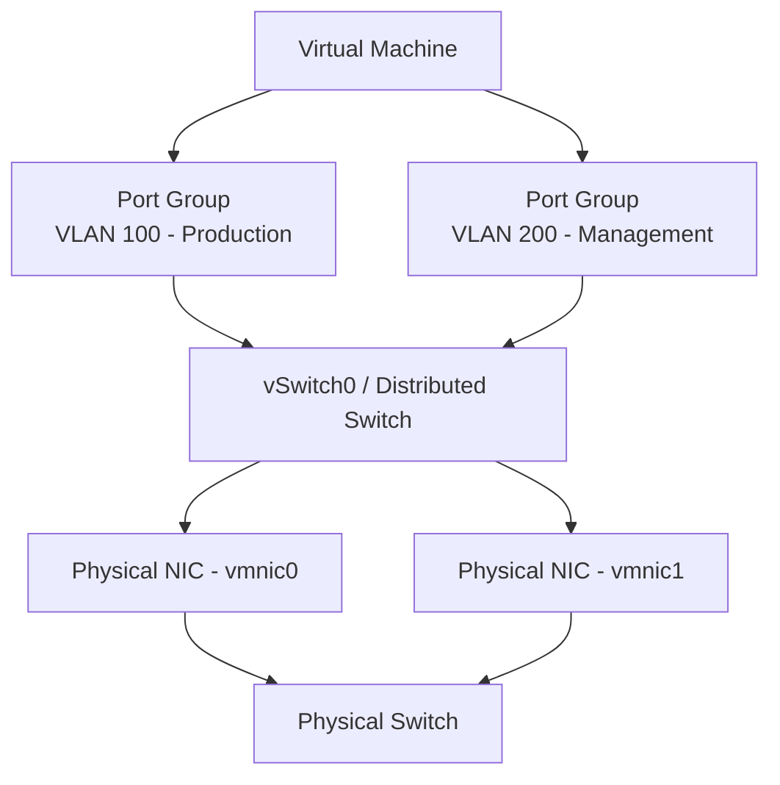

# How to Use Ansible to Manage VMware Port Groups

Author: [nawazdhandala](https://www.github.com/nawazdhandala)

Tags: Ansible, VMware, Networking, Port Groups, vSphere

Description: Learn how to create and manage VMware port groups on standard and distributed switches with Ansible for consistent network configuration.

---

Port groups define the network policies for virtual machines in a VMware environment. They determine which VLAN a VM connects to, the security policies that apply to its traffic, and the bandwidth limits that are enforced. Managing port groups manually across multiple ESXi hosts is tedious and error-prone because each host with a standard vSwitch needs its own configuration. Ansible can create and manage port groups consistently across all your hosts at once.

## Port Group Architecture

In VMware, port groups sit on top of virtual switches and provide network connectivity to VMs.



There are two types of port groups:

- **Standard port groups** live on standard vSwitches and are configured per-host. Each ESXi host needs its own configuration.
- **Distributed port groups** live on distributed vSwitches (dvSwitch) and are configured at the vCenter level. Changes apply to all hosts connected to the dvSwitch.

## Creating Standard Port Groups

Standard port groups need to be created on each ESXi host individually. Ansible makes this manageable by looping over all hosts.

```yaml
# create-standard-portgroup.yml
---
- name: Create standard port groups on all ESXi hosts
  hosts: localhost
  gather_facts: false

  module_defaults:
    group/community.vmware.vmware:
      hostname: "{{ vcenter_hostname }}"
      username: "{{ vcenter_username }}"
      password: "{{ vcenter_password }}"
      validate_certs: false

  vars:
    vcenter_hostname: "vcenter.example.com"
    vcenter_username: "administrator@vsphere.local"
    vcenter_password: "{{ vault_vcenter_password }}"

    esxi_hosts:
      - "esxi-01.example.com"
      - "esxi-02.example.com"
      - "esxi-03.example.com"

    # Define all port groups to create
    port_groups:
      - name: "VLAN-100-Production"
        vlan_id: 100
        vswitch: "vSwitch0"
      - name: "VLAN-200-Management"
        vlan_id: 200
        vswitch: "vSwitch0"
      - name: "VLAN-300-DMZ"
        vlan_id: 300
        vswitch: "vSwitch1"
      - name: "VLAN-500-Backup"
        vlan_id: 500
        vswitch: "vSwitch1"

  tasks:
    - name: Create port groups on all ESXi hosts
      community.vmware.vmware_portgroup:
        esxi_hostname: "{{ item.0 }}"
        switch: "{{ item.1.vswitch }}"
        portgroup: "{{ item.1.name }}"
        vlan_id: "{{ item.1.vlan_id }}"
        # Security policies
        security:
          promiscuous_mode: false
          mac_changes: false
          forged_transmits: false
      loop: "{{ esxi_hosts | product(port_groups) | list }}"
      loop_control:
        label: "{{ item.0 }} - {{ item.1.name }}"
      register: pg_results

    - name: Report port group creation
      ansible.builtin.debug:
        msg: "Created {{ pg_results.results | selectattr('changed') | list | length }} port groups"
```

## Configuring Port Group Security Policies

Security policies control how the port group handles MAC address changes and promiscuous mode.

```yaml
# configure-portgroup-security.yml
---
- name: Configure security policies on port groups
  hosts: localhost
  gather_facts: false

  module_defaults:
    group/community.vmware.vmware:
      hostname: "{{ vcenter_hostname }}"
      username: "{{ vcenter_username }}"
      password: "{{ vcenter_password }}"
      validate_certs: false

  vars:
    vcenter_hostname: "vcenter.example.com"
    vcenter_username: "administrator@vsphere.local"
    vcenter_password: "{{ vault_vcenter_password }}"

  tasks:
    # Standard production port group - strict security
    - name: Configure strict security on production port group
      community.vmware.vmware_portgroup:
        esxi_hostname: "{{ item }}"
        switch: "vSwitch0"
        portgroup: "VLAN-100-Production"
        vlan_id: 100
        security:
          # Do not allow VMs to see all network traffic
          promiscuous_mode: false
          # Do not allow VMs to change their MAC address
          mac_changes: false
          # Do not allow VMs to send frames with a spoofed source MAC
          forged_transmits: false
      loop:
        - "esxi-01.example.com"
        - "esxi-02.example.com"
        - "esxi-03.example.com"

    # Monitoring port group - needs promiscuous mode for packet capture
    - name: Configure monitoring port group with promiscuous mode
      community.vmware.vmware_portgroup:
        esxi_hostname: "{{ item }}"
        switch: "vSwitch0"
        portgroup: "VLAN-600-Monitoring"
        vlan_id: 600
        security:
          promiscuous_mode: true  # Required for network monitoring tools
          mac_changes: false
          forged_transmits: false
      loop:
        - "esxi-01.example.com"
        - "esxi-02.example.com"
        - "esxi-03.example.com"
```

## Configuring Port Group Teaming and Failover

NIC teaming determines how traffic is distributed across physical NICs and what happens when a NIC fails.

```yaml
# configure-teaming.yml
- name: Configure NIC teaming on port groups
  community.vmware.vmware_portgroup:
    hostname: "{{ vcenter_hostname }}"
    username: "{{ vcenter_username }}"
    password: "{{ vcenter_password }}"
    validate_certs: false
    esxi_hostname: "esxi-01.example.com"
    switch: "vSwitch0"
    portgroup: "VLAN-100-Production"
    vlan_id: 100
    teaming:
      # Load balancing policy
      # Options: loadbalance_srcid, loadbalance_ip, loadbalance_srcmac, failover_explicit
      load_balancing: loadbalance_srcid
      # Failover detection
      network_failure_detection: link_status_only
      # Allow failback to preferred NIC when it recovers
      notify_switches: true
      failback: true
      # Active and standby NICs
      active_adapters:
        - vmnic0
        - vmnic1
      standby_adapters:
        - vmnic2
```

## Managing Distributed Port Groups

Distributed port groups are managed at the vCenter level and apply to all hosts connected to the distributed switch.

```yaml
# create-dvs-portgroup.yml
---
- name: Create distributed port groups
  hosts: localhost
  gather_facts: false

  module_defaults:
    group/community.vmware.vmware:
      hostname: "{{ vcenter_hostname }}"
      username: "{{ vcenter_username }}"
      password: "{{ vcenter_password }}"
      validate_certs: false

  vars:
    vcenter_hostname: "vcenter.example.com"
    vcenter_username: "administrator@vsphere.local"
    vcenter_password: "{{ vault_vcenter_password }}"

  tasks:
    - name: Create production distributed port group
      community.vmware.vmware_dvs_portgroup:
        switch_name: "DSwitch-Production"
        portgroup_name: "DPG-VLAN-100-Production"
        vlan_id: 100
        num_ports: 128
        port_binding: static
        state: present
        # Network resource pool for QoS
        network_policy:
          promiscuous: false
          forged_transmits: false
          mac_changes: false
      register: dpg_result

    - name: Create DMZ distributed port group
      community.vmware.vmware_dvs_portgroup:
        switch_name: "DSwitch-Production"
        portgroup_name: "DPG-VLAN-300-DMZ"
        vlan_id: 300
        num_ports: 64
        port_binding: static
        state: present
        network_policy:
          promiscuous: false
          forged_transmits: false
          mac_changes: false

    - name: Create VLAN trunk port group for router VMs
      community.vmware.vmware_dvs_portgroup:
        switch_name: "DSwitch-Production"
        portgroup_name: "DPG-Trunk-Router"
        vlan_trunk: true
        vlan_id: "100-110,200,300-310"  # Trunk specific VLANs
        num_ports: 8
        port_binding: static
        state: present
```

## Gathering Port Group Information

Audit your port group configuration to ensure consistency.

```yaml
# portgroup-audit.yml
---
- name: Audit port group configuration across all hosts
  hosts: localhost
  gather_facts: false

  module_defaults:
    group/community.vmware.vmware:
      hostname: "{{ vcenter_hostname }}"
      username: "{{ vcenter_username }}"
      password: "{{ vcenter_password }}"
      validate_certs: false

  vars:
    vcenter_hostname: "vcenter.example.com"
    vcenter_username: "administrator@vsphere.local"
    vcenter_password: "{{ vault_vcenter_password }}"

  tasks:
    - name: Get port group information from all hosts
      community.vmware.vmware_portgroup_info:
        cluster_name: "Production"
      register: pg_info

    - name: Display port group configuration per host
      ansible.builtin.debug:
        msg: >
          Host: {{ item.key }}
          Port Groups: {{ item.value | map(attribute='portgroup') | list | join(', ') }}
      loop: "{{ pg_info.hosts_portgroup_info | dict2items }}"
```

## Removing Port Groups

Clean up unused port groups to keep your network configuration tidy.

```yaml
# remove-portgroup.yml
- name: Remove deprecated port groups from all hosts
  community.vmware.vmware_portgroup:
    hostname: "{{ vcenter_hostname }}"
    username: "{{ vcenter_username }}"
    password: "{{ vcenter_password }}"
    validate_certs: false
    esxi_hostname: "{{ item }}"
    switch: "vSwitch0"
    portgroup: "VLAN-999-Deprecated"
    state: absent
  loop:
    - "esxi-01.example.com"
    - "esxi-02.example.com"
    - "esxi-03.example.com"
```

## Standardizing Port Groups Across Hosts

One common problem is port group configuration drift, where different hosts end up with slightly different settings. This playbook detects and fixes drift.

```yaml
# standardize-portgroups.yml
---
- name: Ensure all hosts have identical port group configuration
  hosts: localhost
  gather_facts: false

  module_defaults:
    group/community.vmware.vmware:
      hostname: "{{ vcenter_hostname }}"
      username: "{{ vcenter_username }}"
      password: "{{ vcenter_password }}"
      validate_certs: false

  vars:
    vcenter_hostname: "vcenter.example.com"
    vcenter_username: "administrator@vsphere.local"
    vcenter_password: "{{ vault_vcenter_password }}"

    # Get host list dynamically
    cluster_name: "Production"

    # Standard port group definitions
    standard_portgroups:
      - name: "VLAN-100-Production"
        vlan_id: 100
        vswitch: "vSwitch0"
        promiscuous: false
        mac_changes: false
        forged_transmits: false
      - name: "VLAN-200-Management"
        vlan_id: 200
        vswitch: "vSwitch0"
        promiscuous: false
        mac_changes: false
        forged_transmits: false

  tasks:
    - name: Get all hosts in the cluster
      community.vmware.vmware_host_info:
        datacenter: "DC01"
      register: host_info

    - name: Apply standard port group configuration to every host
      community.vmware.vmware_portgroup:
        esxi_hostname: "{{ item.0.key }}"
        switch: "{{ item.1.vswitch }}"
        portgroup: "{{ item.1.name }}"
        vlan_id: "{{ item.1.vlan_id }}"
        security:
          promiscuous_mode: "{{ item.1.promiscuous }}"
          mac_changes: "{{ item.1.mac_changes }}"
          forged_transmits: "{{ item.1.forged_transmits }}"
      loop: "{{ host_info.hosts | dict2items | product(standard_portgroups) | list }}"
      loop_control:
        label: "{{ item.0.key }} - {{ item.1.name }}"
```

Port group management is one of those areas where consistency is everything. A missing port group on one host means VMs cannot vMotion there. A port group with the wrong VLAN ID means network connectivity breaks. By defining your port groups in Ansible and applying them uniformly, you eliminate an entire category of networking issues that plague manually managed VMware environments.
