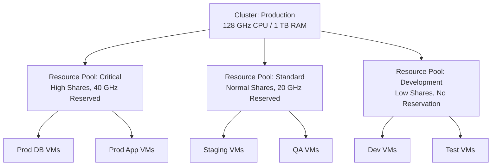

# How to Use Ansible to Manage VMware Resource Pools

Author: [nawazdhandala](https://www.github.com/nawazdhandala)

Tags: Ansible, VMware, Resource Pools, vSphere, Resource Management

Description: Learn how to create and manage VMware resource pools with Ansible to control CPU and memory allocation for different workload tiers.

---

Resource pools in VMware let you partition a cluster's CPU and memory resources among different groups of VMs. Without resource pools, all VMs compete equally for resources, which means a runaway process in a development VM could starve a production database of CPU cycles. By creating resource pools and assigning VMs to them, you guarantee that critical workloads always get the resources they need. Ansible makes it straightforward to create, configure, and manage resource pools programmatically.

## What Resource Pools Do

Resource pools create a hierarchy of resource allocation within a cluster. Each pool gets a share of the cluster's total CPU and memory, with options for reservations (guaranteed minimums) and limits (enforced maximums).



## Creating Resource Pools

The `community.vmware.vmware_resource_pool` module handles resource pool creation and configuration.

```yaml
# create-resource-pools.yml
---
- name: Create VMware resource pools
  hosts: localhost
  gather_facts: false

  module_defaults:
    group/community.vmware.vmware:
      hostname: "{{ vcenter_hostname }}"
      username: "{{ vcenter_username }}"
      password: "{{ vcenter_password }}"
      validate_certs: false

  vars:
    vcenter_hostname: "vcenter.example.com"
    vcenter_username: "administrator@vsphere.local"
    vcenter_password: "{{ vault_vcenter_password }}"

  tasks:
    - name: Create resource pool for critical production workloads
      community.vmware.vmware_resource_pool:
        datacenter: "DC01"
        cluster: "Production"
        resource_pool: "RP-Critical"
        # CPU resource settings
        cpu_shares: high
        cpu_reservation: 40000  # 40 GHz reserved
        cpu_limit: -1           # No limit (-1 means unlimited)
        cpu_expandable_reservations: true
        # Memory resource settings
        mem_shares: high
        mem_reservation: 131072  # 128 GB reserved
        mem_limit: -1            # No limit
        mem_expandable_reservations: true
        state: present
      register: critical_pool

    - name: Display resource pool creation result
      ansible.builtin.debug:
        msg: "Resource pool '{{ critical_pool.resource_pool_config.name }}' created"
```

## Understanding Shares, Reservations, and Limits

These three settings control how resources are allocated.

```yaml
# Resource allocation explained through examples

# SHARES determine relative priority when resources are contended
# High = 8000 shares, Normal = 4000, Low = 2000, or set Custom
# If two pools have High and Normal shares, the High pool gets
# twice the resources during contention

# RESERVATION guarantees a minimum amount of resources
# The cluster must have enough unreserved capacity to honor this
# cpu_reservation: 10000 means 10 GHz is always available to this pool

# LIMIT caps the maximum resources a pool can use
# Even if the cluster has idle capacity, the pool cannot exceed this
# cpu_limit: 20000 means the pool can never use more than 20 GHz
# cpu_limit: -1 means no limit (use whatever is available)
```

## Creating a Full Resource Pool Hierarchy

Most environments need multiple resource pools organized by priority tier.

```yaml
# create-pool-hierarchy.yml
---
- name: Create complete resource pool hierarchy
  hosts: localhost
  gather_facts: false

  module_defaults:
    group/community.vmware.vmware:
      hostname: "{{ vcenter_hostname }}"
      username: "{{ vcenter_username }}"
      password: "{{ vcenter_password }}"
      validate_certs: false

  vars:
    vcenter_hostname: "vcenter.example.com"
    vcenter_username: "administrator@vsphere.local"
    vcenter_password: "{{ vault_vcenter_password }}"

    # Define resource pools with their allocation settings
    resource_pools:
      - name: "RP-Production-Critical"
        cpu_shares: custom
        cpu_shares_value: 16000
        cpu_reservation: 40000
        cpu_limit: -1
        mem_shares: custom
        mem_shares_value: 16000
        mem_reservation: 262144   # 256 GB
        mem_limit: -1
      - name: "RP-Production-Standard"
        cpu_shares: normal
        cpu_shares_value: 4000
        cpu_reservation: 20000
        cpu_limit: -1
        mem_shares: normal
        mem_shares_value: 4000
        mem_reservation: 131072   # 128 GB
        mem_limit: -1
      - name: "RP-Staging"
        cpu_shares: normal
        cpu_shares_value: 4000
        cpu_reservation: 10000
        cpu_limit: 40000
        mem_shares: normal
        mem_shares_value: 4000
        mem_reservation: 65536    # 64 GB
        mem_limit: 131072         # 128 GB max
      - name: "RP-Development"
        cpu_shares: low
        cpu_shares_value: 2000
        cpu_reservation: 0
        cpu_limit: 20000
        mem_shares: low
        mem_shares_value: 2000
        mem_reservation: 0
        mem_limit: 65536          # 64 GB max
      - name: "RP-Testing"
        cpu_shares: low
        cpu_shares_value: 2000
        cpu_reservation: 0
        cpu_limit: 10000
        mem_shares: low
        mem_shares_value: 2000
        mem_reservation: 0
        mem_limit: 32768          # 32 GB max

  tasks:
    - name: Create each resource pool
      community.vmware.vmware_resource_pool:
        datacenter: "DC01"
        cluster: "Production"
        resource_pool: "{{ item.name }}"
        cpu_shares: "{{ item.cpu_shares }}"
        cpu_reservation: "{{ item.cpu_reservation }}"
        cpu_limit: "{{ item.cpu_limit }}"
        cpu_expandable_reservations: true
        mem_shares: "{{ item.mem_shares }}"
        mem_reservation: "{{ item.mem_reservation }}"
        mem_limit: "{{ item.mem_limit }}"
        mem_expandable_reservations: true
        state: present
      loop: "{{ resource_pools }}"
      register: pool_results

    - name: Report pool creation results
      ansible.builtin.debug:
        msg: "{{ item.item.name }}: {{ 'created' if item.changed else 'already exists' }}"
      loop: "{{ pool_results.results }}"
```

## Deploying VMs into Resource Pools

When creating VMs, specify the resource pool to place them in.

```yaml
# deploy-to-resource-pool.yml
- name: Deploy VM into the correct resource pool
  community.vmware.vmware_guest:
    hostname: "{{ vcenter_hostname }}"
    username: "{{ vcenter_username }}"
    password: "{{ vcenter_password }}"
    validate_certs: false
    name: "prod-db-master"
    template: "golden-rhel9-db"
    state: poweredon
    datacenter: "DC01"
    cluster: "Production"
    # Place in the critical resource pool for guaranteed resources
    resource_pool: "RP-Production-Critical"
    folder: "/DC01/vm/Production/Databases"
    datastore: "vsanDatastore"
    hardware:
      memory_mb: 65536
      num_cpus: 16
    wait_for_ip_address: true
```

## Moving VMs Between Resource Pools

When a VM's priority changes, move it to the appropriate resource pool.

```yaml
# move-vm-to-pool.yml
---
- name: Move VMs to appropriate resource pools
  hosts: localhost
  gather_facts: false

  module_defaults:
    group/community.vmware.vmware:
      hostname: "{{ vcenter_hostname }}"
      username: "{{ vcenter_username }}"
      password: "{{ vcenter_password }}"
      validate_certs: false

  vars:
    vcenter_hostname: "vcenter.example.com"
    vcenter_username: "administrator@vsphere.local"
    vcenter_password: "{{ vault_vcenter_password }}"

    # VMs that need to be moved
    vm_pool_assignments:
      - vm_name: "staging-app-01"
        target_pool: "RP-Production-Standard"
      - vm_name: "dev-test-vm"
        target_pool: "RP-Testing"

  tasks:
    - name: Move VMs to their assigned resource pools
      community.vmware.vmware_guest_move:
        datacenter: "DC01"
        name: "{{ item.vm_name }}"
        dest_resource_pool: "{{ item.target_pool }}"
      loop: "{{ vm_pool_assignments }}"
      register: move_results

    - name: Report move results
      ansible.builtin.debug:
        msg: "{{ item.item.vm_name }} moved to {{ item.item.target_pool }}: {{ item.changed }}"
      loop: "{{ move_results.results }}"
```

## Gathering Resource Pool Information

Monitor resource pool usage to understand if your allocations are appropriate.

```yaml
# resource-pool-info.yml
---
- name: Gather resource pool information
  hosts: localhost
  gather_facts: false

  module_defaults:
    group/community.vmware.vmware:
      hostname: "{{ vcenter_hostname }}"
      username: "{{ vcenter_username }}"
      password: "{{ vcenter_password }}"
      validate_certs: false

  vars:
    vcenter_hostname: "vcenter.example.com"
    vcenter_username: "administrator@vsphere.local"
    vcenter_password: "{{ vault_vcenter_password }}"

  tasks:
    - name: Get resource pool details
      community.vmware.vmware_resource_pool_info:
        datacenter: "DC01"
      register: rp_info

    - name: Display resource pool summary
      ansible.builtin.debug:
        msg: >
          Pool: {{ item.name }}
          CPU Reservation: {{ item.cpu_reservation }} MHz
          CPU Limit: {{ item.cpu_limit }} MHz
          Memory Reservation: {{ item.mem_reservation }} MB
          Memory Limit: {{ item.mem_limit }} MB
      loop: "{{ rp_info.resource_pool_info }}"
```

## Removing Resource Pools

When a resource pool is no longer needed, remove it. VMs in the pool will be moved to the parent.

```yaml
# remove-resource-pool.yml
- name: Remove deprecated resource pool
  community.vmware.vmware_resource_pool:
    hostname: "{{ vcenter_hostname }}"
    username: "{{ vcenter_username }}"
    password: "{{ vcenter_password }}"
    validate_certs: false
    datacenter: "DC01"
    cluster: "Production"
    resource_pool: "RP-Deprecated"
    state: absent
```

## Best Practices for Resource Pool Design

Based on managing resource pools in production environments, here are the patterns that work well:

1. **Do not over-reserve.** The total reservations across all pools should not exceed 80% of the cluster capacity. Leave headroom for HA failover and unexpected demand.

2. **Use limits on non-production pools.** Development and testing pools should have limits to prevent them from consuming resources that production workloads need.

3. **Monitor before tuning.** Run your workloads for a few weeks, gather performance data, and then adjust shares and reservations based on actual usage patterns.

4. **Keep it simple.** Three to five resource pools per cluster is usually sufficient. Deeply nested hierarchies become hard to understand and troubleshoot.

Resource pools are a critical tool for multi-tenant VMware environments or any setup where different workloads need guaranteed resource levels. With Ansible managing the configuration, you can define your resource allocation strategy in code, version control it, and apply it consistently.
