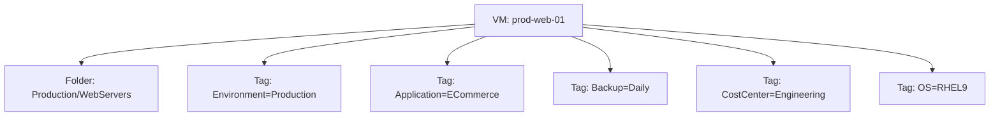

# How to Use Ansible to Manage VMware Tags

Author: [nawazdhandala](https://www.github.com/nawazdhandala)

Tags: Ansible, VMware, Tags, vSphere, Metadata

Description: Learn how to create and manage VMware vSphere tags and tag categories with Ansible for VM classification, policy enforcement, and dynamic inventory.

---

VMware tags are metadata labels you attach to vSphere objects like VMs, hosts, datastores, and networks. They are more flexible than folders because a single object can have multiple tags from different categories. This makes tags perfect for classifying VMs by environment, application, cost center, backup policy, or any other dimension you need. Ansible can manage the full tag lifecycle: creating categories, creating tags, assigning them to VMs, and using them for dynamic inventory grouping.

## Tags vs Folders

Folders give you a single hierarchical classification. Tags give you multi-dimensional classification.



A VM can only be in one folder, but it can have tags from many different categories.

## Creating Tag Categories

Tag categories define the groups that tags belong to. Each category has a cardinality setting that controls whether an object can have one or many tags from that category.

```yaml
# create-tag-categories.yml
---
- name: Create VMware tag categories
  hosts: localhost
  gather_facts: false

  module_defaults:
    group/community.vmware.vmware:
      hostname: "{{ vcenter_hostname }}"
      username: "{{ vcenter_username }}"
      password: "{{ vcenter_password }}"
      validate_certs: false

  vars:
    vcenter_hostname: "vcenter.example.com"
    vcenter_username: "administrator@vsphere.local"
    vcenter_password: "{{ vault_vcenter_password }}"

  tasks:
    # Single cardinality - each VM can only have one tag from this category
    - name: Create Environment tag category
      community.vmware.vmware_category:
        category_name: "Environment"
        category_description: "Deployment environment classification"
        category_cardinality: "single"
        # Which object types can be tagged
        associable_object_types:
          - VirtualMachine
          - Folder
        state: present

    # Single cardinality for backup policy
    - name: Create BackupPolicy tag category
      community.vmware.vmware_category:
        category_name: "BackupPolicy"
        category_description: "Backup schedule and retention policy"
        category_cardinality: "single"
        associable_object_types:
          - VirtualMachine
        state: present

    # Multiple cardinality - VMs can have many tags from this category
    - name: Create Application tag category
      community.vmware.vmware_category:
        category_name: "Application"
        category_description: "Application or service this VM supports"
        category_cardinality: "multiple"
        associable_object_types:
          - VirtualMachine
        state: present

    - name: Create CostCenter tag category
      community.vmware.vmware_category:
        category_name: "CostCenter"
        category_description: "Department or team responsible for this VM"
        category_cardinality: "single"
        associable_object_types:
          - VirtualMachine
          - Folder
          - Datastore
        state: present

    - name: Create OS tag category
      community.vmware.vmware_category:
        category_name: "OperatingSystem"
        category_description: "Guest operating system classification"
        category_cardinality: "single"
        associable_object_types:
          - VirtualMachine
        state: present
```

## Creating Tags

Once categories exist, create the tags within each category.

```yaml
# create-tags.yml
---
- name: Create VMware tags
  hosts: localhost
  gather_facts: false

  module_defaults:
    group/community.vmware.vmware:
      hostname: "{{ vcenter_hostname }}"
      username: "{{ vcenter_username }}"
      password: "{{ vcenter_password }}"
      validate_certs: false

  vars:
    vcenter_hostname: "vcenter.example.com"
    vcenter_username: "administrator@vsphere.local"
    vcenter_password: "{{ vault_vcenter_password }}"

    # Define all tags organized by category
    tag_definitions:
      Environment:
        - Production
        - Staging
        - Development
        - Testing
        - DisasterRecovery
      BackupPolicy:
        - Daily
        - Weekly
        - Monthly
        - NoBackup
      Application:
        - WebFrontend
        - APIGateway
        - Database
        - Cache
        - MessageQueue
        - Monitoring
        - CICD
      CostCenter:
        - Engineering
        - Marketing
        - Finance
        - Operations
        - Research
      OperatingSystem:
        - RHEL9
        - RHEL8
        - Ubuntu2204
        - Ubuntu2404
        - Windows2022
        - Windows2019

  tasks:
    - name: Create tags for each category
      community.vmware.vmware_tag:
        category_name: "{{ item.0.key }}"
        tag_name: "{{ item.1 }}"
        tag_description: "{{ item.0.key }}: {{ item.1 }}"
        state: present
      loop: "{{ tag_definitions | dict2items | subelements('value') }}"
      loop_control:
        label: "{{ item.0.key }}/{{ item.1 }}"
      register: tag_results

    - name: Summary of tag creation
      ansible.builtin.debug:
        msg: "Created {{ tag_results.results | selectattr('changed') | list | length }} new tags"
```

## Assigning Tags to VMs

Use the `community.vmware.vmware_tag_manager` module to assign and remove tags on VMs.

```yaml
# assign-tags.yml
---
- name: Assign tags to virtual machines
  hosts: localhost
  gather_facts: false

  module_defaults:
    group/community.vmware.vmware:
      hostname: "{{ vcenter_hostname }}"
      username: "{{ vcenter_username }}"
      password: "{{ vcenter_password }}"
      validate_certs: false

  vars:
    vcenter_hostname: "vcenter.example.com"
    vcenter_username: "administrator@vsphere.local"
    vcenter_password: "{{ vault_vcenter_password }}"

  tasks:
    - name: Tag production web server
      community.vmware.vmware_tag_manager:
        tag_names:
          - "Environment:Production"
          - "Application:WebFrontend"
          - "BackupPolicy:Daily"
          - "CostCenter:Engineering"
          - "OperatingSystem:RHEL9"
        object_name: "prod-web-01"
        object_type: VirtualMachine
        state: present

    - name: Tag database server
      community.vmware.vmware_tag_manager:
        tag_names:
          - "Environment:Production"
          - "Application:Database"
          - "BackupPolicy:Daily"
          - "CostCenter:Engineering"
          - "OperatingSystem:RHEL9"
        object_name: "prod-db-01"
        object_type: VirtualMachine
        state: present
```

## Bulk Tagging VMs

When you need to tag many VMs at once, use a variable-driven approach.

```yaml
# bulk-tag-vms.yml
---
- name: Bulk tag VMs based on their role
  hosts: localhost
  gather_facts: false

  module_defaults:
    group/community.vmware.vmware:
      hostname: "{{ vcenter_hostname }}"
      username: "{{ vcenter_username }}"
      password: "{{ vcenter_password }}"
      validate_certs: false

  vars:
    vcenter_hostname: "vcenter.example.com"
    vcenter_username: "administrator@vsphere.local"
    vcenter_password: "{{ vault_vcenter_password }}"

    # Define VMs and their tags
    vm_tags:
      - vm_name: "prod-web-01"
        tags:
          - "Environment:Production"
          - "Application:WebFrontend"
          - "BackupPolicy:Daily"
      - vm_name: "prod-web-02"
        tags:
          - "Environment:Production"
          - "Application:WebFrontend"
          - "BackupPolicy:Daily"
      - vm_name: "staging-app-01"
        tags:
          - "Environment:Staging"
          - "Application:APIGateway"
          - "BackupPolicy:Weekly"
      - vm_name: "dev-test-01"
        tags:
          - "Environment:Development"
          - "Application:WebFrontend"
          - "BackupPolicy:NoBackup"

  tasks:
    - name: Apply tags to each VM
      community.vmware.vmware_tag_manager:
        tag_names: "{{ item.tags }}"
        object_name: "{{ item.vm_name }}"
        object_type: VirtualMachine
        state: present
      loop: "{{ vm_tags }}"
      register: bulk_tag_results

    - name: Report tagging results
      ansible.builtin.debug:
        msg: "{{ item.item.vm_name }}: {{ 'tagged' if item.changed else 'already tagged' }}"
      loop: "{{ bulk_tag_results.results }}"
```

## Using Tags for Dynamic Inventory

One of the most powerful uses of tags is building Ansible dynamic inventory groups based on them.

```yaml
# vmware_inventory.yml - Tag-based dynamic inventory
plugin: community.vmware.vmware_vm_inventory
strict: false
hostname: "vcenter.example.com"
username: "administrator@vsphere.local"
password: "{{ lookup('env', 'VMWARE_PASSWORD') }}"
validate_certs: false

# Build groups from tags
keyed_groups:
  # Create groups from Environment tags
  - key: tags['Environment'] | default([])
    prefix: env
    separator: "_"
  # Create groups from Application tags
  - key: tags['Application'] | default([])
    prefix: app
    separator: "_"
  # Create groups from BackupPolicy tags
  - key: tags['BackupPolicy'] | default([])
    prefix: backup
    separator: "_"

# This creates groups like:
# env_Production
# env_Staging
# app_WebFrontend
# app_Database
# backup_Daily
# backup_NoBackup
```

## Querying VMs by Tag

Find all VMs with a specific tag for targeted operations.

```yaml
# find-vms-by-tag.yml
---
- name: Find and operate on VMs by tag
  hosts: localhost
  gather_facts: false

  module_defaults:
    group/community.vmware.vmware:
      hostname: "{{ vcenter_hostname }}"
      username: "{{ vcenter_username }}"
      password: "{{ vcenter_password }}"
      validate_certs: false

  vars:
    vcenter_hostname: "vcenter.example.com"
    vcenter_username: "administrator@vsphere.local"
    vcenter_password: "{{ vault_vcenter_password }}"

  tasks:
    - name: Get all VMs with the NoBackup tag
      community.vmware.vmware_tag_info:
        tag_name: "NoBackup"
        category_name: "BackupPolicy"
      register: no_backup_info

    - name: Display VMs without backup
      ansible.builtin.debug:
        msg: "VM without backup policy: {{ item }}"
      loop: "{{ no_backup_info.tag_info.NoBackup.objects | default([]) }}"
```

## Removing Tags from VMs

Clean up tags when VMs change roles or are decommissioned.

```yaml
# remove-tags.yml
- name: Remove outdated tags from a VM
  community.vmware.vmware_tag_manager:
    hostname: "{{ vcenter_hostname }}"
    username: "{{ vcenter_username }}"
    password: "{{ vcenter_password }}"
    validate_certs: false
    tag_names:
      - "Environment:Development"
    object_name: "promoted-app-01"
    object_type: VirtualMachine
    state: absent

# Then assign the correct new tags
- name: Assign production tags
  community.vmware.vmware_tag_manager:
    hostname: "{{ vcenter_hostname }}"
    username: "{{ vcenter_username }}"
    password: "{{ vcenter_password }}"
    validate_certs: false
    tag_names:
      - "Environment:Production"
    object_name: "promoted-app-01"
    object_type: VirtualMachine
    state: present
```

Tags bring multi-dimensional classification to your VMware environment that folders alone cannot provide. Combined with Ansible's automation capabilities, you can enforce tagging policies, build dynamic inventory groups, and drive automation based on metadata rather than hard-coded VM names. Start with a few essential categories like Environment, Application, and BackupPolicy, and expand from there as your needs grow.
