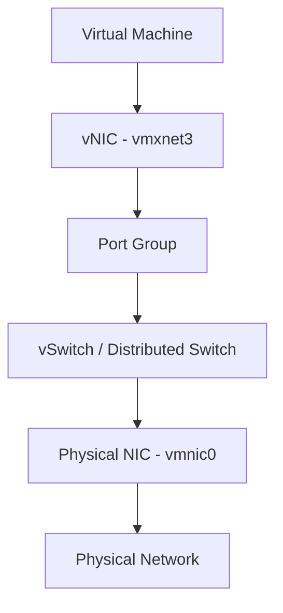

# How to Use Ansible to Manage VMware VM Networks

Author: [nawazdhandala](https://www.github.com/nawazdhandala)

Tags: Ansible, VMware, Networking, vSphere, Virtual Networks

Description: Learn how to manage VMware virtual machine network adapters, VLANs, and network configurations with Ansible for consistent networking at scale.

---

Network configuration in VMware environments touches multiple layers: the VM's virtual network adapters, the port groups they connect to, and the IP settings inside the guest OS. Getting this right manually across dozens or hundreds of VMs leads to mistakes, inconsistencies, and troubleshooting nightmares. Ansible can manage all of these layers, from adding NICs to configuring IP addresses. This guide walks through the practical scenarios you will encounter when managing VM networking.

## VMware Networking Architecture

Before diving into the Ansible modules, it helps to understand the layers involved.



Ansible can manage the VM-level components (vNICs and their port group assignments) and, with the right modules, the infrastructure-level components too (port groups, switches).

## Adding Network Adapters to a VM

Use the `community.vmware.vmware_guest` module to add or modify network adapters.

```yaml
# add-network-adapter.yml
---
- name: Add network adapters to a virtual machine
  hosts: localhost
  gather_facts: false

  module_defaults:
    group/community.vmware.vmware:
      hostname: "{{ vcenter_hostname }}"
      username: "{{ vcenter_username }}"
      password: "{{ vcenter_password }}"
      validate_certs: false

  vars:
    vcenter_hostname: "vcenter.example.com"
    vcenter_username: "administrator@vsphere.local"
    vcenter_password: "{{ vault_vcenter_password }}"

  tasks:
    - name: Configure VM with two network adapters
      community.vmware.vmware_guest:
        name: "prod-app-01"
        datacenter: "DC01"
        networks:
          # Primary network adapter for production traffic
          - name: "VLAN-100-Production"
            device_type: vmxnet3
            ip: "10.100.1.51"
            netmask: "255.255.255.0"
            gateway: "10.100.1.1"
            dns_servers:
              - "10.100.1.10"
              - "10.100.1.11"
            connected: true
            start_connected: true
          # Secondary adapter for management/monitoring
          - name: "VLAN-200-Management"
            device_type: vmxnet3
            ip: "10.200.1.51"
            netmask: "255.255.255.0"
            connected: true
            start_connected: true
      register: network_result

    - name: Show configured networks
      ansible.builtin.debug:
        msg: "Network adapters configured for {{ network_result.instance.hw_name }}"
```

## Network Adapter Types

VMware supports several virtual network adapter types. Choose the right one based on your guest OS and performance requirements.

```yaml
# The device_type parameter controls which virtual NIC type is used

# vmxnet3 - Best performance, requires VMware Tools
# Recommended for all modern Linux and Windows VMs
- name: "VLAN-100"
  device_type: vmxnet3

# e1000e - Intel e1000e emulation, wide OS compatibility
# Use when VMware Tools cannot be installed
- name: "VLAN-100"
  device_type: e1000e

# e1000 - Older Intel e1000 emulation
# Legacy option for very old guest operating systems
- name: "VLAN-100"
  device_type: e1000

# sriov - SR-IOV passthrough for high-performance networking
# Requires compatible physical NICs and ESXi configuration
- name: "VLAN-100"
  device_type: sriov
```

## Changing a VM's Network Assignment

Moving a VM from one port group to another is a common operation during migrations or VLAN changes.

```yaml
# change-network.yml
---
- name: Move VM to a different network
  hosts: localhost
  gather_facts: false

  module_defaults:
    group/community.vmware.vmware:
      hostname: "{{ vcenter_hostname }}"
      username: "{{ vcenter_username }}"
      password: "{{ vcenter_password }}"
      validate_certs: false

  vars:
    vcenter_hostname: "vcenter.example.com"
    vcenter_username: "administrator@vsphere.local"
    vcenter_password: "{{ vault_vcenter_password }}"

  tasks:
    # Use the vmware_guest_network module for precise NIC management
    - name: Change the network for the first NIC
      community.vmware.vmware_guest_network:
        datacenter: "DC01"
        name: "prod-app-01"
        # Identify the NIC to modify by its MAC address or label
        network_name: "VLAN-300-DMZ"
        device_type: vmxnet3
        label: "Network adapter 1"
        state: present
        connected: true
        start_connected: true
      register: nic_change

    - name: Display updated MAC address
      ansible.builtin.debug:
        msg: "NIC updated. MAC: {{ nic_change.network_info['Network adapter 1'].mac_address }}"
```

## Managing Multiple NICs with vmware_guest_network

The `vmware_guest_network` module gives you finer control over individual network adapters.

```yaml
# manage-nics.yml
---
- name: Manage individual network adapters on a VM
  hosts: localhost
  gather_facts: false

  module_defaults:
    group/community.vmware.vmware:
      hostname: "{{ vcenter_hostname }}"
      username: "{{ vcenter_username }}"
      password: "{{ vcenter_password }}"
      validate_certs: false

  vars:
    vcenter_hostname: "vcenter.example.com"
    vcenter_username: "administrator@vsphere.local"
    vcenter_password: "{{ vault_vcenter_password }}"

  tasks:
    # Add a third NIC for a backup network
    - name: Add backup network adapter
      community.vmware.vmware_guest_network:
        datacenter: "DC01"
        name: "prod-db-01"
        network_name: "VLAN-500-Backup"
        device_type: vmxnet3
        label: "Network adapter 3"
        state: present
        connected: true
        start_connected: true

    # Disconnect a NIC without removing it
    - name: Disconnect the management NIC temporarily
      community.vmware.vmware_guest_network:
        datacenter: "DC01"
        name: "prod-db-01"
        label: "Network adapter 2"
        state: present
        connected: false

    # Remove a NIC entirely
    - name: Remove the backup NIC
      community.vmware.vmware_guest_network:
        datacenter: "DC01"
        name: "prod-db-01"
        label: "Network adapter 3"
        state: absent
```

## Gathering Network Information

Before making changes, gather the current network configuration of your VMs.

```yaml
# gather-network-info.yml
---
- name: Gather VM network information
  hosts: localhost
  gather_facts: false

  module_defaults:
    group/community.vmware.vmware:
      hostname: "{{ vcenter_hostname }}"
      username: "{{ vcenter_username }}"
      password: "{{ vcenter_password }}"
      validate_certs: false

  vars:
    vcenter_hostname: "vcenter.example.com"
    vcenter_username: "administrator@vsphere.local"
    vcenter_password: "{{ vault_vcenter_password }}"

  tasks:
    - name: Get detailed VM info including networks
      community.vmware.vmware_guest_info:
        datacenter: "DC01"
        name: "prod-app-01"
      register: vm_info

    - name: Display network adapter details
      ansible.builtin.debug:
        msg: >
          Adapter: {{ item.key }}
          MAC: {{ item.value.macaddress }}
          Network: {{ item.value.label }}
          Connected: {{ item.value.connected }}
      loop: "{{ vm_info.instance.hw_interfaces | dict2items }}"
      when: vm_info.instance.hw_interfaces is defined
```

## Bulk Network Migration

When you need to move many VMs from one VLAN to another, define the migration as a variable list.

```yaml
# vlan-migration.yml
---
- name: Migrate VMs from old VLAN to new VLAN
  hosts: localhost
  gather_facts: false

  module_defaults:
    group/community.vmware.vmware:
      hostname: "{{ vcenter_hostname }}"
      username: "{{ vcenter_username }}"
      password: "{{ vcenter_password }}"
      validate_certs: false

  vars:
    vcenter_hostname: "vcenter.example.com"
    vcenter_username: "administrator@vsphere.local"
    vcenter_password: "{{ vault_vcenter_password }}"

    old_network: "VLAN-100-Legacy"
    new_network: "VLAN-150-Production"

    # VMs to migrate with their new IP assignments
    migration_list:
      - name: "prod-web-01"
        new_ip: "10.150.1.10"
      - name: "prod-web-02"
        new_ip: "10.150.1.11"
      - name: "prod-app-01"
        new_ip: "10.150.1.20"
      - name: "prod-app-02"
        new_ip: "10.150.1.21"

  tasks:
    - name: Migrate VMs to new VLAN
      community.vmware.vmware_guest:
        name: "{{ item.name }}"
        datacenter: "DC01"
        networks:
          - name: "{{ new_network }}"
            device_type: vmxnet3
            ip: "{{ item.new_ip }}"
            netmask: "255.255.255.0"
            gateway: "10.150.1.1"
            dns_servers:
              - "10.150.1.5"
              - "10.150.1.6"
      loop: "{{ migration_list }}"
      register: migration_results

    - name: Verify network migration results
      ansible.builtin.debug:
        msg: "{{ item.item.name }}: changed={{ item.changed }}"
      loop: "{{ migration_results.results }}"
```

## Configuring Guest OS Networking

After changing the virtual hardware, you may also need to configure the guest OS network settings. This requires the VM to be reachable via SSH or WinRM.

```yaml
# configure-guest-networking.yml
---
- name: Configure network settings inside the guest OS
  hosts: new_vms
  become: true

  tasks:
    # For RHEL/CentOS with NetworkManager
    - name: Configure static IP using nmcli
      community.general.nmcli:
        conn_name: "ens192"
        type: ethernet
        ip4: "{{ vm_ip }}/24"
        gw4: "{{ vm_gateway }}"
        dns4:
          - "10.100.1.10"
          - "10.100.1.11"
        state: present
        autoconnect: true
      notify: Restart NetworkManager

    # For Ubuntu with netplan
    - name: Deploy netplan configuration
      ansible.builtin.template:
        src: netplan-config.j2
        dest: /etc/netplan/01-netcfg.yaml
        owner: root
        group: root
        mode: "0600"
      notify: Apply netplan

  handlers:
    - name: Restart NetworkManager
      ansible.builtin.service:
        name: NetworkManager
        state: restarted

    - name: Apply netplan
      ansible.builtin.command:
        cmd: netplan apply
      changed_when: true
```

## Network Configuration Auditing

Build an audit report to ensure all VMs are connected to the correct networks.

```yaml
# audit-networks.yml
- name: Audit VM network assignments
  community.vmware.vmware_vm_info:
    hostname: "{{ vcenter_hostname }}"
    username: "{{ vcenter_username }}"
    password: "{{ vcenter_password }}"
    validate_certs: false
  register: all_vms

- name: Report VMs on unexpected networks
  ansible.builtin.debug:
    msg: "WARNING: {{ item.guest_name }} is on network {{ item.mac_address }}"
  loop: "{{ all_vms.virtual_machines }}"
  when: "'Legacy' in (item.guest_name | default(''))"
```

Network management is one of those areas where a small mistake can have outsized impact. A VM connected to the wrong VLAN can be a security issue or cause application failures. By managing network configurations through Ansible, you get version-controlled changes, consistent configurations, and the ability to audit your entire VM fleet's network state at any time.
