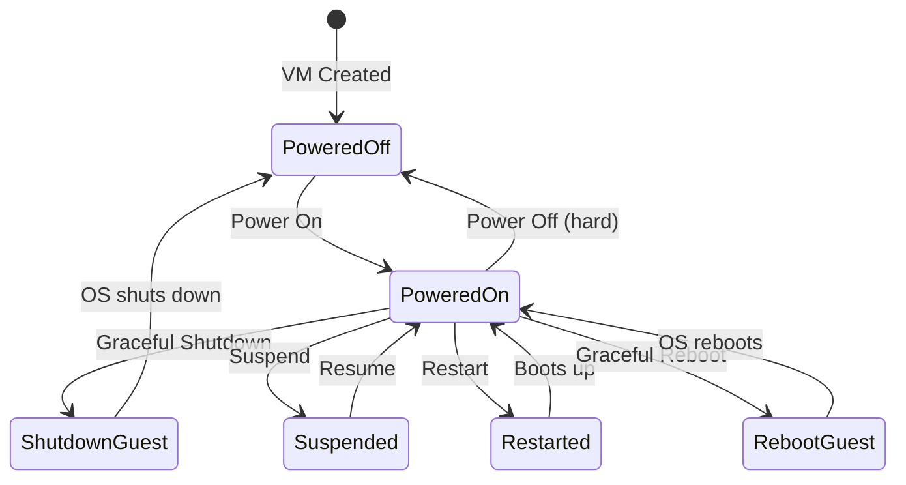

# How to Use Ansible to Manage VMware VM Power State

Author: [nawazdhandala](https://www.github.com/nawazdhandala)

Tags: Ansible, VMware, Power Management, vSphere, Automation

Description: Learn how to control VMware virtual machine power states with Ansible including power on, shutdown, restart, suspend, and scheduled operations.

---

Managing VM power states might seem like a simple task, but when you are dealing with hundreds of VMs across multiple clusters, coordinating power operations becomes a real challenge. Whether you are performing scheduled maintenance windows, implementing cost-saving policies by shutting down dev environments overnight, or orchestrating rolling restarts, Ansible provides a clean way to manage all of it. This guide covers every power state operation you will need.

## Power State Options

VMware VMs can be in several power states, and Ansible can transition between them.



The key distinction is between hard operations (immediate, like pulling the power cord) and guest operations (graceful, like clicking "Shut Down" in the OS).

## Basic Power Operations

The `community.vmware.vmware_guest_powerstate` module handles all power state changes.

```yaml
# power-operations.yml
---
- name: Manage VM power states
  hosts: localhost
  gather_facts: false

  module_defaults:
    group/community.vmware.vmware:
      hostname: "{{ vcenter_hostname }}"
      username: "{{ vcenter_username }}"
      password: "{{ vcenter_password }}"
      validate_certs: false

  vars:
    vcenter_hostname: "vcenter.example.com"
    vcenter_username: "administrator@vsphere.local"
    vcenter_password: "{{ vault_vcenter_password }}"

  tasks:
    # Power on a VM
    - name: Power on a virtual machine
      community.vmware.vmware_guest_powerstate:
        name: "dev-server-01"
        folder: "/DC01/vm/Development"
        state: powered-on

    # Graceful shutdown (requires VMware Tools)
    - name: Gracefully shut down a virtual machine
      community.vmware.vmware_guest_powerstate:
        name: "dev-server-01"
        folder: "/DC01/vm/Development"
        state: shutdown-guest

    # Hard power off (like pulling the power cord - use only when needed)
    - name: Force power off a virtual machine
      community.vmware.vmware_guest_powerstate:
        name: "dev-server-01"
        folder: "/DC01/vm/Development"
        state: powered-off

    # Graceful reboot (requires VMware Tools)
    - name: Gracefully reboot a virtual machine
      community.vmware.vmware_guest_powerstate:
        name: "dev-server-01"
        folder: "/DC01/vm/Development"
        state: reboot-guest

    # Hard reset (like pressing the reset button)
    - name: Hard reset a virtual machine
      community.vmware.vmware_guest_powerstate:
        name: "dev-server-01"
        folder: "/DC01/vm/Development"
        state: restarted

    # Suspend VM (saves memory state to disk)
    - name: Suspend a virtual machine
      community.vmware.vmware_guest_powerstate:
        name: "dev-server-01"
        folder: "/DC01/vm/Development"
        state: suspended
```

## Using vmware_guest for Power State

You can also use the `vmware_guest` module to manage power states. This is useful when you want to combine power state changes with other VM configuration.

```yaml
# power-on-with-guest-module.yml
- name: Ensure VM is powered on using vmware_guest
  community.vmware.vmware_guest:
    hostname: "{{ vcenter_hostname }}"
    username: "{{ vcenter_username }}"
    password: "{{ vcenter_password }}"
    validate_certs: false
    name: "prod-web-01"
    datacenter: "DC01"
    state: poweredon

# Power off using vmware_guest
- name: Ensure VM is powered off
  community.vmware.vmware_guest:
    hostname: "{{ vcenter_hostname }}"
    username: "{{ vcenter_username }}"
    password: "{{ vcenter_password }}"
    validate_certs: false
    name: "prod-web-01"
    datacenter: "DC01"
    state: shutdownguest
```

## Batch Power Operations

When managing groups of VMs, use loops with appropriate ordering.

```yaml
# shutdown-environment.yml
---
- name: Gracefully shut down an entire environment in order
  hosts: localhost
  gather_facts: false

  module_defaults:
    group/community.vmware.vmware:
      hostname: "{{ vcenter_hostname }}"
      username: "{{ vcenter_username }}"
      password: "{{ vcenter_password }}"
      validate_certs: false

  vars:
    vcenter_hostname: "vcenter.example.com"
    vcenter_username: "administrator@vsphere.local"
    vcenter_password: "{{ vault_vcenter_password }}"

    # Shutdown order matters - web servers first, then app servers, then databases
    shutdown_order:
      - group: "Web Servers"
        vms:
          - "staging-web-01"
          - "staging-web-02"
      - group: "Application Servers"
        vms:
          - "staging-app-01"
          - "staging-app-02"
      - group: "Database Servers"
        vms:
          - "staging-db-01"

  tasks:
    - name: Shut down VMs in order by group
      community.vmware.vmware_guest_powerstate:
        name: "{{ item.1 }}"
        folder: "/DC01/vm/Staging"
        state: shutdown-guest
      loop: "{{ shutdown_order | subelements('vms') }}"
      loop_control:
        label: "{{ item.0.group }} - {{ item.1 }}"

    # Wait between groups to allow graceful shutdown
    - name: Wait for shutdown to complete
      ansible.builtin.pause:
        seconds: 30
```

## Startup with Dependency Ordering

When starting an environment, the order is reversed. Databases start first, then application servers, then web servers.

```yaml
# startup-environment.yml
---
- name: Start an environment in the correct dependency order
  hosts: localhost
  gather_facts: false

  module_defaults:
    group/community.vmware.vmware:
      hostname: "{{ vcenter_hostname }}"
      username: "{{ vcenter_username }}"
      password: "{{ vcenter_password }}"
      validate_certs: false

  vars:
    vcenter_hostname: "vcenter.example.com"
    vcenter_username: "administrator@vsphere.local"
    vcenter_password: "{{ vault_vcenter_password }}"

    # Startup order is the reverse of shutdown
    startup_groups:
      - name: "Database Servers"
        vms: ["staging-db-01"]
        wait_port: 5432
      - name: "Application Servers"
        vms: ["staging-app-01", "staging-app-02"]
        wait_port: 8080
      - name: "Web Servers"
        vms: ["staging-web-01", "staging-web-02"]
        wait_port: 443

  tasks:
    - name: Start each group and wait for readiness
      include_tasks: start-group.yml
      loop: "{{ startup_groups }}"
      loop_control:
        loop_var: vm_group
```

Create the included task file for group startup logic.

```yaml
# start-group.yml
---
- name: "Power on {{ vm_group.name }}"
  community.vmware.vmware_guest_powerstate:
    name: "{{ vm_name }}"
    folder: "/DC01/vm/Staging"
    state: powered-on
  loop: "{{ vm_group.vms }}"
  loop_control:
    loop_var: vm_name

- name: "Wait for {{ vm_group.name }} to become reachable"
  ansible.builtin.wait_for:
    host: "{{ vm_name }}"
    port: "{{ vm_group.wait_port }}"
    timeout: 300
    delay: 15
  loop: "{{ vm_group.vms }}"
  loop_control:
    loop_var: vm_name
```

## Scheduled Power Operations

Implement a schedule to shut down dev environments at night and start them in the morning.

```yaml
# scheduled-power-management.yml
---
- name: Cost-saving power management for development VMs
  hosts: localhost
  gather_facts: true

  module_defaults:
    group/community.vmware.vmware:
      hostname: "{{ vcenter_hostname }}"
      username: "{{ vcenter_username }}"
      password: "{{ vcenter_password }}"
      validate_certs: false

  vars:
    vcenter_hostname: "vcenter.example.com"
    vcenter_username: "administrator@vsphere.local"
    vcenter_password: "{{ vault_vcenter_password }}"
    dev_vms:
      - "dev-web-01"
      - "dev-app-01"
      - "dev-db-01"
      - "dev-test-01"

  tasks:
    # Determine current hour to decide action
    - name: Get current hour
      ansible.builtin.set_fact:
        current_hour: "{{ ansible_date_time.hour | int }}"

    # Shut down dev VMs after hours (after 7 PM)
    - name: Shut down development VMs for the night
      community.vmware.vmware_guest_powerstate:
        name: "{{ item }}"
        folder: "/DC01/vm/Development"
        state: shutdown-guest
      loop: "{{ dev_vms }}"
      when: current_hour | int >= 19
      ignore_errors: true

    # Start dev VMs in the morning (at 7 AM)
    - name: Start development VMs for the day
      community.vmware.vmware_guest_powerstate:
        name: "{{ item }}"
        folder: "/DC01/vm/Development"
        state: powered-on
      loop: "{{ dev_vms }}"
      when: current_hour | int == 7
```

Schedule this with a cron job or CI pipeline.

```bash
# Crontab entries for scheduled power management
# Shut down dev VMs at 7 PM weekdays
0 19 * * 1-5 ansible-playbook /opt/ansible/scheduled-power-management.yml

# Start dev VMs at 7 AM weekdays
0 7 * * 1-5 ansible-playbook /opt/ansible/scheduled-power-management.yml
```

## Handling VMs Without VMware Tools

Guest operations (shutdown-guest, reboot-guest) require VMware Tools. For VMs without it, fall back to hard operations.

```yaml
# safe-shutdown.yml
- name: Attempt graceful shutdown, fall back to power off
  block:
    - name: Try graceful shutdown
      community.vmware.vmware_guest_powerstate:
        name: "{{ vm_name }}"
        folder: "/DC01/vm/Production"
        state: shutdown-guest

    - name: Wait for VM to power off
      community.vmware.vmware_guest_info:
        datacenter: "DC01"
        name: "{{ vm_name }}"
      register: vm_info
      until: vm_info.instance.hw_power_status == "poweredOff"
      retries: 12
      delay: 10

  rescue:
    - name: Graceful shutdown failed, forcing power off
      community.vmware.vmware_guest_powerstate:
        name: "{{ vm_name }}"
        folder: "/DC01/vm/Production"
        state: powered-off
```

Power state management is one of those tasks where automation provides the most value when applied at scale. Individual VM power operations are trivial, but coordinating the startup and shutdown of entire environments with proper dependency ordering and health checking is where Ansible really shines. Build your power management playbooks once, and every maintenance window and cost-saving schedule becomes a single command.
