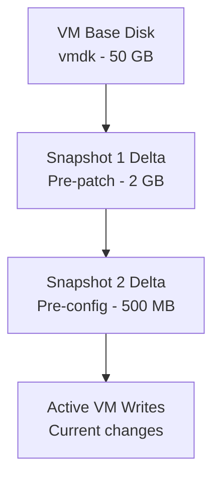

# How to Use Ansible to Manage VMware VM Snapshots

Author: [nawazdhandala](https://www.github.com/nawazdhandala)

Tags: Ansible, VMware, Snapshots, vSphere, Backup

Description: Learn how to create, delete, revert, and manage VMware VM snapshots with Ansible for change management and disaster recovery workflows.

---

Snapshots are one of those VMware features that everyone uses but few manage well. They are invaluable for change windows, letting you quickly roll back if a patch or configuration change goes wrong. But snapshots that linger for days or weeks cause performance degradation and eat up storage. Ansible gives you the ability to manage snapshots programmatically, which means you can create them before changes, verify the change succeeded, and automatically clean them up afterward. No more orphaned snapshots consuming your datastore.

## How VMware Snapshots Work

A snapshot captures the state of a VM's virtual disks, memory (optionally), and settings at a specific point in time. After taking a snapshot, all new writes go to a delta disk file while the original disk is preserved as read-only.



Each snapshot adds a layer. The more layers you have, the more I/O overhead the VM experiences because every read might need to traverse multiple delta files.

## Creating Snapshots

The `community.vmware.vmware_guest_snapshot` module handles all snapshot operations.

```yaml
# create-snapshot.yml
---
- name: Create a VM snapshot before maintenance
  hosts: localhost
  gather_facts: false

  module_defaults:
    group/community.vmware.vmware:
      hostname: "{{ vcenter_hostname }}"
      username: "{{ vcenter_username }}"
      password: "{{ vcenter_password }}"
      validate_certs: false

  vars:
    vcenter_hostname: "vcenter.example.com"
    vcenter_username: "administrator@vsphere.local"
    vcenter_password: "{{ vault_vcenter_password }}"

  tasks:
    - name: Create snapshot with memory state
      community.vmware.vmware_guest_snapshot:
        datacenter: "DC01"
        name: "prod-app-server-01"
        folder: "/DC01/vm/Production"
        state: present
        snapshot_name: "pre-patch-2026-02-21"
        description: "Snapshot before February security patches"
        memory_dump: true
        quiesce: false
      register: snapshot_result

    - name: Display snapshot details
      ansible.builtin.debug:
        msg: "Snapshot '{{ snapshot_result.snapshot_results.current_snapshot.name }}' created successfully"
```

### Understanding Snapshot Options

- **memory_dump** - When true, captures the VM's memory state. This allows you to revert to the exact running state, including applications in memory. Increases snapshot size significantly.
- **quiesce** - When true, VMware Tools quiesces the guest file system before snapshotting. This ensures file system consistency. Requires VMware Tools to be installed and running.

```yaml
# Snapshot for database servers - quiesce for consistency, skip memory to save space
- name: Create quiesced snapshot for database server
  community.vmware.vmware_guest_snapshot:
    datacenter: "DC01"
    name: "prod-db-01"
    folder: "/DC01/vm/Production"
    state: present
    snapshot_name: "pre-upgrade-db"
    description: "Quiesced snapshot before database upgrade"
    memory_dump: false
    quiesce: true
```

## Reverting to a Snapshot

If something goes wrong during a maintenance window, revert to the snapshot to undo all changes.

```yaml
# revert-snapshot.yml
---
- name: Revert VM to a previous snapshot
  hosts: localhost
  gather_facts: false

  module_defaults:
    group/community.vmware.vmware:
      hostname: "{{ vcenter_hostname }}"
      username: "{{ vcenter_username }}"
      password: "{{ vcenter_password }}"
      validate_certs: false

  vars:
    vcenter_hostname: "vcenter.example.com"
    vcenter_username: "administrator@vsphere.local"
    vcenter_password: "{{ vault_vcenter_password }}"

  tasks:
    - name: Revert to the pre-patch snapshot
      community.vmware.vmware_guest_snapshot:
        datacenter: "DC01"
        name: "prod-app-server-01"
        folder: "/DC01/vm/Production"
        state: revert
        snapshot_name: "pre-patch-2026-02-21"
      register: revert_result

    - name: Confirm revert was successful
      ansible.builtin.debug:
        msg: "VM reverted to snapshot successfully"
      when: revert_result.changed
```

## Deleting Snapshots

After confirming that a change was successful, delete the snapshot to reclaim storage and eliminate the performance overhead.

```yaml
# delete-snapshot.yml
---
- name: Remove snapshots after successful maintenance
  hosts: localhost
  gather_facts: false

  module_defaults:
    group/community.vmware.vmware:
      hostname: "{{ vcenter_hostname }}"
      username: "{{ vcenter_username }}"
      password: "{{ vcenter_password }}"
      validate_certs: false

  vars:
    vcenter_hostname: "vcenter.example.com"
    vcenter_username: "administrator@vsphere.local"
    vcenter_password: "{{ vault_vcenter_password }}"

  tasks:
    # Delete a specific snapshot by name
    - name: Delete the pre-patch snapshot
      community.vmware.vmware_guest_snapshot:
        datacenter: "DC01"
        name: "prod-app-server-01"
        folder: "/DC01/vm/Production"
        state: absent
        snapshot_name: "pre-patch-2026-02-21"

    # Delete ALL snapshots on a VM (use with caution)
    - name: Remove all snapshots from the VM
      community.vmware.vmware_guest_snapshot:
        datacenter: "DC01"
        name: "prod-app-server-01"
        folder: "/DC01/vm/Production"
        state: remove_all
```

## Complete Change Management Workflow

Here is a full playbook that implements a proper change management workflow with snapshots.

```yaml
# maintenance-with-snapshots.yml
---
- name: Maintenance workflow with snapshot management
  hosts: localhost
  gather_facts: false

  module_defaults:
    group/community.vmware.vmware:
      hostname: "{{ vcenter_hostname }}"
      username: "{{ vcenter_username }}"
      password: "{{ vcenter_password }}"
      validate_certs: false

  vars:
    vcenter_hostname: "vcenter.example.com"
    vcenter_username: "administrator@vsphere.local"
    vcenter_password: "{{ vault_vcenter_password }}"
    target_vms:
      - "prod-web-01"
      - "prod-web-02"
      - "prod-app-01"
    snapshot_name: "pre-maintenance-{{ ansible_date_time.date | default('2026-02-21') }}"

  tasks:
    # Step 1: Create snapshots on all target VMs
    - name: Create pre-maintenance snapshots
      community.vmware.vmware_guest_snapshot:
        datacenter: "DC01"
        name: "{{ item }}"
        folder: "/DC01/vm/Production"
        state: present
        snapshot_name: "{{ snapshot_name }}"
        description: "Automated pre-maintenance snapshot"
        memory_dump: false
        quiesce: true
      loop: "{{ target_vms }}"
      register: snapshot_results

    - name: Verify all snapshots were created
      ansible.builtin.assert:
        that:
          - item.changed or item.snapshot_results is defined
        fail_msg: "Failed to create snapshot for {{ item.item }}"
      loop: "{{ snapshot_results.results }}"

    # Step 2: Perform the actual maintenance
    # (This is where you would run your patching or configuration playbooks)
    - name: Simulate maintenance task
      ansible.builtin.debug:
        msg: "Performing maintenance on {{ item }}"
      loop: "{{ target_vms }}"

    # Step 3: Verify the maintenance was successful
    - name: Verify services are healthy after maintenance
      ansible.builtin.uri:
        url: "http://{{ item }}:8080/health"
        method: GET
        status_code: 200
      loop: "{{ target_vms }}"
      register: health_checks
      ignore_errors: true

    # Step 4: Handle results
    - name: Check if any health check failed
      ansible.builtin.set_fact:
        maintenance_failed: "{{ health_checks.results | selectattr('failed', 'equalto', true) | list | length > 0 }}"

    # If maintenance failed, revert snapshots
    - name: Revert snapshots on failure
      community.vmware.vmware_guest_snapshot:
        datacenter: "DC01"
        name: "{{ item }}"
        folder: "/DC01/vm/Production"
        state: revert
        snapshot_name: "{{ snapshot_name }}"
      loop: "{{ target_vms }}"
      when: maintenance_failed | bool

    # If maintenance succeeded, clean up snapshots
    - name: Delete snapshots after successful maintenance
      community.vmware.vmware_guest_snapshot:
        datacenter: "DC01"
        name: "{{ item }}"
        folder: "/DC01/vm/Production"
        state: absent
        snapshot_name: "{{ snapshot_name }}"
      loop: "{{ target_vms }}"
      when: not (maintenance_failed | bool)
```

## Finding and Cleaning Old Snapshots

Stale snapshots are a common problem. Use the snapshot info module to find them.

```yaml
# find-old-snapshots.yml
---
- name: Find and report old snapshots across all VMs
  hosts: localhost
  gather_facts: false

  module_defaults:
    group/community.vmware.vmware:
      hostname: "{{ vcenter_hostname }}"
      username: "{{ vcenter_username }}"
      password: "{{ vcenter_password }}"
      validate_certs: false

  vars:
    vcenter_hostname: "vcenter.example.com"
    vcenter_username: "administrator@vsphere.local"
    vcenter_password: "{{ vault_vcenter_password }}"
    # Snapshots older than this many days should be flagged
    max_snapshot_age_days: 3

  tasks:
    - name: Get snapshot information for all VMs in the datacenter
      community.vmware.vmware_guest_snapshot_info:
        datacenter: "DC01"
        name: "{{ item }}"
        folder: "/DC01/vm/Production"
      loop:
        - "prod-web-01"
        - "prod-web-02"
        - "prod-app-01"
        - "prod-db-01"
      register: all_snapshots
      ignore_errors: true

    - name: Report VMs with snapshots
      ansible.builtin.debug:
        msg: >
          VM: {{ item.item }} has {{ item.guest_snapshots.snapshots | default([]) | length }} snapshot(s)
      loop: "{{ all_snapshots.results }}"
      when: item.guest_snapshots.snapshots | default([]) | length > 0
```

## Scheduled Snapshot Cleanup

Combine the above with a cron job or CI pipeline to automatically clean up old snapshots.

```yaml
# cleanup-old-snapshots.yml
- name: Remove all snapshots older than 3 days
  community.vmware.vmware_guest_snapshot:
    hostname: "{{ vcenter_hostname }}"
    username: "{{ vcenter_username }}"
    password: "{{ vcenter_password }}"
    validate_certs: false
    datacenter: "DC01"
    name: "{{ item }}"
    folder: "/DC01/vm/Production"
    state: remove_all
  loop: "{{ vms_with_old_snapshots }}"
```

Snapshot management is a critical part of running a VMware environment well. With Ansible handling the creation, verification, and cleanup, you eliminate the human error that leads to forgotten snapshots consuming your storage. Build snapshot management into every change workflow and set up automated cleanup as a safety net.
