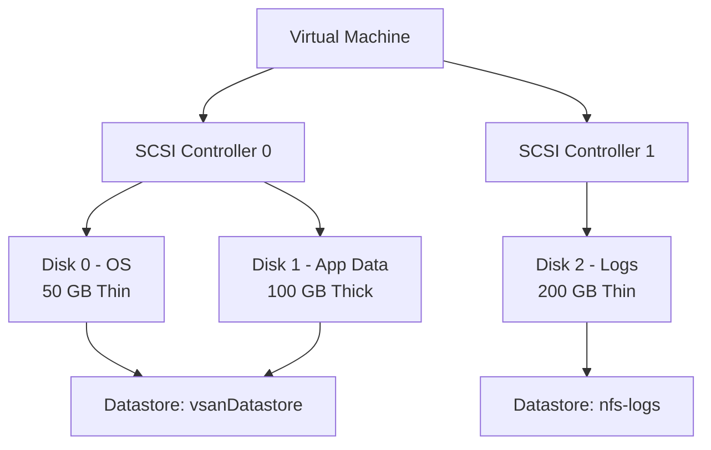

# How to Use Ansible to Manage VMware VM Storage

Author: [nawazdhandala](https://www.github.com/nawazdhandala)

Tags: Ansible, VMware, Storage, vSphere, Disk Management

Description: Learn how to manage VMware virtual machine disks and storage with Ansible including adding disks, resizing, changing storage policies, and managing SCSI controllers.

---

Storage management in VMware is one of those tasks that comes up constantly. Applications need more disk space, new volumes need to be attached for data, or VMs need to be migrated between datastores. Handling this through the vSphere Client works for ad-hoc tasks, but when you are managing storage across a fleet of VMs, Ansible brings the consistency and repeatability that manual operations lack. This guide covers adding disks, resizing them, managing SCSI controllers, and working with storage policies.

## VMware Storage Architecture for VMs

Every VM has its disks stored on a datastore, which sits on top of physical storage. Understanding the layers helps when troubleshooting performance issues.



VMs can have multiple SCSI controllers (up to 4), and each controller can have up to 15 disks (minus the controller slot itself). For high I/O workloads, spreading disks across multiple SCSI controllers can improve performance.

## Adding a Disk to a VM

The `community.vmware.vmware_guest_disk` module manages VM disks without affecting other VM settings.

```yaml
# add-disk.yml
---
- name: Add a new disk to a virtual machine
  hosts: localhost
  gather_facts: false

  module_defaults:
    group/community.vmware.vmware:
      hostname: "{{ vcenter_hostname }}"
      username: "{{ vcenter_username }}"
      password: "{{ vcenter_password }}"
      validate_certs: false

  vars:
    vcenter_hostname: "vcenter.example.com"
    vcenter_username: "administrator@vsphere.local"
    vcenter_password: "{{ vault_vcenter_password }}"

  tasks:
    - name: Add a 200 GB data disk to the VM
      community.vmware.vmware_guest_disk:
        datacenter: "DC01"
        name: "prod-app-01"
        disk:
          - size_gb: 200
            type: thin
            datastore: "vsanDatastore"
            scsi_controller: 0
            unit_number: 2
            scsi_type: paravirtual
            state: present
      register: disk_result

    - name: Display new disk information
      ansible.builtin.debug:
        msg: "Disk added: {{ disk_result.disk_data }}"
```

## Disk Types Explained

VMware offers several disk provisioning types. Choose based on your performance and storage efficiency needs.

```yaml
# Thin provisioning - starts small, grows as data is written
# Best for: Development, test, and VMs where actual usage is less than allocated
- size_gb: 100
  type: thin
  # Only uses storage as data is actually written
  # A 100 GB thin disk with 10 GB of data uses roughly 10 GB on the datastore

# Thick provision, lazy zeroed - allocates full space immediately
# Best for: Production workloads where performance matters
- size_gb: 100
  type: thick
  # Allocates 100 GB immediately but does not zero out blocks until first write

# Thick provision, eager zeroed - allocates and zeros full space
# Best for: Databases, clustering, and fault tolerance
- size_gb: 100
  type: eagerzeroedthick
  # Allocates and zeros all 100 GB immediately
  # Takes longer to create but provides best write performance
```

## Adding Multiple Disks

When provisioning a database server, you typically need separate disks for different purposes.

```yaml
# add-multiple-disks.yml
---
- name: Provision storage layout for database server
  hosts: localhost
  gather_facts: false

  module_defaults:
    group/community.vmware.vmware:
      hostname: "{{ vcenter_hostname }}"
      username: "{{ vcenter_username }}"
      password: "{{ vcenter_password }}"
      validate_certs: false

  vars:
    vcenter_hostname: "vcenter.example.com"
    vcenter_username: "administrator@vsphere.local"
    vcenter_password: "{{ vault_vcenter_password }}"

  tasks:
    - name: Configure database server disk layout
      community.vmware.vmware_guest_disk:
        datacenter: "DC01"
        name: "prod-db-01"
        disk:
          # OS disk - already exists, just defining for completeness
          - size_gb: 80
            type: thin
            datastore: "vsanDatastore"
            scsi_controller: 0
            unit_number: 0
            state: present
          # Database data files - thick for performance
          - size_gb: 500
            type: eagerzeroedthick
            datastore: "fast-ssd-datastore"
            scsi_controller: 1
            unit_number: 0
            scsi_type: paravirtual
            state: present
          # Database logs - separate controller for I/O isolation
          - size_gb: 200
            type: eagerzeroedthick
            datastore: "fast-ssd-datastore"
            scsi_controller: 1
            unit_number: 1
            state: present
          # Backup staging area - thin since it is temporary
          - size_gb: 1000
            type: thin
            datastore: "nfs-backup"
            scsi_controller: 2
            unit_number: 0
            scsi_type: paravirtual
            state: present
      register: db_disk_result

    - name: Display disk configuration
      ansible.builtin.debug:
        msg: "Database disk layout configured with {{ db_disk_result.disk_data | length }} disks"
```

## Resizing Existing Disks

Expanding a disk is a common operation. Note that VMware does not support shrinking disks through the API.

```yaml
# resize-disk.yml
---
- name: Expand a virtual machine disk
  hosts: localhost
  gather_facts: false

  module_defaults:
    group/community.vmware.vmware:
      hostname: "{{ vcenter_hostname }}"
      username: "{{ vcenter_username }}"
      password: "{{ vcenter_password }}"
      validate_certs: false

  vars:
    vcenter_hostname: "vcenter.example.com"
    vcenter_username: "administrator@vsphere.local"
    vcenter_password: "{{ vault_vcenter_password }}"

  tasks:
    # Expand the data disk from its current size to 300 GB
    - name: Expand data disk to 300 GB
      community.vmware.vmware_guest_disk:
        datacenter: "DC01"
        name: "prod-app-01"
        disk:
          - size_gb: 300
            scsi_controller: 0
            unit_number: 2
            state: present
      register: resize_result

    - name: Report resize status
      ansible.builtin.debug:
        msg: "Disk resize completed: {{ resize_result.changed }}"
```

After resizing the virtual disk, you also need to extend the filesystem inside the guest OS.

```yaml
# extend-guest-filesystem.yml
---
- name: Extend the filesystem inside the guest after disk resize
  hosts: prod-app-01
  become: true

  tasks:
    # Rescan for the new disk size
    - name: Rescan SCSI bus for disk changes
      ansible.builtin.command:
        cmd: "echo 1 > /sys/class/block/sdc/device/rescan"
      changed_when: true

    # Extend the LVM physical volume
    - name: Resize the physical volume
      ansible.builtin.command:
        cmd: pvresize /dev/sdc
      changed_when: true

    # Extend the logical volume to use all available space
    - name: Extend logical volume to 100% of free space
      community.general.lvol:
        vg: data_vg
        lv: data_lv
        size: +100%FREE
        resizefs: true
```

## Removing a Disk

Remove disks that are no longer needed to free up datastore space.

```yaml
# remove-disk.yml
- name: Remove a disk from a VM
  community.vmware.vmware_guest_disk:
    hostname: "{{ vcenter_hostname }}"
    username: "{{ vcenter_username }}"
    password: "{{ vcenter_password }}"
    validate_certs: false
    datacenter: "DC01"
    name: "prod-app-01"
    disk:
      - scsi_controller: 0
        unit_number: 3
        state: absent
        destroy: true  # Also delete the vmdk file from the datastore
```

## Migrating VM Storage Between Datastores

Use `community.vmware.vmware_vmotion` to move a VM's storage to a different datastore without downtime.

```yaml
# storage-vmotion.yml
---
- name: Migrate VM storage to a new datastore
  hosts: localhost
  gather_facts: false

  module_defaults:
    group/community.vmware.vmware:
      hostname: "{{ vcenter_hostname }}"
      username: "{{ vcenter_username }}"
      password: "{{ vcenter_password }}"
      validate_certs: false

  vars:
    vcenter_hostname: "vcenter.example.com"
    vcenter_username: "administrator@vsphere.local"
    vcenter_password: "{{ vault_vcenter_password }}"

  tasks:
    - name: Storage vMotion VM to new datastore
      community.vmware.vmware_vmotion:
        vm_name: "prod-app-01"
        destination_datastore: "new-vsan-datastore"
      register: svmotion_result

    - name: Confirm storage migration
      ansible.builtin.debug:
        msg: "Storage migration completed for {{ svmotion_result.vm_name }}"
```

## Gathering Storage Information

Audit your VMs' storage configuration to understand current usage.

```yaml
# storage-audit.yml
---
- name: Audit VM storage configuration
  hosts: localhost
  gather_facts: false

  module_defaults:
    group/community.vmware.vmware:
      hostname: "{{ vcenter_hostname }}"
      username: "{{ vcenter_username }}"
      password: "{{ vcenter_password }}"
      validate_certs: false

  vars:
    vcenter_hostname: "vcenter.example.com"
    vcenter_username: "administrator@vsphere.local"
    vcenter_password: "{{ vault_vcenter_password }}"

  tasks:
    - name: Get VM disk information
      community.vmware.vmware_guest_disk_info:
        datacenter: "DC01"
        name: "prod-db-01"
      register: disk_info

    - name: Display disk details for each disk
      ansible.builtin.debug:
        msg: >
          Disk {{ item.key }}:
          Size: {{ item.value.capacity_in_kb | int / 1024 / 1024 }} GB,
          Thin: {{ item.value.backing_thinprovisioned }},
          Datastore: {{ item.value.backing_datastore }},
          Controller: {{ item.value.controller_bus_number }}:{{ item.value.unit_number }}
      loop: "{{ disk_info.guest_disk_info | dict2items }}"
```

Storage management is foundational to running VMware environments well. Disks that are too small cause application failures; disks that are over-provisioned waste expensive storage. With Ansible managing your VM storage, you get consistent provisioning, easy scaling, and a clear audit trail of every change. Start by standardizing your disk layouts for each VM role and build from there.
