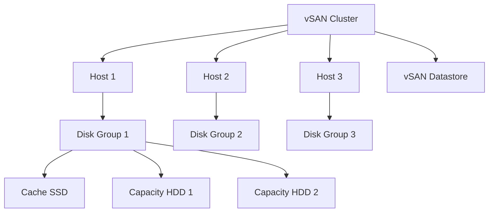

# How to Use Ansible to Manage VMware vSAN

Author: [nawazdhandala](https://www.github.com/nawazdhandala)

Tags: Ansible, VMware, VSAN, Storage, Hyper-Converged

Description: Learn how to manage VMware vSAN storage clusters with Ansible for automated disk group creation, policy management, and monitoring.

---

VMware vSAN turns local disks across your ESXi hosts into a shared datastore. It eliminates the need for external SANs in many use cases, but managing vSAN configurations manually across a growing cluster gets complicated. Ansible gives you a way to standardize and automate vSAN operations, from initial cluster setup to storage policy management.

In this post, I will walk through managing vSAN with Ansible, covering cluster enablement, disk groups, storage policies, and health monitoring.

## Prerequisites

Make sure you have:

- Ansible version supported by your installed `community.vmware` collection
- The `community.vmware` collection installed
- vCenter Server 7.0+ with vSAN license
- ESXi hosts with local SSDs and HDDs (or all-flash)
- Python libraries `pyvmomi`, `requests`, and the VMware vSAN Management SDK

```bash
# Install required collection and Python packages

ansible-galaxy collection install community.vmware
pip install pyvmomi requests
```

The `vmware_cluster_vsan` and `vmware_vsan_health_info` modules also require VMware's vSAN Management SDK, which Broadcom/VMware distributes separately from PyPI.

## vSAN Architecture Refresher

vSAN pools local disks from each host into a distributed datastore. In vSAN Original Storage Architecture (OSA), each storage-contributing host has one or more disk groups consisting of one cache device and one or more capacity devices. vSAN Express Storage Architecture (ESA), introduced with vSAN 8, uses storage pools instead of cache/capacity disk groups.


```mermaid
graph TD
    A[vSAN Cluster] --> B[Host 1]
    A --> C[Host 2]
    A --> D[Host 3]
    B --> E[Disk Group 1]
    E --> F[Cache SSD]
    E --> G[Capacity HDD 1]
    E --> H[Capacity HDD 2]
    C --> I[Disk Group 2]
    D --> J[Disk Group 3]
    A --> K[vSAN Datastore]
```

## Enabling vSAN on a Cluster

The `community.vmware.vmware_cluster_vsan` module handles vSAN cluster configuration.

```yaml
# playbooks/enable-vsan.yml
---
- name: Enable vSAN on cluster
  hosts: localhost
  gather_facts: false
  vars_files:
    - ../vars/vcenter_creds.yml

  vars:
    vcenter_datacenter: "DC-Production"
    vcenter_cluster: "Cluster-vSAN-01"

  tasks:
    # Enable vSAN without automatically claiming disks
    - name: Enable vSAN on the cluster
      community.vmware.vmware_cluster_vsan:
        hostname: "{{ vcenter_hostname }}"
        username: "{{ vcenter_username }}"
        password: "{{ vcenter_password }}"
        datacenter_name: "{{ vcenter_datacenter }}"
        cluster_name: "{{ vcenter_cluster }}"
        validate_certs: false
        enable: true
        vsan_auto_claim_storage: false
        advanced_options:
          automatic_rebalance: true
          disable_site_read_locality: false
      register: vsan_result

    - name: Display vSAN enablement result
      ansible.builtin.debug:
        var: vsan_result
```

I always set `vsan_auto_claim_storage` to `false`. Auto-claiming grabs every available disk, which is almost never what you want in production. You should explicitly define your disk groups.

## Creating Disk Groups

Disk groups are the fundamental storage unit in vSAN. Each disk group has one cache disk and one or more capacity disks.

```yaml
# playbooks/vsan-disk-groups.yml
---
- name: Configure vSAN disk groups
  hosts: localhost
  gather_facts: false
  vars_files:
    - ../vars/vcenter_creds.yml

  vars:
    esxi_hosts:
      - hostname: esxi-01.lab.local
        cache_disk: "naa.5000c5001234abcd"
        capacity_disks:
          - "naa.5000c500abcd1234"
          - "naa.5000c500abcd5678"
      - hostname: esxi-02.lab.local
        cache_disk: "naa.5000c5005678efgh"
        capacity_disks:
          - "naa.5000c500efgh1234"
          - "naa.5000c500efgh5678"
      - hostname: esxi-03.lab.local
        cache_disk: "naa.5000c500ijkl9012"
        capacity_disks:
          - "naa.5000c500ijkl3456"
          - "naa.5000c500ijkl7890"

  tasks:
    # First, get disk info to verify disk IDs
    - name: Get disk information for each host
      community.vmware.vmware_host_disk_info:
        hostname: "{{ vcenter_hostname }}"
        username: "{{ vcenter_username }}"
        password: "{{ vcenter_password }}"
        esxi_hostname: "{{ item.hostname }}"
        validate_certs: false
      loop: "{{ esxi_hosts }}"
      loop_control:
        label: "{{ item.hostname }}"
      register: disk_info

    # Create OSA disk groups on each host.
    # community.vmware does not currently expose an idempotent disk-group module,
    # so this example shells out to the official ESXCLI command.
    - name: Create vSAN OSA disk groups
      ansible.builtin.command:
        cmd: >
          ssh root@{{ item.hostname }}
          esxcli vsan storage add
          -s {{ item.cache_disk }}
          {{ item.capacity_disks | map('regex_replace', '^(.*)$', '-d \\1') | join(' ') }}
      loop: "{{ esxi_hosts }}"
      loop_control:
        label: "{{ item.hostname }}"
```

## Managing vSAN Storage Policies

Storage policies define how data is stored: number of failures to tolerate, stripe width, and more. This is where vSAN shines compared to traditional storage. The `community.vmware.vmware_vm_storage_policy` module creates tag-based vSphere storage policies only, so vSAN rule-based policies such as FTT and RAID-5/6 should already exist in vCenter before you assign them with Ansible.

```yaml
# playbooks/vsan-storage-policies.yml
---
- name: Verify vSAN storage policies
  hosts: localhost
  gather_facts: false
  vars_files:
    - ../vars/vcenter_creds.yml

  vars:
    required_vsan_policies:
      - "vSAN-Critical-FTT2"
      - "vSAN-Dev-RAID5"

  tasks:
    # Gather existing storage policies from vCenter
    - name: Get storage policies
      community.vmware.vmware_vm_storage_policy_info:
        hostname: "{{ vcenter_hostname }}"
        username: "{{ vcenter_username }}"
        password: "{{ vcenter_password }}"
        validate_certs: false
      register: storage_policies

    # Confirm the vSAN rule-based policies exist before assignment
    - name: Fail if a required vSAN policy is missing
      ansible.builtin.fail:
        msg: "Required storage policy {{ item }} does not exist in vCenter."
      when: item not in (storage_policies.spbm_profiles | map(attribute='name') | list)
      loop: "{{ required_vsan_policies }}"
```

## Applying Storage Policies to VMs

After verifying the policies exist, assign them to VMs to control their data placement.

```yaml
# playbooks/assign-vsan-policies.yml
---
- name: Assign vSAN storage policies to VMs
  hosts: localhost
  gather_facts: false
  vars_files:
    - ../vars/vcenter_creds.yml

  vars:
    critical_vms:
      - sql-prod-01
      - sql-prod-02
      - app-prod-01
    dev_vms:
      - dev-web-01
      - dev-app-01

  tasks:
    # Apply the high-availability policy to critical VMs
    - name: Assign FTT=2 policy to critical VMs
      community.vmware.vmware_guest_storage_policy:
        hostname: "{{ vcenter_hostname }}"
        username: "{{ vcenter_username }}"
        password: "{{ vcenter_password }}"
        validate_certs: false
        name: "{{ item }}"
        vm_home: "vSAN-Critical-FTT2"
        disk:
          - unit_number: 0
            policy: "vSAN-Critical-FTT2"
      loop: "{{ critical_vms }}"

    # Apply space-efficient policy to dev VMs
    - name: Assign RAID-5 policy to dev VMs
      community.vmware.vmware_guest_storage_policy:
        hostname: "{{ vcenter_hostname }}"
        username: "{{ vcenter_username }}"
        password: "{{ vcenter_password }}"
        validate_certs: false
        name: "{{ item }}"
        vm_home: "vSAN-Dev-RAID5"
        disk:
          - unit_number: 0
            policy: "vSAN-Dev-RAID5"
      loop: "{{ dev_vms }}"
```

## Monitoring vSAN Health

vSAN health checks are critical. A playbook that regularly verifies cluster health can catch problems before they cause outages.

```yaml
# playbooks/vsan-health-check.yml
---
- name: Check vSAN cluster health
  hosts: localhost
  gather_facts: false
  vars_files:
    - ../vars/vcenter_creds.yml

  tasks:
    # Gather vSAN health information
    - name: Get vSAN cluster health
      community.vmware.vmware_vsan_health_info:
        hostname: "{{ vcenter_hostname }}"
        username: "{{ vcenter_username }}"
        password: "{{ vcenter_password }}"
        cluster_name: "{{ vcenter_cluster }}"
        validate_certs: false
      register: vsan_health

    - name: Display vSAN health summary
      ansible.builtin.debug:
        msg: "vSAN Health: {{ vsan_health }}"

    # Alert if health is not green
    - name: Fail if vSAN health is degraded
      ansible.builtin.fail:
        msg: "vSAN health check failed! Review the cluster immediately."
      when: vsan_health.vsan_health_info.clusterStatus.status != "green"
```

## Managing vSAN Stretched Clusters

For sites that need cross-datacenter redundancy, vSAN stretched clusters replicate data between two sites with a witness host at a third site. The `community.vmware` collection does not provide a `vmware_vsan_stretch_cluster` module, so treat stretched-cluster creation as a vCenter/API or PowerCLI workflow and use Ansible for validation and follow-up configuration.

```yaml
# playbooks/vsan-stretched-cluster.yml
---
- name: Validate vSAN stretched cluster health
  hosts: localhost
  gather_facts: false
  vars_files:
    - ../vars/vcenter_creds.yml

  tasks:
    # Confirm the stretched cluster is healthy after it is configured in vCenter
    - name: Get stretched cluster health
      community.vmware.vmware_vsan_health_info:
        hostname: "{{ vcenter_hostname }}"
        username: "{{ vcenter_username }}"
        password: "{{ vcenter_password }}"
        validate_certs: false
        cluster_name: "{{ vcenter_cluster }}"
      register: stretched_vsan_health

    - name: Fail if stretched cluster health is degraded
      ansible.builtin.fail:
        msg: "vSAN stretched cluster health is not green."
      when: stretched_vsan_health.vsan_health_info.clusterStatus.status != "green"
```

## Building a vSAN Management Role

Wrap it all into a reusable role.

```yaml
# roles/vsan_management/tasks/main.yml
---
- name: Enable vSAN
  community.vmware.vmware_cluster_vsan:
    hostname: "{{ vcenter_hostname }}"
    username: "{{ vcenter_username }}"
    password: "{{ vcenter_password }}"
    datacenter_name: "{{ vsan_datacenter }}"
    cluster_name: "{{ vsan_cluster }}"
    validate_certs: false
    enable: true
    vsan_auto_claim_storage: false

- name: Configure disk groups
  ansible.builtin.command:
    cmd: >
      ssh root@{{ item.hostname }}
      esxcli vsan storage add
      -s {{ item.cache_disk }}
      {{ item.capacity_disks | map('regex_replace', '^(.*)$', '-d \\1') | join(' ') }}
  loop: "{{ vsan_disk_groups }}"
  loop_control:
    label: "{{ item.hostname }}"
  when: vsan_disk_groups is defined
```

## Things I Have Learned Running vSAN

1. **Never use auto-claim in production.** It will grab disks you did not intend to use, including boot device partitions in some edge cases.
2. **FTT=1 is the minimum for production.** If you lose a host with FTT=0, you lose data. Period.
3. **Monitor disk health proactively.** In vSAN OSA, a failing cache disk takes out the entire disk group. Use Ansible scheduled jobs to check health regularly.
4. **RAID-5/6 erasure coding saves space** but requires more hosts (minimum 4 for RAID-5, 6 for RAID-6). Plan your cluster size accordingly.
5. **Network bandwidth matters.** vSAN all-flash and ESA designs should use at least 10 GbE, and even hybrid designs benefit from 10 GbE because resync operations during host failures can be slow on 1 GbE networks.

With Ansible managing your vSAN configuration, you get consistent storage policies across all clusters and can spin up new vSAN clusters from a template in minutes instead of hours.
