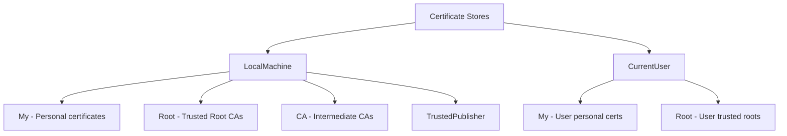

# How to Use Ansible to Manage Windows Certificates

Author: [nawazdhandala](https://www.github.com/nawazdhandala)

Tags: Ansible, Windows, Certificates, Security

Description: Automate Windows certificate management with Ansible to import, export, and manage SSL/TLS certificates across your infrastructure.

---

Certificate management on Windows is one of those tasks that seems simple until you need to do it across 50 servers. Installing a new SSL certificate, updating an expiring cert, deploying root CA certificates to trust stores, or cleaning up old certificates, all of these become repetitive and error-prone when done manually. Ansible can automate the entire certificate lifecycle on Windows, from importing PFX files to configuring certificate bindings.

## Windows Certificate Stores Overview

Windows organizes certificates into stores, each serving a different purpose:



The `LocalMachine` store is what you typically work with for server certificates. The `My` store (also called "Personal") is where SSL/TLS server certificates live. The `Root` store contains trusted Certificate Authority certificates.

## Importing a PFX Certificate

The most common operation is importing a PFX (PKCS#12) file that contains a certificate and its private key. The `ansible.windows.win_certificate_store` module handles this.

```yaml
# playbook-import-pfx.yml
# Imports an SSL certificate from a PFX file into the Windows certificate store
- name: Import SSL certificate
  hosts: windows
  vars:
    cert_password: "{{ vault_cert_password }}"

  tasks:
    - name: Copy PFX file to target server
      ansible.windows.win_copy:
        src: files/webserver.pfx
        dest: C:\Temp\webserver.pfx

    - name: Import PFX into Local Machine Personal store
      ansible.windows.win_certificate_store:
        path: C:\Temp\webserver.pfx
        password: "{{ cert_password }}"
        key_exportable: yes
        key_storage: machine
        store_name: My
        store_location: LocalMachine
        state: present
      register: cert_import

    - name: Display imported certificate thumbprint
      ansible.builtin.debug:
        msg: "Certificate imported with thumbprint: {{ cert_import.thumbprints[0] }}"
      when: cert_import.thumbprints is defined

    - name: Clean up PFX file from temp
      ansible.windows.win_file:
        path: C:\Temp\webserver.pfx
        state: absent
```

Key parameters for PFX import:

- **key_exportable**: Whether the private key can be exported later
- **key_storage**: `machine` for machine-level key storage, `user` for user-level
- **store_name**: `My` for personal, `Root` for trusted roots, `CA` for intermediates
- **store_location**: `LocalMachine` or `CurrentUser`

## Importing a Root CA Certificate

When deploying internal CA certificates to trust stores, you typically have a DER or PEM encoded certificate (no private key):

```yaml
# playbook-import-ca.yml
# Deploys internal root CA certificate to trusted root store on all servers
- name: Deploy Root CA Certificate
  hosts: windows
  tasks:
    - name: Copy CA certificate to target
      ansible.windows.win_copy:
        src: files/internal-root-ca.cer
        dest: C:\Temp\internal-root-ca.cer

    - name: Import root CA into Trusted Root store
      ansible.windows.win_certificate_store:
        path: C:\Temp\internal-root-ca.cer
        store_name: Root
        store_location: LocalMachine
        state: present
      register: ca_import

    - name: Import intermediate CA into Intermediate store
      ansible.windows.win_copy:
        src: files/internal-intermediate-ca.cer
        dest: C:\Temp\internal-intermediate-ca.cer

    - name: Add intermediate CA to CA store
      ansible.windows.win_certificate_store:
        path: C:\Temp\internal-intermediate-ca.cer
        store_name: CA
        store_location: LocalMachine
        state: present

    - name: Clean up certificate files
      ansible.windows.win_file:
        path: "{{ item }}"
        state: absent
      loop:
        - C:\Temp\internal-root-ca.cer
        - C:\Temp\internal-intermediate-ca.cer
```

## Removing Expired Certificates

Certificate cleanup is often overlooked but important for security hygiene. Here is how to find and remove expired certificates:

```yaml
# playbook-cleanup-expired.yml
# Finds and removes expired certificates from the personal store
- name: Clean up expired certificates
  hosts: windows
  tasks:
    - name: Find expired certificates
      ansible.windows.win_shell: |
        # Get all expired certificates from the Personal store
        $expired = Get-ChildItem -Path Cert:\LocalMachine\My |
          Where-Object { $_.NotAfter -lt (Get-Date) } |
          Select-Object Thumbprint, Subject, NotAfter |
          ForEach-Object {
            @{
              Thumbprint = $_.Thumbprint
              Subject = $_.Subject
              ExpiredOn = $_.NotAfter.ToString("yyyy-MM-dd")
            }
          }
        $expired | ConvertTo-Json -AsArray
      register: expired_certs

    - name: Display expired certificates
      ansible.builtin.debug:
        msg: "Found expired certificates: {{ expired_certs.stdout | from_json }}"
      when: expired_certs.stdout | from_json | length > 0

    - name: Remove each expired certificate
      ansible.windows.win_certificate_store:
        thumbprint: "{{ item.Thumbprint }}"
        store_name: My
        store_location: LocalMachine
        state: absent
      loop: "{{ expired_certs.stdout | from_json }}"
      loop_control:
        label: "{{ item.Subject }}"
      when: expired_certs.stdout | from_json | length > 0
```

## Certificate Expiry Monitoring

Proactive monitoring of certificate expiry is critical. This playbook checks for certificates expiring within 30 days:

```yaml
# playbook-cert-monitor.yml
# Checks for certificates expiring within 30 days and generates a report
- name: Monitor certificate expiry
  hosts: windows
  vars:
    warning_days: 30

  tasks:
    - name: Check for expiring certificates
      ansible.windows.win_shell: |
        $warningDate = (Get-Date).AddDays({{ warning_days }})
        $expiring = Get-ChildItem -Path Cert:\LocalMachine\My |
          Where-Object { $_.NotAfter -lt $warningDate -and $_.NotAfter -gt (Get-Date) } |
          Select-Object Thumbprint, Subject, NotAfter, Issuer |
          ForEach-Object {
            @{
              Thumbprint = $_.Thumbprint
              Subject = $_.Subject
              ExpiresOn = $_.NotAfter.ToString("yyyy-MM-dd")
              DaysLeft = [math]::Floor(($_.NotAfter - (Get-Date)).TotalDays)
              Issuer = $_.Issuer
            }
          }
        $expiring | ConvertTo-Json -AsArray
      register: expiring_certs

    - name: Alert on expiring certificates
      ansible.builtin.debug:
        msg: |
          WARNING: Certificate expiring soon on {{ inventory_hostname }}
          Subject: {{ item.Subject }}
          Expires: {{ item.ExpiresOn }} ({{ item.DaysLeft }} days left)
          Thumbprint: {{ item.Thumbprint }}
      loop: "{{ expiring_certs.stdout | from_json }}"
      loop_control:
        label: "{{ item.Subject }}"
      when: expiring_certs.stdout | from_json | length > 0

    - name: Fail if any critical certificates are expiring
      ansible.builtin.fail:
        msg: "{{ expiring_certs.stdout | from_json | length }} certificate(s) expiring within {{ warning_days }} days!"
      when: expiring_certs.stdout | from_json | length > 0
```

## Generating Self-Signed Certificates

For development and testing environments, you might need to generate self-signed certificates:

```yaml
# playbook-self-signed.yml
# Generates a self-signed certificate for development environments
- name: Generate self-signed certificate
  hosts: windows
  vars:
    cert_cn: "dev.example.local"
    cert_sans: "dev.example.local,localhost,127.0.0.1"
    cert_years: 2

  tasks:
    - name: Create self-signed certificate
      ansible.windows.win_shell: |
        # Generate a self-signed certificate with SAN entries
        $params = @{
          Subject = "CN={{ cert_cn }}"
          DnsName = "{{ cert_sans }}".Split(",")
          CertStoreLocation = "Cert:\LocalMachine\My"
          NotAfter = (Get-Date).AddYears({{ cert_years }})
          KeyAlgorithm = "RSA"
          KeyLength = 2048
          KeyExportPolicy = "Exportable"
          HashAlgorithm = "SHA256"
          Provider = "Microsoft Enhanced RSA and AES Cryptographic Provider"
        }
        $cert = New-SelfSignedCertificate @params
        Write-Output $cert.Thumbprint
      register: self_signed_cert

    - name: Store thumbprint as fact
      ansible.builtin.set_fact:
        cert_thumbprint: "{{ self_signed_cert.stdout | trim }}"

    - name: Display certificate thumbprint
      ansible.builtin.debug:
        msg: "Self-signed certificate created with thumbprint: {{ cert_thumbprint }}"
```

## Complete Certificate Renewal Workflow

Here is a full certificate renewal workflow that backs up the old cert, imports the new one, binds it to IIS, and verifies everything works:

```yaml
# playbook-cert-renewal.yml
# Full certificate renewal workflow with backup and IIS binding
- name: Certificate renewal workflow
  hosts: web_servers
  vars:
    site_name: MyWebApp
    cert_password: "{{ vault_cert_password }}"
    new_cert_file: files/renewed-cert.pfx

  tasks:
    - name: Get current certificate thumbprint from IIS binding
      ansible.windows.win_shell: |
        $binding = Get-WebBinding -Name "{{ site_name }}" -Protocol "https"
        $binding.certificateHash
      register: old_thumbprint

    - name: Export current certificate as backup
      ansible.windows.win_shell: |
        $thumb = "{{ old_thumbprint.stdout | trim }}"
        $cert = Get-ChildItem -Path "Cert:\LocalMachine\My\$thumb"
        $bytes = $cert.Export([System.Security.Cryptography.X509Certificates.X509ContentType]::Pfx, "BackupPassword123!")
        [System.IO.File]::WriteAllBytes("C:\CertBackups\backup-$thumb.pfx", $bytes)
        Write-Output "Backed up certificate $thumb"
      when: old_thumbprint.stdout | trim | length > 0

    - name: Copy new certificate to server
      ansible.windows.win_copy:
        src: "{{ new_cert_file }}"
        dest: C:\Temp\renewed-cert.pfx

    - name: Import new certificate
      ansible.windows.win_certificate_store:
        path: C:\Temp\renewed-cert.pfx
        password: "{{ cert_password }}"
        key_exportable: yes
        key_storage: machine
        store_name: My
        store_location: LocalMachine
        state: present
      register: new_cert

    - name: Bind new certificate to IIS site
      ansible.windows.win_shell: |
        $newThumb = "{{ new_cert.thumbprints[0] }}"
        $binding = Get-WebBinding -Name "{{ site_name }}" -Protocol "https"
        $binding.AddSslCertificate($newThumb, "My")
        Write-Output "Bound certificate $newThumb to {{ site_name }}"

    - name: Verify HTTPS is working
      ansible.windows.win_shell: |
        try {
          $response = Invoke-WebRequest -Uri "https://localhost" -UseBasicParsing -SkipCertificateCheck
          Write-Output "HTTPS OK - Status: $($response.StatusCode)"
        } catch {
          Write-Output "HTTPS FAILED - $($_.Exception.Message)"
          exit 1
        }

    - name: Clean up temp files
      ansible.windows.win_file:
        path: C:\Temp\renewed-cert.pfx
        state: absent
```

## Tips for Certificate Automation

**Always use Ansible Vault for passwords.** Never put certificate passwords in plain text. Use `ansible-vault encrypt_string` to encrypt them inline or store them in a vaulted variable file.

**Keep PFX files secure.** Even during automation, PFX files should not linger on disk. Copy them, import them, and delete them in the same playbook.

**Test certificate chains.** A certificate is only as good as its chain. Make sure intermediate and root CA certificates are in the correct stores.

**Automate renewal reminders.** Run the expiry monitoring playbook on a schedule (via cron or AWX) to catch certificates before they expire. Nothing is worse than an expired cert bringing down production on a Friday evening.

Certificate management with Ansible transforms a manual, error-prone process into a reliable, repeatable workflow. Whether you are deploying certificates to a single web server or managing thousands of certs across an enterprise, the combination of `win_certificate_store` and PowerShell gives you complete control.
