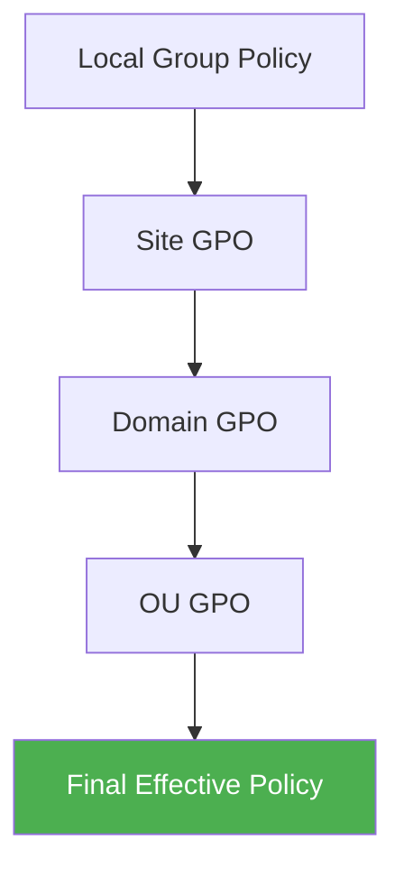

# How to Use Ansible to Manage Windows Group Policy

Author: [nawazdhandala](https://www.github.com/nawazdhandala)

Tags: Ansible, Windows, Group Policy, Active Directory

Description: Learn how to manage Windows Group Policy settings with Ansible using registry-based policy management and GPO automation techniques.

---

Group Policy is one of the most powerful features in Windows and Active Directory environments. It lets administrators enforce security settings, configure desktops, deploy software, and control just about every aspect of the Windows experience across an organization. Traditionally, Group Policy is managed through the Group Policy Management Console (GPMC), but there are strong reasons to manage it with Ansible instead, especially if you want version-controlled, repeatable, auditable infrastructure.

This post covers how to use Ansible to manage local Group Policy settings on individual machines and how to work with domain-level GPOs through PowerShell modules.

## Understanding Group Policy Layers

Group Policy settings get applied in a specific order, and this matters when you are deciding where to make changes with Ansible.



Domain-level GPOs override local policies. So if you set a local policy with Ansible but a domain GPO overrides it, the domain GPO wins. Keep this in mind when planning your automation strategy.

## Managing Local Policy via Registry

Many Group Policy settings are just registry values under the hood. Ansible's `win_regedit` module can set these directly, which is the most straightforward approach for local policy management.

```yaml
# playbook-registry-policy.yml
# Sets common security policy settings via the registry
- name: Configure local security policy via registry
  hosts: windows
  tasks:
    - name: Disable autoplay on all drives
      ansible.windows.win_regedit:
        path: HKLM:\SOFTWARE\Microsoft\Windows\CurrentVersion\Policies\Explorer
        name: NoDriveTypeAutoRun
        data: 255
        type: dword
        state: present

    - name: Enable screen saver password protection
      ansible.windows.win_regedit:
        path: HKCU:\Software\Policies\Microsoft\Windows\Control Panel\Desktop
        name: ScreenSaverIsSecure
        data: "1"
        type: string
        state: present

    - name: Set screen saver timeout to 10 minutes
      ansible.windows.win_regedit:
        path: HKCU:\Software\Policies\Microsoft\Windows\Control Panel\Desktop
        name: ScreenSaveTimeOut
        data: "600"
        type: string
        state: present

    - name: Disable USB storage devices
      ansible.windows.win_regedit:
        path: HKLM:\SYSTEM\CurrentControlSet\Services\USBSTOR
        name: Start
        data: 4
        type: dword
        state: present
```

## Using the community.windows.win_security_policy Module

For Local Security Policy settings (password policy, account lockout, audit policy), there is a dedicated module:

```yaml
# playbook-security-policy.yml
# Configures account lockout and password policies
- name: Configure local security policy
  hosts: windows
  tasks:
    - name: Set account lockout threshold
      community.windows.win_security_policy:
        section: System Access
        key: LockoutBadCount
        value: 5

    - name: Set lockout duration to 30 minutes
      community.windows.win_security_policy:
        section: System Access
        key: LockoutDuration
        value: 30

    - name: Set minimum password length
      community.windows.win_security_policy:
        section: System Access
        key: MinimumPasswordLength
        value: 12

    - name: Set maximum password age to 90 days
      community.windows.win_security_policy:
        section: System Access
        key: MaximumPasswordAge
        value: 90

    - name: Require password history of 24 passwords
      community.windows.win_security_policy:
        section: System Access
        key: PasswordHistorySize
        value: 24

    - name: Enable password complexity requirements
      community.windows.win_security_policy:
        section: System Access
        key: PasswordComplexity
        value: 1
```

The `section` and `key` values correspond to entries in the `secedit` security database. You can find available keys by exporting the current policy:

```yaml
# Export current security policy to see available settings
    - name: Export current security policy for reference
      ansible.windows.win_shell: secedit /export /cfg C:\Temp\secpol.cfg
```

## Managing Domain GPOs with PowerShell

For domain-level GPO management, you need the Group Policy PowerShell module (part of RSAT) and can use `win_shell` to call its cmdlets:

```yaml
# playbook-domain-gpo.yml
# Creates and configures a domain GPO for workstation hardening
- name: Manage domain Group Policy Objects
  hosts: domain_controllers
  tasks:
    - name: Ensure GroupPolicy module is available
      ansible.windows.win_feature:
        name: GPMC
        state: present

    - name: Create a new GPO for workstation hardening
      ansible.windows.win_shell: |
        # Check if GPO already exists
        $gpo = Get-GPO -Name "Workstation-Hardening" -ErrorAction SilentlyContinue
        if (-not $gpo) {
            $gpo = New-GPO -Name "Workstation-Hardening" -Comment "Managed by Ansible"
            Write-Output "CREATED"
        } else {
            Write-Output "EXISTS"
        }
      register: gpo_result

    - name: Configure GPO - disable guest account
      ansible.windows.win_shell: |
        Set-GPRegistryValue `
          -Name "Workstation-Hardening" `
          -Key "HKLM\SOFTWARE\Microsoft\Windows\CurrentVersion\Policies\System" `
          -ValueName "EnableGuestAccount" `
          -Type DWord `
          -Value 0

    - name: Configure GPO - set interactive logon message title
      ansible.windows.win_shell: |
        Set-GPRegistryValue `
          -Name "Workstation-Hardening" `
          -Key "HKLM\SOFTWARE\Microsoft\Windows\CurrentVersion\Policies\System" `
          -ValueName "legalnoticecaption" `
          -Type String `
          -Value "Authorized Access Only"

    - name: Configure GPO - set interactive logon message text
      ansible.windows.win_shell: |
        Set-GPRegistryValue `
          -Name "Workstation-Hardening" `
          -Key "HKLM\SOFTWARE\Microsoft\Windows\CurrentVersion\Policies\System" `
          -ValueName "legalnoticetext" `
          -Type String `
          -Value "This system is for authorized use only. All activity is monitored."

    - name: Link GPO to workstation OU
      ansible.windows.win_shell: |
        $link = Get-GPLink -Name "Workstation-Hardening" `
          -Target "OU=Workstations,DC=corp,DC=local" `
          -ErrorAction SilentlyContinue
        if (-not $link) {
            New-GPLink -Name "Workstation-Hardening" `
              -Target "OU=Workstations,DC=corp,DC=local" `
              -LinkEnabled Yes
            Write-Output "LINKED"
        } else {
            Write-Output "ALREADY_LINKED"
        }
      register: link_result
```

## Applying Multiple Registry-Based Policy Settings

Many Group Policy settings map to specific registry keys. Here is a structured approach using a variable dictionary:

```yaml
# playbook-bulk-policy.yml
# Applies a batch of security-related Group Policy settings via registry
- name: Apply bulk policy settings
  hosts: windows
  vars:
    policy_settings:
      # Disable Windows Installer always install with elevated privileges
      - path: HKLM:\SOFTWARE\Policies\Microsoft\Windows\Installer
        name: AlwaysInstallElevated
        data: 0
        type: dword

      # Configure Windows Update to auto-download but prompt to install
      - path: HKLM:\SOFTWARE\Policies\Microsoft\Windows\WindowsUpdate\AU
        name: AUOptions
        data: 3
        type: dword

      # Disable Remote Assistance solicited requests
      - path: HKLM:\SOFTWARE\Policies\Microsoft\Windows NT\Terminal Services
        name: fAllowToGetHelp
        data: 0
        type: dword

      # Enable audit of process creation
      - path: HKLM:\SOFTWARE\Microsoft\Windows\CurrentVersion\Policies\System\Audit
        name: ProcessCreationIncludeCmdLine_Enabled
        data: 1
        type: dword

      # Disable anonymous SID enumeration
      - path: HKLM:\SYSTEM\CurrentControlSet\Control\Lsa
        name: RestrictAnonymousSAM
        data: 1
        type: dword

      # Configure SMB signing
      - path: HKLM:\SYSTEM\CurrentControlSet\Services\LanManServer\Parameters
        name: RequireSecuritySignature
        data: 1
        type: dword

  tasks:
    - name: Apply each policy setting
      ansible.windows.win_regedit:
        path: "{{ item.path }}"
        name: "{{ item.name }}"
        data: "{{ item.data }}"
        type: "{{ item.type }}"
        state: present
      loop: "{{ policy_settings }}"
      loop_control:
        label: "{{ item.name }}"
```

## Forcing Group Policy Update

After making changes, you may want to force a Group Policy refresh on the target machines:

```yaml
# Force a Group Policy update on all target hosts
    - name: Force Group Policy update
      ansible.windows.win_shell: gpupdate /force
      register: gpupdate_result

    - name: Show gpupdate output
      ansible.builtin.debug:
        msg: "{{ gpupdate_result.stdout_lines }}"
```

## Auditing Current Policy Settings

Before making changes, it is a good practice to capture the current state for comparison:

```yaml
# playbook-audit-policy.yml
# Exports current Group Policy settings for auditing
- name: Audit Group Policy settings
  hosts: windows
  tasks:
    - name: Generate Group Policy result report
      ansible.windows.win_shell: |
        gpresult /H C:\Temp\gpresult.html /F
      register: gpresult

    - name: Fetch the report to control node
      ansible.builtin.fetch:
        src: C:\Temp\gpresult.html
        dest: "./reports/{{ inventory_hostname }}-gpresult.html"
        flat: yes

    - name: Export specific registry policy values
      ansible.windows.win_shell: |
        $policies = @{
            "AutoPlay" = (Get-ItemProperty -Path "HKLM:\SOFTWARE\Microsoft\Windows\CurrentVersion\Policies\Explorer" -Name "NoDriveTypeAutoRun" -ErrorAction SilentlyContinue).NoDriveTypeAutoRun
            "SMBSigning" = (Get-ItemProperty -Path "HKLM:\SYSTEM\CurrentControlSet\Services\LanManServer\Parameters" -Name "RequireSecuritySignature" -ErrorAction SilentlyContinue).RequireSecuritySignature
            "USBStorage" = (Get-ItemProperty -Path "HKLM:\SYSTEM\CurrentControlSet\Services\USBSTOR" -Name "Start" -ErrorAction SilentlyContinue).Start
        }
        $policies | ConvertTo-Json
      register: current_policies

    - name: Display current policy values
      ansible.builtin.debug:
        msg: "{{ current_policies.stdout | from_json }}"
```

## Tips for Group Policy Automation

**Know the registry path.** The hardest part of managing Group Policy via Ansible is figuring out which registry keys correspond to which settings. The best resources are Microsoft's Group Policy Settings Reference spreadsheets, which you can download from Microsoft's website.

**Test in a lab first.** Group Policy changes can have far-reaching effects. A bad password policy or lockout setting can lock out every user in the domain. Always test in a non-production environment.

**Use local policy for standalone servers.** If a server is not domain-joined, local Group Policy is your only option. Ansible is perfect for this scenario since there is no GPMC to manage.

**Consider compliance frameworks.** If you are implementing CIS benchmarks or STIG settings, there are published mappings between the benchmark items and their registry keys. This makes it straightforward to build an Ansible playbook that enforces an entire compliance baseline.

Managing Group Policy with Ansible gives you the repeatability and auditability that the traditional GUI approach lacks. Whether you are hardening standalone servers or managing domain-wide policies, the combination of `win_regedit`, `win_security_policy`, and PowerShell GPO cmdlets covers the full spectrum of Group Policy automation.
