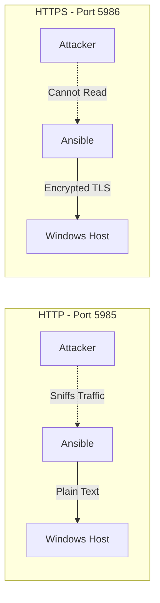

# How to Use Ansible to Manage Windows Hosts with HTTPS WinRM

Author: [nawazdhandala](https://www.github.com/nawazdhandala)

Tags: Ansible, Windows, WinRM, Security

Description: Set up secure HTTPS WinRM connections between Ansible and Windows hosts with certificate-based authentication and proper configuration.

---

WinRM (Windows Remote Management) is the protocol Ansible uses to communicate with Windows hosts. By default, WinRM can run over HTTP on port 5985 or HTTPS on port 5986. For any environment beyond a test lab, you should always use HTTPS. HTTP transmits data (including credentials) in plain text, which is a serious security risk. Setting up HTTPS WinRM is not difficult, but it requires getting the certificate configuration right on both sides.

This guide walks through the complete setup, from generating certificates on Windows to configuring Ansible to connect securely.

## Why HTTPS Matters for WinRM



When Ansible connects to a Windows host, it sends credentials (username and password) with every request. Over HTTP, these credentials are visible to anyone on the network. HTTPS encrypts the entire connection with TLS, protecting both credentials and data in transit.

## Step 1: Configure WinRM on Windows

First, set up WinRM with an HTTPS listener on each Windows host. This can be done manually or, better yet, with a PowerShell script that you can run via your initial provisioning process.

```yaml
# playbook-setup-winrm-https.yml
# Configures WinRM HTTPS listener using a self-signed certificate
# Run this initially via another mechanism (e.g., user data script, manual setup)
- name: Configure WinRM HTTPS
  hosts: windows_initial
  vars:
    ansible_connection: winrm
    ansible_winrm_transport: basic
    ansible_port: 5985

  tasks:
    - name: Create self-signed certificate for WinRM
      ansible.windows.win_shell: |
        # Check if an HTTPS listener already exists
        $httpsListener = Get-ChildItem WSMan:\localhost\Listener |
          Where-Object { $_.Keys -contains "Transport=HTTPS" }

        if ($httpsListener) {
          Write-Output "HTTPS listener already exists"
          exit 0
        }

        # Generate a self-signed certificate
        $hostname = $env:COMPUTERNAME
        $cert = New-SelfSignedCertificate `
          -DnsName $hostname, $hostname.ToLower() `
          -CertStoreLocation Cert:\LocalMachine\My `
          -NotAfter (Get-Date).AddYears(5) `
          -KeyAlgorithm RSA `
          -KeyLength 2048

        # Create the HTTPS listener
        New-Item -Path WSMan:\localhost\Listener `
          -Transport HTTPS `
          -Address * `
          -CertificateThumbPrint $cert.Thumbprint `
          -Force

        Write-Output "HTTPS listener created with cert: $($cert.Thumbprint)"
      register: winrm_setup

    - name: Display setup result
      ansible.builtin.debug:
        msg: "{{ winrm_setup.stdout }}"
```

## Step 2: Configure WinRM Security Settings

Once the HTTPS listener is in place, configure WinRM security settings to enforce secure connections:

```yaml
# playbook-winrm-security.yml
# Hardens WinRM security settings
- name: Harden WinRM configuration
  hosts: windows
  tasks:
    - name: Enable basic authentication (needed for some transports)
      ansible.windows.win_shell: |
        Set-Item -Path WSMan:\localhost\Service\Auth\Basic -Value $true

    - name: Enable certificate authentication
      ansible.windows.win_shell: |
        Set-Item -Path WSMan:\localhost\Service\Auth\Certificate -Value $true

    - name: Disable unencrypted traffic
      ansible.windows.win_shell: |
        Set-Item -Path WSMan:\localhost\Service\AllowUnencrypted -Value $false

    - name: Set maximum concurrent operations
      ansible.windows.win_shell: |
        Set-Item -Path WSMan:\localhost\Service\MaxConcurrentOperationsPerUser -Value 50

    - name: Set maximum envelope size (in KB)
      ansible.windows.win_shell: |
        Set-Item -Path WSMan:\localhost\MaxEnvelopeSizeKb -Value 8192

    - name: Add firewall rule for WinRM HTTPS
      community.windows.win_firewall_rule:
        name: "WinRM HTTPS"
        localport: 5986
        action: allow
        direction: in
        protocol: tcp
        state: present
        enabled: yes

    - name: Restart WinRM service
      ansible.windows.win_service:
        name: WinRM
        state: restarted
```

## Step 3: Configure Ansible Inventory for HTTPS

Now configure your Ansible inventory to use HTTPS connections:

```ini
# inventory/hosts.ini
# Ansible inventory configured for HTTPS WinRM connections
[windows]
web-server-01 ansible_host=192.168.1.100
web-server-02 ansible_host=192.168.1.101
db-server-01  ansible_host=192.168.1.200

[windows:vars]
ansible_user=ansible-admin
ansible_password={{ vault_windows_password }}
ansible_connection=winrm
ansible_port=5986
ansible_winrm_transport=ntlm
ansible_winrm_server_cert_validation=ignore
ansible_winrm_scheme=https
```

The key settings for HTTPS are:

- `ansible_port: 5986` - HTTPS port (vs 5985 for HTTP)
- `ansible_winrm_scheme: https` - Forces HTTPS
- `ansible_winrm_server_cert_validation: ignore` - For self-signed certs

## Step 4: Using Proper Certificate Validation

In production, you should validate the server certificate instead of ignoring it. This requires either a CA-signed certificate on the Windows host or trusting the self-signed certificate on the Ansible control node.

```yaml
# group_vars/windows.yml
# Production WinRM configuration with certificate validation
ansible_connection: winrm
ansible_port: 5986
ansible_winrm_transport: ntlm
ansible_winrm_scheme: https
ansible_winrm_server_cert_validation: validate
ansible_winrm_ca_trust_path: /etc/pki/tls/certs/internal-ca.pem
```

To export the Windows certificate for trusting on the Ansible control node:

```yaml
# playbook-export-cert.yml
# Exports the WinRM certificate from Windows hosts for trust configuration
- name: Export WinRM certificates
  hosts: windows
  tasks:
    - name: Export the WinRM HTTPS certificate
      ansible.windows.win_shell: |
        $listener = Get-ChildItem WSMan:\localhost\Listener |
          Where-Object { $_.Keys -contains "Transport=HTTPS" }
        $thumbprint = ($listener | Get-ChildItem |
          Where-Object { $_.Name -eq "CertificateThumbprint" }).Value
        $cert = Get-ChildItem "Cert:\LocalMachine\My\$thumbprint"
        $bytes = $cert.Export([System.Security.Cryptography.X509Certificates.X509ContentType]::Cert)
        [System.Convert]::ToBase64String($bytes)
      register: cert_b64

    - name: Save certificate to control node
      ansible.builtin.copy:
        content: |
          -----BEGIN CERTIFICATE-----
          {{ cert_b64.stdout | trim }}
          -----END CERTIFICATE-----
        dest: "/etc/pki/tls/certs/{{ inventory_hostname }}.pem"
      delegate_to: localhost
```

## Using Certificate-Based Authentication

For the most secure setup, you can use client certificate authentication instead of username/password:

```yaml
# playbook-cert-auth-setup.yml
# Configures certificate-based authentication for WinRM
- name: Set up certificate authentication
  hosts: windows
  tasks:
    - name: Enable certificate authentication on WinRM
      ansible.windows.win_shell: |
        Set-Item -Path WSMan:\localhost\Service\Auth\Certificate -Value $true

    - name: Import client certificate to trusted people store
      ansible.windows.win_shell: |
        # The client certificate needs to be in Trusted People
        $certPath = "C:\Temp\ansible-client.cer"
        $cert = New-Object System.Security.Cryptography.X509Certificates.X509Certificate2($certPath)
        $store = New-Object System.Security.Cryptography.X509Certificates.X509Store("TrustedPeople", "LocalMachine")
        $store.Open("ReadWrite")
        $store.Add($cert)
        $store.Close()
        Write-Output "Client certificate imported"

    - name: Create certificate mapping
      ansible.windows.win_shell: |
        $clientCert = Get-ChildItem Cert:\LocalMachine\TrustedPeople |
          Where-Object { $_.Subject -like "*ansible-client*" }
        $credential = New-Object PSCredential("ansible-admin", (ConvertTo-SecureString "{{ vault_password }}" -AsPlainText -Force))

        New-Item -Path WSMan:\localhost\ClientCertificate `
          -Subject "ansible-client" `
          -URI * `
          -Issuer $clientCert.Thumbprint `
          -Credential $credential `
          -Force
```

Then configure Ansible to use certificate authentication:

```ini
# inventory for certificate auth
[windows:vars]
ansible_connection=winrm
ansible_port=5986
ansible_winrm_transport=certificate
ansible_winrm_cert_pem=/path/to/ansible-client.pem
ansible_winrm_cert_key_pem=/path/to/ansible-client-key.pem
ansible_winrm_scheme=https
```

## Complete Bootstrap Script

Here is a PowerShell script you can use to bootstrap WinRM HTTPS on a fresh Windows server. This would typically be run as part of your provisioning process (user data, startup script, etc.):

```yaml
# playbook-bootstrap-winrm.yml
# Complete WinRM HTTPS bootstrap for new Windows servers
- name: Bootstrap WinRM HTTPS
  hosts: windows_new
  vars:
    ansible_connection: winrm
    ansible_port: 5985
    ansible_winrm_transport: basic
    ansible_winrm_scheme: http

  tasks:
    - name: Run complete WinRM HTTPS setup
      ansible.windows.win_shell: |
        # Step 1: Generate certificate
        $hostname = [System.Net.Dns]::GetHostEntry("").HostName
        $ip = (Get-NetIPAddress -AddressFamily IPv4 |
          Where-Object { $_.InterfaceAlias -ne "Loopback" } |
          Select-Object -First 1).IPAddress

        $cert = New-SelfSignedCertificate `
          -DnsName $hostname, $env:COMPUTERNAME, $ip, "localhost" `
          -CertStoreLocation Cert:\LocalMachine\My `
          -NotAfter (Get-Date).AddYears(5) `
          -KeyAlgorithm RSA `
          -KeyLength 4096

        # Step 2: Remove existing HTTPS listener if present
        $existing = Get-ChildItem WSMan:\localhost\Listener |
          Where-Object { $_.Keys -contains "Transport=HTTPS" }
        if ($existing) {
          Remove-Item -Path "WSMan:\localhost\Listener\$($existing.Name)" -Recurse
        }

        # Step 3: Create HTTPS listener
        New-Item -Path WSMan:\localhost\Listener `
          -Transport HTTPS `
          -Address * `
          -CertificateThumbPrint $cert.Thumbprint `
          -Force

        # Step 4: Configure security
        Set-Item WSMan:\localhost\Service\AllowUnencrypted -Value $false
        Set-Item WSMan:\localhost\Service\Auth\Basic -Value $true
        Set-Item WSMan:\localhost\Service\Auth\CredSSP -Value $false

        # Step 5: Firewall
        $rule = Get-NetFirewallRule -Name "WinRM-HTTPS" -ErrorAction SilentlyContinue
        if (-not $rule) {
          New-NetFirewallRule -Name "WinRM-HTTPS" `
            -DisplayName "WinRM HTTPS" `
            -Direction Inbound `
            -Protocol TCP `
            -LocalPort 5986 `
            -Action Allow
        }

        # Step 6: Restart WinRM
        Restart-Service WinRM

        Write-Output "WinRM HTTPS configured successfully"
        Write-Output "Certificate Thumbprint: $($cert.Thumbprint)"
        Write-Output "Hostname: $hostname"
      register: bootstrap_result

    - name: Display bootstrap results
      ansible.builtin.debug:
        msg: "{{ bootstrap_result.stdout_lines }}"
```

## Testing the Connection

After setup, verify the HTTPS connection works:

```bash
# Test WinRM HTTPS connectivity from the Ansible control node
ansible windows -i inventory/hosts.ini -m ansible.windows.win_ping

# For more verbose output during troubleshooting
ansible windows -i inventory/hosts.ini -m ansible.windows.win_ping -vvvv
```

## Troubleshooting Common Issues

**Connection refused on port 5986**: The HTTPS listener is not configured. Check with `winrm enumerate winrm/config/listener` on the Windows host.

**SSL certificate error**: Either trust the certificate on the Ansible side or set `ansible_winrm_server_cert_validation=ignore` (not recommended for production).

**Authentication failures**: Make sure the authentication method configured in WinRM matches what Ansible is using. NTLM is the most compatible option. If using Basic auth over HTTPS, both sides need it enabled.

**Timeout errors**: Increase the timeout with `ansible_winrm_operation_timeout_sec` and `ansible_winrm_read_timeout_sec` in your inventory.

**pywinrm not installed**: The Ansible control node needs the `pywinrm` Python package. Install it with `pip install pywinrm`.

Getting WinRM HTTPS right is a one-time setup effort that pays off in security for every subsequent Ansible run. Once configured, the encrypted connection works transparently and you can manage your Windows fleet with confidence that credentials and data are protected in transit.
