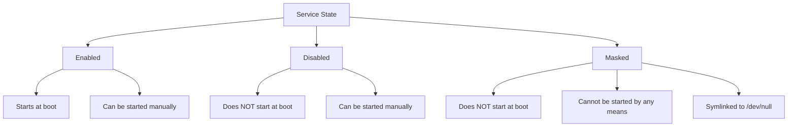

# How to Use Ansible to Mask and Unmask systemd Services

Author: [nawazdhandala](https://www.github.com/nawazdhandala)

Tags: Ansible, systemd, Security, Linux, Service Management

Description: Learn how to use Ansible to mask and unmask systemd services to prevent accidental or unauthorized service starts on your Linux servers.

---

Disabling a systemd service prevents it from starting at boot, but it can still be started manually or pulled in as a dependency by another service. Masking goes a step further: it makes it impossible to start the service by any means, including manual start and dependency resolution. This is a powerful security and compliance tool, and Ansible makes it easy to enforce masking across your fleet.

## The Difference Between Disabled and Masked

Let's be precise about what each state means.

A disabled service has no symlink in the `multi-user.target.wants` directory (or whichever target it was linked to). It will not start at boot, but you can still run `systemctl start myservice` to fire it up manually.

A masked service has a symlink from its unit file to `/dev/null`. Any attempt to start it, whether manual, by dependency, or by socket activation, will fail. The service is effectively dead until you unmask it.



## Masking a Service with Ansible

The `ansible.builtin.systemd` module supports the `masked` parameter directly.

Mask a service so it cannot be started:

```yaml
---
- name: Mask dangerous services
  hosts: all
  become: yes
  tasks:
    - name: Mask the Bluetooth service
      ansible.builtin.systemd:
        name: bluetooth.service
        masked: yes
```

When you run this, Ansible creates a symlink:

```
/etc/systemd/system/bluetooth.service -> /dev/null
```

After masking, any attempt to start the service fails:

```bash
$ systemctl start bluetooth.service
Failed to start bluetooth.service: Unit bluetooth.service is masked.
```

## Unmasking a Service

To reverse the operation, set `masked: no`.

Unmask a previously masked service:

```yaml
- name: Unmask the Bluetooth service
  ansible.builtin.systemd:
    name: bluetooth.service
    masked: no
```

This removes the `/dev/null` symlink, allowing the service to be started again. Note that unmasking does not start or enable the service. It just removes the block. You would need to separately enable and start it if that is what you want.

## Combining Mask with Stop and Disable

In most real scenarios, you want to stop a running service, disable it from boot, and then mask it to prevent any future starts.

Fully shut down and mask a service:

```yaml
- name: Completely prevent cups from running
  ansible.builtin.systemd:
    name: cups.service
    state: stopped
    enabled: no
    masked: yes
```

Ansible handles the ordering correctly here. It will stop the service first, then disable it, then mask it.

## Security Hardening Playbook

One of the most common use cases for masking is server hardening. Many Linux distributions install services that are unnecessary on a production server.

Harden servers by masking unnecessary services:

```yaml
---
- name: Security hardening - mask unnecessary services
  hosts: production_servers
  become: yes

  vars:
    services_to_mask:
      - bluetooth.service
      - cups.service
      - cups-browsed.service
      - avahi-daemon.service
      - ModemManager.service
      - NetworkManager-wait-online.service
      - wpa_supplicant.service
      - colord.service
      - accounts-daemon.service

    # Services that should absolutely never run on production
    critical_mask_list:
      - debug-shell.service
      - kdump.service
      - ctrl-alt-del.target

  tasks:
    - name: Stop and mask unnecessary services
      ansible.builtin.systemd:
        name: "{{ item }}"
        state: stopped
        masked: yes
      loop: "{{ services_to_mask }}"
      ignore_errors: yes  # Some services may not exist on all hosts

    - name: Mask critical security-sensitive services
      ansible.builtin.systemd:
        name: "{{ item }}"
        masked: yes
      loop: "{{ critical_mask_list }}"
      ignore_errors: yes

    - name: Mask ctrl-alt-del reboot target
      ansible.builtin.systemd:
        name: ctrl-alt-del.target
        masked: yes
```

That last one is important: masking `ctrl-alt-del.target` prevents someone with physical or console access from rebooting the server by pressing Ctrl+Alt+Del.

## Verifying Masked State

You can verify that services are properly masked using ad-hoc commands or by checking the symlink.

Verify services are masked across the fleet:

```yaml
- name: Check mask status of services
  ansible.builtin.command: "systemctl is-enabled {{ item }}"
  register: mask_check
  loop:
    - bluetooth.service
    - cups.service
    - avahi-daemon.service
  changed_when: false
  failed_when: false

- name: Report mask status
  ansible.builtin.debug:
    msg: "{{ item.item }}: {{ item.stdout }}"
  loop: "{{ mask_check.results }}"
  loop_control:
    label: "{{ item.item }}"
```

A masked service will show `masked` in the output of `systemctl is-enabled`.

## Using service_facts to Audit Mask State

For a more comprehensive audit, combine with `service_facts`.

Audit all services and find ones that should be masked but are not:

```yaml
---
- name: Audit service mask compliance
  hosts: all
  become: yes

  vars:
    must_be_masked:
      - bluetooth.service
      - cups.service
      - avahi-daemon.service
      - debug-shell.service

  tasks:
    - name: Gather service facts
      ansible.builtin.service_facts:

    - name: Check for services that should be masked
      ansible.builtin.set_fact:
        non_compliant: >-
          {{ must_be_masked
             | select('in', ansible_facts.services.keys())
             | reject('in',
                 ansible_facts.services | dict2items
                 | selectattr('value.status', 'equalto', 'masked')
                 | map(attribute='key')
                 | list)
             | list }}

    - name: Report non-compliant hosts
      ansible.builtin.debug:
        msg: >
          HOST {{ inventory_hostname }} has unmasked services that
          should be masked: {{ non_compliant | join(', ') }}
      when: non_compliant | length > 0

    - name: Fix non-compliant services
      ansible.builtin.systemd:
        name: "{{ item }}"
        state: stopped
        masked: yes
      loop: "{{ non_compliant }}"
      when: non_compliant | length > 0
```

## Masking with Runtime vs Persistent

By default, masking is persistent (survives reboots). The mask symlink goes into `/etc/systemd/system/`. If you only need to mask a service temporarily for the current boot, you can use the runtime directory instead.

Runtime masking that does not survive reboot:

```yaml
- name: Temporarily mask a service (runtime only)
  ansible.builtin.command: "systemctl mask --runtime {{ item }}"
  loop:
    - some-maintenance.service
  changed_when: true
```

This creates the symlink in `/run/systemd/system/` instead, which is a tmpfs that gets cleared on reboot. Note that Ansible's `systemd` module does not have a native parameter for runtime masking, so you need to fall back to the `command` module.

## Handling Dependencies When Masking

When you mask a service that other services depend on, those dependent services will fail to start. This can be intentional (you want to break a chain) or accidental.

Check what depends on a service before masking it:

```yaml
- name: Check reverse dependencies before masking
  ansible.builtin.command: "systemctl list-dependencies --reverse {{ service_to_mask }}"
  register: reverse_deps
  changed_when: false

- name: Show what depends on this service
  ansible.builtin.debug:
    var: reverse_deps.stdout_lines

- name: Proceed with masking if safe
  ansible.builtin.systemd:
    name: "{{ service_to_mask }}"
    state: stopped
    masked: yes
  when: reverse_deps.stdout_lines | length <= 1  # Only the service itself
```

## Role-Based Masking

Different server roles need different services masked. Here is a pattern for role-based service masking.

Mask services based on server role using group variables:

```yaml
# group_vars/web_servers.yml
masked_services:
  - bluetooth.service
  - cups.service
  - avahi-daemon.service
  - postfix.service  # web servers should not run mail

# group_vars/db_servers.yml
masked_services:
  - bluetooth.service
  - cups.service
  - avahi-daemon.service
  - nginx.service  # database servers should not run web servers
  - httpd.service

# group_vars/all.yml
base_masked_services:
  - debug-shell.service
  - ctrl-alt-del.target
```

Then in the playbook:

```yaml
---
- name: Apply role-based service masking
  hosts: all
  become: yes
  tasks:
    - name: Mask base services on all hosts
      ansible.builtin.systemd:
        name: "{{ item }}"
        masked: yes
      loop: "{{ base_masked_services | default([]) }}"
      ignore_errors: yes

    - name: Mask role-specific services
      ansible.builtin.systemd:
        name: "{{ item }}"
        state: stopped
        masked: yes
      loop: "{{ masked_services | default([]) }}"
      ignore_errors: yes
```

## Summary

Masking is your strongest tool for keeping services dead on a system. Unlike disabling, it prevents all start mechanisms, including manual starts and dependency pulls. Use it for security hardening, compliance enforcement, and preventing services from running on systems where they do not belong. The `ansible.builtin.systemd` module makes it trivial to mask and unmask services, and when combined with `service_facts`, you can build audit playbooks that verify your masking policy is enforced consistently across your entire infrastructure.
