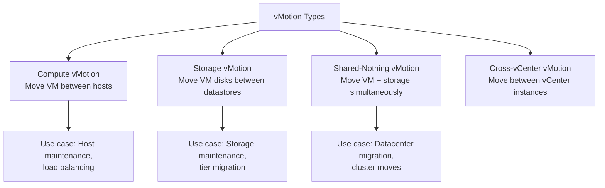
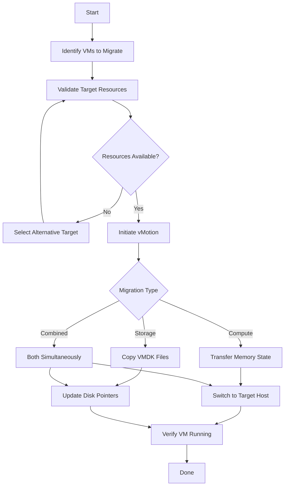

# How to Use Ansible to Migrate VMs with vMotion

Author: [nawazdhandala](https://www.github.com/nawazdhandala)

Tags: Ansible, VMware, vMotion, Migration, vSphere

Description: Learn how to automate VMware vMotion migrations with Ansible including compute vMotion, storage vMotion, and cross-vCenter moves for maintenance and load balancing.

---

vMotion is one of VMware's most powerful features. It lets you move running VMs between ESXi hosts (compute vMotion), between datastores (storage vMotion), or both at the same time, all without any downtime for the VM. While the vSphere Client makes it easy to migrate one VM at a time, automating vMotion with Ansible is essential when you need to evacuate a host for maintenance, balance workloads across a cluster, or migrate VMs between storage tiers.

## Types of vMotion

There are several types of vMotion, each serving a different purpose.



## Compute vMotion: Moving VMs Between Hosts

Use the `community.vmware.vmware_vmotion` module to migrate a running VM to a different ESXi host.

```yaml
# compute-vmotion.yml
---
- name: Migrate VM to a different ESXi host
  hosts: localhost
  gather_facts: false

  module_defaults:
    group/community.vmware.vmware:
      hostname: "{{ vcenter_hostname }}"
      username: "{{ vcenter_username }}"
      password: "{{ vcenter_password }}"
      validate_certs: false

  vars:
    vcenter_hostname: "vcenter.example.com"
    vcenter_username: "administrator@vsphere.local"
    vcenter_password: "{{ vault_vcenter_password }}"

  tasks:
    - name: Migrate VM to target ESXi host
      community.vmware.vmware_vmotion:
        vm_name: "prod-app-01"
        destination_host: "esxi-02.example.com"
      register: vmotion_result

    - name: Display migration result
      ansible.builtin.debug:
        msg: >
          VM: {{ vmotion_result.vm_name }}
          migrated to host: {{ vmotion_result.destination_host }}
      when: vmotion_result.changed
```

## Storage vMotion: Moving VM Disks

Storage vMotion moves the VM's virtual disks to a different datastore while the VM continues running.

```yaml
# storage-vmotion.yml
---
- name: Migrate VM storage to a different datastore
  hosts: localhost
  gather_facts: false

  module_defaults:
    group/community.vmware.vmware:
      hostname: "{{ vcenter_hostname }}"
      username: "{{ vcenter_username }}"
      password: "{{ vcenter_password }}"
      validate_certs: false

  vars:
    vcenter_hostname: "vcenter.example.com"
    vcenter_username: "administrator@vsphere.local"
    vcenter_password: "{{ vault_vcenter_password }}"

  tasks:
    - name: Move VM disks to new datastore
      community.vmware.vmware_vmotion:
        vm_name: "prod-db-01"
        destination_datastore: "fast-ssd-datastore"
      register: svmotion_result

    - name: Report storage migration
      ansible.builtin.debug:
        msg: "Storage migration complete for {{ svmotion_result.vm_name }}"
```

## Combined vMotion: Host and Storage Together

Move both the compute and storage at the same time.

```yaml
# combined-vmotion.yml
- name: Move VM to a different host and datastore simultaneously
  community.vmware.vmware_vmotion:
    hostname: "{{ vcenter_hostname }}"
    username: "{{ vcenter_username }}"
    password: "{{ vcenter_password }}"
    validate_certs: false
    vm_name: "prod-web-01"
    destination_host: "esxi-03.example.com"
    destination_datastore: "vsanDatastore-02"
  register: combined_result
```

## Host Evacuation for Maintenance

The most common vMotion use case is evacuating all VMs from a host before maintenance.

```yaml
# evacuate-host.yml
---
- name: Evacuate all VMs from an ESXi host for maintenance
  hosts: localhost
  gather_facts: false

  module_defaults:
    group/community.vmware.vmware:
      hostname: "{{ vcenter_hostname }}"
      username: "{{ vcenter_username }}"
      password: "{{ vcenter_password }}"
      validate_certs: false

  vars:
    vcenter_hostname: "vcenter.example.com"
    vcenter_username: "administrator@vsphere.local"
    vcenter_password: "{{ vault_vcenter_password }}"
    source_host: "esxi-01.example.com"
    target_host: "esxi-02.example.com"

  tasks:
    # Get all VMs running on the source host
    - name: Get list of VMs on the source host
      community.vmware.vmware_vm_info:
        hostname: "{{ vcenter_hostname }}"
        username: "{{ vcenter_username }}"
        password: "{{ vcenter_password }}"
        validate_certs: false
      register: all_vms

    - name: Build list of VMs on the source host
      ansible.builtin.set_fact:
        vms_to_migrate: >-
          {{ all_vms.virtual_machines |
             selectattr('esxi_hostname', 'equalto', source_host) |
             selectattr('power_state', 'equalto', 'poweredOn') |
             map(attribute='guest_name') | list }}

    - name: Display VMs that will be migrated
      ansible.builtin.debug:
        msg: "VMs to migrate from {{ source_host }}: {{ vms_to_migrate }}"

    # Migrate each VM to the target host
    - name: Migrate VMs off the source host
      community.vmware.vmware_vmotion:
        vm_name: "{{ item }}"
        destination_host: "{{ target_host }}"
      loop: "{{ vms_to_migrate }}"
      register: migration_results

    - name: Report migration results
      ansible.builtin.debug:
        msg: "{{ item.item }}: {{ 'migrated' if item.changed else 'skipped' }}"
      loop: "{{ migration_results.results }}"

    # Now put the host in maintenance mode
    - name: Put source host in maintenance mode
      community.vmware.vmware_maintenancemode:
        esxi_hostname: "{{ source_host }}"
        timeout: 3600
        state: present
```

## Intelligent vMotion with Load Distribution

Instead of dumping all VMs onto one host, distribute them across available hosts.

```yaml
# balanced-evacuation.yml
---
- name: Evacuate host with balanced distribution
  hosts: localhost
  gather_facts: false

  module_defaults:
    group/community.vmware.vmware:
      hostname: "{{ vcenter_hostname }}"
      username: "{{ vcenter_username }}"
      password: "{{ vcenter_password }}"
      validate_certs: false

  vars:
    vcenter_hostname: "vcenter.example.com"
    vcenter_username: "administrator@vsphere.local"
    vcenter_password: "{{ vault_vcenter_password }}"
    evacuate_host: "esxi-01.example.com"
    # Available target hosts (excluding the one being evacuated)
    target_hosts:
      - "esxi-02.example.com"
      - "esxi-03.example.com"
      - "esxi-04.example.com"

  tasks:
    - name: Get VMs on the source host
      community.vmware.vmware_vm_info: {}
      register: all_vms

    - name: Build VM migration list
      ansible.builtin.set_fact:
        vms_to_migrate: >-
          {{ all_vms.virtual_machines |
             selectattr('esxi_hostname', 'equalto', evacuate_host) |
             selectattr('power_state', 'equalto', 'poweredOn') |
             map(attribute='guest_name') | list }}

    # Distribute VMs across target hosts using round-robin
    - name: Migrate VMs with round-robin distribution
      community.vmware.vmware_vmotion:
        vm_name: "{{ item }}"
        destination_host: "{{ target_hosts[idx % (target_hosts | length)] }}"
      loop: "{{ vms_to_migrate }}"
      loop_control:
        index_var: idx
      register: balanced_results

    - name: Migration summary
      ansible.builtin.debug:
        msg: "{{ item.item }} -> {{ target_hosts[idx % (target_hosts | length)] }}"
      loop: "{{ balanced_results.results }}"
      loop_control:
        index_var: idx
```

## Storage Tier Migration

Move VMs between storage tiers based on performance requirements.

```yaml
# storage-tier-migration.yml
---
- name: Migrate VMs to appropriate storage tiers
  hosts: localhost
  gather_facts: false

  module_defaults:
    group/community.vmware.vmware:
      hostname: "{{ vcenter_hostname }}"
      username: "{{ vcenter_username }}"
      password: "{{ vcenter_password }}"
      validate_certs: false

  vars:
    vcenter_hostname: "vcenter.example.com"
    vcenter_username: "administrator@vsphere.local"
    vcenter_password: "{{ vault_vcenter_password }}"

    # Define storage tier migrations
    storage_migrations:
      # Move database VMs to fast SSD storage
      - vm_name: "prod-db-01"
        target_datastore: "nvme-tier1"
        reason: "High IOPS requirement"
      - vm_name: "prod-db-02"
        target_datastore: "nvme-tier1"
        reason: "High IOPS requirement"
      # Move archive VMs to cost-effective storage
      - vm_name: "archive-server-01"
        target_datastore: "sata-tier3"
        reason: "Cold data, low performance need"
      # Move dev VMs to NFS for easy management
      - vm_name: "dev-app-01"
        target_datastore: "nfs-development"
        reason: "Development workload"

  tasks:
    - name: Migrate VM storage to target tier
      community.vmware.vmware_vmotion:
        vm_name: "{{ item.vm_name }}"
        destination_datastore: "{{ item.target_datastore }}"
      loop: "{{ storage_migrations }}"
      register: tier_migration_results

    - name: Report tier migration results
      ansible.builtin.debug:
        msg: "{{ item.item.vm_name }} -> {{ item.item.target_datastore }} ({{ item.item.reason }}): {{ 'done' if item.changed else 'skipped' }}"
      loop: "{{ tier_migration_results.results }}"
```

## Pre-Migration Validation

Before migrating, validate that the target has enough resources.

```yaml
# validate-and-migrate.yml
- name: Validate target host capacity before migration
  community.vmware.vmware_host_info:
    hostname: "{{ vcenter_hostname }}"
    username: "{{ vcenter_username }}"
    password: "{{ vcenter_password }}"
    validate_certs: false
  register: host_info

- name: Check target host is not in maintenance mode
  ansible.builtin.assert:
    that:
      - host_info.hosts[target_host].connection_state == "connected"
    fail_msg: "Target host {{ target_host }} is not available for migration"

- name: Proceed with migration
  community.vmware.vmware_vmotion:
    hostname: "{{ vcenter_hostname }}"
    username: "{{ vcenter_username }}"
    password: "{{ vcenter_password }}"
    validate_certs: false
    vm_name: "{{ vm_to_migrate }}"
    destination_host: "{{ target_host }}"
```

## vMotion Workflow Diagram



vMotion automation with Ansible turns what is usually a manual, one-at-a-time operation into something you can run at scale. Whether you are evacuating hosts for patching, migrating between storage tiers, or rebalancing workloads, the patterns in this guide give you a solid foundation. The key is combining vMotion with proper validation and health checks so migrations are not just automated but also safe.
