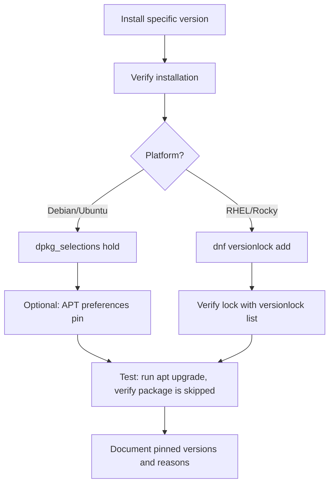

# How to Use Ansible to Pin Package Versions and Prevent Updates

Author: [nawazdhandala](https://www.github.com/nawazdhandala)

Tags: Ansible, Package Pinning, Version Locking, DevOps

Description: How to lock package versions on Debian and RHEL systems using Ansible to prevent unplanned upgrades during system updates.

---

Installing a specific version of a package is only half the problem. The other half is making sure that version stays put. Without version locking, the next time someone runs `apt upgrade` or `dnf update`, your carefully pinned version gets bumped to whatever the repository offers. This post covers the tools Ansible gives you for both Debian and Red Hat systems to lock packages down.

## The Problem

Picture this scenario. You deploy PostgreSQL 15.4, test your application against it, and push to production. Two weeks later, a junior engineer runs a routine patching playbook that includes `apt upgrade: dist`. PostgreSQL gets bumped to 15.5, which introduces a subtle change in query planning. Your application's slowest queries become 10x slower, and you spend the evening rolling back.

Version locking prevents this by marking specific packages so the system package manager skips them during upgrades.

## Locking on Debian/Ubuntu with dpkg_selections

The `dpkg_selections` module controls how dpkg treats packages. Setting a package to "hold" tells both dpkg and apt to skip it during upgrades:

```yaml
# Hold a package to prevent upgrades
- name: Hold PostgreSQL at current version
  ansible.builtin.dpkg_selections:
    name: postgresql-15
    selection: hold

# Hold multiple packages
- name: Hold critical database packages
  ansible.builtin.dpkg_selections:
    name: "{{ item }}"
    selection: hold
  loop:
    - postgresql-15
    - postgresql-client-15
    - postgresql-common
    - libpq5
```

When a package is held, `apt-get upgrade` and `apt-get dist-upgrade` will skip it. The output shows:

```
The following packages have been kept back:
  postgresql-15 postgresql-client-15
```

## Releasing a Hold

When you are ready to upgrade, release the hold:

```yaml
# Release the hold to allow upgrades
- name: Unhold PostgreSQL packages
  ansible.builtin.dpkg_selections:
    name: "{{ item }}"
    selection: install
  loop:
    - postgresql-15
    - postgresql-client-15
    - postgresql-common
    - libpq5
```

The `selection: install` resets the package to its normal state.

## Checking Held Packages

Before making changes, check what is currently held:

```yaml
# List currently held packages
- name: Get held packages
  ansible.builtin.command:
    cmd: dpkg --get-selections
  register: dpkg_selections
  changed_when: false

- name: Show held packages
  ansible.builtin.debug:
    msg: "{{ dpkg_selections.stdout_lines | select('search', 'hold') | list }}"
```

## Using APT Preferences for Priority-Based Pinning

For more granular control, APT preferences let you set priority levels that determine which versions apt prefers:

```yaml
# Pin a package to a specific version using apt preferences
- name: Pin Redis to version 7.0.x
  ansible.builtin.copy:
    content: |
      # Managed by Ansible - do not edit manually
      # Reason: Application tested against Redis 7.0.x only
      Package: redis-server redis-tools
      Pin: version 5:7.0.*
      Pin-Priority: 1001
    dest: /etc/apt/preferences.d/redis-pin
    owner: root
    group: root
    mode: '0644'
```

Priority levels determine behavior:

```yaml
# Block a package from being installed at all
- name: Prevent PostgreSQL 16 from being installed
  ansible.builtin.copy:
    content: |
      # Block PostgreSQL 16 - we are committed to 15.x
      Package: postgresql-16 postgresql-client-16
      Pin: release *
      Pin-Priority: -1
    dest: /etc/apt/preferences.d/block-pg16
    mode: '0644'
```

## Locking on RHEL with dnf versionlock

On Red Hat-based systems, the `versionlock` plugin for dnf (or yum) provides equivalent functionality:

```yaml
# Install the versionlock plugin
- name: Install dnf versionlock plugin
  ansible.builtin.dnf:
    name: python3-dnf-plugin-versionlock
    state: present

# Lock a package at its current version
- name: Lock nginx version
  ansible.builtin.command:
    cmd: dnf versionlock add nginx
  register: lock_result
  changed_when: "'Added' in lock_result.stdout"

# Lock multiple packages
- name: Lock database packages
  ansible.builtin.command:
    cmd: "dnf versionlock add {{ item }}"
  loop:
    - postgresql15-server
    - postgresql15
    - postgresql15-libs
  register: lock_results
  changed_when: "'Added' in item.stdout"
  loop_control:
    label: "{{ item }}"
```

## Listing and Removing Version Locks on RHEL

```yaml
# List current version locks
- name: Show locked packages
  ansible.builtin.command:
    cmd: dnf versionlock list
  register: versionlock_list
  changed_when: false

- name: Display locked packages
  ansible.builtin.debug:
    msg: "{{ versionlock_list.stdout_lines }}"

# Remove a specific version lock
- name: Unlock nginx
  ansible.builtin.command:
    cmd: dnf versionlock delete nginx
  register: unlock_result
  changed_when: "'Deleted' in unlock_result.stdout"

# Remove all version locks
- name: Clear all version locks
  ansible.builtin.command:
    cmd: dnf versionlock clear
  changed_when: true
```

## A Reusable Role for Version Pinning

Here is a cross-platform role that handles version pinning on both Debian and RHEL:

```yaml
# roles/pin_packages/tasks/main.yml
- name: Include Debian pinning tasks
  ansible.builtin.include_tasks: debian.yml
  when: ansible_os_family == "Debian"

- name: Include RedHat pinning tasks
  ansible.builtin.include_tasks: redhat.yml
  when: ansible_os_family == "RedHat"
```

Debian-specific tasks:

```yaml
# roles/pin_packages/tasks/debian.yml
- name: Hold packages with dpkg
  ansible.builtin.dpkg_selections:
    name: "{{ item }}"
    selection: hold
  loop: "{{ pinned_packages }}"
```

RedHat-specific tasks:

```yaml
# roles/pin_packages/tasks/redhat.yml
- name: Install versionlock plugin
  ansible.builtin.dnf:
    name: python3-dnf-plugin-versionlock
    state: present

- name: Lock package versions
  ansible.builtin.command:
    cmd: "dnf versionlock add {{ item }}"
  loop: "{{ pinned_packages }}"
  register: lock_results
  changed_when: "'Added' in lock_results.stdout"
```

Use the role:

```yaml
# Pin database packages across platforms
- name: Lock database package versions
  hosts: database_servers
  become: yes
  roles:
    - role: pin_packages
      vars:
        pinned_packages:
          - postgresql-15
          - postgresql-client-15
```

## Complete Workflow: Install, Test, and Lock

```yaml
# Full workflow: install specific version, verify, then lock
- name: Deploy and lock PostgreSQL
  hosts: database_servers
  become: yes
  vars:
    pg_version: "15.4-1.pgdg22.04+1"
  tasks:
    - name: Install PostgreSQL at target version
      ansible.builtin.apt:
        name: "postgresql-15={{ pg_version }}"
        state: present
        update_cache: yes

    - name: Verify PostgreSQL version
      ansible.builtin.command:
        cmd: psql --version
      register: pg_actual_version
      changed_when: false

    - name: Display installed version
      ansible.builtin.debug:
        msg: "Installed: {{ pg_actual_version.stdout }}"

    - name: Hold PostgreSQL packages
      ansible.builtin.dpkg_selections:
        name: "{{ item }}"
        selection: hold
      loop:
        - postgresql-15
        - postgresql-client-15
        - postgresql-common

    - name: Create apt pin to prevent any PostgreSQL 16 installation
      ansible.builtin.copy:
        content: |
          Package: postgresql-16*
          Pin: release *
          Pin-Priority: -1
        dest: /etc/apt/preferences.d/block-pg16
        mode: '0644'
```

## Version Pinning Strategy



## Auditing Pinned Packages

Run periodic audits to review what is pinned and whether the pins are still necessary:

```yaml
# Audit version pins across the fleet
- name: Audit version pins
  hosts: all
  become: yes
  tasks:
    - name: Collect held packages (Debian)
      ansible.builtin.command:
        cmd: dpkg --get-selections
      register: dpkg_info
      changed_when: false
      when: ansible_os_family == "Debian"

    - name: Collect locked packages (RedHat)
      ansible.builtin.command:
        cmd: dnf versionlock list
      register: versionlock_info
      changed_when: false
      when: ansible_os_family == "RedHat"

    - name: Write audit report
      ansible.builtin.copy:
        content: |
          Version Pin Audit Report
          Host: {{ inventory_hostname }}
          Date: {{ ansible_date_time.iso8601 }}

          
          Held packages:
          
          - {{ line }}
          
          
          Locked packages:
          
          - {{ line }}
          
          
        dest: "/var/log/version-pin-audit-{{ ansible_date_time.date }}.txt"
        mode: '0644'
```

## Best Practices

1. **Always pin related packages together.** If you pin `postgresql-15`, also pin `postgresql-client-15` and `libpq5`. A library upgrade without the server upgrade (or vice versa) can cause subtle problems.

2. **Document the reason for every pin.** Add a comment in the APT preferences file or in your inventory explaining why the package is pinned and what needs to happen before it can be unpinned.

3. **Review pins quarterly.** Stale pins prevent you from getting security fixes. Set a recurring reminder to review and update version pins.

4. **Test the pin works.** After setting a hold, run `apt-get dist-upgrade --dry-run` (or `dnf update --assumeno`) to verify the package is actually skipped.

5. **Have a documented upgrade procedure.** When it is time to upgrade a pinned package, have a tested runbook that unholds, upgrades, tests, and re-holds at the new version.

Version pinning is a trade-off. It gives you stability and predictability at the cost of potentially missing security updates. The techniques in this post let you manage that trade-off precisely, locking down what needs to stay stable while still being able to upgrade when you choose to.
