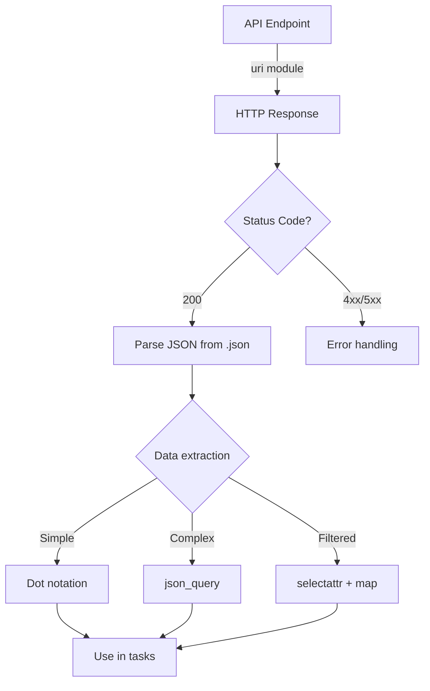

# How to Use Ansible to Process API Response Data

Author: [nawazdhandala](https://www.github.com/nawazdhandala)

Tags: Ansible, API, Data Processing, REST

Description: Learn how to use Ansible to call REST APIs, parse JSON responses, extract data, handle pagination, and process API data for infrastructure automation.

---

APIs are the backbone of modern infrastructure. Cloud providers, monitoring tools, CI/CD systems, and internal services all expose REST APIs. Ansible can call these APIs, parse the responses, and use the data to drive automation decisions. This post walks through the practical patterns for API data processing in Ansible.

## Making API Calls with the uri Module

The `uri` module is Ansible's HTTP client. It handles request methods, headers, authentication, and automatic JSON parsing:

```yaml
# playbook-basic-api.yml
# Makes a GET request to a REST API and displays the parsed response
- name: Basic API call
  hosts: localhost
  gather_facts: false

  tasks:
    - name: Call GitHub API
      ansible.builtin.uri:
        url: "https://api.github.com/repos/ansible/ansible"
        method: GET
        return_content: true
        headers:
          Accept: application/json
          User-Agent: Ansible-Playbook
      register: github_response

    - name: Show response status
      ansible.builtin.debug:
        msg: "Status: {{ github_response.status }}, Content-Type: {{ github_response.content_type }}"

    - name: Access parsed JSON data
      ansible.builtin.debug:
        msg:
          name: "{{ github_response.json.full_name }}"
          stars: "{{ github_response.json.stargazers_count }}"
          language: "{{ github_response.json.language }}"
```

## Handling API Authentication

```yaml
# playbook-api-auth.yml
# Demonstrates different API authentication methods
- name: API calls with authentication
  hosts: localhost
  gather_facts: false
  vars:
    api_token: "{{ lookup('env', 'API_TOKEN') }}"

  tasks:
    - name: Bearer token authentication
      ansible.builtin.uri:
        url: "https://api.example.com/v1/servers"
        method: GET
        headers:
          Authorization: "Bearer {{ api_token }}"
      register: servers_response

    - name: Basic authentication
      ansible.builtin.uri:
        url: "https://api.example.com/v1/status"
        method: GET
        url_username: admin
        url_password: "{{ lookup('env', 'API_PASSWORD') }}"
        force_basic_auth: true
      register: status_response
```

## Extracting Data from Responses

API responses are often deeply nested. Here is how to extract what you need:

```yaml
# playbook-extract-api.yml
# Extracts specific fields from a complex API response structure
- name: Extract data from API responses
  hosts: localhost
  gather_facts: false
  vars:
    simulated_response:
      data:
        servers:
          - id: srv-001
            name: web-01
            status: running
            ip_addresses:
              public: 54.23.10.5
              private: 10.0.1.10
            tags:
              environment: production
              team: platform
          - id: srv-002
            name: web-02
            status: running
            ip_addresses:
              public: 54.23.10.6
              private: 10.0.1.11
            tags:
              environment: production
              team: platform
          - id: srv-003
            name: staging-01
            status: stopped
            ip_addresses:
              private: 10.0.2.10
            tags:
              environment: staging
              team: platform
        pagination:
          page: 1
          total_pages: 3
          total_items: 25

  tasks:
    - name: Get all server names
      ansible.builtin.debug:
        msg: "{{ simulated_response.data.servers | map(attribute='name') | list }}"

    - name: Get running server IPs
      ansible.builtin.set_fact:
        running_ips: >-
          {{ simulated_response.data.servers |
             selectattr('status', 'equalto', 'running') |
             map(attribute='ip_addresses') |
             map(attribute='private') | list }}

    - name: Get production servers using json_query
      ansible.builtin.debug:
        msg: "{{ simulated_response | json_query(\"data.servers[?tags.environment=='production'].name\") }}"
```

## API Processing Flow



## Handling Paginated APIs

Many APIs return data in pages. You need to loop through all pages:

```yaml
# playbook-pagination.yml
# Handles a paginated API by fetching all pages until no more data remains
- name: Handle paginated API
  hosts: localhost
  gather_facts: false
  vars:
    api_base_url: "https://api.example.com/v1/servers"
    all_servers: []

  tasks:
    - name: Fetch all pages of server data
      ansible.builtin.uri:
        url: "{{ api_base_url }}?page={{ item }}&per_page=50"
        method: GET
        headers:
          Authorization: "Bearer {{ lookup('env', 'API_TOKEN') }}"
      register: page_responses
      loop: "{{ range(1, 6) | list }}"
      until: page_responses.json.data | length == 0
      retries: 5

    - name: Combine all page results
      ansible.builtin.set_fact:
        all_servers: "{{ page_responses.results | map(attribute='json') | map(attribute='data') | flatten | list }}"

    - name: Show total servers collected
      ansible.builtin.debug:
        msg: "Collected {{ all_servers | length }} servers across all pages"
```

## Processing and Transforming API Data

Transform API data into a format suitable for Ansible tasks:

```yaml
# playbook-transform-api.yml
# Transforms raw API response into a clean inventory structure
- name: Transform API data for Ansible use
  hosts: localhost
  gather_facts: false
  vars:
    api_data:
      instances:
        - InstanceId: i-abc123
          InstanceType: t3.medium
          State:
            Name: running
          Tags:
            - Key: Name
              Value: web-01
            - Key: Environment
              Value: production
          PrivateIpAddress: 10.0.1.10
        - InstanceId: i-def456
          InstanceType: r5.large
          State:
            Name: running
          Tags:
            - Key: Name
              Value: db-01
            - Key: Environment
              Value: production
          PrivateIpAddress: 10.0.2.10

  tasks:
    - name: Transform into clean inventory format
      ansible.builtin.set_fact:
        inventory: >-
          
          
          
          
          
          
          {{ result }}

    - name: Show clean inventory
      ansible.builtin.debug:
        var: inventory
```

## Making POST Requests with Data

```yaml
# playbook-post-api.yml
# Sends a POST request to create a resource and processes the response
- name: POST data to API
  hosts: localhost
  gather_facts: false

  tasks:
    - name: Create a new resource via API
      ansible.builtin.uri:
        url: "https://api.example.com/v1/dns-records"
        method: POST
        headers:
          Authorization: "Bearer {{ lookup('env', 'API_TOKEN') }}"
          Content-Type: application/json
        body_format: json
        body:
          type: A
          name: "app.example.com"
          content: "93.184.216.34"
          ttl: 3600
        status_code: [200, 201]
      register: create_response

    - name: Show created resource
      ansible.builtin.debug:
        msg: "Created record ID: {{ create_response.json.result.id }}"
```

## Error Handling for API Calls

```yaml
# playbook-api-error-handling.yml
# Handles API errors gracefully with retries and fallback behavior
- name: Robust API error handling
  hosts: localhost
  gather_facts: false

  tasks:
    - name: API call with retry and error handling
      block:
        - name: Call potentially unreliable API
          ansible.builtin.uri:
            url: "https://api.example.com/v1/health"
            method: GET
            timeout: 10
            status_code: 200
          register: health_check
          retries: 3
          delay: 5
          until: health_check.status == 200

        - name: Process successful response
          ansible.builtin.debug:
            msg: "API is healthy: {{ health_check.json }}"

      rescue:
        - name: Handle API failure
          ansible.builtin.debug:
            msg: "API health check failed after retries"

        - name: Send alert
          ansible.builtin.uri:
            url: "https://hooks.slack.com/services/xxx"
            method: POST
            body_format: json
            body:
              text: "API health check failed on {{ inventory_hostname }}"
```

## Practical Example: Cloud Resource Inventory

```yaml
# playbook-cloud-inventory.yml
# Builds a complete cloud inventory by calling multiple API endpoints
- name: Build inventory from cloud API
  hosts: localhost
  gather_facts: false
  vars:
    api_base: "https://api.cloudprovider.com/v2"
    api_token: "{{ lookup('env', 'CLOUD_API_TOKEN') }}"

  tasks:
    - name: Fetch all droplets
      ansible.builtin.uri:
        url: "{{ api_base }}/droplets?per_page=200"
        headers:
          Authorization: "Bearer {{ api_token }}"
      register: droplets_response

    - name: Fetch all load balancers
      ansible.builtin.uri:
        url: "{{ api_base }}/load_balancers"
        headers:
          Authorization: "Bearer {{ api_token }}"
      register: lb_response

    - name: Build structured inventory
      ansible.builtin.set_fact:
        cloud_inventory:
          servers: "{{ droplets_response.json.droplets | map(attribute='name') | list }}"
          load_balancers: "{{ lb_response.json.load_balancers | map(attribute='name') | list }}"
          total_resources: >-
            {{ droplets_response.json.droplets | length +
               lb_response.json.load_balancers | length }}

    - name: Generate inventory report
      ansible.builtin.copy:
        content: "{{ cloud_inventory | to_nice_yaml(indent=2) }}"
        dest: /tmp/cloud_inventory.yml
```

## Summary

Ansible's `uri` module combined with its data manipulation filters makes it a capable tool for API data processing. Use `uri` with appropriate authentication headers for API calls, access the automatic JSON parsing via `.json`, and extract data with `map`, `selectattr`, `json_query`, or Jinja2 expressions. Handle pagination by looping through pages and flattening results. Always implement retry logic and error handling for external API calls, since network issues and rate limiting are facts of life. Transform API data into clean structures before using it in downstream tasks to keep your playbooks readable.
