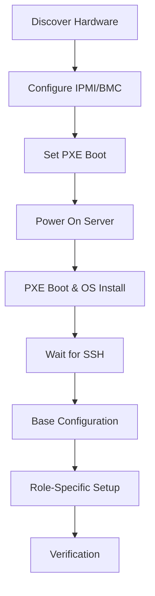

# How to Use Ansible to Provision Bare Metal Servers

Author: [nawazdhandala](https://www.github.com/nawazdhandala)

Tags: Ansible, Bare Metal, Server Provisioning, Data Center, Automation

Description: Learn how to automate bare metal server provisioning with Ansible from PXE boot and IPMI management to full OS configuration.

---

Bare metal servers are the foundation of many production environments, and provisioning them has traditionally been a manual, time-consuming process. You rack the server, connect the cables, configure the BIOS, boot from PXE, install the OS, and then spend another hour configuring everything. Ansible can automate most of this workflow, turning a multi-hour process into something that runs with a single command.

This guide covers automating bare metal provisioning with Ansible, including IPMI management, PXE boot orchestration, OS installation, and post-install configuration.

## The Bare Metal Provisioning Pipeline



## Prerequisites

For bare metal automation, you need:

- Ansible 2.12+ on your control node
- Network access to the servers' IPMI/BMC interfaces
- A PXE boot infrastructure (DHCP + TFTP + HTTP)
- Python `pyghmi` library for IPMI commands
- The `community.general` collection

```bash
# Install required collections and libraries
ansible-galaxy collection install community.general
pip install pyghmi
```

## Inventory for Bare Metal

Bare metal inventory is more detailed than cloud inventory because you need both management (IPMI) and production network addresses.

```yaml
# inventory/bare-metal.yml
---
all:
  children:
    bare_metal:
      hosts:
        server-01:
          ansible_host: 10.10.1.11
          ipmi_address: 10.10.0.11
          ipmi_user: admin
          ipmi_password: "{{ vault_ipmi_password }}"
          mac_address: "aa:bb:cc:dd:ee:01"
          role: compute
        server-02:
          ansible_host: 10.10.1.12
          ipmi_address: 10.10.0.12
          ipmi_user: admin
          ipmi_password: "{{ vault_ipmi_password }}"
          mac_address: "aa:bb:cc:dd:ee:02"
          role: compute
        server-03:
          ansible_host: 10.10.1.13
          ipmi_address: 10.10.0.13
          ipmi_user: admin
          ipmi_password: "{{ vault_ipmi_password }}"
          mac_address: "aa:bb:cc:dd:ee:03"
          role: storage
      vars:
        ansible_user: root
        ansible_ssh_private_key_file: ~/.ssh/deploy
```

## Managing IPMI/BMC

IPMI gives you out-of-band management: power control, console access, and boot device selection. Ansible can drive IPMI commands using the `community.general.ipmi_power` and raw command modules.

```yaml
# playbooks/ipmi-management.yml
---
- name: Manage bare metal servers via IPMI
  hosts: bare_metal
  gather_facts: false
  connection: local

  tasks:
    # Check current power state
    - name: Check server power status
      community.general.ipmi_power:
        name: "{{ ipmi_address }}"
        user: "{{ ipmi_user }}"
        password: "{{ ipmi_password }}"
        state: status
      register: power_status

    - name: Display power status
      ansible.builtin.debug:
        msg: "{{ inventory_hostname }}: {{ power_status.powerstate }}"

    # Power on servers that are off
    - name: Power on server
      community.general.ipmi_power:
        name: "{{ ipmi_address }}"
        user: "{{ ipmi_user }}"
        password: "{{ ipmi_password }}"
        state: on
      when: power_status.powerstate != "on"
```

## Setting PXE Boot

Before triggering OS installation, set the boot device to PXE.

```yaml
# playbooks/set-pxe-boot.yml
---
- name: Configure PXE boot on bare metal servers
  hosts: bare_metal
  gather_facts: false
  connection: local

  tasks:
    # Set next boot to PXE using ipmitool
    - name: Set boot device to PXE for next boot
      ansible.builtin.command:
        cmd: >
          ipmitool -I lanplus
          -H {{ ipmi_address }}
          -U {{ ipmi_user }}
          -P {{ ipmi_password }}
          chassis bootdev pxe options=efiboot
      delegate_to: localhost
      changed_when: true

    # Power cycle the server to trigger PXE boot
    - name: Power cycle server
      community.general.ipmi_power:
        name: "{{ ipmi_address }}"
        user: "{{ ipmi_user }}"
        password: "{{ ipmi_password }}"
        state: reset
```

## PXE Server Configuration

Configure your PXE boot infrastructure with Ansible. This playbook sets up dnsmasq as the DHCP/TFTP server and nginx for HTTP file serving.

```yaml
# playbooks/setup-pxe-server.yml
---
- name: Configure PXE boot server
  hosts: pxe_server
  become: true

  vars:
    tftp_root: /srv/tftp
    http_root: /srv/http/install

  tasks:
    # Install required packages
    - name: Install PXE server packages
      ansible.builtin.apt:
        name:
          - dnsmasq
          - nginx
          - syslinux-efi
        state: present

    # Configure dnsmasq for DHCP and TFTP
    - name: Configure dnsmasq
      ansible.builtin.copy:
        dest: /etc/dnsmasq.d/pxe.conf
        content: |
          # DHCP range for provisioning network
          dhcp-range=10.10.1.100,10.10.1.200,255.255.255.0,1h

          # TFTP settings
          enable-tftp
          tftp-root={{ tftp_root }}

          # PXE boot file for UEFI clients
          dhcp-match=set:efi-x86_64,option:client-arch,7
          dhcp-boot=tag:efi-x86_64,grubx64.efi

          # Static DHCP assignments for known servers
          dhcp-host=aa:bb:cc:dd:ee:01,10.10.1.11,server-01
          dhcp-host=aa:bb:cc:dd:ee:02,10.10.1.12,server-02
          dhcp-host=aa:bb:cc:dd:ee:03,10.10.1.13,server-03
        mode: '0644'
      notify: restart dnsmasq

    # Set up GRUB configuration for automated install
    - name: Create GRUB config directory
      ansible.builtin.file:
        path: "{{ tftp_root }}/grub"
        state: directory
        mode: '0755'

    - name: Create GRUB configuration
      ansible.builtin.copy:
        dest: "{{ tftp_root }}/grub/grub.cfg"
        content: |
          set timeout=5
          menuentry "Ubuntu 22.04 Automated Install" {
              linux /vmlinuz ip=dhcp autoinstall ds=nocloud-net;s=http://10.10.0.1/install/
              initrd /initrd
          }
        mode: '0644'

  handlers:
    - name: restart dnsmasq
      ansible.builtin.service:
        name: dnsmasq
        state: restarted
```

## Autoinstall Configuration

For Ubuntu, create an autoinstall (cloud-init) configuration. For RHEL-based systems, you would use a Kickstart file instead.

```yaml
# playbooks/generate-autoinstall.yml
---
- name: Generate autoinstall configs for each server
  hosts: pxe_server
  become: true

  vars:
    servers:
      - hostname: server-01
        ip: 10.10.1.11
        gateway: 10.10.1.1
        disk: /dev/sda
      - hostname: server-02
        ip: 10.10.1.12
        gateway: 10.10.1.1
        disk: /dev/sda
      - hostname: server-03
        ip: 10.10.1.13
        gateway: 10.10.1.1
        disk: /dev/sda

  tasks:
    # Create autoinstall directory structure
    - name: Create autoinstall directories
      ansible.builtin.file:
        path: "/srv/http/install/{{ item.hostname }}"
        state: directory
        mode: '0755'
      loop: "{{ servers }}"

    # Generate autoinstall configs
    - name: Generate autoinstall user-data
      ansible.builtin.copy:
        dest: "/srv/http/install/{{ item.hostname }}/user-data"
        content: |
          #cloud-config
          autoinstall:
            version: 1
            identity:
              hostname: {{ item.hostname }}
              password: "$6$rounds=4096$salt$hashedpassword"
              username: deploy
            ssh:
              install-server: true
              authorized-keys:
                - {{ lookup('file', '~/.ssh/deploy.pub') }}
            storage:
              layout:
                name: lvm
                sizing-policy: all
            network:
              version: 2
              ethernets:
                ens3:
                  addresses:
                    - {{ item.ip }}/24
                  gateway4: {{ item.gateway }}
                  nameservers:
                    addresses: [10.10.0.53, 10.10.0.54]
            packages:
              - openssh-server
              - python3
              - python3-apt
            late-commands:
              - echo "{{ item.hostname }}" > /target/etc/hostname
        mode: '0644'
      loop: "{{ servers }}"
```

## Waiting for OS Installation

After PXE booting, the OS installation takes several minutes. Ansible needs to wait.

```yaml
# playbooks/wait-for-install.yml
---
- name: Wait for bare metal OS installation to complete
  hosts: bare_metal
  gather_facts: false
  connection: local

  tasks:
    # Wait for SSH to become available after OS install
    - name: Wait for SSH port to open
      ansible.builtin.wait_for:
        host: "{{ ansible_host }}"
        port: 22
        state: started
        timeout: 1800
        delay: 120
      delegate_to: localhost

    # Verify we can actually connect
    - name: Wait for SSH connection to work
      ansible.builtin.wait_for_connection:
        delay: 10
        timeout: 300
```

## Post-Install Configuration

Once the OS is installed, apply base configuration.

```yaml
# playbooks/post-install.yml
---
- name: Post-installation configuration
  hosts: bare_metal
  become: true
  gather_facts: true

  tasks:
    - name: Update all packages
      ansible.builtin.apt:
        upgrade: dist
        update_cache: true

    - name: Install essential packages
      ansible.builtin.apt:
        name:
          - vim
          - htop
          - iotop
          - sysstat
          - net-tools
          - lvm2
          - mdadm
          - smartmontools
          - ntp
          - fail2ban
        state: present

    # Configure storage for additional disks
    - name: Create volume group for data disks
      community.general.lvg:
        vg: data-vg
        pvs:
          - /dev/sdb
          - /dev/sdc
      when: "'storage' in role"

    - name: Create logical volume for data
      community.general.lvol:
        vg: data-vg
        lv: data-lv
        size: 100%FREE
      when: "'storage' in role"

    - name: Create filesystem on data LV
      community.general.filesystem:
        fstype: xfs
        dev: /dev/data-vg/data-lv
      when: "'storage' in role"

    - name: Mount data volume
      ansible.posix.mount:
        path: /data
        src: /dev/data-vg/data-lv
        fstype: xfs
        opts: noatime,nodiratime
        state: mounted
      when: "'storage' in role"

    # Configure SMART monitoring
    - name: Enable SMART on all drives
      ansible.builtin.command:
        cmd: "smartctl -s on {{ item }}"
      loop:
        - /dev/sda
        - /dev/sdb
      changed_when: true
      failed_when: false
```

## Full Orchestration Playbook

Tie everything together into a single orchestration workflow.

```yaml
# playbooks/provision-bare-metal.yml
---
- name: Set PXE boot and power cycle
  ansible.builtin.import_playbook: set-pxe-boot.yml

- name: Wait for OS installation
  ansible.builtin.import_playbook: wait-for-install.yml

- name: Post-installation configuration
  ansible.builtin.import_playbook: post-install.yml
```

## Tips for Bare Metal Automation

1. **IPMI networks should be isolated.** Never put BMC interfaces on your production network. They run old firmware with known vulnerabilities.
2. **Test your autoinstall configs thoroughly.** A typo in the disk layout section can wipe the wrong drive. Test on a single server before rolling out to the fleet.
3. **Set BIOS settings with Ansible where possible.** Some vendors (Dell with racadm, HP with iLO REST) support BIOS configuration through their management interfaces.
4. **Keep a hardware inventory database.** Track serial numbers, MAC addresses, IPMI addresses, and physical locations. This becomes your Ansible inventory source.
5. **Budget extra time.** Bare metal provisioning is slower than cloud. OS installs take 10-30 minutes, and firmware updates can require multiple reboots. Set your timeouts accordingly.

Automating bare metal provisioning with Ansible takes more upfront effort than cloud provisioning, but the payoff is significant. Once your PXE infrastructure and playbooks are in place, adding a new server to your fleet is as simple as racking it and running a playbook.
