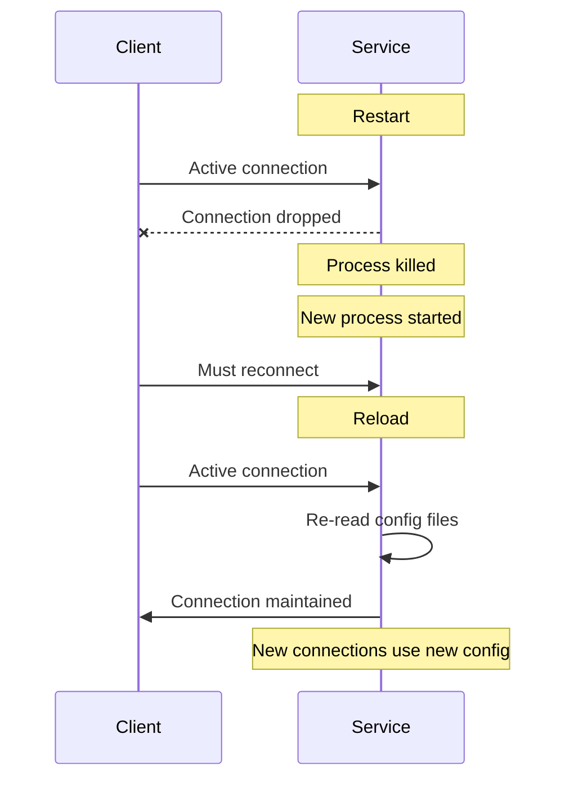

# How to Use Ansible to Reload Service Configuration Without Restart

Author: [nawazdhandala](https://www.github.com/nawazdhandala)

Tags: Ansible, Service Management, Configuration, Linux

Description: Learn how to reload service configurations without full restarts using Ansible, preserving active connections and minimizing downtime.

---

There is an important difference between restarting a service and reloading it. A restart kills the process and starts a new one, dropping all active connections. A reload tells the running process to re-read its configuration files without stopping. For production services handling live traffic, this difference matters a lot. Ansible gives you several ways to reload service configurations cleanly.

## Restart vs Reload

Here is what happens during each operation:



A reload is always preferred when the service supports it. Not all services do, and not all configuration changes can be applied via reload.

## Using the systemd Module to Reload

The `ansible.builtin.systemd` module supports `state: reloaded` directly.

Reload a service configuration:

```yaml
---
- name: Reload service configuration
  hosts: web_servers
  become: yes
  tasks:
    - name: Update Nginx server block
      ansible.builtin.template:
        src: mysite.conf.j2
        dest: /etc/nginx/sites-available/mysite.conf
      notify: Reload Nginx

  handlers:
    - name: Reload Nginx
      ansible.builtin.systemd:
        name: nginx
        state: reloaded
```

When you set `state: reloaded`, Ansible runs `systemctl reload nginx`, which sends a signal (usually SIGHUP) to the master process. Nginx then reads the new config and applies it to new connections while keeping existing ones alive.

## Understanding ExecReload

The reload behavior is defined by the `ExecReload` directive in the service's unit file. Different services implement it differently.

Check what reload does for a specific service:

```yaml
- name: Show how reload is implemented
  ansible.builtin.command: "systemctl show {{ item }} --property=ExecReload"
  register: reload_cmd
  loop:
    - nginx
    - apache2
    - postgresql
    - sshd
  changed_when: false

- name: Display reload commands
  ansible.builtin.debug:
    msg: "{{ item.item }}: {{ item.stdout }}"
  loop: "{{ reload_cmd.results }}"
  loop_control:
    label: "{{ item.item }}"
```

For Nginx, `ExecReload` typically sends `SIGHUP` to the master process. For PostgreSQL, it runs `pg_ctl reload`. For Apache, it sends `SIGWINCH` or `SIGUSR1` depending on the configuration.

## Validating Config Before Reload

Always validate the configuration before reloading. If you reload with a broken config, some services will continue running with the old config (Nginx), while others might crash (depending on implementation).

Validate configuration before applying:

```yaml
tasks:
  - name: Deploy updated Nginx config
    ansible.builtin.template:
      src: nginx.conf.j2
      dest: /etc/nginx/nginx.conf
    register: nginx_config

  - name: Validate Nginx configuration
    ansible.builtin.command: nginx -t
    when: nginx_config.changed
    register: nginx_test
    changed_when: false

  - name: Reload Nginx only if config is valid
    ansible.builtin.systemd:
      name: nginx
      state: reloaded
    when:
      - nginx_config.changed
      - nginx_test.rc == 0
```

An even cleaner approach uses the `validate` parameter of the template module:

```yaml
  - name: Deploy and validate Nginx config in one step
    ansible.builtin.template:
      src: nginx.conf.j2
      dest: /etc/nginx/nginx.conf
      validate: "nginx -t -c %s"
    notify: Reload Nginx
```

The `validate` parameter runs the specified command with `%s` replaced by the temporary file path. If validation fails, the file is not deployed and the handler is not triggered.

## Service-Specific Reload Methods

Different services have different reload capabilities and commands.

### PostgreSQL

```yaml
- name: Update PostgreSQL configuration
  ansible.builtin.template:
    src: postgresql.conf.j2
    dest: /etc/postgresql/15/main/postgresql.conf
  register: pg_config

- name: Reload PostgreSQL (for most settings)
  ansible.builtin.systemd:
    name: postgresql
    state: reloaded
  when: pg_config.changed

# Some PostgreSQL settings require a full restart
- name: Check if restart is needed
  ansible.builtin.command: >
    psql -U postgres -t -c
    "SELECT count(*) FROM pg_settings WHERE pending_restart = true"
  register: pending_restart
  changed_when: false
  when: pg_config.changed

- name: Restart PostgreSQL if required
  ansible.builtin.systemd:
    name: postgresql
    state: restarted
  when:
    - pg_config.changed
    - pending_restart.stdout | trim | int > 0
```

### HAProxy

```yaml
- name: Update HAProxy configuration
  ansible.builtin.template:
    src: haproxy.cfg.j2
    dest: /etc/haproxy/haproxy.cfg
    validate: "haproxy -c -f %s"
  notify: Reload HAProxy

handlers:
  - name: Reload HAProxy
    ansible.builtin.systemd:
      name: haproxy
      state: reloaded
```

### Apache

```yaml
- name: Deploy Apache vhost
  ansible.builtin.template:
    src: vhost.conf.j2
    dest: /etc/apache2/sites-available/mysite.conf
  notify: Reload Apache

handlers:
  - name: Reload Apache
    ansible.builtin.systemd:
      name: apache2
      state: reloaded
```

## Sending Signals Directly

Some services respond to specific Unix signals for different reload behaviors. You can send these through Ansible.

Send a specific signal to reload a service:

```yaml
# Send SIGHUP to reload configuration
- name: Reload via SIGHUP
  ansible.builtin.command: "kill -HUP $(systemctl show {{ service_name }} --property=MainPID --value)"
  when: config_changed

# Send SIGUSR1 to reopen log files (useful after log rotation)
- name: Reopen log files
  ansible.builtin.command: "kill -USR1 $(systemctl show nginx --property=MainPID --value)"
```

## The reload-or-restart Pattern

systemd also supports `reload-or-restart`, which tries reload first and falls back to restart. Ansible does not have this as a direct state value, but you can implement it.

Implement reload-or-restart logic:

```yaml
- name: Try to reload the service
  ansible.builtin.command: "systemctl reload-or-restart {{ service_name }}"
  when: config_changed
```

Or with more control:

```yaml
- name: Try reload first
  ansible.builtin.systemd:
    name: "{{ service_name }}"
    state: reloaded
  register: reload_result
  ignore_errors: yes

- name: Fall back to restart if reload failed
  ansible.builtin.systemd:
    name: "{{ service_name }}"
    state: restarted
  when: reload_result is failed
```

## Handler Pattern: Reload vs Restart Decision

Use different handlers for different config files based on whether they need a reload or restart.

Smart handler selection based on what changed:

```yaml
tasks:
  # This change can be picked up with a reload
  - name: Update virtual host config
    ansible.builtin.template:
      src: vhost.conf.j2
      dest: /etc/nginx/sites-available/mysite.conf
    notify: Reload Nginx

  # This change requires a full restart
  - name: Update worker_processes setting
    ansible.builtin.lineinfile:
      path: /etc/nginx/nginx.conf
      regexp: "^worker_processes"
      line: "worker_processes {{ nginx_workers }};"
    notify: Restart Nginx

handlers:
  # Reload is defined first so it runs first if both are triggered
  - name: Reload Nginx
    ansible.builtin.systemd:
      name: nginx
      state: reloaded

  # If restart is also triggered, it runs after reload
  # (which makes the reload redundant, but that is fine)
  - name: Restart Nginx
    ansible.builtin.systemd:
      name: nginx
      state: restarted
```

## Verifying Reload Was Successful

After a reload, verify the new configuration is active.

Verify the reload took effect:

```yaml
- name: Update Nginx upstream config
  ansible.builtin.template:
    src: upstream.conf.j2
    dest: /etc/nginx/conf.d/upstream.conf
  register: upstream_changed

- name: Reload Nginx
  ansible.builtin.systemd:
    name: nginx
    state: reloaded
  when: upstream_changed.changed

- name: Verify new config is active
  ansible.builtin.command: "nginx -T"
  register: nginx_config_dump
  changed_when: false

- name: Check that new upstream is in the active config
  ansible.builtin.assert:
    that:
      - "'new-backend-server' in nginx_config_dump.stdout"
    fail_msg: "New upstream configuration was not picked up after reload"
```

## Services That Cannot Reload

Some services do not support reload at all. You need to know which ones require a full restart.

Common services and their reload support:

| Service | Reload Support | Notes |
|---------|---------------|-------|
| Nginx | Yes | Graceful, no connection drops |
| Apache | Yes | Graceful restart via SIGWINCH |
| PostgreSQL | Partial | Some settings need restart |
| MySQL | Partial | Some settings need restart |
| Redis | Limited | Only some settings reloadable |
| SSH | Yes | Does not affect existing connections |
| Docker | No | Must restart for daemon config |
| systemd-journald | Yes | Picks up journald.conf changes |

## Summary

Reload is always better than restart when the service supports it. Use Ansible's `state: reloaded` for services that handle it cleanly. Always validate configuration before reloading to avoid loading broken configs. For services with mixed reloadable and non-reloadable settings (like PostgreSQL), implement logic to determine which operation is needed. And always verify after a reload that the new configuration is actually active. The goal is zero-downtime configuration management, and proper use of reload gets you most of the way there.
