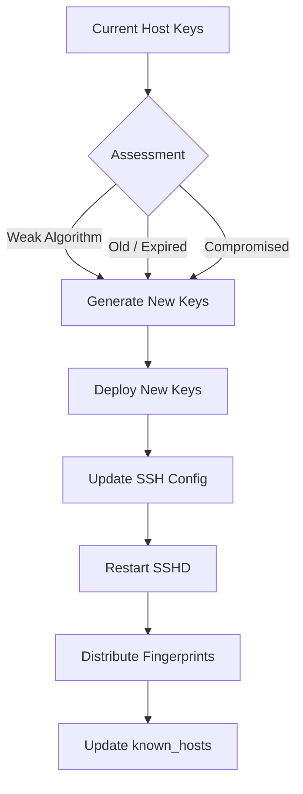

# How to Use Ansible to Rotate SSH Host Keys

Author: [nawazdhandala](https://www.github.com/nawazdhandala)

Tags: Ansible, SSH, Key Rotation, Security, Linux

Description: Automate SSH host key rotation across your server fleet using Ansible to maintain strong cryptographic security and meet compliance requirements.

---

SSH host keys are what your servers use to prove their identity to clients. When you connect to a server for the first time and see that "fingerprint" prompt, you are verifying the server's host key. These keys should be rotated periodically for several reasons: compliance requirements often mandate it, old keys may use weak algorithms (like DSA or short RSA keys), and if a key is ever compromised, rotation limits the exposure window.

Doing this manually is risky. Generate a new key, update the SSH config, restart the daemon, update every known_hosts file that references the old key... it adds up fast. Ansible makes this process safe and repeatable.

## Why Rotate SSH Host Keys?

There are several good reasons to rotate SSH host keys:

- Moving away from weak key types (DSA, 1024-bit RSA)
- Compliance frameworks require periodic rotation
- After a suspected server compromise
- When moving to newer, stronger algorithms (Ed25519)
- Cleaning up keys from old OS installations



## Auditing Current Host Keys

Before rotating, check what keys your servers currently have.

This playbook collects host key information from all servers:

```yaml
# audit_host_keys.yml - Audit current SSH host keys
---
- name: Audit SSH host keys
  hosts: all
  become: true

  tasks:
    - name: Find all host key files
      ansible.builtin.find:
        paths: /etc/ssh
        patterns: "ssh_host_*_key.pub"
      register: host_key_files

    - name: Get key details
      ansible.builtin.command: "ssh-keygen -l -f {{ item.path }}"
      loop: "{{ host_key_files.files }}"
      register: key_details
      changed_when: false

    - name: Display key information
      ansible.builtin.debug:
        msg: "{{ item.stdout }}"
      loop: "{{ key_details.results }}"

    - name: Check for weak DSA keys
      ansible.builtin.stat:
        path: /etc/ssh/ssh_host_dsa_key
      register: dsa_key

    - name: Warn about DSA keys
      ansible.builtin.debug:
        msg: "WARNING: DSA host key found on {{ inventory_hostname }}. DSA keys should be removed."
      when: dsa_key.stat.exists

    - name: Check RSA key size
      ansible.builtin.shell: ssh-keygen -l -f /etc/ssh/ssh_host_rsa_key.pub | awk '{print $1}'
      register: rsa_key_size
      changed_when: false
      failed_when: false

    - name: Warn about weak RSA keys
      ansible.builtin.debug:
        msg: "WARNING: RSA key on {{ inventory_hostname }} is {{ rsa_key_size.stdout }} bits. Should be at least 4096."
      when: rsa_key_size.stdout | int < 4096
```

## Generating New Host Keys

This is the core operation. Generate new, strong host keys to replace the old ones.

This playbook generates new Ed25519 and RSA host keys:

```yaml
# rotate_host_keys.yml - Generate and deploy new SSH host keys
---
- name: Rotate SSH host keys
  hosts: all
  become: true
  serial: "10%"  # Process 10% of hosts at a time for safety

  vars:
    ssh_key_types:
      - type: ed25519
        file: /etc/ssh/ssh_host_ed25519_key
      - type: rsa
        bits: 4096
        file: /etc/ssh/ssh_host_rsa_key
      - type: ecdsa
        bits: 521
        file: /etc/ssh/ssh_host_ecdsa_key
    remove_dsa_keys: true
    remove_old_keys: true
    backup_old_keys: true

  tasks:
    - name: Create backup directory for old keys
      ansible.builtin.file:
        path: /etc/ssh/old_keys/{{ ansible_date_time.date }}
        state: directory
        owner: root
        group: root
        mode: '0700'
      when: backup_old_keys

    - name: Backup existing host keys
      ansible.builtin.copy:
        src: "{{ item.file }}"
        dest: "/etc/ssh/old_keys/{{ ansible_date_time.date }}/{{ item.file | basename }}"
        remote_src: true
        mode: '0600'
      loop: "{{ ssh_key_types }}"
      when: backup_old_keys
      failed_when: false

    - name: Backup existing public keys
      ansible.builtin.copy:
        src: "{{ item.file }}.pub"
        dest: "/etc/ssh/old_keys/{{ ansible_date_time.date }}/{{ item.file | basename }}.pub"
        remote_src: true
        mode: '0644'
      loop: "{{ ssh_key_types }}"
      when: backup_old_keys
      failed_when: false

    - name: Remove existing host keys
      ansible.builtin.file:
        path: "{{ item }}"
        state: absent
      loop: "{{ ssh_key_types | map(attribute='file') | list + ssh_key_types | map(attribute='file') | map('regex_replace', '$', '.pub') | list }}"
      when: remove_old_keys

    - name: Remove DSA keys
      ansible.builtin.file:
        path: "{{ item }}"
        state: absent
      loop:
        - /etc/ssh/ssh_host_dsa_key
        - /etc/ssh/ssh_host_dsa_key.pub
      when: remove_dsa_keys

    - name: Generate new Ed25519 host key
      ansible.builtin.command: >
        ssh-keygen -t ed25519 -f /etc/ssh/ssh_host_ed25519_key -N "" -q
      args:
        creates: /etc/ssh/ssh_host_ed25519_key

    - name: Generate new RSA host key
      ansible.builtin.command: >
        ssh-keygen -t rsa -b 4096 -f /etc/ssh/ssh_host_rsa_key -N "" -q
      args:
        creates: /etc/ssh/ssh_host_rsa_key

    - name: Generate new ECDSA host key
      ansible.builtin.command: >
        ssh-keygen -t ecdsa -b 521 -f /etc/ssh/ssh_host_ecdsa_key -N "" -q
      args:
        creates: /etc/ssh/ssh_host_ecdsa_key

    - name: Set correct permissions on private keys
      ansible.builtin.file:
        path: "{{ item.file }}"
        owner: root
        group: root
        mode: '0600'
      loop: "{{ ssh_key_types }}"

    - name: Set correct permissions on public keys
      ansible.builtin.file:
        path: "{{ item.file }}.pub"
        owner: root
        group: root
        mode: '0644'
      loop: "{{ ssh_key_types }}"

    - name: Restart SSH daemon
      ansible.builtin.service:
        name: sshd
        state: restarted
```

## Updating SSH Server Configuration

After generating new keys, ensure the SSH server configuration only references the key types you want.

This playbook configures sshd to use only strong host key algorithms:

```yaml
# configure_sshd_keys.yml - Configure SSH to use strong host keys only
---
- name: Configure SSH host key settings
  hosts: all
  become: true

  tasks:
    - name: Configure host key files in sshd_config
      ansible.builtin.blockinfile:
        path: /etc/ssh/sshd_config
        block: |
          # Host key configuration - Managed by Ansible
          HostKey /etc/ssh/ssh_host_ed25519_key
          HostKey /etc/ssh/ssh_host_rsa_key
          HostKey /etc/ssh/ssh_host_ecdsa_key
        marker: "# {mark} ANSIBLE MANAGED HOST KEYS"
      notify: restart sshd

    - name: Configure host key algorithms (prefer Ed25519)
      ansible.builtin.lineinfile:
        path: /etc/ssh/sshd_config
        regexp: "^#?HostKeyAlgorithms"
        line: "HostKeyAlgorithms ssh-ed25519,ssh-ed25519-cert-v01@openssh.com,rsa-sha2-512,rsa-sha2-256,ecdsa-sha2-nistp521"
      notify: restart sshd

    - name: Remove DSA host key references
      ansible.builtin.lineinfile:
        path: /etc/ssh/sshd_config
        regexp: ".*ssh_host_dsa_key"
        state: absent
      notify: restart sshd

    - name: Validate sshd config
      ansible.builtin.command: sshd -t
      changed_when: false

  handlers:
    - name: restart sshd
      ansible.builtin.service:
        name: sshd
        state: restarted
```

## Collecting and Distributing New Fingerprints

After rotation, you need to distribute the new fingerprints so users can verify them.

This playbook collects fingerprints and generates a report:

```yaml
# collect_fingerprints.yml - Gather new host key fingerprints
---
- name: Collect host key fingerprints
  hosts: all
  become: true

  tasks:
    - name: Get Ed25519 fingerprint
      ansible.builtin.command: ssh-keygen -l -f /etc/ssh/ssh_host_ed25519_key.pub
      register: ed25519_fp
      changed_when: false

    - name: Get RSA fingerprint
      ansible.builtin.command: ssh-keygen -l -f /etc/ssh/ssh_host_rsa_key.pub
      register: rsa_fp
      changed_when: false

    - name: Collect fingerprints
      ansible.builtin.set_fact:
        host_fingerprints:
          hostname: "{{ inventory_hostname }}"
          ip: "{{ ansible_default_ipv4.address }}"
          ed25519: "{{ ed25519_fp.stdout }}"
          rsa: "{{ rsa_fp.stdout }}"

    - name: Save fingerprint report locally
      ansible.builtin.copy:
        content: |
          # SSH Host Key Fingerprints - Generated {{ ansible_date_time.iso8601 }}
          Host: {{ inventory_hostname }} ({{ ansible_default_ipv4.address }})
          Ed25519: {{ ed25519_fp.stdout }}
          RSA:     {{ rsa_fp.stdout }}
        dest: /etc/ssh/fingerprints.txt
        mode: '0644'

    - name: Fetch fingerprints to controller
      ansible.builtin.fetch:
        src: /etc/ssh/fingerprints.txt
        dest: "./fingerprints/{{ inventory_hostname }}.txt"
        flat: true
```

## Updating known_hosts Files

The trickiest part of key rotation is updating `known_hosts` files on all machines that connect to the rotated servers.

This playbook updates known_hosts across your fleet:

```yaml
# update_known_hosts.yml - Update known_hosts after key rotation
---
- name: Update known_hosts on all hosts
  hosts: all
  become: true

  vars:
    rotated_hosts:
      - name: web01
        ip: 10.0.1.10
      - name: web02
        ip: 10.0.1.11

  tasks:
    - name: Remove old host keys from system known_hosts
      ansible.builtin.known_hosts:
        name: "{{ item.name }}"
        state: absent
        path: /etc/ssh/ssh_known_hosts
      loop: "{{ rotated_hosts }}"

    - name: Remove old host keys by IP
      ansible.builtin.known_hosts:
        name: "{{ item.ip }}"
        state: absent
        path: /etc/ssh/ssh_known_hosts
      loop: "{{ rotated_hosts }}"

    - name: Scan and add new host keys
      ansible.builtin.command: ssh-keyscan -H {{ item.name }} {{ item.ip }}
      loop: "{{ rotated_hosts }}"
      register: new_keys
      changed_when: false

    - name: Add new keys to known_hosts
      ansible.builtin.known_hosts:
        name: "{{ item.item.name }}"
        key: "{{ item.stdout }}"
        path: /etc/ssh/ssh_known_hosts
        state: present
      loop: "{{ new_keys.results }}"
```

## Scheduled Rotation with a Complete Role

For production use, package everything into a role:

```yaml
# roles/ssh_key_rotation/defaults/main.yml
---
ssh_rotation_key_types:
  - ed25519
  - rsa
  - ecdsa
ssh_rotation_rsa_bits: 4096
ssh_rotation_ecdsa_bits: 521
ssh_rotation_remove_dsa: true
ssh_rotation_backup: true
ssh_rotation_serial_percent: 10
```

## Verification After Rotation

Always verify the rotation worked:

```yaml
# verify_rotation.yml - Verify SSH key rotation
---
- name: Verify key rotation
  hosts: all
  become: true

  tasks:
    - name: Check all required key files exist
      ansible.builtin.stat:
        path: "{{ item }}"
      loop:
        - /etc/ssh/ssh_host_ed25519_key
        - /etc/ssh/ssh_host_ed25519_key.pub
        - /etc/ssh/ssh_host_rsa_key
        - /etc/ssh/ssh_host_rsa_key.pub
      register: key_check

    - name: Verify all keys exist
      ansible.builtin.assert:
        that:
          - item.stat.exists
        fail_msg: "Missing key file: {{ item.item }}"
      loop: "{{ key_check.results }}"

    - name: Verify DSA keys are removed
      ansible.builtin.stat:
        path: /etc/ssh/ssh_host_dsa_key
      register: dsa_check

    - name: Confirm DSA removal
      ansible.builtin.assert:
        that:
          - not dsa_check.stat.exists
        fail_msg: "DSA key still exists on {{ inventory_hostname }}"

    - name: Test SSH daemon is running
      ansible.builtin.service_facts:

    - name: Verify SSHD is active
      ansible.builtin.assert:
        that:
          - "'sshd.service' in ansible_facts.services"
          - "ansible_facts.services['sshd.service'].state == 'running'"
```

## Lessons from Production

1. **Use serial processing.** Never rotate keys on all servers simultaneously. Process them in small batches (10% at a time) so you can catch problems early.
2. **Back up old keys.** Keep the old keys for at least 30 days in case you need to roll back.
3. **Communicate with your team.** Warn everyone before rotating keys. They will see "host key changed" warnings and might think it is a man-in-the-middle attack.
4. **Update automation tools.** CI/CD pipelines, monitoring systems, and deployment tools all have their own known_hosts files. Do not forget to update those.
5. **Test SSH connectivity after rotation.** Run a quick connectivity check from your Ansible controller to confirm everything still works.

SSH host key rotation with Ansible turns a nerve-wracking manual process into a safe, automated operation. The key is doing it in stages and verifying at each step.
