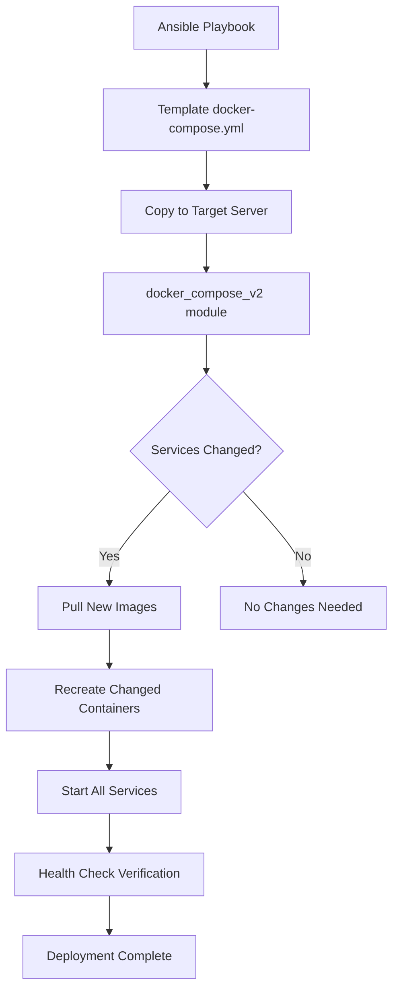

# How to Use Ansible to Run Docker Compose

Author: [nawazdhandala](https://www.github.com/nawazdhandala)

Tags: Ansible, Docker, Docker Compose, Container Orchestration, DevOps

Description: Learn how to deploy and manage Docker Compose applications with Ansible, covering the docker_compose_v2 module, templating, and production workflows.

---

Docker Compose is the go-to tool for defining and running multi-container applications. You describe your services, networks, and volumes in a YAML file, and a single command brings everything up. Ansible takes this further by letting you deploy Docker Compose projects across multiple servers, template compose files with environment-specific values, and integrate Compose deployments into larger automation workflows. In this post, we will cover everything from basic Compose deployments to production-grade workflows with Ansible.

## Why Use Ansible with Docker Compose?

You might wonder why you would use Ansible if Docker Compose already handles multi-container deployments. Here are the reasons:

- Deploy the same Compose project to multiple servers
- Template compose files with environment-specific values
- Manage the entire server setup (Docker installation, firewall, SSL, etc.) alongside the application deployment
- Handle secrets securely with Ansible Vault instead of `.env` files
- Roll back deployments by keeping previous compose files versioned

## Prerequisites

```bash
# Install the community.docker collection
ansible-galaxy collection install community.docker

# Install the Docker Python SDK and compose support
pip install docker docker-compose
```

Docker and Docker Compose must be installed on the target hosts.

## Basic Docker Compose Deployment

The simplest approach is to copy a compose file to the server and use the `docker_compose_v2` module to bring it up.

```yaml
# deploy-compose.yml - Deploy a Docker Compose application
---
- name: Deploy Docker Compose Application
  hosts: docker_hosts
  become: true

  tasks:
    - name: Create application directory
      ansible.builtin.file:
        path: /opt/myapp
        state: directory
        mode: "0755"

    - name: Copy docker-compose.yml to the server
      ansible.builtin.copy:
        content: |
          services:
            web:
              image: nginx:1.25
              ports:
                - "80:80"
              volumes:
                - ./html:/usr/share/nginx/html:ro
              depends_on:
                - api
              restart: unless-stopped

            api:
              image: node:20-slim
              working_dir: /app
              command: node server.js
              ports:
                - "3000:3000"
              environment:
                - NODE_ENV=production
                - DATABASE_URL=postgres://user:pass@db:5432/myapp
                - REDIS_URL=redis://redis:6379
              depends_on:
                - db
                - redis
              restart: unless-stopped

            db:
              image: postgres:16
              environment:
                - POSTGRES_USER=user
                - POSTGRES_PASSWORD=pass
                - POSTGRES_DB=myapp
              volumes:
                - postgres-data:/var/lib/postgresql/data
              restart: unless-stopped

            redis:
              image: redis:7-alpine
              command: redis-server --maxmemory 256mb --maxmemory-policy allkeys-lru
              volumes:
                - redis-data:/data
              restart: unless-stopped

          volumes:
            postgres-data:
            redis-data:
        dest: /opt/myapp/docker-compose.yml
        mode: "0644"

    - name: Deploy the Docker Compose application
      community.docker.docker_compose_v2:
        project_src: /opt/myapp
        state: present
      register: compose_result

    - name: Show deployment status
      ansible.builtin.debug:
        msg: |
          Deployment complete.
          Containers: {{ compose_result.containers | length }}
```

## Templated Compose Files

The real power comes from templating. Use Jinja2 templates to inject environment-specific values.

```yaml
# deploy-templated.yml - Deploy with environment-specific values
---
- name: Deploy Templated Docker Compose
  hosts: docker_hosts
  become: true

  vars:
    app_name: "myapp"
    app_version: "2.5.0"
    db_password: "{{ vault_db_password }}"
    redis_max_memory: "512mb"
    api_workers: 4
    environment: "production"
    domain: "app.example.com"

  tasks:
    - name: Create application directory
      ansible.builtin.file:
        path: "/opt/{{ app_name }}"
        state: directory
        mode: "0755"

    - name: Deploy docker-compose.yml from template
      ansible.builtin.template:
        src: docker-compose.yml.j2
        dest: "/opt/{{ app_name }}/docker-compose.yml"
        mode: "0644"

    - name: Deploy the application
      community.docker.docker_compose_v2:
        project_src: "/opt/{{ app_name }}"
        state: present
      register: result

    - name: Show status
      ansible.builtin.debug:
        msg: "Deployed {{ app_name }}:{{ app_version }} to {{ environment }}"
```

The template file:

```yaml
# templates/docker-compose.yml.j2 - Jinja2 template for docker-compose
services:
  web:
    image: nginx:1.25
    ports:
      - "80:80"
      - "443:443"
    volumes:
      - ./nginx.conf:/etc/nginx/nginx.conf:ro
    depends_on:
      api:
        condition: service_healthy
    restart: unless-stopped

  api:
    image: "registry.example.com/{{ app_name }}-api:{{ app_version }}"
    environment:
      NODE_ENV: "{{ environment }}"
      DATABASE_URL: "postgres://{{ app_name }}:{{ db_password }}@db:5432/{{ app_name }}"
      REDIS_URL: "redis://redis:6379"
      WORKERS: "{{ api_workers }}"
    healthcheck:
      test: ["CMD", "curl", "-f", "http://localhost:3000/health"]
      interval: 10s
      timeout: 5s
      retries: 5
    depends_on:
      db:
        condition: service_healthy
      redis:
        condition: service_started
    restart: unless-stopped

  db:
    image: postgres:16
    environment:
      POSTGRES_USER: "{{ app_name }}"
      POSTGRES_PASSWORD: "{{ db_password }}"
      POSTGRES_DB: "{{ app_name }}"
    volumes:
      - postgres-data:/var/lib/postgresql/data
    healthcheck:
      test: ["CMD-SHELL", "pg_isready -U {{ app_name }}"]
      interval: 5s
      timeout: 5s
      retries: 10
    restart: unless-stopped

  redis:
    image: redis:7-alpine
    command: >
      redis-server
      --maxmemory {{ redis_max_memory }}
      --maxmemory-policy allkeys-lru
      --appendonly yes
    volumes:
      - redis-data:/data
    restart: unless-stopped

volumes:
  postgres-data:
    labels:
      backup: "daily"
  redis-data:
    labels:
      backup: "none"
```

## Compose Deployment Flow



## Managing Compose Services

You can control individual services within a Compose project.

```yaml
# manage-services.yml - Control individual services in a Compose project
---
- name: Manage Docker Compose Services
  hosts: docker_hosts
  become: true

  tasks:
    # Bring up the entire project
    - name: Start all services
      community.docker.docker_compose_v2:
        project_src: /opt/myapp
        state: present

    # Stop the entire project (keeps containers)
    - name: Stop all services
      community.docker.docker_compose_v2:
        project_src: /opt/myapp
        state: stopped

    # Bring down the project (removes containers)
    - name: Remove all services
      community.docker.docker_compose_v2:
        project_src: /opt/myapp
        state: absent

    # Restart specific services
    - name: Restart just the API service
      community.docker.docker_compose_v2:
        project_src: /opt/myapp
        state: restarted
        services:
          - api

    # Scale a specific service
    - name: Scale workers to 3 instances
      community.docker.docker_compose_v2:
        project_src: /opt/myapp
        state: present
        services:
          - worker
      environment:
        COMPOSE_PROJECT_NAME: myapp
```

## Deploying with Updates

When deploying a new version, you want to pull the latest images and recreate only the changed containers.

```yaml
# update-deployment.yml - Deploy a new version of the application
---
- name: Update Docker Compose Deployment
  hosts: docker_hosts
  become: true

  vars:
    app_version: "2.6.0"
    app_name: "myapp"

  tasks:
    - name: Update the compose file with new version
      ansible.builtin.template:
        src: docker-compose.yml.j2
        dest: "/opt/{{ app_name }}/docker-compose.yml"
        mode: "0644"
      register: compose_file

    - name: Pull new images
      community.docker.docker_compose_v2:
        project_src: "/opt/{{ app_name }}"
        state: present
        pull: always
      register: deploy_result

    - name: Show what changed
      ansible.builtin.debug:
        msg: |
          Deployment of version {{ app_version }} complete.
          Containers: {{ deploy_result.containers | length }}
```

## Health Check Verification After Deployment

After deploying, verify that services are healthy.

```yaml
# verify-deployment.yml - Verify services are healthy after deploy
---
- name: Verify Docker Compose Deployment
  hosts: docker_hosts
  become: true

  tasks:
    - name: Wait for the API to be healthy
      ansible.builtin.uri:
        url: "http://localhost:3000/health"
        return_content: true
      register: health_check
      until: health_check.status == 200
      retries: 30
      delay: 5

    - name: Verify database connectivity
      community.docker.docker_container_exec:
        container: "myapp-db-1"
        command: "pg_isready -U myapp"
      register: db_check

    - name: Check all container statuses
      community.docker.docker_compose_v2:
        project_src: /opt/myapp
        state: present
      register: compose_status

    - name: Report health status
      ansible.builtin.debug:
        msg: |
          API health: {{ health_check.status }}
          Database: {{ 'healthy' if db_check.rc == 0 else 'unhealthy' }}
          All services running: {{ compose_status.containers | length }} containers
```

## Rollback Strategy

Keep previous compose files so you can roll back quickly.

```yaml
# deploy-with-rollback.yml - Deploy with automatic rollback on failure
---
- name: Deploy with Rollback Capability
  hosts: docker_hosts
  become: true

  vars:
    app_name: "myapp"
    app_version: "2.6.0"

  tasks:
    - name: Backup current compose file
      ansible.builtin.copy:
        src: "/opt/{{ app_name }}/docker-compose.yml"
        dest: "/opt/{{ app_name }}/docker-compose.yml.backup"
        remote_src: true
      ignore_errors: true

    - name: Deploy new compose file
      ansible.builtin.template:
        src: docker-compose.yml.j2
        dest: "/opt/{{ app_name }}/docker-compose.yml"
        mode: "0644"

    - name: Apply the new deployment
      community.docker.docker_compose_v2:
        project_src: "/opt/{{ app_name }}"
        state: present
        pull: always
      register: deploy_result

    - name: Verify deployment health
      ansible.builtin.uri:
        url: "http://localhost:3000/health"
      register: health
      until: health.status == 200
      retries: 12
      delay: 10
      ignore_errors: true

    # Rollback block
    - name: Rollback if health check failed
      when: health is failed
      block:
        - name: Restore previous compose file
          ansible.builtin.copy:
            src: "/opt/{{ app_name }}/docker-compose.yml.backup"
            dest: "/opt/{{ app_name }}/docker-compose.yml"
            remote_src: true

        - name: Apply rollback
          community.docker.docker_compose_v2:
            project_src: "/opt/{{ app_name }}"
            state: present

        - name: Report rollback
          ansible.builtin.debug:
            msg: "Deployment of {{ app_version }} failed. Rolled back to previous version."

        - name: Fail the playbook
          ansible.builtin.fail:
            msg: "Deployment failed health check. Rollback completed."
```

## Environment File Management

Instead of hardcoding values, use environment files.

```yaml
# deploy-with-env.yml - Deploy using environment files
---
- name: Deploy with Environment Files
  hosts: docker_hosts
  become: true

  vars:
    app_name: "myapp"
    db_password: "{{ vault_db_password }}"
    api_secret: "{{ vault_api_secret }}"

  tasks:
    - name: Create environment file (secrets)
      ansible.builtin.copy:
        content: |
          POSTGRES_PASSWORD={{ db_password }}
          API_SECRET={{ api_secret }}
          JWT_SECRET={{ vault_jwt_secret }}
        dest: "/opt/{{ app_name }}/.env"
        mode: "0600"
      no_log: true

    - name: Deploy compose with .env file
      community.docker.docker_compose_v2:
        project_src: "/opt/{{ app_name }}"
        state: present
        env_files:
          - "/opt/{{ app_name }}/.env"
```

## Cleaning Up

```yaml
# cleanup-compose.yml - Tear down a Compose project completely
---
- name: Cleanup Docker Compose Project
  hosts: docker_hosts
  become: true

  vars:
    app_name: "myapp"

  tasks:
    - name: Bring down the compose project
      community.docker.docker_compose_v2:
        project_src: "/opt/{{ app_name }}"
        state: absent
        remove_volumes: true
        remove_images: all

    - name: Remove application directory
      ansible.builtin.file:
        path: "/opt/{{ app_name }}"
        state: absent

    - name: Prune unused Docker resources
      community.docker.docker_prune:
        containers: true
        images: true
        networks: true
        volumes: false
```

## Best Practices

1. **Template your compose files.** Hard-coding values in compose files makes them environment-specific. Use Jinja2 templates to generate compose files for each environment.

2. **Use Ansible Vault for secrets.** Never store passwords in plain text compose files or `.env` files checked into version control.

3. **Implement health checks.** Always verify that services are healthy after deployment. Automated rollback on health check failure prevents bad deployments from persisting.

4. **Keep backup compose files.** Before every deployment, back up the current compose file so you can roll back quickly.

5. **Use `restart: unless-stopped`** for all production services. This ensures containers come back after host reboots.

6. **Pin image versions.** Never use `latest` in production compose files. Always specify exact version tags.

7. **Separate data from configuration.** Use named volumes for data and bind mounts (or configs) for configuration files.

## Conclusion

Combining Ansible with Docker Compose gives you the best of both worlds: Compose's clean multi-container definitions and Ansible's cross-server automation, templating, and secret management. Whether you are deploying a simple web application or a complex microservices stack, this combination provides reliable, repeatable deployments with built-in rollback capabilities. The key is to treat your compose files as templates, manage secrets with Ansible Vault, and always verify deployment health before declaring success.
