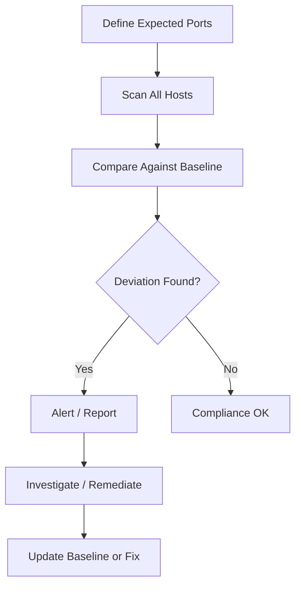

# How to Use Ansible to Scan for Open Ports

Author: [nawazdhandala](https://www.github.com/nawazdhandala)

Tags: Ansible, Port Scanning, Security, Network Audit, Compliance

Description: Use Ansible to scan for open ports across your infrastructure, identify unauthorized services, and enforce a known-good port baseline.

---

Knowing what ports are open on your servers is fundamental to security. Every open port is a potential entry point, and if you do not know what is listening, you cannot protect it. Traditional port scanning with tools like Nmap works fine for one-off checks, but when you need regular auditing across a fleet of servers, integrating port scanning into your Ansible workflows is far more practical.

In this post, I will show you how to use Ansible to scan for open ports, compare results against a baseline, and generate compliance reports. We will cover both local socket enumeration and remote scanning approaches.

## Why Automate Port Scanning?

Manual port scanning has several problems at scale:

- It is time-consuming across large fleets
- Results are not automatically compared against expected baselines
- There is no built-in tracking of changes over time
- It is hard to integrate into CI/CD or compliance workflows

Ansible solves all of these by making port scanning a repeatable, automated process with built-in reporting.



## Method 1: Local Socket Enumeration

The most reliable way to find open ports is to check from the server itself using `ss` or `netstat`. This catches everything, including ports bound to localhost.

This playbook lists all listening ports on each server:

```yaml
# scan_local_ports.yml - Enumerate listening ports from each server
---
- name: Scan local listening ports
  hosts: all
  become: true

  tasks:
    - name: Get all listening TCP ports
      ansible.builtin.shell: ss -tlnp | tail -n +2
      register: tcp_ports
      changed_when: false

    - name: Get all listening UDP ports
      ansible.builtin.shell: ss -ulnp | tail -n +2
      register: udp_ports
      changed_when: false

    - name: Parse TCP listening ports
      ansible.builtin.set_fact:
        open_tcp_ports: "{{ tcp_ports.stdout_lines | map('regex_search', ':([0-9]+)\\s', '\\1') | select('string') | list }}"

    - name: Display open TCP ports
      ansible.builtin.debug:
        msg: "{{ inventory_hostname }} - Open TCP ports: {{ open_tcp_ports }}"

    - name: Save port scan results
      ansible.builtin.copy:
        content: |
          # Port scan results for {{ inventory_hostname }}
          # Date: {{ ansible_date_time.iso8601 }}

          ## TCP Listening Ports
          {{ tcp_ports.stdout }}

          ## UDP Listening Ports
          {{ udp_ports.stdout }}
        dest: /tmp/port_scan_{{ inventory_hostname }}.txt
        mode: '0644'

    - name: Fetch results to controller
      ansible.builtin.fetch:
        src: /tmp/port_scan_{{ inventory_hostname }}.txt
        dest: "./port_scans/{{ inventory_hostname }}.txt"
        flat: true
```

## Method 2: Using the wait_for Module for Remote Scanning

Ansible's `wait_for` module can check if specific ports are open on remote hosts. This is useful for verifying connectivity between servers.

This playbook checks specific ports from the Ansible controller:

```yaml
# remote_port_check.yml - Check specific ports remotely
---
- name: Remote port check
  hosts: localhost
  gather_facts: false

  vars:
    targets:
      - host: 10.0.1.10
        name: web01
        expected_ports: [22, 80, 443]
      - host: 10.0.1.20
        name: app01
        expected_ports: [22, 8080]
      - host: 10.0.1.30
        name: db01
        expected_ports: [22, 5432]

  tasks:
    - name: Check expected ports are open
      ansible.builtin.wait_for:
        host: "{{ item.0.host }}"
        port: "{{ item.1 }}"
        timeout: 5
        state: started
      loop: "{{ targets | subelements('expected_ports') }}"
      register: port_checks
      failed_when: false

    - name: Report port check results
      ansible.builtin.debug:
        msg: "{{ item.item.0.name }}:{{ item.item.1 }} - {{ 'OPEN' if item.failed is not defined or not item.failed else 'CLOSED' }}"
      loop: "{{ port_checks.results }}"
```

## Method 3: Using Nmap via Ansible

For more thorough scanning, you can run Nmap through Ansible.

This playbook installs Nmap and performs a comprehensive scan:

```yaml
# nmap_scan.yml - Run Nmap scans via Ansible
---
- name: Nmap port scanning
  hosts: all
  become: true

  vars:
    nmap_scan_ports: "1-65535"
    nmap_scan_type: "-sS"  # SYN scan
    nmap_output_dir: /var/log/nmap

  tasks:
    - name: Install Nmap
      ansible.builtin.package:
        name: nmap
        state: present

    - name: Create output directory
      ansible.builtin.file:
        path: "{{ nmap_output_dir }}"
        state: directory
        owner: root
        group: root
        mode: '0700'

    - name: Run Nmap scan against localhost
      ansible.builtin.command: >
        nmap {{ nmap_scan_type }}
        -p {{ nmap_scan_ports }}
        -oN {{ nmap_output_dir }}/scan_{{ ansible_date_time.date }}.txt
        --no-dns
        localhost
      register: nmap_result
      changed_when: false

    - name: Parse open ports from Nmap output
      ansible.builtin.shell: >
        grep "^[0-9]" {{ nmap_output_dir }}/scan_{{ ansible_date_time.date }}.txt |
        grep "open" |
        awk '{print $1}'
      register: nmap_open_ports
      changed_when: false

    - name: Display Nmap results
      ansible.builtin.debug:
        msg: "Open ports on {{ inventory_hostname }}: {{ nmap_open_ports.stdout_lines }}"
```

## Baseline Comparison

The real value comes from comparing scan results against a known-good baseline.

This playbook compares current open ports against expected baselines:

```yaml
# port_baseline.yml - Compare ports against baseline
---
- name: Port baseline compliance check
  hosts: all
  become: true

  vars:
    # Define expected ports per server role
    port_baselines:
      webserver:
        tcp: [22, 80, 443, 9100]
        udp: []
      appserver:
        tcp: [22, 8080, 8443, 9100]
        udp: []
      database:
        tcp: [22, 5432, 9100]
        udp: []
      default:
        tcp: [22, 9100]
        udp: []

  tasks:
    - name: Get current listening TCP ports
      ansible.builtin.shell: ss -tlnp | awk 'NR>1 {print $4}' | grep -oP '(?<=:)\d+$' | sort -un
      register: current_tcp
      changed_when: false

    - name: Set server role
      ansible.builtin.set_fact:
        server_role: >-
          webserver
          appserver
          database
          default

    - name: Get expected ports for role
      ansible.builtin.set_fact:
        expected_ports: "{{ port_baselines[server_role].tcp | map('string') | list }}"
        actual_ports: "{{ current_tcp.stdout_lines }}"

    - name: Find unexpected open ports
      ansible.builtin.set_fact:
        unexpected_ports: "{{ actual_ports | difference(expected_ports) }}"
        missing_ports: "{{ expected_ports | difference(actual_ports) }}"

    - name: Report unexpected ports
      ansible.builtin.debug:
        msg: "ALERT: Unexpected ports on {{ inventory_hostname }}: {{ unexpected_ports }}"
      when: unexpected_ports | length > 0

    - name: Report missing expected ports
      ansible.builtin.debug:
        msg: "WARNING: Expected ports not open on {{ inventory_hostname }}: {{ missing_ports }}"
      when: missing_ports | length > 0

    - name: Fail on unexpected ports
      ansible.builtin.fail:
        msg: "Compliance violation: {{ unexpected_ports | length }} unexpected ports found"
      when: unexpected_ports | length > 0
```

## Identifying Processes on Open Ports

When you find unexpected ports, you need to know what process is listening.

This playbook identifies the process behind each open port:

```yaml
# identify_port_processes.yml - Find what is listening on each port
---
- name: Identify processes on open ports
  hosts: all
  become: true

  tasks:
    - name: Get detailed socket information
      ansible.builtin.shell: ss -tlnp | tail -n +2
      register: socket_info
      changed_when: false

    - name: Parse socket details into structured data
      ansible.builtin.shell: |
        ss -tlnp | tail -n +2 | while read state recv send local peer process; do
          port=$(echo "$local" | grep -oP '(?<=:)\d+$')
          proc=$(echo "$process" | grep -oP '(?<=\(\")[^"]+')
          pid=$(echo "$process" | grep -oP '(?<=pid=)\d+')
          echo "$port|$proc|$pid"
        done
      register: port_details
      changed_when: false

    - name: Display port-to-process mapping
      ansible.builtin.debug:
        msg: "{{ inventory_hostname }}: Port {{ item.split('|')[0] }} -> {{ item.split('|')[1] }} (PID {{ item.split('|')[2] }})"
      loop: "{{ port_details.stdout_lines }}"
      when: item | length > 2
```

## Scheduled Scanning

Set up regular automated scans with reporting:

```yaml
# scheduled_port_scan.yml - Deploy automated port scanning
---
- name: Deploy scheduled port scanning
  hosts: all
  become: true

  vars:
    scan_schedule_hour: 6
    scan_schedule_minute: 0
    alert_email: security@example.com

  tasks:
    - name: Deploy port scan script
      ansible.builtin.copy:
        content: |
          #!/bin/bash
          # Automated port scan - Managed by Ansible
          LOGDIR="/var/log/port-scans"
          DATE=$(date +%Y%m%d-%H%M)
          mkdir -p "$LOGDIR"

          # Capture current listening ports
          ss -tlnp > "$LOGDIR/tcp-$DATE.txt"
          ss -ulnp > "$LOGDIR/udp-$DATE.txt"

          # Compare with baseline
          BASELINE="$LOGDIR/baseline.txt"
          CURRENT="$LOGDIR/tcp-$DATE.txt"

          if [ -f "$BASELINE" ]; then
              DIFF=$(diff <(awk 'NR>1{print $4}' "$BASELINE" | sort) \
                         <(awk 'NR>1{print $4}' "$CURRENT" | sort))
              if [ -n "$DIFF" ]; then
                  echo "Port changes detected on $(hostname):" > /tmp/port-alert.txt
                  echo "$DIFF" >> /tmp/port-alert.txt
                  mail -s "Port change alert: $(hostname)" {{ alert_email }} < /tmp/port-alert.txt
              fi
          else
              cp "$CURRENT" "$BASELINE"
          fi

          # Rotate old logs
          find "$LOGDIR" -name "*.txt" -mtime +30 ! -name "baseline.txt" -delete
        dest: /usr/local/bin/port-scan.sh
        owner: root
        group: root
        mode: '0700'

    - name: Schedule daily port scan
      ansible.builtin.cron:
        name: "Daily port scan"
        hour: "{{ scan_schedule_hour }}"
        minute: "{{ scan_schedule_minute }}"
        job: "/usr/local/bin/port-scan.sh"
        user: root
```

## Practical Tips

1. **Scan from both inside and outside.** Local enumeration shows everything listening. Remote scanning shows what is actually reachable through firewalls.
2. **Define baselines per role.** A web server and a database server have different expected ports. Do not use one baseline for everything.
3. **Include process identification.** An open port is only half the story. Knowing what process is listening tells you whether it is legitimate.
4. **Scan regularly.** A one-time scan is a snapshot. Regular scanning catches changes over time.
5. **Integrate with your monitoring.** Feed port scan results into your monitoring system so unexpected changes trigger alerts.
6. **Do not forget UDP.** Many teams only scan TCP. UDP services like DNS, NTP, and SNMP are also potential attack vectors.

Port scanning with Ansible turns a reactive security practice into a proactive, automated process. Define what should be open, scan for what is actually open, and act on the differences.
