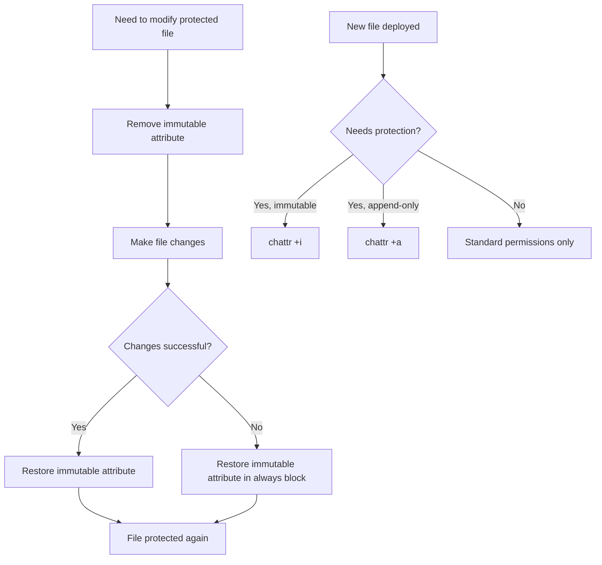

# How to Use Ansible to Set File Attributes (chattr)

Author: [nawazdhandala](https://www.github.com/nawazdhandala)

Tags: Ansible, Linux, Security, File Management

Description: Learn how to use the Ansible file module and command module to set extended file attributes with chattr for protecting critical system files.

---

Linux extended file attributes go beyond standard permissions. They let you mark files as immutable (cannot be modified, deleted, or renamed even by root), append-only (can only be appended to, not overwritten), or apply other special behaviors. The `chattr` command controls these attributes, and while Ansible does not have a dedicated `chattr` module, you can manage these attributes effectively using the `file` module's `attributes` parameter and the `command` module.

## Understanding File Attributes

The most commonly used file attributes are:

| Attribute | Flag | Effect |
|-----------|------|--------|
| Immutable | i | Cannot be modified, deleted, renamed, or linked |
| Append only | a | Can only be appended to, not overwritten |
| No dump | d | Not backed up by the dump command |
| Secure deletion | s | Blocks zeroed when file is deleted |
| Synchronous | S | Changes written immediately to disk |
| No tail merging | t | No partial block merging |
| Undeletable | u | Contents saved when file is deleted |

The immutable (`i`) and append-only (`a`) attributes are by far the most useful for system administration.

## Using the file Module's attributes Parameter

The `file` module has an `attributes` parameter that maps directly to chattr flags.

```yaml
# Make a critical config file immutable
- name: Set immutable attribute on resolv.conf
  ansible.builtin.file:
    path: /etc/resolv.conf
    attributes: +i
```

The `+i` syntax adds the immutable flag. To remove it, use `-i`.

```yaml
# Remove immutable attribute before making changes
- name: Remove immutable attribute from resolv.conf
  ansible.builtin.file:
    path: /etc/resolv.conf
    attributes: -i

- name: Update resolv.conf
  ansible.builtin.template:
    src: templates/resolv.conf.j2
    dest: /etc/resolv.conf
    owner: root
    group: root
    mode: '0644'

- name: Restore immutable attribute on resolv.conf
  ansible.builtin.file:
    path: /etc/resolv.conf
    attributes: +i
```

## Protecting Critical System Files

Certain files should never be modified accidentally. Making them immutable adds a layer of protection.

```yaml
# Protect critical system files with immutable attribute
- name: Set immutable on critical config files
  ansible.builtin.file:
    path: "{{ item }}"
    attributes: +i
  loop:
    - /etc/resolv.conf
    - /etc/hostname
    - /etc/hosts
    - /etc/passwd
    - /etc/shadow
    - /etc/group
    - /etc/gshadow
```

Note that setting `/etc/passwd` and `/etc/shadow` as immutable will prevent user management commands (like `useradd`, `usermod`, `passwd`) from working. Only do this on servers where user accounts are fully managed by Ansible and should never be changed manually.

## Append-Only Log Files

The append-only attribute is perfect for log files. It prevents log tampering because even root cannot overwrite or truncate the file.

```yaml
# Set append-only on security audit log
- name: Set append-only attribute on audit log
  ansible.builtin.file:
    path: /var/log/audit/audit.log
    attributes: +a

# Set append-only on application security log
- name: Set append-only on security log files
  ansible.builtin.file:
    path: "{{ item }}"
    attributes: +a
  loop:
    - /var/log/auth.log
    - /var/log/secure
    - /var/log/myapp/security.log
```

## Safely Updating Immutable Files

When you need to update an immutable file, you must first remove the attribute, make the change, and then restore it. A block with always is the safest pattern.

```yaml
# Safely update an immutable file
- name: Update protected configuration file
  block:
    - name: Remove immutable attribute
      ansible.builtin.file:
        path: /etc/resolv.conf
        attributes: -i

    - name: Update resolv.conf
      ansible.builtin.copy:
        content: |
          nameserver 10.0.1.2
          nameserver 10.0.1.3
          search internal.company.com
        dest: /etc/resolv.conf
        owner: root
        group: root
        mode: '0644'

  always:
    - name: Restore immutable attribute
      ansible.builtin.file:
        path: /etc/resolv.conf
        attributes: +i
```

The `always` block ensures the immutable attribute is restored even if the update task fails.

## Using the command Module for Complex Attributes

For more complex attribute management or when you need to set multiple attributes at once, use the `command` module.

```yaml
# Set multiple attributes at once using chattr
- name: Set immutable and no-dump on backup config
  ansible.builtin.command:
    cmd: chattr +id /etc/backup.conf
  register: chattr_result
  changed_when: chattr_result.rc == 0

# Check current attributes
- name: Check file attributes
  ansible.builtin.command:
    cmd: lsattr /etc/resolv.conf
  register: file_attrs
  changed_when: false

- name: Display current attributes
  ansible.builtin.debug:
    msg: "{{ file_attrs.stdout }}"
```

## Idempotent Attribute Management

The `file` module with `attributes` is idempotent when used correctly. But if you need to verify the current state before making changes, use this pattern.

```yaml
# Only set immutable if not already set
- name: Check if file is already immutable
  ansible.builtin.command:
    cmd: lsattr /etc/resolv.conf
  register: current_attrs
  changed_when: false

- name: Set immutable attribute if not already set
  ansible.builtin.command:
    cmd: chattr +i /etc/resolv.conf
  when: "'----i' not in current_attrs.stdout"
```

## Protecting Docker and Container Configurations

In containerized environments, certain files should not be modified by containers.

```yaml
# Protect container runtime configurations
- name: Deploy Docker daemon configuration
  ansible.builtin.template:
    src: templates/daemon.json.j2
    dest: /etc/docker/daemon.json
    owner: root
    group: root
    mode: '0644'
  notify: Restart Docker

- name: Protect Docker daemon configuration
  ansible.builtin.file:
    path: /etc/docker/daemon.json
    attributes: +i
```

## Managing Attributes in a Role

Here is a complete role for managing file attributes across your infrastructure.

```yaml
# roles/file-attributes/tasks/main.yml
---
- name: Set immutable attributes on protected files
  ansible.builtin.file:
    path: "{{ item }}"
    attributes: +i
  loop: "{{ immutable_files | default([]) }}"

- name: Set append-only attributes on log files
  ansible.builtin.file:
    path: "{{ item }}"
    attributes: +a
  loop: "{{ append_only_files | default([]) }}"

- name: Remove attributes from files that should be writable
  ansible.builtin.file:
    path: "{{ item }}"
    attributes: -ia
  loop: "{{ writable_files | default([]) }}"
```

```yaml
# group_vars/webservers.yml
immutable_files:
  - /etc/resolv.conf
  - /etc/hostname
  - /etc/nginx/nginx.conf
  - /etc/ssl/certs/server.pem
  - /etc/ssl/private/server.key

append_only_files:
  - /var/log/nginx/access.log
  - /var/log/nginx/error.log
  - /var/log/auth.log
```

## Pre-Deployment Attribute Removal

When deploying updates, you may need to temporarily remove attributes from multiple files.

```yaml
# Deployment playbook that handles immutable files
- name: Deploy application update
  block:
    - name: Remove immutable attributes for deployment
      ansible.builtin.file:
        path: "{{ item }}"
        attributes: -i
      loop: "{{ protected_app_files }}"
      ignore_errors: yes

    - name: Deploy new application version
      ansible.builtin.unarchive:
        src: "files/myapp-{{ app_version }}.tar.gz"
        dest: /opt/myapp/
        extra_opts:
          - '--strip-components=1'

    - name: Deploy updated configuration
      ansible.builtin.template:
        src: "templates/{{ item | basename }}.j2"
        dest: "{{ item }}"
        owner: root
        group: root
        mode: '0644'
      loop: "{{ protected_app_files }}"

  always:
    - name: Restore immutable attributes after deployment
      ansible.builtin.file:
        path: "{{ item }}"
        attributes: +i
      loop: "{{ protected_app_files }}"
```

## Attribute Management Flow



## Verifying Attributes Across Fleet

Run an audit to check attribute compliance.

```yaml
# Audit file attributes across all servers
- name: Check attributes on critical files
  ansible.builtin.command:
    cmd: "lsattr {{ item }}"
  register: attr_check
  changed_when: false
  loop:
    - /etc/resolv.conf
    - /etc/hostname
    - /etc/hosts

- name: Report files missing immutable attribute
  ansible.builtin.debug:
    msg: "WARNING: {{ item.item }} is NOT immutable: {{ item.stdout }}"
  loop: "{{ attr_check.results }}"
  when: "'i' not in item.stdout.split()[0]"
```

## Summary

File attributes via `chattr` provide an additional security layer that even standard root permissions do not offer. An immutable file cannot be modified, deleted, or renamed by anyone, including root, making it an effective guard against accidental changes and certain types of attacks. The append-only attribute protects log integrity. Use the `file` module's `attributes` parameter for simple cases and the `command` module for complex scenarios. Always wrap modifications to immutable files in `block/always` constructs to guarantee attributes are restored, and maintain a variable-driven list of protected files for easy auditing and management across your fleet.
