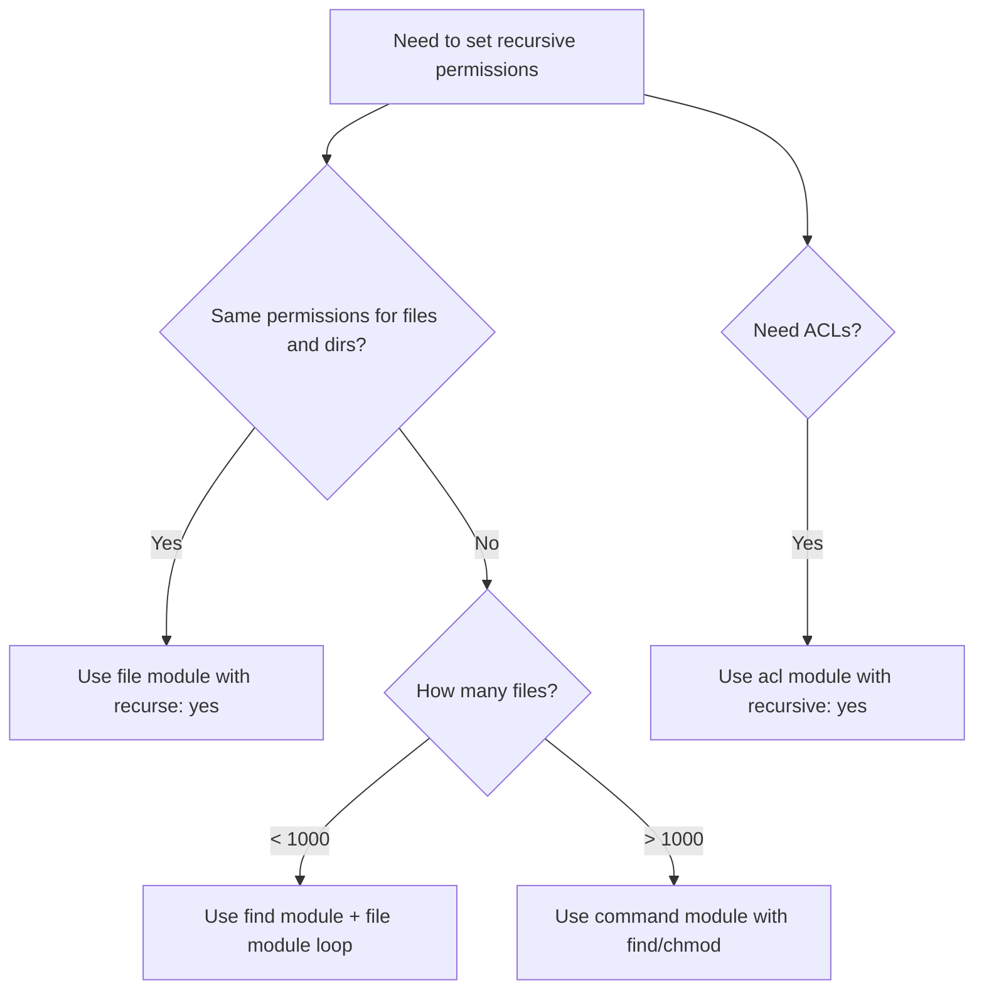

# How to Use Ansible to Set Recursive Directory Permissions

Author: [nawazdhandala](https://www.github.com/nawazdhandala)

Tags: Ansible, File Permissions, Linux, Security

Description: A practical guide to recursively setting file and directory permissions with Ansible using the file module and other approaches.

---

Getting file permissions right across a directory tree is critical for security, but doing it manually on dozens of servers is tedious and error-prone. Ansible gives you several ways to handle recursive permission changes, from the built-in `file` module to more fine-grained approaches that treat files and directories differently. This post covers the practical patterns you will actually use in production.

## Basic Recursive Permissions with the file Module

The `file` module has a `recurse` parameter that applies ownership and permissions to everything inside a directory. This is the simplest approach when you want uniform permissions.

Here is a straightforward example that sets ownership and permissions on a web root:

```yaml
# Set owner, group, and permissions recursively on the web root
- name: Set permissions on /var/www/myapp
  ansible.builtin.file:
    path: /var/www/myapp
    owner: www-data
    group: www-data
    mode: '0755'
    recurse: yes
```

This sets every file and every directory under `/var/www/myapp` to mode `0755`, owned by `www-data`. The problem? You usually do not want files to be executable. The convention is `0755` for directories (so you can `cd` into them) and `0644` for regular files.

## Setting Different Permissions for Files and Directories

Ansible does not have a single parameter to distinguish between files and directories in the `file` module. The standard approach is to use `find` combined with `file` in two separate tasks.

This playbook sets `0755` on directories and `0644` on regular files:

```yaml
# First, find all directories and set their permissions
- name: Find all directories under /var/www/myapp
  ansible.builtin.find:
    paths: /var/www/myapp
    file_type: directory
    recurse: yes
  register: app_directories

- name: Set directory permissions to 0755
  ansible.builtin.file:
    path: "{{ item.path }}"
    mode: '0755'
    owner: www-data
    group: www-data
  loop: "{{ app_directories.files }}"
  loop_control:
    label: "{{ item.path }}"

# Then find all regular files and set their permissions
- name: Find all files under /var/www/myapp
  ansible.builtin.find:
    paths: /var/www/myapp
    file_type: file
    recurse: yes
  register: app_files

- name: Set file permissions to 0644
  ansible.builtin.file:
    path: "{{ item.path }}"
    mode: '0644'
    owner: www-data
    group: www-data
  loop: "{{ app_files.files }}"
  loop_control:
    label: "{{ item.path }}"
```

The `loop_control` with `label` keeps the output clean. Without it, Ansible would dump the entire `stat` dictionary for every file, flooding your terminal.

## Using the command Module for Performance

When you have tens of thousands of files, looping through each one with the `file` module is painfully slow. Each iteration is a separate SSH round-trip. In these cases, the `chmod` and `chown` commands are far faster.

```yaml
# Use native chmod for bulk permission changes (much faster on large trees)
- name: Set directory permissions recursively
  ansible.builtin.command:
    cmd: find /var/www/myapp -type d -exec chmod 0755 {} +
  changed_when: true

- name: Set file permissions recursively
  ansible.builtin.command:
    cmd: find /var/www/myapp -type f -exec chmod 0644 {} +
  changed_when: true

- name: Set ownership recursively
  ansible.builtin.file:
    path: /var/www/myapp
    owner: www-data
    group: www-data
    recurse: yes
```

The `find ... -exec ... +` syntax batches the chmod calls, which is significantly faster than `-exec ... \;` (which runs chmod once per file). Note that `command` tasks are not naturally idempotent, so we set `changed_when` explicitly. You could add a pre-check to make it smarter, but in practice the chmod is fast enough that running it unconditionally is fine.

## Setting Permissions Based on File Patterns

Sometimes you need to set specific permissions on certain file types. For example, shell scripts need to be executable, but config files should not be.

```yaml
# Find shell scripts and make them executable
- name: Find all shell scripts
  ansible.builtin.find:
    paths: /opt/myapp/bin
    patterns: '*.sh'
    recurse: yes
  register: shell_scripts

- name: Make shell scripts executable
  ansible.builtin.file:
    path: "{{ item.path }}"
    mode: '0755'
  loop: "{{ shell_scripts.files }}"
  loop_control:
    label: "{{ item.path }}"

# Find config files and lock them down
- name: Find configuration files
  ansible.builtin.find:
    paths: /opt/myapp/config
    patterns: '*.yml,*.yaml,*.conf'
    recurse: yes
  register: config_files

- name: Restrict config file permissions
  ansible.builtin.file:
    path: "{{ item.path }}"
    mode: '0640'
    owner: appuser
    group: appuser
  loop: "{{ config_files.files }}"
  loop_control:
    label: "{{ item.path }}"
```

## Handling Special Permission Bits

The setgid bit on directories is common for shared team directories. When set, new files inherit the directory's group rather than the creating user's primary group.

```yaml
# Create a shared project directory with setgid
- name: Create shared project directory
  ansible.builtin.file:
    path: /opt/projects/shared
    state: directory
    owner: root
    group: developers
    mode: '2775'

# Apply setgid to all subdirectories so new files inherit the group
- name: Find all subdirectories
  ansible.builtin.find:
    paths: /opt/projects/shared
    file_type: directory
    recurse: yes
  register: shared_dirs

- name: Set setgid on subdirectories
  ansible.builtin.file:
    path: "{{ item.path }}"
    mode: '2775'
    group: developers
  loop: "{{ shared_dirs.files }}"
  loop_control:
    label: "{{ item.path }}"
```

The leading `2` in `2775` sets the setgid bit. This is especially useful for deployment directories where multiple users or CI systems push code.

## Using ACLs for Fine-Grained Control

When standard Unix permissions are not enough, POSIX ACLs let you grant access to multiple users or groups without changing the owning group.

```yaml
# Install the acl package (required for Ansible's acl module)
- name: Ensure acl tools are installed
  ansible.builtin.apt:
    name: acl
    state: present

# Set a default ACL on a directory so new files inherit permissions
- name: Set default ACL for monitoring group
  ansible.posix.acl:
    path: /var/log/myapp
    entity: monitoring
    etype: group
    permissions: rx
    default: yes
    recursive: yes
    state: present

# Set ACL on existing files too
- name: Set ACL on existing log files
  ansible.posix.acl:
    path: /var/log/myapp
    entity: monitoring
    etype: group
    permissions: rx
    recursive: yes
    state: present
```

The `default: yes` parameter sets a default ACL, which means any new files or directories created inside `/var/log/myapp` will automatically inherit the ACL entry. The second task handles files that already exist.

## A Reusable Role for Permission Management

If you find yourself repeating the same permission patterns, wrapping them in a role makes sense.

```yaml
# roles/set_permissions/tasks/main.yml
# Reusable role that handles the common dir/file permission split
- name: Set ownership recursively
  ansible.builtin.file:
    path: "{{ perm_path }}"
    owner: "{{ perm_owner }}"
    group: "{{ perm_group }}"
    recurse: yes

- name: Set directory permissions
  ansible.builtin.command:
    cmd: "find {{ perm_path }} -type d -exec chmod {{ perm_dir_mode | default('0755') }} {} +"
  changed_when: true

- name: Set file permissions
  ansible.builtin.command:
    cmd: "find {{ perm_path }} -type f -exec chmod {{ perm_file_mode | default('0644') }} {} +"
  changed_when: true
```

Then call it from your playbook:

```yaml
# Apply standard web permissions using the role
- name: Set permissions on web application
  ansible.builtin.include_role:
    name: set_permissions
  vars:
    perm_path: /var/www/myapp
    perm_owner: www-data
    perm_group: www-data
    perm_dir_mode: '0755'
    perm_file_mode: '0644'
```

## Permission Management Flow

Here is how the decision process looks when choosing an approach:



## Key Takeaways

The `file` module with `recurse: yes` is the go-to for simple cases where uniform permissions are acceptable. When you need different modes for files versus directories, combine the `find` module with `file` in a loop. For large directory trees with thousands of files, drop down to the `command` module with native `find` and `chmod` for performance. And when standard Unix permissions are not flexible enough, reach for the `acl` module from the `ansible.posix` collection.

Whatever approach you pick, always test permission changes in a staging environment first. A wrong chmod on `/etc` can make a system unbootable, and debugging permission issues remotely is no fun at all.
