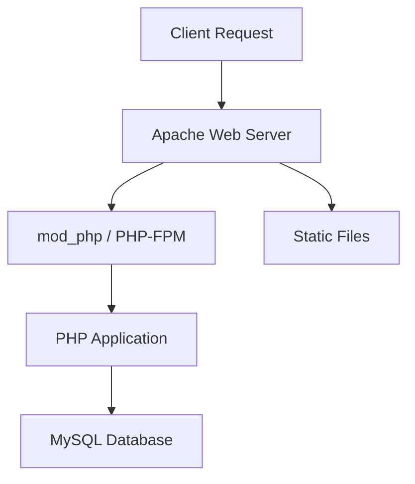

# How to Use Ansible to Set Up a Complete LAMP Stack

Author: [nawazdhandala](https://www.github.com/nawazdhandala)

Tags: Ansible, LAMP Stack, Linux, Apache, MySQL, PHP

Description: Deploy a complete LAMP stack (Linux, Apache, MySQL, PHP) using Ansible with automated configuration, security hardening, and virtual host setup.

---

The LAMP stack (Linux, Apache, MySQL, PHP) remains one of the most popular web application platforms. Setting it up manually on one server takes 30 minutes. Setting it up consistently across 10 servers takes a day. With Ansible, it takes the time to run the playbook regardless of how many servers you target. Here is a production-ready LAMP stack deployment.

## Project Structure

```
lamp-stack/
├── inventories/
│   └── production/
│       ├── hosts.yml
│       └── group_vars/
│           ├── all.yml
│           └── vault.yml
├── roles/
│   ├── apache/
│   ├── mysql/
│   └── php/
├── playbooks/
│   └── lamp.yml
└── ansible.cfg
```

## Inventory

```yaml
# inventories/production/hosts.yml
all:
  children:
    lamp_servers:
      hosts:
        web01.example.com:
          ansible_host: 10.0.1.10
        web02.example.com:
          ansible_host: 10.0.1.11
```

```yaml
# inventories/production/group_vars/all.yml
apache_server_admin: admin@example.com
apache_document_root: /var/www/html
apache_vhosts:
  - server_name: app.example.com
    document_root: /var/www/app
    directory_index: index.php

mysql_root_password: "{{ vault_mysql_root_password }}"
mysql_databases:
  - name: appdb
    encoding: utf8mb4
    collation: utf8mb4_unicode_ci
mysql_users:
  - name: appuser
    password: "{{ vault_mysql_app_password }}"
    priv: "appdb.*:ALL"
    host: localhost

php_version: "8.2"
php_modules:
  - php{{ php_version }}-mysql
  - php{{ php_version }}-curl
  - php{{ php_version }}-gd
  - php{{ php_version }}-mbstring
  - php{{ php_version }}-xml
  - php{{ php_version }}-zip
  - php{{ php_version }}-intl
```

## Apache Role

```yaml
# roles/apache/tasks/main.yml
# Install and configure Apache web server

- name: Install Apache
  ansible.builtin.apt:
    name:
      - apache2
      - libapache2-mod-php{{ php_version }}
    state: present
    update_cache: yes

- name: Enable Apache modules
  community.general.apache2_module:
    name: "{{ item }}"
    state: present
  loop:
    - rewrite
    - ssl
    - headers
  notify: restart apache

- name: Deploy Apache main configuration
  ansible.builtin.template:
    src: apache2.conf.j2
    dest: /etc/apache2/apache2.conf
    owner: root
    group: root
    mode: '0644'
  notify: reload apache

- name: Deploy virtual host configurations
  ansible.builtin.template:
    src: vhost.conf.j2
    dest: "/etc/apache2/sites-available/{{ item.server_name }}.conf"
    owner: root
    group: root
    mode: '0644'
  loop: "{{ apache_vhosts }}"
  notify: reload apache

- name: Enable virtual hosts
  ansible.builtin.command:
    cmd: "a2ensite {{ item.server_name }}.conf"
    creates: "/etc/apache2/sites-enabled/{{ item.server_name }}.conf"
  loop: "{{ apache_vhosts }}"
  notify: reload apache

- name: Disable default site
  ansible.builtin.command:
    cmd: a2dissite 000-default.conf
    removes: /etc/apache2/sites-enabled/000-default.conf
  notify: reload apache

- name: Create document root directories
  ansible.builtin.file:
    path: "{{ item.document_root }}"
    state: directory
    owner: www-data
    group: www-data
    mode: '0755'
  loop: "{{ apache_vhosts }}"

- name: Deploy test PHP page
  ansible.builtin.copy:
    content: |
      <?php
      // Test page to verify LAMP stack
      echo "<h1>LAMP Stack Working</h1>";
      echo "<p>Server: " . gethostname() . "</p>";
      echo "<p>PHP Version: " . phpversion() . "</p>";

      // Test MySQL connection
      try {
          $pdo = new PDO('mysql:host=localhost;dbname={{ mysql_databases[0].name }}',
                         '{{ mysql_users[0].name }}', '{{ vault_mysql_app_password }}');
          echo "<p>MySQL: Connected successfully</p>";
      } catch (PDOException $e) {
          echo "<p>MySQL: Connection failed - " . $e->getMessage() . "</p>";
      }
      ?>
    dest: "{{ apache_vhosts[0].document_root }}/index.php"
    owner: www-data
    group: www-data
    mode: '0644'

- name: Ensure Apache is running and enabled
  ansible.builtin.service:
    name: apache2
    state: started
    enabled: yes
```

```yaml
# roles/apache/handlers/main.yml
- name: restart apache
  ansible.builtin.service:
    name: apache2
    state: restarted

- name: reload apache
  ansible.builtin.service:
    name: apache2
    state: reloaded
```

## Virtual Host Template

```jinja2
{# roles/apache/templates/vhost.conf.j2 #}
<VirtualHost *:80>
    ServerName {{ item.server_name }}
    ServerAdmin {{ apache_server_admin }}
    DocumentRoot {{ item.document_root }}

    DirectoryIndex {{ item.directory_index | default('index.php index.html') }}

    <Directory {{ item.document_root }}>
        Options -Indexes +FollowSymLinks
        AllowOverride All
        Require all granted
    </Directory>

    ErrorLog ${APACHE_LOG_DIR}/{{ item.server_name }}-error.log
    CustomLog ${APACHE_LOG_DIR}/{{ item.server_name }}-access.log combined

    # Security headers
    Header always set X-Content-Type-Options "nosniff"
    Header always set X-Frame-Options "SAMEORIGIN"
    Header always set X-XSS-Protection "1; mode=block"
</VirtualHost>
```

## MySQL Role

```yaml
# roles/mysql/tasks/main.yml
# Install and configure MySQL

- name: Install MySQL server
  ansible.builtin.apt:
    name:
      - mysql-server
      - mysql-client
      - python3-mysqldb
    state: present
    update_cache: yes

- name: Start MySQL service
  ansible.builtin.service:
    name: mysql
    state: started
    enabled: yes

- name: Set MySQL root password
  community.mysql.mysql_user:
    name: root
    password: "{{ mysql_root_password }}"
    login_unix_socket: /var/run/mysqld/mysqld.sock
    host_all: yes
  no_log: true

- name: Create MySQL databases
  community.mysql.mysql_db:
    name: "{{ item.name }}"
    encoding: "{{ item.encoding | default('utf8mb4') }}"
    collation: "{{ item.collation | default('utf8mb4_unicode_ci') }}"
    state: present
    login_unix_socket: /var/run/mysqld/mysqld.sock
  loop: "{{ mysql_databases }}"

- name: Create MySQL users
  community.mysql.mysql_user:
    name: "{{ item.name }}"
    password: "{{ item.password }}"
    priv: "{{ item.priv }}"
    host: "{{ item.host | default('localhost') }}"
    state: present
    login_unix_socket: /var/run/mysqld/mysqld.sock
  loop: "{{ mysql_users }}"
  no_log: true

- name: Deploy MySQL configuration
  ansible.builtin.template:
    src: mysqld.cnf.j2
    dest: /etc/mysql/mysql.conf.d/mysqld.cnf
    owner: root
    group: root
    mode: '0644'
  notify: restart mysql

- name: Remove anonymous MySQL users
  community.mysql.mysql_user:
    name: ''
    host_all: yes
    state: absent
    login_unix_socket: /var/run/mysqld/mysqld.sock

- name: Remove test database
  community.mysql.mysql_db:
    name: test
    state: absent
    login_unix_socket: /var/run/mysqld/mysqld.sock
```

## PHP Role

```yaml
# roles/php/tasks/main.yml
# Install and configure PHP

- name: Add PHP repository
  ansible.builtin.apt_repository:
    repo: "ppa:ondrej/php"
    state: present

- name: Install PHP and modules
  ansible.builtin.apt:
    name: "{{ ['php' + php_version, 'php' + php_version + '-fpm'] + php_modules }}"
    state: present
    update_cache: yes

- name: Configure PHP settings
  ansible.builtin.lineinfile:
    path: "/etc/php/{{ php_version }}/apache2/php.ini"
    regexp: "{{ item.regexp }}"
    line: "{{ item.line }}"
  loop:
    - { regexp: '^;?upload_max_filesize', line: 'upload_max_filesize = 64M' }
    - { regexp: '^;?post_max_size', line: 'post_max_size = 64M' }
    - { regexp: '^;?memory_limit', line: 'memory_limit = 256M' }
    - { regexp: '^;?max_execution_time', line: 'max_execution_time = 300' }
    - { regexp: '^;?expose_php', line: 'expose_php = Off' }
    - { regexp: '^;?date.timezone', line: 'date.timezone = UTC' }
  notify: reload apache
```

## Main Playbook

```yaml
# playbooks/lamp.yml
# Deploy complete LAMP stack
- name: Deploy LAMP stack
  hosts: lamp_servers
  become: yes

  pre_tasks:
    - name: Update apt cache
      ansible.builtin.apt:
        update_cache: yes
        cache_valid_time: 3600

  roles:
    - role: mysql
      tags: [mysql, database]
    - role: php
      tags: [php]
    - role: apache
      tags: [apache, web]

  post_tasks:
    - name: Verify LAMP stack
      ansible.builtin.uri:
        url: "http://localhost/"
        status_code: 200
        return_content: yes
      register: lamp_test

    - name: Confirm PHP is working
      ansible.builtin.assert:
        that:
          - "'LAMP Stack Working' in lamp_test.content"
        fail_msg: "LAMP stack verification failed"
```

## LAMP Architecture



## Summary

A complete LAMP stack with Ansible covers Apache installation and virtual host configuration, MySQL setup with secure defaults and application databases, and PHP with optimized settings and required modules. The playbook is idempotent, so running it multiple times is safe. Variables control every aspect from PHP version to database names, making the same playbook usable across development, staging, and production environments.
