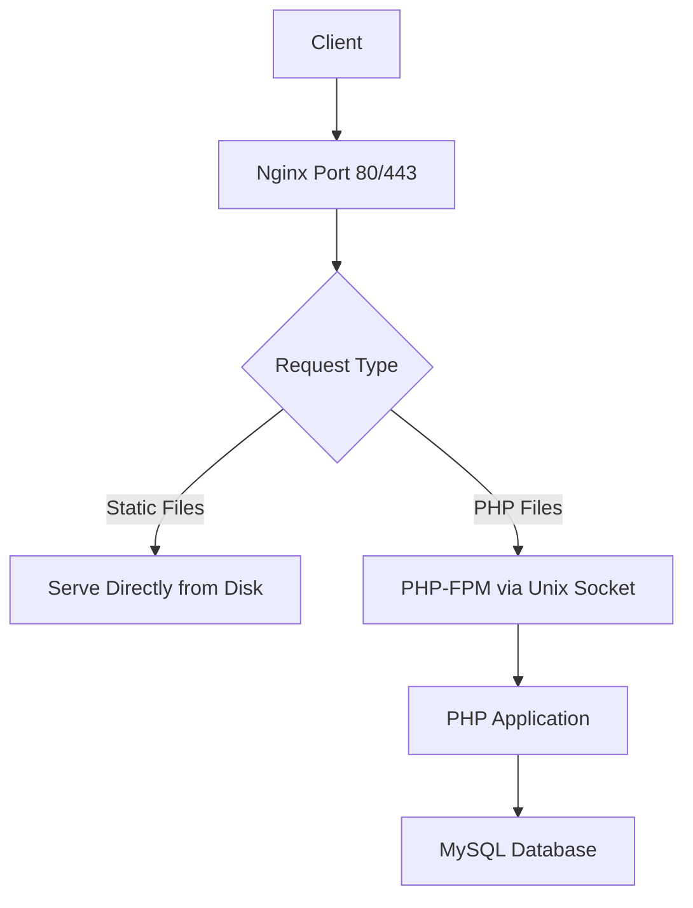

# How to Use Ansible to Set Up a Complete LEMP Stack

Author: [nawazdhandala](https://www.github.com/nawazdhandala)

Tags: Ansible, LEMP Stack, Nginx, MySQL, PHP-FPM

Description: Deploy a production-ready LEMP stack (Linux, Nginx, MySQL, PHP-FPM) with Ansible including reverse proxy configuration and performance tuning.

---

The LEMP stack replaces Apache with Nginx and uses PHP-FPM instead of mod_php. Nginx handles static files more efficiently and uses less memory under load, making it the preferred choice for high-traffic sites. Here is how to deploy a complete LEMP stack with Ansible.

## Inventory and Variables

```yaml
# inventories/production/group_vars/all.yml
nginx_worker_processes: auto
nginx_worker_connections: 1024

php_version: "8.2"
php_fpm_pool_max_children: 50
php_fpm_pool_start_servers: 5
php_fpm_pool_min_spare_servers: 5
php_fpm_pool_max_spare_servers: 35

mysql_root_password: "{{ vault_mysql_root_password }}"
mysql_databases:
  - name: webapp
    encoding: utf8mb4
mysql_users:
  - name: webuser
    password: "{{ vault_mysql_web_password }}"
    priv: "webapp.*:ALL"

app_domain: app.example.com
app_root: /var/www/app
```

## Nginx Role

```yaml
# roles/nginx/tasks/main.yml
# Install and configure Nginx as a reverse proxy for PHP-FPM

- name: Install Nginx
  ansible.builtin.apt:
    name: nginx
    state: present
    update_cache: yes

- name: Deploy Nginx main configuration
  ansible.builtin.template:
    src: nginx.conf.j2
    dest: /etc/nginx/nginx.conf
    validate: nginx -t -c %s
  notify: reload nginx

- name: Deploy site configuration
  ansible.builtin.template:
    src: site.conf.j2
    dest: "/etc/nginx/sites-available/{{ app_domain }}.conf"
  notify: reload nginx

- name: Enable site
  ansible.builtin.file:
    src: "/etc/nginx/sites-available/{{ app_domain }}.conf"
    dest: "/etc/nginx/sites-enabled/{{ app_domain }}.conf"
    state: link
  notify: reload nginx

- name: Remove default site
  ansible.builtin.file:
    path: /etc/nginx/sites-enabled/default
    state: absent
  notify: reload nginx

- name: Create web root
  ansible.builtin.file:
    path: "{{ app_root }}"
    state: directory
    owner: www-data
    group: www-data
    mode: '0755'

- name: Deploy test page
  ansible.builtin.copy:
    content: |
      <?php
      echo "<h1>LEMP Stack Working</h1>";
      echo "<p>Server: " . gethostname() . "</p>";
      echo "<p>PHP: " . phpversion() . "</p>";
      echo "<p>Server Software: " . $_SERVER['SERVER_SOFTWARE'] . "</p>";

      try {
          $pdo = new PDO('mysql:host=localhost;dbname={{ mysql_databases[0].name }}',
                         '{{ mysql_users[0].name }}', '{{ vault_mysql_web_password }}');
          echo "<p>MySQL: Connected</p>";
      } catch (PDOException $e) {
          echo "<p>MySQL Error: " . $e->getMessage() . "</p>";
      }
      ?>
    dest: "{{ app_root }}/index.php"
    owner: www-data
    group: www-data
    mode: '0644'

- name: Ensure Nginx is running
  ansible.builtin.service:
    name: nginx
    state: started
    enabled: yes
```

## Nginx Site Configuration Template

```jinja2
{# roles/nginx/templates/site.conf.j2 #}
server {
    listen 80;
    server_name {{ app_domain }};
    root {{ app_root }};
    index index.php index.html;

    # Logging
    access_log /var/log/nginx/{{ app_domain }}-access.log;
    error_log /var/log/nginx/{{ app_domain }}-error.log;

    # Security headers
    add_header X-Content-Type-Options "nosniff" always;
    add_header X-Frame-Options "SAMEORIGIN" always;
    add_header X-XSS-Protection "1; mode=block" always;

    # Static file handling
    location ~* \.(jpg|jpeg|gif|png|css|js|ico|svg|woff2)$ {
        expires 30d;
        add_header Cache-Control "public, immutable";
        try_files $uri =404;
    }

    # PHP processing via PHP-FPM
    location ~ \.php$ {
        fastcgi_pass unix:/run/php/php{{ php_version }}-fpm.sock;
        fastcgi_param SCRIPT_FILENAME $document_root$fastcgi_script_name;
        include fastcgi_params;
        fastcgi_read_timeout 300;
        fastcgi_buffer_size 128k;
        fastcgi_buffers 4 256k;
    }

    # Deny access to hidden files
    location ~ /\. {
        deny all;
    }

    location / {
        try_files $uri $uri/ /index.php?$query_string;
    }
}
```

## PHP-FPM Role

```yaml
# roles/php_fpm/tasks/main.yml
# Install PHP-FPM with optimized pool configuration

- name: Add PHP repository
  ansible.builtin.apt_repository:
    repo: "ppa:ondrej/php"
    state: present

- name: Install PHP-FPM and modules
  ansible.builtin.apt:
    name:
      - "php{{ php_version }}-fpm"
      - "php{{ php_version }}-mysql"
      - "php{{ php_version }}-curl"
      - "php{{ php_version }}-gd"
      - "php{{ php_version }}-mbstring"
      - "php{{ php_version }}-xml"
      - "php{{ php_version }}-zip"
      - "php{{ php_version }}-opcache"
      - "php{{ php_version }}-redis"
    state: present
    update_cache: yes

- name: Configure PHP-FPM pool
  ansible.builtin.template:
    src: www.conf.j2
    dest: "/etc/php/{{ php_version }}/fpm/pool.d/www.conf"
  notify: restart php-fpm

- name: Configure PHP settings
  ansible.builtin.template:
    src: php.ini.j2
    dest: "/etc/php/{{ php_version }}/fpm/conf.d/99-custom.ini"
  notify: restart php-fpm

- name: Ensure PHP-FPM is running
  ansible.builtin.service:
    name: "php{{ php_version }}-fpm"
    state: started
    enabled: yes
```

```jinja2
{# roles/php_fpm/templates/www.conf.j2 #}
[www]
user = www-data
group = www-data
listen = /run/php/php{{ php_version }}-fpm.sock
listen.owner = www-data
listen.group = www-data
pm = dynamic
pm.max_children = {{ php_fpm_pool_max_children }}
pm.start_servers = {{ php_fpm_pool_start_servers }}
pm.min_spare_servers = {{ php_fpm_pool_min_spare_servers }}
pm.max_spare_servers = {{ php_fpm_pool_max_spare_servers }}
pm.max_requests = 500
pm.status_path = /fpm-status
request_slowlog_timeout = 10s
slowlog = /var/log/php{{ php_version }}-fpm-slow.log
```

## LEMP Architecture



## Main Playbook

```yaml
# playbooks/lemp.yml
- name: Deploy LEMP stack
  hosts: lemp_servers
  become: yes

  roles:
    - role: mysql
      tags: [mysql]
    - role: php_fpm
      tags: [php]
    - role: nginx
      tags: [nginx]

  post_tasks:
    - name: Verify LEMP stack
      ansible.builtin.uri:
        url: "http://localhost/"
        status_code: 200
        return_content: yes
      register: lemp_test

    - name: Confirm stack is working
      ansible.builtin.assert:
        that: "'LEMP Stack Working' in lemp_test.content"
```

## Summary

The LEMP stack with Ansible combines Nginx for efficient HTTP handling, PHP-FPM for process management, and MySQL for data storage. Nginx communicates with PHP-FPM through a Unix socket, avoiding TCP overhead. The PHP-FPM pool is configured with dynamic process management that scales based on load. All configuration is templated and variable-driven, making it easy to tune for different server sizes and traffic patterns.

## Common Use Cases

Here are several practical scenarios where this module proves essential in real-world playbooks.

### Infrastructure Provisioning Workflow

```yaml
# Complete workflow incorporating this module
- name: Infrastructure provisioning
  hosts: all
  become: true
  gather_facts: true
  tasks:
    - name: Gather system information
      ansible.builtin.setup:
        gather_subset:
          - hardware
          - network

    - name: Display system summary
      ansible.builtin.debug:
        msg: >-
          Host {{ inventory_hostname }} has
          {{ ansible_memtotal_mb }}MB RAM,
          {{ ansible_processor_vcpus }} vCPUs,
          running {{ ansible_distribution }} {{ ansible_distribution_version }}

    - name: Install required packages
      ansible.builtin.package:
        name:
          - curl
          - wget
          - git
          - vim
          - htop
          - jq
        state: present

    - name: Configure system timezone
      ansible.builtin.timezone:
        name: "{{ system_timezone | default('UTC') }}"

    - name: Configure hostname
      ansible.builtin.hostname:
        name: "{{ inventory_hostname }}"

    - name: Update /etc/hosts
      ansible.builtin.lineinfile:
        path: /etc/hosts
        regexp: '^127\.0\.1\.1'
        line: "127.0.1.1 {{ inventory_hostname }}"

    - name: Configure SSH hardening
      ansible.builtin.lineinfile:
        path: /etc/ssh/sshd_config
        regexp: "{{ item.regexp }}"
        line: "{{ item.line }}"
      loop:
        - { regexp: '^PermitRootLogin', line: 'PermitRootLogin no' }
        - { regexp: '^PasswordAuthentication', line: 'PasswordAuthentication no' }
      notify: restart sshd

    - name: Configure firewall rules
      community.general.ufw:
        rule: allow
        port: "{{ item }}"
        proto: tcp
      loop:
        - "22"
        - "80"
        - "443"

    - name: Enable firewall
      community.general.ufw:
        state: enabled
        policy: deny

  handlers:
    - name: restart sshd
      ansible.builtin.service:
        name: sshd
        state: restarted
```

### Integration with Monitoring

```yaml
# Using gathered facts to configure monitoring thresholds
- name: Configure monitoring based on system specs
  hosts: all
  become: true
  tasks:
    - name: Set monitoring thresholds based on hardware
      ansible.builtin.template:
        src: monitoring_config.yml.j2
        dest: /etc/monitoring/config.yml
      vars:
        memory_warning_threshold: "{{ (ansible_memtotal_mb * 0.8) | int }}"
        memory_critical_threshold: "{{ (ansible_memtotal_mb * 0.95) | int }}"
        cpu_warning_threshold: 80
        cpu_critical_threshold: 95

    - name: Register host with monitoring system
      ansible.builtin.uri:
        url: "https://monitoring.example.com/api/hosts"
        method: POST
        body_format: json
        body:
          hostname: "{{ inventory_hostname }}"
          ip_address: "{{ ansible_default_ipv4.address }}"
          os: "{{ ansible_distribution }}"
          memory_mb: "{{ ansible_memtotal_mb }}"
          cpus: "{{ ansible_processor_vcpus }}"
        headers:
          Authorization: "Bearer {{ monitoring_api_token }}"
        status_code: [200, 201, 409]
```

### Error Handling Patterns

```yaml
# Robust error handling with this module
- name: Robust task execution
  hosts: all
  tasks:
    - name: Attempt primary operation
      ansible.builtin.command: /opt/app/primary-task.sh
      register: primary_result
      failed_when: false

    - name: Handle primary failure with fallback
      ansible.builtin.command: /opt/app/fallback-task.sh
      when: primary_result.rc != 0
      register: fallback_result

    - name: Report final status
      ansible.builtin.debug:
        msg: >-
          Task completed via {{ 'primary' if primary_result.rc == 0 else 'fallback' }} path.
          Return code: {{ primary_result.rc if primary_result.rc == 0 else fallback_result.rc }}

    - name: Fail if both paths failed
      ansible.builtin.fail:
        msg: "Both primary and fallback operations failed"
      when:
        - primary_result.rc != 0
        - fallback_result is defined
        - fallback_result.rc != 0
```

### Scheduling and Automation

```yaml
# Set up scheduled compliance scans using cron
- name: Configure automated scans
  hosts: all
  become: true
  tasks:
    - name: Create scan script
      ansible.builtin.copy:
        dest: /opt/scripts/compliance_scan.sh
        mode: '0755'
        content: |
          #!/bin/bash
          cd /opt/ansible
          ansible-playbook playbooks/validate.yml -i inventory/ > /var/log/compliance_scan.log 2>&1
          EXIT_CODE=$?
          if [ $EXIT_CODE -ne 0 ]; then
            curl -X POST https://hooks.example.com/alert \
              -H "Content-Type: application/json" \
              -d "{\"text\":\"Compliance scan failed on $(hostname)\"}"
          fi
          exit $EXIT_CODE

    - name: Schedule weekly compliance scan
      ansible.builtin.cron:
        name: "Weekly compliance scan"
        minute: "0"
        hour: "3"
        weekday: "1"
        job: "/opt/scripts/compliance_scan.sh"
        user: ansible
```

