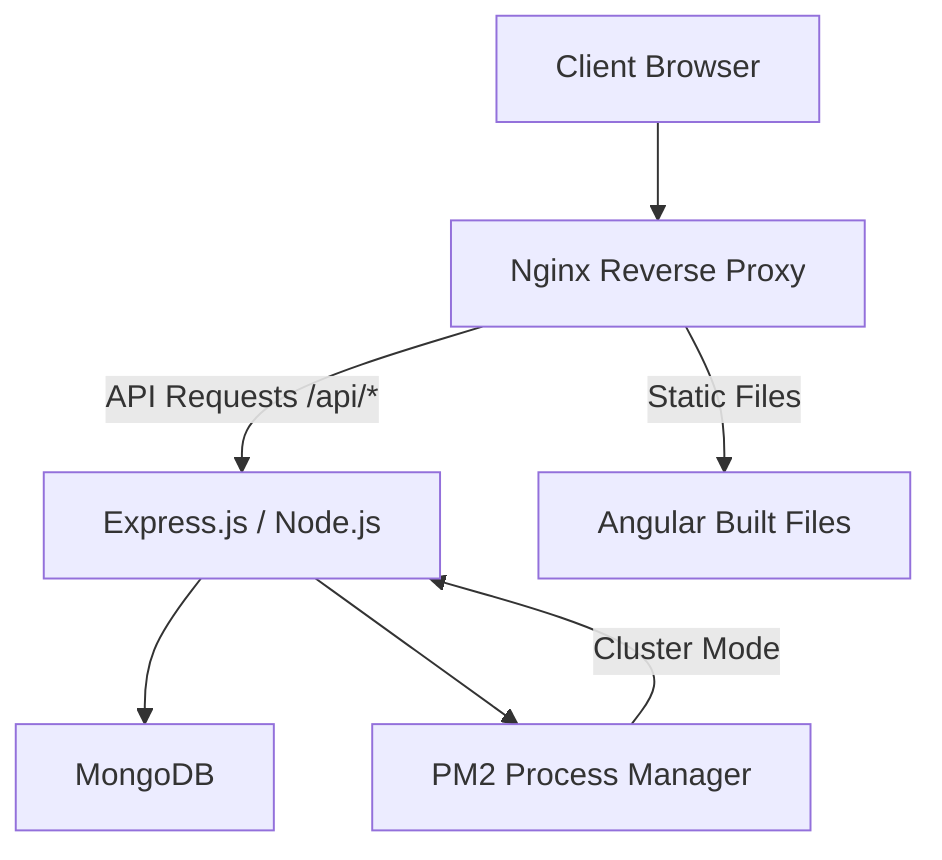

# How to Use Ansible to Set Up a Complete MEAN Stack

Author: [nawazdhandala](https://www.github.com/nawazdhandala)

Tags: Ansible, MEAN Stack, MongoDB, Express, Angular, Node.js

Description: Deploy a complete MEAN stack (MongoDB, Express.js, Angular, Node.js) using Ansible with automated configuration and PM2 process management.

---

The MEAN stack (MongoDB, Express.js, Angular, Node.js) is a JavaScript-only stack for building modern web applications. Every layer uses JavaScript, from the database queries (MongoDB) to the server (Node.js/Express) to the frontend (Angular). Setting this up with Ansible means consistent environments for your entire team.

## Project Variables

```yaml
# inventories/production/group_vars/all.yml
nodejs_version: "20"
mongodb_version: "7.0"

app_name: myapp
app_user: nodeapp
app_dir: /opt/myapp
app_port: 3000
app_env: production
app_repo: https://github.com/company/myapp.git
app_version: main

mongodb_bind_ip: "127.0.0.1"
mongodb_port: 27017
mongodb_db_name: myapp
mongodb_app_user: appuser
mongodb_app_password: "{{ vault_mongodb_app_password }}"

nginx_server_name: app.example.com
```

## Node.js Role

```yaml
# roles/nodejs/tasks/main.yml
# Install Node.js and PM2 process manager

- name: Install Node.js prerequisites
  ansible.builtin.apt:
    name:
      - ca-certificates
      - curl
      - gnupg
    state: present

- name: Add NodeSource GPG key
  ansible.builtin.shell: |
    curl -fsSL https://deb.nodesource.com/gpgkey/nodesource-repo.gpg.key | gpg --dearmor -o /usr/share/keyrings/nodesource.gpg
  args:
    creates: /usr/share/keyrings/nodesource.gpg

- name: Add NodeSource repository
  ansible.builtin.apt_repository:
    repo: "deb [signed-by=/usr/share/keyrings/nodesource.gpg] https://deb.nodesource.com/node_{{ nodejs_version }}.x nodistro main"
    state: present

- name: Install Node.js
  ansible.builtin.apt:
    name: nodejs
    state: present
    update_cache: yes

- name: Install PM2 globally
  community.general.npm:
    name: pm2
    global: yes
    state: present

- name: Create application user
  ansible.builtin.user:
    name: "{{ app_user }}"
    system: yes
    shell: /bin/bash
    create_home: yes
```

## MongoDB Role

```yaml
# roles/mongodb/tasks/main.yml
# Install and configure MongoDB

- name: Import MongoDB GPG key
  ansible.builtin.apt_key:
    url: "https://pgp.mongodb.com/server-{{ mongodb_version }}.asc"
    state: present

- name: Add MongoDB repository
  ansible.builtin.apt_repository:
    repo: "deb [ arch=amd64,arm64 ] https://repo.mongodb.org/apt/ubuntu {{ ansible_distribution_release }}/mongodb-org/{{ mongodb_version }} multiverse"
    state: present

- name: Install MongoDB
  ansible.builtin.apt:
    name: mongodb-org
    state: present
    update_cache: yes

- name: Deploy MongoDB configuration
  ansible.builtin.template:
    src: mongod.conf.j2
    dest: /etc/mongod.conf
    owner: root
    group: root
    mode: '0644'
  notify: restart mongodb

- name: Ensure MongoDB is running
  ansible.builtin.service:
    name: mongod
    state: started
    enabled: yes

- name: Wait for MongoDB to be ready
  ansible.builtin.wait_for:
    port: "{{ mongodb_port }}"
    delay: 5
    timeout: 30

- name: Create application database and user
  community.mongodb.mongodb_user:
    database: "{{ mongodb_db_name }}"
    name: "{{ mongodb_app_user }}"
    password: "{{ mongodb_app_password }}"
    roles:
      - dbOwner
    state: present
    login_port: "{{ mongodb_port }}"
  no_log: true
```

```jinja2
{# roles/mongodb/templates/mongod.conf.j2 #}
# MongoDB configuration
storage:
  dbPath: /var/lib/mongodb
  journal:
    enabled: true

systemLog:
  destination: file
  logAppend: true
  path: /var/log/mongodb/mongod.log

net:
  port: {{ mongodb_port }}
  bindIp: {{ mongodb_bind_ip }}

security:
  authorization: enabled
```

## Application Deployment Role

```yaml
# roles/mean_app/tasks/main.yml
# Deploy the MEAN application

- name: Create application directory
  ansible.builtin.file:
    path: "{{ app_dir }}"
    state: directory
    owner: "{{ app_user }}"
    group: "{{ app_user }}"
    mode: '0755'

- name: Clone application repository
  ansible.builtin.git:
    repo: "{{ app_repo }}"
    dest: "{{ app_dir }}"
    version: "{{ app_version }}"
  become_user: "{{ app_user }}"

- name: Install backend dependencies
  community.general.npm:
    path: "{{ app_dir }}"
    production: yes
  become_user: "{{ app_user }}"

- name: Build Angular frontend
  ansible.builtin.command:
    cmd: npm run build --production
    chdir: "{{ app_dir }}/client"
  become_user: "{{ app_user }}"
  changed_when: true

- name: Deploy environment configuration
  ansible.builtin.template:
    src: env.j2
    dest: "{{ app_dir }}/.env"
    owner: "{{ app_user }}"
    mode: '0600'
  no_log: true

- name: Deploy PM2 ecosystem file
  ansible.builtin.template:
    src: ecosystem.config.js.j2
    dest: "{{ app_dir }}/ecosystem.config.js"
    owner: "{{ app_user }}"
    mode: '0644'

- name: Start application with PM2
  ansible.builtin.command:
    cmd: "pm2 start ecosystem.config.js --env {{ app_env }}"
    chdir: "{{ app_dir }}"
  become_user: "{{ app_user }}"
  changed_when: true

- name: Save PM2 process list
  ansible.builtin.command: pm2 save
  become_user: "{{ app_user }}"
  changed_when: true

- name: Configure PM2 startup script
  ansible.builtin.command: "pm2 startup systemd -u {{ app_user }} --hp /home/{{ app_user }}"
  changed_when: true
```

```jinja2
{# roles/mean_app/templates/ecosystem.config.js.j2 #}
// PM2 process management configuration
module.exports = {
  apps: [{
    name: '{{ app_name }}',
    script: 'server.js',
    cwd: '{{ app_dir }}',
    instances: 'max',
    exec_mode: 'cluster',
    env: {
      NODE_ENV: 'development',
      PORT: {{ app_port }}
    },
    env_production: {
      NODE_ENV: 'production',
      PORT: {{ app_port }},
      MONGODB_URI: 'mongodb://{{ mongodb_app_user }}:{{ mongodb_app_password }}@localhost:{{ mongodb_port }}/{{ mongodb_db_name }}'
    },
    max_memory_restart: '500M',
    log_date_format: 'YYYY-MM-DD HH:mm:ss Z'
  }]
};
```

## MEAN Stack Architecture



## Main Playbook

```yaml
# playbooks/mean.yml
- name: Deploy MEAN Stack
  hosts: mean_servers
  become: yes
  roles:
    - role: nodejs
      tags: [nodejs]
    - role: mongodb
      tags: [mongodb]
    - role: mean_app
      tags: [app]
    - role: nginx
      tags: [nginx]

  post_tasks:
    - name: Verify application
      ansible.builtin.uri:
        url: "http://localhost:{{ app_port }}/api/health"
        status_code: 200
      retries: 10
      delay: 5
```

## Summary

The MEAN stack with Ansible automates Node.js installation with a specific version, MongoDB setup with authentication enabled, application deployment with npm dependency management, Angular frontend building, and PM2 cluster-mode process management. Nginx sits in front as a reverse proxy, serving the built Angular files directly and forwarding API requests to the Node.js backend. PM2 ensures the application restarts on crashes and utilizes all CPU cores.
