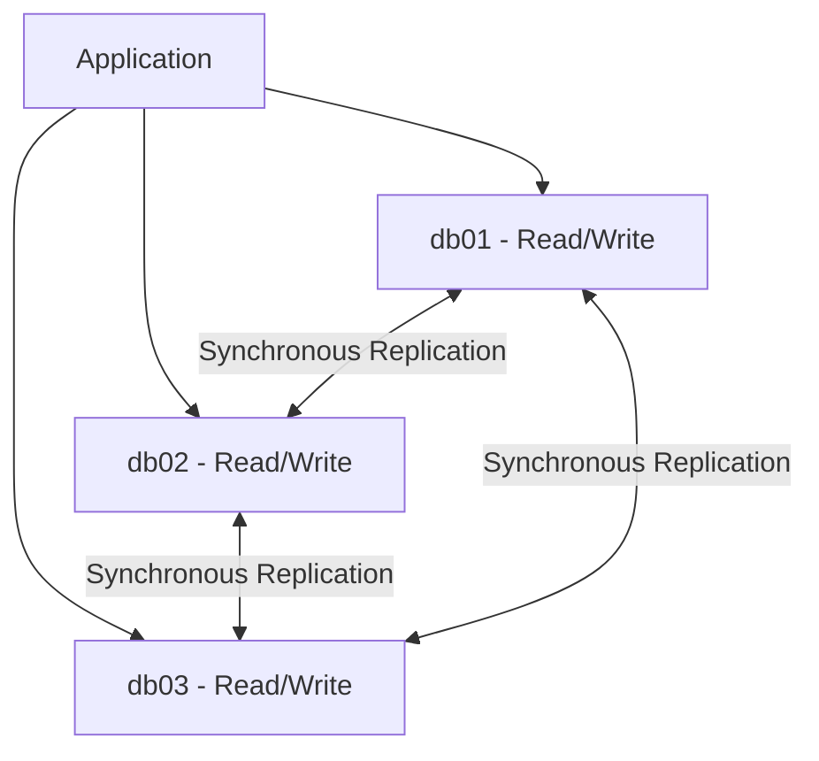

# How to Use Ansible to Set Up a Galera Cluster for MySQL

Author: [nawazdhandala](https://www.github.com/nawazdhandala)

Tags: Ansible, Galera Cluster, MySQL, MariaDB, High Availability

Description: Deploy a multi-master Galera Cluster for MySQL/MariaDB using Ansible with synchronous replication, automatic node joining, and cluster health monitoring.

---

Galera Cluster provides synchronous multi-master replication for MySQL and MariaDB. Every node can accept reads and writes, and data is replicated synchronously to all other nodes. This means no replication lag and no split-brain scenarios. Setting up a Galera cluster manually requires careful coordination because the first node must be bootstrapped differently from the rest. Ansible handles this orchestration cleanly.

## Inventory

```yaml
# inventories/production/hosts.yml
all:
  children:
    galera_cluster:
      hosts:
        db01.example.com:
          ansible_host: 10.0.2.10
          galera_bootstrap: true
        db02.example.com:
          ansible_host: 10.0.2.11
        db03.example.com:
          ansible_host: 10.0.2.12
```

```yaml
# inventories/production/group_vars/galera_cluster.yml
mariadb_version: "10.11"
galera_cluster_name: "prod_galera"
galera_sst_method: mariabackup
galera_sst_user: sst_user
galera_sst_password: "{{ vault_galera_sst_password }}"
mysql_root_password: "{{ vault_mysql_root_password }}"
galera_cluster_address: "gcomm://{{ groups['galera_cluster'] | map('extract', hostvars, 'ansible_host') | join(',') }}"
```

## Galera Role

```yaml
# roles/galera/tasks/main.yml
# Install and configure Galera Cluster

- name: Install MariaDB and Galera packages
  ansible.builtin.apt:
    name:
      - "mariadb-server"
      - "mariadb-client"
      - "galera-4"
      - "mariadb-backup"
      - python3-mysqldb
    state: present
    update_cache: yes

- name: Stop MariaDB before cluster configuration
  ansible.builtin.service:
    name: mariadb
    state: stopped

- name: Deploy Galera cluster configuration
  ansible.builtin.template:
    src: galera.cnf.j2
    dest: /etc/mysql/mariadb.conf.d/99-galera.cnf
    owner: root
    group: root
    mode: '0644'

- name: Deploy MariaDB server configuration
  ansible.builtin.template:
    src: server.cnf.j2
    dest: /etc/mysql/mariadb.conf.d/50-server.cnf
    owner: root
    group: root
    mode: '0644'

- name: Bootstrap first node
  ansible.builtin.command: galera_new_cluster
  when: galera_bootstrap | default(false)

- name: Start MariaDB on remaining nodes
  ansible.builtin.service:
    name: mariadb
    state: started
    enabled: yes
  when: not (galera_bootstrap | default(false))

- name: Wait for cluster sync
  ansible.builtin.command:
    cmd: mysql -u root -e "SHOW STATUS LIKE 'wsrep_local_state_comment'"
  register: cluster_state
  until: "'Synced' in cluster_state.stdout"
  retries: 30
  delay: 5
  changed_when: false

- name: Set MariaDB root password
  community.mysql.mysql_user:
    name: root
    password: "{{ mysql_root_password }}"
    login_unix_socket: /var/run/mysqld/mysqld.sock
    host_all: yes
  no_log: true
  run_once: true

- name: Create SST user for Galera
  community.mysql.mysql_user:
    name: "{{ galera_sst_user }}"
    password: "{{ galera_sst_password }}"
    priv: "*.*:RELOAD,PROCESS,LOCK TABLES,REPLICATION CLIENT"
    host: localhost
    state: present
    login_unix_socket: /var/run/mysqld/mysqld.sock
  no_log: true
  run_once: true

- name: Remove anonymous users
  community.mysql.mysql_user:
    name: ''
    host_all: yes
    state: absent
    login_unix_socket: /var/run/mysqld/mysqld.sock
  run_once: true
```

```jinja2
{# roles/galera/templates/galera.cnf.j2 #}
# Galera Cluster configuration
[galera]
wsrep_on = ON
wsrep_provider = /usr/lib/galera/libgalera_smm.so
wsrep_cluster_name = {{ galera_cluster_name }}
wsrep_cluster_address = {{ galera_cluster_address }}
wsrep_node_address = {{ ansible_host }}
wsrep_node_name = {{ inventory_hostname }}
wsrep_sst_method = {{ galera_sst_method }}
wsrep_sst_auth = {{ galera_sst_user }}:{{ galera_sst_password }}

# InnoDB settings required by Galera
binlog_format = ROW
default_storage_engine = InnoDB
innodb_autoinc_lock_mode = 2
innodb_flush_log_at_trx_commit = 0
innodb_buffer_pool_size = {{ (ansible_memtotal_mb * 0.5) | int }}M
```

```jinja2
{# roles/galera/templates/server.cnf.j2 #}
[mysqld]
bind-address = 0.0.0.0
port = 3306
max_connections = 500
max_allowed_packet = 64M
character-set-server = utf8mb4
collation-server = utf8mb4_unicode_ci

# Performance
query_cache_type = 0
query_cache_size = 0
tmp_table_size = 64M
max_heap_table_size = 64M

# Logging
slow_query_log = 1
slow_query_log_file = /var/log/mysql/slow-query.log
long_query_time = 2
```

## Cluster Verification

```yaml
# playbooks/verify-galera.yml
- name: Verify Galera cluster health
  hosts: galera_cluster
  become: yes
  tasks:
    - name: Check cluster size
      ansible.builtin.command:
        cmd: mysql -u root -e "SHOW STATUS LIKE 'wsrep_cluster_size'"
      register: cluster_size
      changed_when: false

    - name: Verify all nodes see the full cluster
      ansible.builtin.assert:
        that:
          - "groups['galera_cluster'] | length | string in cluster_size.stdout"
        fail_msg: "Cluster size mismatch. Expected {{ groups['galera_cluster'] | length }}, got: {{ cluster_size.stdout }}"

    - name: Check node state
      ansible.builtin.command:
        cmd: mysql -u root -e "SHOW STATUS LIKE 'wsrep_local_state_comment'"
      register: node_state
      changed_when: false

    - name: Verify node is synced
      ansible.builtin.assert:
        that:
          - "'Synced' in node_state.stdout"
        fail_msg: "Node {{ inventory_hostname }} is not synced: {{ node_state.stdout }}"

    - name: Check cluster status
      ansible.builtin.command:
        cmd: mysql -u root -e "SHOW STATUS WHERE Variable_name IN ('wsrep_cluster_size', 'wsrep_cluster_status', 'wsrep_local_state_comment', 'wsrep_ready')"
      register: full_status
      changed_when: false

    - name: Display cluster status
      ansible.builtin.debug:
        msg: "{{ full_status.stdout }}"
```

## Galera Cluster Architecture



## Main Playbook

```yaml
# playbooks/galera-cluster.yml
# Deploy Galera Cluster in correct order
- name: Configure Galera nodes
  hosts: galera_cluster
  become: yes
  serial: 1
  order: inventory
  roles:
    - galera

- name: Verify cluster
  ansible.builtin.import_playbook: verify-galera.yml
```

## Summary

Galera Cluster with Ansible provides synchronous multi-master replication where every node accepts reads and writes. The bootstrap node is initialized first, and subsequent nodes join the cluster automatically. MariaBackup handles state snapshot transfer for new nodes. The cluster self-heals when nodes rejoin after failure. Ansible orchestrates the precise boot order required for cluster initialization and verifies that all nodes are synced before the playbook completes.

## Common Use Cases

Here are several practical scenarios where this module proves essential in real-world playbooks.

### Infrastructure Provisioning Workflow

```yaml
# Complete workflow incorporating this module
- name: Infrastructure provisioning
  hosts: all
  become: true
  gather_facts: true
  tasks:
    - name: Gather system information
      ansible.builtin.setup:
        gather_subset:
          - hardware
          - network

    - name: Display system summary
      ansible.builtin.debug:
        msg: >-
          Host {{ inventory_hostname }} has
          {{ ansible_memtotal_mb }}MB RAM,
          {{ ansible_processor_vcpus }} vCPUs,
          running {{ ansible_distribution }} {{ ansible_distribution_version }}

    - name: Install required packages
      ansible.builtin.package:
        name:
          - curl
          - wget
          - git
          - vim
          - htop
          - jq
        state: present

    - name: Configure system timezone
      ansible.builtin.timezone:
        name: "{{ system_timezone | default('UTC') }}"

    - name: Configure hostname
      ansible.builtin.hostname:
        name: "{{ inventory_hostname }}"

    - name: Update /etc/hosts
      ansible.builtin.lineinfile:
        path: /etc/hosts
        regexp: '^127\.0\.1\.1'
        line: "127.0.1.1 {{ inventory_hostname }}"

    - name: Configure SSH hardening
      ansible.builtin.lineinfile:
        path: /etc/ssh/sshd_config
        regexp: "{{ item.regexp }}"
        line: "{{ item.line }}"
      loop:
        - { regexp: '^PermitRootLogin', line: 'PermitRootLogin no' }
        - { regexp: '^PasswordAuthentication', line: 'PasswordAuthentication no' }
      notify: restart sshd

    - name: Configure firewall rules
      community.general.ufw:
        rule: allow
        port: "{{ item }}"
        proto: tcp
      loop:
        - "22"
        - "80"
        - "443"

    - name: Enable firewall
      community.general.ufw:
        state: enabled
        policy: deny

  handlers:
    - name: restart sshd
      ansible.builtin.service:
        name: sshd
        state: restarted
```

### Integration with Monitoring

```yaml
# Using gathered facts to configure monitoring thresholds
- name: Configure monitoring based on system specs
  hosts: all
  become: true
  tasks:
    - name: Set monitoring thresholds based on hardware
      ansible.builtin.template:
        src: monitoring_config.yml.j2
        dest: /etc/monitoring/config.yml
      vars:
        memory_warning_threshold: "{{ (ansible_memtotal_mb * 0.8) | int }}"
        memory_critical_threshold: "{{ (ansible_memtotal_mb * 0.95) | int }}"
        cpu_warning_threshold: 80
        cpu_critical_threshold: 95

    - name: Register host with monitoring system
      ansible.builtin.uri:
        url: "https://monitoring.example.com/api/hosts"
        method: POST
        body_format: json
        body:
          hostname: "{{ inventory_hostname }}"
          ip_address: "{{ ansible_default_ipv4.address }}"
          os: "{{ ansible_distribution }}"
          memory_mb: "{{ ansible_memtotal_mb }}"
          cpus: "{{ ansible_processor_vcpus }}"
        headers:
          Authorization: "Bearer {{ monitoring_api_token }}"
        status_code: [200, 201, 409]
```

### Error Handling Patterns

```yaml
# Robust error handling with this module
- name: Robust task execution
  hosts: all
  tasks:
    - name: Attempt primary operation
      ansible.builtin.command: /opt/app/primary-task.sh
      register: primary_result
      failed_when: false

    - name: Handle primary failure with fallback
      ansible.builtin.command: /opt/app/fallback-task.sh
      when: primary_result.rc != 0
      register: fallback_result

    - name: Report final status
      ansible.builtin.debug:
        msg: >-
          Task completed via {{ 'primary' if primary_result.rc == 0 else 'fallback' }} path.
          Return code: {{ primary_result.rc if primary_result.rc == 0 else fallback_result.rc }}

    - name: Fail if both paths failed
      ansible.builtin.fail:
        msg: "Both primary and fallback operations failed"
      when:
        - primary_result.rc != 0
        - fallback_result is defined
        - fallback_result.rc != 0
```

### Scheduling and Automation

```yaml
# Set up scheduled compliance scans using cron
- name: Configure automated scans
  hosts: all
  become: true
  tasks:
    - name: Create scan script
      ansible.builtin.copy:
        dest: /opt/scripts/compliance_scan.sh
        mode: '0755'
        content: |
          #!/bin/bash
          cd /opt/ansible
          ansible-playbook playbooks/validate.yml -i inventory/ > /var/log/compliance_scan.log 2>&1
          EXIT_CODE=$?
          if [ $EXIT_CODE -ne 0 ]; then
            curl -X POST https://hooks.example.com/alert \
              -H "Content-Type: application/json" \
              -d "{\"text\":\"Compliance scan failed on $(hostname)\"}"
          fi
          exit $EXIT_CODE

    - name: Schedule weekly compliance scan
      ansible.builtin.cron:
        name: "Weekly compliance scan"
        minute: "0"
        hour: "3"
        weekday: "1"
        job: "/opt/scripts/compliance_scan.sh"
        user: ansible
```

