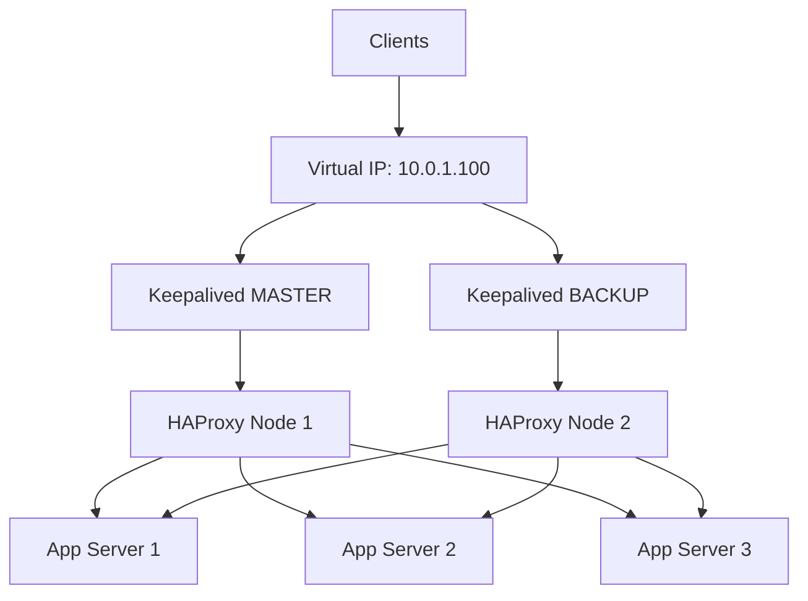

# How to Use Ansible to Set Up a High Availability Cluster

Author: [nawazdhandala](https://www.github.com/nawazdhandala)

Tags: Ansible, High Availability, Clustering, Keepalived, HAProxy

Description: Deploy a high availability cluster using Ansible with Keepalived for VIP failover and HAProxy for load balancing with automatic failover capabilities.

---

High availability means your application survives individual server failures. A single server is a single point of failure. A cluster with automatic failover keeps serving traffic even when a node goes down. Ansible automates the entire cluster setup including virtual IP management, health checks, and failover configuration.

## Cluster Architecture



## Inventory

```yaml
# inventories/production/hosts.yml
all:
  children:
    ha_nodes:
      hosts:
        ha01.example.com:
          ansible_host: 10.0.1.10
          keepalived_priority: 101
          keepalived_state: MASTER
        ha02.example.com:
          ansible_host: 10.0.1.11
          keepalived_priority: 100
          keepalived_state: BACKUP
    app_servers:
      hosts:
        app01.example.com:
          ansible_host: 10.0.2.10
        app02.example.com:
          ansible_host: 10.0.2.11
        app03.example.com:
          ansible_host: 10.0.2.12
```

```yaml
# inventories/production/group_vars/all.yml
keepalived_vip: 10.0.1.100
keepalived_interface: eth0
keepalived_router_id: 51
keepalived_auth_pass: "{{ vault_keepalived_pass }}"

haproxy_frontend_port: 80
haproxy_stats_port: 8404
haproxy_stats_user: admin
haproxy_stats_password: "{{ vault_haproxy_stats_pass }}"

app_port: 8080
app_health_path: /health
```

## Keepalived Role

```yaml
# roles/keepalived/tasks/main.yml
# Install and configure Keepalived for VIP failover

- name: Install Keepalived
  ansible.builtin.apt:
    name: keepalived
    state: present
    update_cache: yes

- name: Deploy Keepalived configuration
  ansible.builtin.template:
    src: keepalived.conf.j2
    dest: /etc/keepalived/keepalived.conf
    owner: root
    group: root
    mode: '0644'
  notify: restart keepalived

- name: Deploy health check script
  ansible.builtin.template:
    src: check_haproxy.sh.j2
    dest: /etc/keepalived/check_haproxy.sh
    owner: root
    group: root
    mode: '0755'

- name: Allow VRRP protocol in firewall
  community.general.ufw:
    rule: allow
    proto: vrrp

- name: Ensure Keepalived is running
  ansible.builtin.service:
    name: keepalived
    state: started
    enabled: yes
```

```jinja2
{# roles/keepalived/templates/keepalived.conf.j2 #}
! Keepalived configuration for HA failover
global_defs {
    router_id {{ inventory_hostname }}
    script_user root
    enable_script_security
}

vrrp_script check_haproxy {
    script "/etc/keepalived/check_haproxy.sh"
    interval 2
    weight -20
    fall 3
    rise 2
}

vrrp_instance VI_1 {
    state {{ keepalived_state }}
    interface {{ keepalived_interface }}
    virtual_router_id {{ keepalived_router_id }}
    priority {{ keepalived_priority }}
    advert_int 1

    authentication {
        auth_type PASS
        auth_pass {{ keepalived_auth_pass }}
    }

    virtual_ipaddress {
        {{ keepalived_vip }}/24
    }

    track_script {
        check_haproxy
    }
}
```

```jinja2
{# roles/keepalived/templates/check_haproxy.sh.j2 #}
#!/bin/bash
# Check if HAProxy is running and healthy
if ! pidof haproxy > /dev/null; then
    exit 1
fi

# Check if HAProxy responds on stats port
if ! curl -sf http://localhost:{{ haproxy_stats_port }}/health > /dev/null 2>&1; then
    exit 1
fi

exit 0
```

## HAProxy Role

```yaml
# roles/haproxy/tasks/main.yml
# Install and configure HAProxy for load balancing

- name: Install HAProxy
  ansible.builtin.apt:
    name: haproxy
    state: present
    update_cache: yes

- name: Deploy HAProxy configuration
  ansible.builtin.template:
    src: haproxy.cfg.j2
    dest: /etc/haproxy/haproxy.cfg
    owner: root
    group: root
    mode: '0644'
    validate: haproxy -c -f %s
  notify: reload haproxy

- name: Ensure HAProxy is running
  ansible.builtin.service:
    name: haproxy
    state: started
    enabled: yes
```

```jinja2
{# roles/haproxy/templates/haproxy.cfg.j2 #}
global
    log /dev/log local0
    chroot /var/lib/haproxy
    stats socket /run/haproxy/admin.sock mode 660 level admin
    stats timeout 30s
    user haproxy
    group haproxy
    daemon
    maxconn 4096

defaults
    log     global
    mode    http
    option  httplog
    option  dontlognull
    option  forwardfor
    option  http-server-close
    timeout connect 5000ms
    timeout client  50000ms
    timeout server  50000ms
    retries 3
    option  redispatch

frontend http_front
    bind *:{{ haproxy_frontend_port }}
    default_backend app_servers

    # Health check endpoint for Keepalived
    acl health_check path /haproxy-health
    http-request return status 200 if health_check

backend app_servers
    balance roundrobin
    option httpchk GET {{ app_health_path }}
    http-check expect status 200

    server {{ host }} {{ hostvars[host].ansible_host }}:{{ app_port }} check inter 5s fall 3 rise 2


listen stats
    bind *:{{ haproxy_stats_port }}
    stats enable
    stats uri /stats
    stats auth {{ haproxy_stats_user }}:{{ haproxy_stats_password }}
    stats refresh 10s

    # Health endpoint for monitoring
    acl health_check path /health
    http-request return status 200 if health_check
```

## Main Playbook

```yaml
# playbooks/ha-cluster.yml
- name: Configure application servers
  hosts: app_servers
  become: yes
  roles:
    - common
    - app_deploy

- name: Configure HA nodes
  hosts: ha_nodes
  become: yes
  roles:
    - role: haproxy
      tags: [haproxy]
    - role: keepalived
      tags: [keepalived]

  post_tasks:
    - name: Verify HAProxy is load balancing
      ansible.builtin.uri:
        url: "http://{{ keepalived_vip }}:{{ haproxy_frontend_port }}{{ app_health_path }}"
        status_code: 200
      retries: 10
      delay: 3
      delegate_to: localhost
      run_once: true

    - name: Check HAProxy stats
      ansible.builtin.uri:
        url: "http://localhost:{{ haproxy_stats_port }}/stats"
        user: "{{ haproxy_stats_user }}"
        password: "{{ haproxy_stats_password }}"
        status_code: 200
```

## Testing Failover

```yaml
# playbooks/test-failover.yml
# Test HA failover by stopping HAProxy on the master
- name: Test failover
  hosts: ha_nodes
  serial: 1
  tasks:
    - name: Stop HAProxy on current host
      ansible.builtin.service:
        name: haproxy
        state: stopped
      when: keepalived_state == 'MASTER'

    - name: Wait for failover
      ansible.builtin.pause:
        seconds: 10
      when: keepalived_state == 'MASTER'

    - name: Verify VIP is still accessible
      ansible.builtin.uri:
        url: "http://{{ keepalived_vip }}:{{ haproxy_frontend_port }}{{ app_health_path }}"
        status_code: 200
      delegate_to: localhost
      run_once: true

    - name: Restart HAProxy
      ansible.builtin.service:
        name: haproxy
        state: started
      when: keepalived_state == 'MASTER'
```

## Summary

A high availability cluster with Ansible uses Keepalived for virtual IP failover between two load balancer nodes and HAProxy for distributing traffic across application servers. Keepalived monitors HAProxy health and transfers the VIP to the backup node if the master fails. HAProxy performs health checks on backend servers and removes unhealthy ones from the pool. The entire setup is automated, tested, and can be deployed across environments with different configurations.
