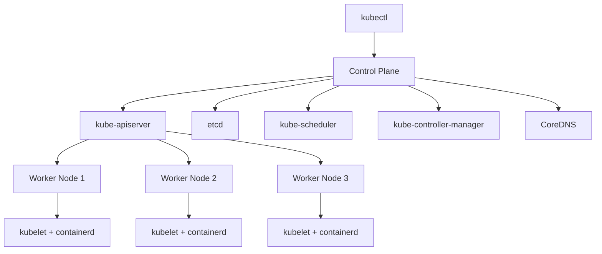

# How to Use Ansible to Set Up a Kubernetes Cluster from Scratch

Author: [nawazdhandala](https://www.github.com/nawazdhandala)

Tags: Ansible, Kubernetes, Container Orchestration, kubeadm

Description: Build a production-ready Kubernetes cluster from scratch using Ansible and kubeadm with control plane setup, worker node joining, and CNI configuration.

---

Setting up a Kubernetes cluster manually involves dozens of steps: installing container runtimes, configuring kernel parameters, initializing the control plane, joining worker nodes, and installing networking plugins. Miss one step and the cluster will not work. Ansible automates this entire process and makes it repeatable across environments.

## Cluster Architecture



## Inventory

```yaml
# inventories/production/hosts.yml
all:
  children:
    k8s_control_plane:
      hosts:
        cp01.example.com:
          ansible_host: 10.0.5.10
    k8s_workers:
      hosts:
        worker01.example.com:
          ansible_host: 10.0.5.20
        worker02.example.com:
          ansible_host: 10.0.5.21
        worker03.example.com:
          ansible_host: 10.0.5.22
    k8s_cluster:
      children:
        k8s_control_plane:
        k8s_workers:
```

```yaml
# inventories/production/group_vars/k8s_cluster.yml
kubernetes_version: "1.29"
pod_network_cidr: "10.244.0.0/16"
service_cidr: "10.96.0.0/12"
cni_plugin: calico
containerd_version: "1.7"
cluster_name: prod-k8s
control_plane_endpoint: "10.0.5.10:6443"
```

## Prerequisites Role

```yaml
# roles/k8s_prereqs/tasks/main.yml
# Configure prerequisites for all Kubernetes nodes

- name: Disable swap
  ansible.builtin.command: swapoff -a
  changed_when: true

- name: Remove swap from fstab
  ansible.builtin.lineinfile:
    path: /etc/fstab
    regexp: '.*swap.*'
    state: absent

- name: Load required kernel modules
  ansible.builtin.modprobe:
    name: "{{ item }}"
    state: present
  loop:
    - overlay
    - br_netfilter

- name: Persist kernel modules
  ansible.builtin.copy:
    content: |
      overlay
      br_netfilter
    dest: /etc/modules-load.d/k8s.conf
    mode: '0644'

- name: Configure sysctl for Kubernetes networking
  ansible.posix.sysctl:
    name: "{{ item.name }}"
    value: "{{ item.value }}"
    sysctl_set: yes
    state: present
    reload: yes
  loop:
    - { name: net.bridge.bridge-nf-call-iptables, value: '1' }
    - { name: net.bridge.bridge-nf-call-ip6tables, value: '1' }
    - { name: net.ipv4.ip_forward, value: '1' }

- name: Install containerd
  ansible.builtin.include_tasks: install-containerd.yml

- name: Install kubeadm, kubelet, and kubectl
  ansible.builtin.include_tasks: install-k8s-packages.yml
```

```yaml
# roles/k8s_prereqs/tasks/install-containerd.yml
# Install and configure containerd runtime

- name: Install containerd prerequisites
  ansible.builtin.apt:
    name:
      - apt-transport-https
      - ca-certificates
      - curl
      - gnupg
    state: present
    update_cache: yes

- name: Add Docker GPG key (for containerd packages)
  ansible.builtin.shell: |
    curl -fsSL https://download.docker.com/linux/ubuntu/gpg | gpg --dearmor -o /usr/share/keyrings/docker-archive-keyring.gpg
  args:
    creates: /usr/share/keyrings/docker-archive-keyring.gpg

- name: Add Docker repository
  ansible.builtin.apt_repository:
    repo: "deb [signed-by=/usr/share/keyrings/docker-archive-keyring.gpg] https://download.docker.com/linux/ubuntu {{ ansible_distribution_release }} stable"
    state: present

- name: Install containerd
  ansible.builtin.apt:
    name: containerd.io
    state: present
    update_cache: yes

- name: Create containerd configuration directory
  ansible.builtin.file:
    path: /etc/containerd
    state: directory
    mode: '0755'

- name: Generate default containerd config
  ansible.builtin.command: containerd config default
  register: containerd_config
  changed_when: false

- name: Write containerd configuration
  ansible.builtin.copy:
    content: "{{ containerd_config.stdout }}"
    dest: /etc/containerd/config.toml
    mode: '0644'

- name: Enable SystemdCgroup in containerd
  ansible.builtin.lineinfile:
    path: /etc/containerd/config.toml
    regexp: '(\s+)SystemdCgroup = false'
    line: '\1SystemdCgroup = true'
    backrefs: yes
  notify: restart containerd

- name: Ensure containerd is running
  ansible.builtin.service:
    name: containerd
    state: started
    enabled: yes
```

```yaml
# roles/k8s_prereqs/tasks/install-k8s-packages.yml
# Install Kubernetes packages

- name: Add Kubernetes GPG key
  ansible.builtin.shell: |
    curl -fsSL https://pkgs.k8s.io/core:/stable:/v{{ kubernetes_version }}/deb/Release.key | gpg --dearmor -o /usr/share/keyrings/kubernetes-apt-keyring.gpg
  args:
    creates: /usr/share/keyrings/kubernetes-apt-keyring.gpg

- name: Add Kubernetes repository
  ansible.builtin.apt_repository:
    repo: "deb [signed-by=/usr/share/keyrings/kubernetes-apt-keyring.gpg] https://pkgs.k8s.io/core:/stable:/v{{ kubernetes_version }}/deb/ /"
    state: present

- name: Install Kubernetes packages
  ansible.builtin.apt:
    name:
      - "kubelet"
      - "kubeadm"
      - "kubectl"
    state: present
    update_cache: yes

- name: Hold Kubernetes packages at current version
  ansible.builtin.dpkg_selections:
    name: "{{ item }}"
    selection: hold
  loop:
    - kubelet
    - kubeadm
    - kubectl

- name: Ensure kubelet is enabled
  ansible.builtin.service:
    name: kubelet
    enabled: yes
```

## Control Plane Role

```yaml
# roles/k8s_control_plane/tasks/main.yml
# Initialize the Kubernetes control plane

- name: Check if cluster is already initialized
  ansible.builtin.stat:
    path: /etc/kubernetes/admin.conf
  register: kubeadm_init

- name: Initialize control plane with kubeadm
  ansible.builtin.command:
    cmd: >
      kubeadm init
      --pod-network-cidr={{ pod_network_cidr }}
      --service-cidr={{ service_cidr }}
      --apiserver-advertise-address={{ ansible_host }}
      --kubernetes-version=stable-{{ kubernetes_version }}
  when: not kubeadm_init.stat.exists
  register: init_result

- name: Create .kube directory for root
  ansible.builtin.file:
    path: /root/.kube
    state: directory
    mode: '0755'

- name: Copy admin config
  ansible.builtin.copy:
    src: /etc/kubernetes/admin.conf
    dest: /root/.kube/config
    remote_src: yes
    owner: root
    group: root
    mode: '0600'

- name: Install Calico CNI
  ansible.builtin.command:
    cmd: kubectl apply -f https://raw.githubusercontent.com/projectcalico/calico/v3.27.0/manifests/calico.yaml
  when: cni_plugin == 'calico' and not kubeadm_init.stat.exists
  changed_when: true

- name: Wait for control plane pods to be ready
  ansible.builtin.command:
    cmd: kubectl get pods -n kube-system -o json
  register: kube_pods
  until: >
    (kube_pods.stdout | from_json).items |
    selectattr('status.phase', 'equalto', 'Running') | list | length >= 4
  retries: 30
  delay: 10
  changed_when: false

- name: Generate join command
  ansible.builtin.command: kubeadm token create --print-join-command
  register: join_command
  changed_when: false

- name: Save join command
  ansible.builtin.set_fact:
    k8s_join_command: "{{ join_command.stdout }}"
```

## Worker Node Role

```yaml
# roles/k8s_worker/tasks/main.yml
# Join worker nodes to the cluster

- name: Check if already joined
  ansible.builtin.stat:
    path: /etc/kubernetes/kubelet.conf
  register: kubelet_conf

- name: Join cluster
  ansible.builtin.command:
    cmd: "{{ hostvars[groups['k8s_control_plane'][0]].k8s_join_command }}"
  when: not kubelet_conf.stat.exists

- name: Wait for node to be ready
  ansible.builtin.command:
    cmd: "kubectl get node {{ inventory_hostname }} -o jsonpath='{.status.conditions[?(@.type==\"Ready\")].status}'"
  register: node_status
  until: node_status.stdout == 'True'
  retries: 30
  delay: 10
  delegate_to: "{{ groups['k8s_control_plane'][0] }}"
  changed_when: false
```

## Main Playbook

```yaml
# playbooks/kubernetes-cluster.yml
# Deploy Kubernetes cluster from scratch

- name: Configure prerequisites on all nodes
  hosts: k8s_cluster
  become: yes
  roles:
    - k8s_prereqs

- name: Initialize control plane
  hosts: k8s_control_plane
  become: yes
  roles:
    - k8s_control_plane

- name: Join worker nodes
  hosts: k8s_workers
  become: yes
  serial: 1
  roles:
    - k8s_worker

- name: Verify cluster
  hosts: k8s_control_plane
  become: yes
  tasks:
    - name: Get cluster nodes
      ansible.builtin.command: kubectl get nodes -o wide
      register: cluster_nodes
      changed_when: false

    - name: Display cluster status
      ansible.builtin.debug:
        msg: "{{ cluster_nodes.stdout_lines }}"

    - name: Verify all nodes are Ready
      ansible.builtin.command:
        cmd: kubectl get nodes -o json
      register: nodes_json
      changed_when: false

    - name: Assert all nodes are ready
      ansible.builtin.assert:
        that:
          - (nodes_json.stdout | from_json).items | length == groups['k8s_cluster'] | length
        fail_msg: "Not all nodes have joined the cluster"

    - name: Get cluster component status
      ansible.builtin.command: kubectl get pods -n kube-system
      register: system_pods
      changed_when: false

    - name: Display system pods
      ansible.builtin.debug:
        msg: "{{ system_pods.stdout_lines }}"
```

## Post-Installation Tasks

```yaml
# playbooks/k8s-post-install.yml
# Post-installation configuration
- name: Configure cluster post-installation
  hosts: k8s_control_plane
  become: yes
  tasks:
    - name: Install metrics-server
      ansible.builtin.command:
        cmd: kubectl apply -f https://github.com/kubernetes-sigs/metrics-server/releases/latest/download/components.yaml
      changed_when: true

    - name: Create namespaces
      ansible.builtin.command:
        cmd: "kubectl create namespace {{ item }} --dry-run=client -o yaml | kubectl apply -f -"
      loop:
        - production
        - staging
        - monitoring
      changed_when: true

    - name: Copy kubeconfig to local machine
      ansible.builtin.fetch:
        src: /etc/kubernetes/admin.conf
        dest: "~/.kube/config-{{ cluster_name }}"
        flat: yes
```

## Summary

Building a Kubernetes cluster from scratch with Ansible covers five phases: prerequisites (swap disabled, kernel modules, sysctl settings), container runtime (containerd with SystemdCgroup), Kubernetes packages (kubeadm, kubelet, kubectl), control plane initialization (kubeadm init with CNI), and worker node joining (kubeadm join). The control plane role generates a join token that worker nodes use to authenticate. Calico provides pod networking. Verification confirms all nodes are Ready and system pods are running. This approach gives you full control over the cluster configuration compared to managed Kubernetes services, and the entire setup is reproducible with a single playbook run.
