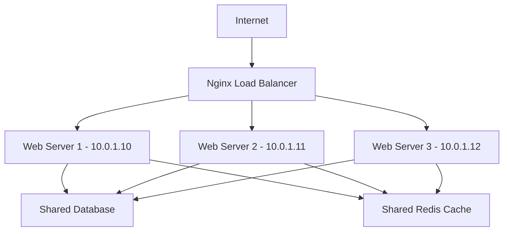

# How to Use Ansible to Set Up a Load-Balanced Web Application

Author: [nawazdhandala](https://www.github.com/nawazdhandala)

Tags: Ansible, Load Balancing, Nginx, Web Application

Description: Deploy a load-balanced web application with Ansible using Nginx as a reverse proxy, multiple backend servers, and health check monitoring.

---

A single web server cannot handle growing traffic forever. Load balancing distributes requests across multiple backend servers, improving both performance and reliability. If one backend server goes down, the load balancer routes traffic to the remaining healthy servers. Ansible automates the entire setup: load balancer configuration, backend deployment, and health monitoring.

## Architecture



## Inventory

```yaml
# inventories/production/hosts.yml
all:
  children:
    loadbalancers:
      hosts:
        lb01.example.com:
          ansible_host: 10.0.0.10
    webservers:
      hosts:
        web01.example.com:
          ansible_host: 10.0.1.10
        web02.example.com:
          ansible_host: 10.0.1.11
        web03.example.com:
          ansible_host: 10.0.1.12
    dbservers:
      hosts:
        db01.example.com:
          ansible_host: 10.0.2.10
```

```yaml
# inventories/production/group_vars/all.yml
app_name: webapp
app_port: 8080
app_health_path: /health
lb_algorithm: least_conn
lb_domain: app.example.com
```

## Load Balancer Role

```yaml
# roles/lb_nginx/tasks/main.yml
# Configure Nginx as a load balancer

- name: Install Nginx
  ansible.builtin.apt:
    name: nginx
    state: present
    update_cache: yes

- name: Deploy load balancer configuration
  ansible.builtin.template:
    src: lb.conf.j2
    dest: /etc/nginx/sites-available/loadbalancer.conf
    validate: nginx -t -c /dev/stdin < %s
  notify: reload nginx

- name: Enable load balancer configuration
  ansible.builtin.file:
    src: /etc/nginx/sites-available/loadbalancer.conf
    dest: /etc/nginx/sites-enabled/loadbalancer.conf
    state: link
  notify: reload nginx

- name: Remove default site
  ansible.builtin.file:
    path: /etc/nginx/sites-enabled/default
    state: absent
  notify: reload nginx

- name: Deploy Nginx main config
  ansible.builtin.template:
    src: nginx.conf.j2
    dest: /etc/nginx/nginx.conf
    validate: nginx -t -c %s
  notify: reload nginx

- name: Ensure Nginx is running
  ansible.builtin.service:
    name: nginx
    state: started
    enabled: yes
```

```jinja2
{# roles/lb_nginx/templates/lb.conf.j2 #}
# Upstream backend pool
upstream {{ app_name }}_backend {
    {{ lb_algorithm }};


    server {{ hostvars[host].ansible_host }}:{{ app_port }} max_fails=3 fail_timeout=30s;


    # Keep connections alive to backends
    keepalive 32;
}

server {
    listen 80;
    server_name {{ lb_domain }};

    # Access and error logs
    access_log /var/log/nginx/{{ app_name }}-access.log;
    error_log /var/log/nginx/{{ app_name }}-error.log;

    # Client settings
    client_max_body_size 50m;
    client_body_timeout 60s;

    location / {
        proxy_pass http://{{ app_name }}_backend;
        proxy_set_header Host $host;
        proxy_set_header X-Real-IP $remote_addr;
        proxy_set_header X-Forwarded-For $proxy_add_x_forwarded_for;
        proxy_set_header X-Forwarded-Proto $scheme;

        # Timeouts
        proxy_connect_timeout 10s;
        proxy_send_timeout 60s;
        proxy_read_timeout 60s;

        # Keep alive to backends
        proxy_http_version 1.1;
        proxy_set_header Connection "";
    }

    # Health check endpoint
    location /lb-health {
        access_log off;
        return 200 "OK\n";
    }

    # Load balancer status
    location /nginx-status {
        stub_status on;
        allow 10.0.0.0/8;
        deny all;
    }
}
```

## Web Server Role

```yaml
# roles/web_app/tasks/main.yml
# Deploy the web application on backend servers

- name: Install application dependencies
  ansible.builtin.apt:
    name:
      - python3
      - python3-pip
      - python3-venv
    state: present

- name: Create application user
  ansible.builtin.user:
    name: "{{ app_name }}"
    system: yes
    shell: /bin/bash

- name: Create application directory
  ansible.builtin.file:
    path: "/opt/{{ app_name }}"
    state: directory
    owner: "{{ app_name }}"
    mode: '0755'

- name: Deploy application code
  ansible.builtin.git:
    repo: "{{ app_repo }}"
    dest: "/opt/{{ app_name }}"
    version: "{{ app_version }}"
  become_user: "{{ app_name }}"
  notify: restart app

- name: Install Python dependencies
  ansible.builtin.pip:
    requirements: "/opt/{{ app_name }}/requirements.txt"
    virtualenv: "/opt/{{ app_name }}/venv"
  become_user: "{{ app_name }}"
  notify: restart app

- name: Deploy systemd service
  ansible.builtin.template:
    src: app.service.j2
    dest: "/etc/systemd/system/{{ app_name }}.service"
    mode: '0644'
  notify:
    - daemon reload
    - restart app

- name: Ensure application is running
  ansible.builtin.service:
    name: "{{ app_name }}"
    state: started
    enabled: yes
```

## Rolling Deployment

Deploy to backends one at a time without downtime:

```yaml
# playbooks/rolling-deploy.yml
- name: Rolling deployment
  hosts: webservers
  become: yes
  serial: 1

  pre_tasks:
    - name: Disable server in load balancer
      ansible.builtin.command:
        cmd: >
          curl -s http://{{ hostvars[groups['loadbalancers'][0]].ansible_host }}/nginx-status
      delegate_to: localhost
      changed_when: false

  roles:
    - web_app

  post_tasks:
    - name: Wait for application to start
      ansible.builtin.uri:
        url: "http://localhost:{{ app_port }}{{ app_health_path }}"
        status_code: 200
      retries: 15
      delay: 5

    - name: Wait before processing next server
      ansible.builtin.pause:
        seconds: 10
```

## Main Playbook

```yaml
# playbooks/lb-webapp.yml
- name: Deploy database
  hosts: dbservers
  become: yes
  roles:
    - postgresql

- name: Deploy web application
  hosts: webservers
  become: yes
  roles:
    - common
    - web_app

- name: Configure load balancer
  hosts: loadbalancers
  become: yes
  roles:
    - lb_nginx

  post_tasks:
    - name: Verify load balancer
      ansible.builtin.uri:
        url: "http://{{ lb_domain }}{{ app_health_path }}"
        status_code: 200
      delegate_to: localhost
```

## Summary

A load-balanced web application with Ansible uses Nginx as a reverse proxy distributing traffic across multiple backend servers. The `least_conn` algorithm sends new requests to the server with the fewest active connections. Built-in health checks remove failed backends automatically. Rolling deployments update one server at a time so the application stays available throughout. The entire configuration is template-driven, making it easy to add or remove backend servers by updating the inventory.

## Common Use Cases

Here are several practical scenarios where this module proves essential in real-world playbooks.

### Infrastructure Provisioning Workflow

```yaml
# Complete workflow incorporating this module
- name: Infrastructure provisioning
  hosts: all
  become: true
  gather_facts: true
  tasks:
    - name: Gather system information
      ansible.builtin.setup:
        gather_subset:
          - hardware
          - network

    - name: Display system summary
      ansible.builtin.debug:
        msg: >-
          Host {{ inventory_hostname }} has
          {{ ansible_memtotal_mb }}MB RAM,
          {{ ansible_processor_vcpus }} vCPUs,
          running {{ ansible_distribution }} {{ ansible_distribution_version }}

    - name: Install required packages
      ansible.builtin.package:
        name:
          - curl
          - wget
          - git
          - vim
          - htop
          - jq
        state: present

    - name: Configure system timezone
      ansible.builtin.timezone:
        name: "{{ system_timezone | default('UTC') }}"

    - name: Configure hostname
      ansible.builtin.hostname:
        name: "{{ inventory_hostname }}"

    - name: Update /etc/hosts
      ansible.builtin.lineinfile:
        path: /etc/hosts
        regexp: '^127\.0\.1\.1'
        line: "127.0.1.1 {{ inventory_hostname }}"

    - name: Configure SSH hardening
      ansible.builtin.lineinfile:
        path: /etc/ssh/sshd_config
        regexp: "{{ item.regexp }}"
        line: "{{ item.line }}"
      loop:
        - { regexp: '^PermitRootLogin', line: 'PermitRootLogin no' }
        - { regexp: '^PasswordAuthentication', line: 'PasswordAuthentication no' }
      notify: restart sshd

    - name: Configure firewall rules
      community.general.ufw:
        rule: allow
        port: "{{ item }}"
        proto: tcp
      loop:
        - "22"
        - "80"
        - "443"

    - name: Enable firewall
      community.general.ufw:
        state: enabled
        policy: deny

  handlers:
    - name: restart sshd
      ansible.builtin.service:
        name: sshd
        state: restarted
```

### Integration with Monitoring

```yaml
# Using gathered facts to configure monitoring thresholds
- name: Configure monitoring based on system specs
  hosts: all
  become: true
  tasks:
    - name: Set monitoring thresholds based on hardware
      ansible.builtin.template:
        src: monitoring_config.yml.j2
        dest: /etc/monitoring/config.yml
      vars:
        memory_warning_threshold: "{{ (ansible_memtotal_mb * 0.8) | int }}"
        memory_critical_threshold: "{{ (ansible_memtotal_mb * 0.95) | int }}"
        cpu_warning_threshold: 80
        cpu_critical_threshold: 95

    - name: Register host with monitoring system
      ansible.builtin.uri:
        url: "https://monitoring.example.com/api/hosts"
        method: POST
        body_format: json
        body:
          hostname: "{{ inventory_hostname }}"
          ip_address: "{{ ansible_default_ipv4.address }}"
          os: "{{ ansible_distribution }}"
          memory_mb: "{{ ansible_memtotal_mb }}"
          cpus: "{{ ansible_processor_vcpus }}"
        headers:
          Authorization: "Bearer {{ monitoring_api_token }}"
        status_code: [200, 201, 409]
```

### Error Handling Patterns

```yaml
# Robust error handling with this module
- name: Robust task execution
  hosts: all
  tasks:
    - name: Attempt primary operation
      ansible.builtin.command: /opt/app/primary-task.sh
      register: primary_result
      failed_when: false

    - name: Handle primary failure with fallback
      ansible.builtin.command: /opt/app/fallback-task.sh
      when: primary_result.rc != 0
      register: fallback_result

    - name: Report final status
      ansible.builtin.debug:
        msg: >-
          Task completed via {{ 'primary' if primary_result.rc == 0 else 'fallback' }} path.
          Return code: {{ primary_result.rc if primary_result.rc == 0 else fallback_result.rc }}

    - name: Fail if both paths failed
      ansible.builtin.fail:
        msg: "Both primary and fallback operations failed"
      when:
        - primary_result.rc != 0
        - fallback_result is defined
        - fallback_result.rc != 0
```

### Scheduling and Automation

```yaml
# Set up scheduled compliance scans using cron
- name: Configure automated scans
  hosts: all
  become: true
  tasks:
    - name: Create scan script
      ansible.builtin.copy:
        dest: /opt/scripts/compliance_scan.sh
        mode: '0755'
        content: |
          #!/bin/bash
          cd /opt/ansible
          ansible-playbook playbooks/validate.yml -i inventory/ > /var/log/compliance_scan.log 2>&1
          EXIT_CODE=$?
          if [ $EXIT_CODE -ne 0 ]; then
            curl -X POST https://hooks.example.com/alert \
              -H "Content-Type: application/json" \
              -d "{\"text\":\"Compliance scan failed on $(hostname)\"}"
          fi
          exit $EXIT_CODE

    - name: Schedule weekly compliance scan
      ansible.builtin.cron:
        name: "Weekly compliance scan"
        minute: "0"
        hour: "3"
        weekday: "1"
        job: "/opt/scripts/compliance_scan.sh"
        user: ansible
```

