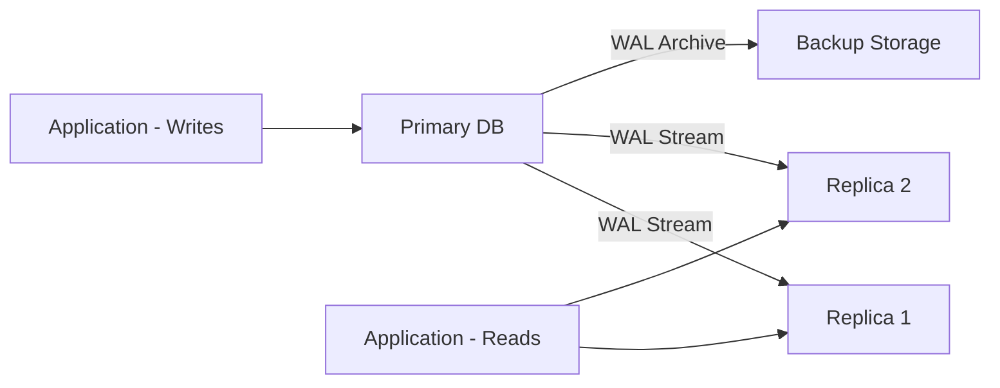

# How to Use Ansible to Set Up a Master-Slave Database Replication

Author: [nawazdhandala](https://www.github.com/nawazdhandala)

Tags: Ansible, PostgreSQL, Database Replication, High Availability

Description: Configure PostgreSQL streaming replication with Ansible including primary server setup, replica configuration, and automated failover monitoring.

---

Database replication creates copies of your data on multiple servers. The primary (master) handles writes, and replicas (slaves) handle read traffic and serve as failover targets. Setting this up manually is error-prone because the configuration on primary and replica must be coordinated precisely. Ansible handles both sides in a single playbook run.

## Inventory

```yaml
# inventories/production/hosts.yml
all:
  children:
    db_primary:
      hosts:
        db-primary.example.com:
          ansible_host: 10.0.2.10
          postgresql_role: primary
    db_replicas:
      hosts:
        db-replica01.example.com:
          ansible_host: 10.0.2.11
          postgresql_role: replica
        db-replica02.example.com:
          ansible_host: 10.0.2.12
          postgresql_role: replica
    dbservers:
      children:
        db_primary:
        db_replicas:
```

```yaml
# inventories/production/group_vars/dbservers.yml
postgresql_version: 15
postgresql_data_dir: "/var/lib/postgresql/{{ postgresql_version }}/main"
postgresql_config_dir: "/etc/postgresql/{{ postgresql_version }}/main"
postgresql_port: 5432
postgresql_replication_user: replicator
postgresql_replication_password: "{{ vault_replication_password }}"
postgresql_max_wal_senders: 5
postgresql_wal_keep_size: "1GB"
```

## Primary Server Configuration

```yaml
# roles/postgresql_primary/tasks/main.yml
# Configure PostgreSQL primary for streaming replication

- name: Install PostgreSQL
  ansible.builtin.apt:
    name:
      - "postgresql-{{ postgresql_version }}"
      - "postgresql-client-{{ postgresql_version }}"
      - python3-psycopg2
    state: present
    update_cache: yes

- name: Deploy PostgreSQL configuration
  ansible.builtin.template:
    src: postgresql.conf.j2
    dest: "{{ postgresql_config_dir }}/postgresql.conf"
    owner: postgres
    group: postgres
    mode: '0644'
  notify: restart postgresql

- name: Deploy pg_hba.conf for replication access
  ansible.builtin.template:
    src: pg_hba.conf.j2
    dest: "{{ postgresql_config_dir }}/pg_hba.conf"
    owner: postgres
    group: postgres
    mode: '0640'
  notify: reload postgresql

- name: Ensure PostgreSQL is running
  ansible.builtin.service:
    name: postgresql
    state: started
    enabled: yes

- name: Create replication user
  community.postgresql.postgresql_user:
    name: "{{ postgresql_replication_user }}"
    password: "{{ postgresql_replication_password }}"
    role_attr_flags: REPLICATION,LOGIN
    state: present
  become_user: postgres
  no_log: true

- name: Create replication slot for each replica
  community.postgresql.postgresql_slot:
    name: "{{ hostvars[item].inventory_hostname | replace('.', '_') | replace('-', '_') }}"
    slot_type: physical
    state: present
  become_user: postgres
  loop: "{{ groups['db_replicas'] }}"
```

```jinja2
{# roles/postgresql_primary/templates/postgresql.conf.j2 #}
# PostgreSQL primary configuration for replication
listen_addresses = '*'
port = {{ postgresql_port }}
max_connections = 200

# WAL configuration for replication
wal_level = replica
max_wal_senders = {{ postgresql_max_wal_senders }}
wal_keep_size = {{ postgresql_wal_keep_size }}
synchronous_commit = on
archive_mode = on
archive_command = 'cp %p /var/lib/postgresql/wal_archive/%f'

# Performance
shared_buffers = {{ (ansible_memtotal_mb * 0.25) | int }}MB
effective_cache_size = {{ (ansible_memtotal_mb * 0.75) | int }}MB
work_mem = 16MB
maintenance_work_mem = 256MB

# Logging
log_destination = 'stderr'
logging_collector = on
log_directory = 'log'
log_filename = 'postgresql-%Y-%m-%d.log'
```

```jinja2
{# roles/postgresql_primary/templates/pg_hba.conf.j2 #}
# PostgreSQL host-based authentication
local   all         postgres                          peer
local   all         all                               peer
host    all         all         127.0.0.1/32          scram-sha-256
host    all         all         ::1/128               scram-sha-256

# Replication access for replicas

host    replication {{ postgresql_replication_user }} {{ hostvars[host].ansible_host }}/32 scram-sha-256


# Application access
host    all         all         10.0.0.0/8            scram-sha-256
```

## Replica Server Configuration

```yaml
# roles/postgresql_replica/tasks/main.yml
# Configure PostgreSQL replica for streaming replication

- name: Install PostgreSQL
  ansible.builtin.apt:
    name:
      - "postgresql-{{ postgresql_version }}"
      - "postgresql-client-{{ postgresql_version }}"
      - python3-psycopg2
    state: present

- name: Stop PostgreSQL for initial sync
  ansible.builtin.service:
    name: postgresql
    state: stopped

- name: Remove existing data directory
  ansible.builtin.file:
    path: "{{ postgresql_data_dir }}"
    state: absent

- name: Run pg_basebackup from primary
  ansible.builtin.command:
    cmd: >
      pg_basebackup
      -h {{ hostvars[groups['db_primary'][0]].ansible_host }}
      -U {{ postgresql_replication_user }}
      -D {{ postgresql_data_dir }}
      -Fp -Xs -P -R
      -S {{ inventory_hostname | replace('.', '_') | replace('-', '_') }}
  become_user: postgres
  environment:
    PGPASSWORD: "{{ postgresql_replication_password }}"
  no_log: true

- name: Deploy replica configuration
  ansible.builtin.template:
    src: postgresql-replica.conf.j2
    dest: "{{ postgresql_config_dir }}/postgresql.conf"
    owner: postgres
    group: postgres
    mode: '0644'

- name: Set correct data directory ownership
  ansible.builtin.file:
    path: "{{ postgresql_data_dir }}"
    owner: postgres
    group: postgres
    recurse: yes

- name: Start PostgreSQL replica
  ansible.builtin.service:
    name: postgresql
    state: started
    enabled: yes

- name: Wait for replica to connect
  ansible.builtin.command:
    cmd: psql -c "SELECT pg_is_in_recovery()"
  become_user: postgres
  register: recovery_status
  retries: 30
  delay: 2
  until: "'t' in recovery_status.stdout"
  changed_when: false
```

## Replication Architecture



## Verify Replication

```yaml
# playbooks/verify-replication.yml
- name: Verify replication status
  hosts: db_primary
  become: yes
  tasks:
    - name: Check replication status on primary
      ansible.builtin.command:
        cmd: psql -c "SELECT client_addr, state, sent_lsn, write_lsn, replay_lsn, sync_state FROM pg_stat_replication"
      become_user: postgres
      register: repl_status
      changed_when: false

    - name: Display replication status
      ansible.builtin.debug:
        msg: "{{ repl_status.stdout }}"

- name: Verify replicas are in recovery
  hosts: db_replicas
  become: yes
  tasks:
    - name: Check recovery status
      ansible.builtin.command:
        cmd: psql -c "SELECT pg_is_in_recovery(), pg_last_wal_receive_lsn(), pg_last_wal_replay_lsn()"
      become_user: postgres
      register: replica_status
      changed_when: false

    - name: Display replica status
      ansible.builtin.debug:
        msg: "{{ replica_status.stdout }}"
```

## Main Playbook

```yaml
# playbooks/db-replication.yml
- name: Configure primary database
  hosts: db_primary
  become: yes
  roles:
    - postgresql_primary

- name: Configure replica databases
  hosts: db_replicas
  become: yes
  serial: 1
  roles:
    - postgresql_replica

- name: Verify replication
  ansible.builtin.import_playbook: verify-replication.yml
```

## Summary

PostgreSQL streaming replication with Ansible configures the primary server for WAL shipping, creates replication users and slots, and uses `pg_basebackup` to initialize replicas. The primary sends WAL records to replicas in real time, keeping them synchronized. Replication slots ensure the primary retains WAL segments until all replicas have consumed them. Verification tasks confirm replication is working and replicas are in recovery mode. The entire setup is idempotent for the primary configuration and can be extended to add more replicas by simply adding hosts to the inventory.
