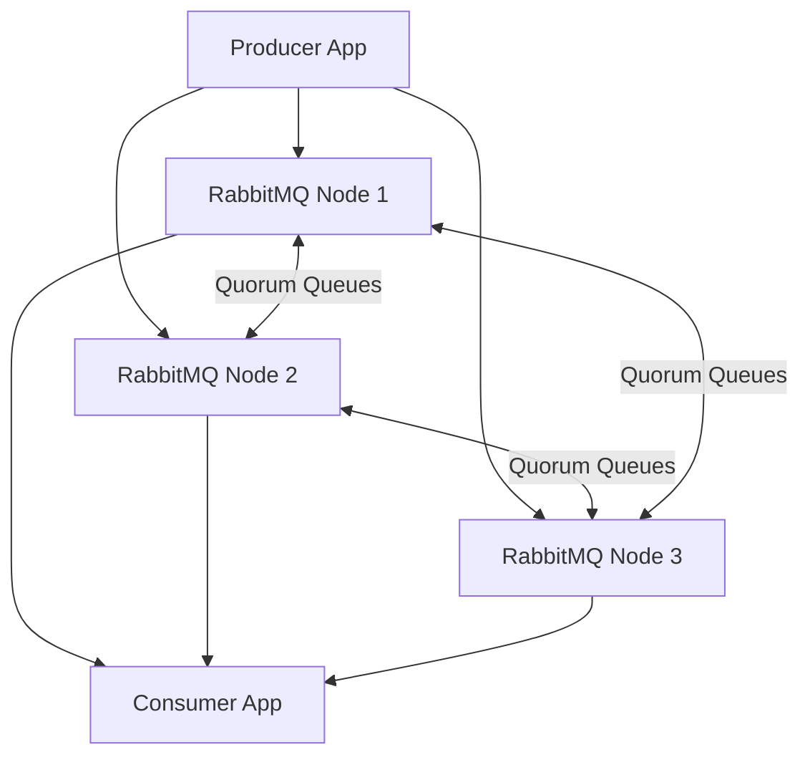

# How to Use Ansible to Set Up a RabbitMQ Cluster

Author: [nawazdhandala](https://www.github.com/nawazdhandala)

Tags: Ansible, RabbitMQ, Message Queue, Clustering

Description: Deploy a production-ready RabbitMQ cluster using Ansible with mirrored queues, management UI, and automated node joining for reliable message delivery.

---

RabbitMQ clustering provides message queue high availability. When nodes are clustered, exchanges, bindings, users, virtual hosts, and other broker metadata are replicated across all nodes. Queue contents require a replicated queue type, such as quorum queues, so that if one node goes down, the remaining nodes can continue processing messages as long as a quorum of queue replicas is available. Ansible automates the tricky parts: sharing the Erlang cookie, joining nodes to the cluster, and configuring quorum queues.

## Inventory

```yaml
# inventories/production/hosts.yml

all:
  children:
    rabbitmq_cluster:
      hosts:
        rmq01.example.com:
          ansible_host: 10.0.4.10
          rabbitmq_cluster_master: true
        rmq02.example.com:
          ansible_host: 10.0.4.11
        rmq03.example.com:
          ansible_host: 10.0.4.12
```

```yaml
# inventories/production/group_vars/rabbitmq_cluster.yml
rabbitmq_version: "3.13.7"
rabbitmq_erlang_version: "1:26.2.5.13-1"
rabbitmq_erlang_cookie: "{{ vault_erlang_cookie }}"
rabbitmq_admin_user: admin
rabbitmq_admin_password: "{{ vault_rabbitmq_admin_password }}"
rabbitmq_app_user: appuser
rabbitmq_app_password: "{{ vault_rabbitmq_app_password }}"
rabbitmq_app_vhost: /production
rabbitmq_cluster_name: "prod-rabbitmq"
```

## RabbitMQ Role

```yaml
# roles/rabbitmq/tasks/main.yml
# Install and configure RabbitMQ

- name: Install repository dependencies
  ansible.builtin.apt:
    name:
      - curl
      - gnupg
      - apt-transport-https
    state: present
    update_cache: yes

- name: Download RabbitMQ signing key
  ansible.builtin.get_url:
    url: https://keys.openpgp.org/vks/v1/by-fingerprint/0A9AF2115F4687BD29803A206B73A36E6026DFCA
    dest: /usr/share/keyrings/com.rabbitmq.team.asc
    mode: '0644'

- name: Add Erlang repository
  ansible.builtin.apt_repository:
    repo: "deb [arch=amd64 signed-by=/usr/share/keyrings/com.rabbitmq.team.asc] https://deb1.rabbitmq.com/rabbitmq-erlang/ubuntu {{ ansible_distribution_release }} main"
    state: present
    filename: rabbitmq

- name: Add RabbitMQ repository
  ansible.builtin.apt_repository:
    repo: "deb [arch=amd64 signed-by=/usr/share/keyrings/com.rabbitmq.team.asc] https://deb1.rabbitmq.com/rabbitmq-server/ubuntu {{ ansible_distribution_release }} main"
    state: present
    filename: rabbitmq

- name: Install Erlang dependencies
  ansible.builtin.apt:
    name:
      - "erlang-base={{ rabbitmq_erlang_version }}"
      - "erlang-asn1={{ rabbitmq_erlang_version }}"
      - "erlang-crypto={{ rabbitmq_erlang_version }}"
      - "erlang-eldap={{ rabbitmq_erlang_version }}"
      - "erlang-ftp={{ rabbitmq_erlang_version }}"
      - "erlang-inets={{ rabbitmq_erlang_version }}"
      - "erlang-mnesia={{ rabbitmq_erlang_version }}"
      - "erlang-os-mon={{ rabbitmq_erlang_version }}"
      - "erlang-parsetools={{ rabbitmq_erlang_version }}"
      - "erlang-public-key={{ rabbitmq_erlang_version }}"
      - "erlang-runtime-tools={{ rabbitmq_erlang_version }}"
      - "erlang-snmp={{ rabbitmq_erlang_version }}"
      - "erlang-ssl={{ rabbitmq_erlang_version }}"
      - "erlang-syntax-tools={{ rabbitmq_erlang_version }}"
      - "erlang-tftp={{ rabbitmq_erlang_version }}"
      - "erlang-tools={{ rabbitmq_erlang_version }}"
      - "erlang-xmerl={{ rabbitmq_erlang_version }}"
    state: present
    update_cache: yes

- name: Install RabbitMQ
  ansible.builtin.apt:
    name: "rabbitmq-server={{ rabbitmq_version }}*"
    state: present
    update_cache: yes

- name: Stop RabbitMQ for initial configuration
  ansible.builtin.service:
    name: rabbitmq-server
    state: stopped

- name: Deploy Erlang cookie for cluster authentication
  ansible.builtin.copy:
    content: "{{ rabbitmq_erlang_cookie }}"
    dest: /var/lib/rabbitmq/.erlang.cookie
    owner: rabbitmq
    group: rabbitmq
    mode: '0400'
  no_log: true

- name: Deploy RabbitMQ configuration
  ansible.builtin.template:
    src: rabbitmq.conf.j2
    dest: /etc/rabbitmq/rabbitmq.conf
    owner: rabbitmq
    group: rabbitmq
    mode: '0644'

- name: Deploy RabbitMQ environment config
  ansible.builtin.template:
    src: rabbitmq-env.conf.j2
    dest: /etc/rabbitmq/rabbitmq-env.conf
    owner: rabbitmq
    group: rabbitmq
    mode: '0644'

- name: Start RabbitMQ
  ansible.builtin.service:
    name: rabbitmq-server
    state: started
    enabled: yes

- name: Wait for RabbitMQ to start
  ansible.builtin.wait_for:
    port: 5672
    delay: 10
    timeout: 60

- name: Enable management plugin
  community.rabbitmq.rabbitmq_plugin:
    names: rabbitmq_management
    state: enabled

- name: Include cluster joining tasks
  ansible.builtin.include_tasks: cluster.yml
  when: not (rabbitmq_cluster_master | default(false))

- name: Configure users and permissions
  ansible.builtin.include_tasks: users.yml
  when: rabbitmq_cluster_master | default(false)
```

```jinja2
{# roles/rabbitmq/templates/rabbitmq.conf.j2 #}
# RabbitMQ configuration
listeners.tcp.default = 5672
management.tcp.port = 15672
management.tcp.ip = 0.0.0.0

# Cluster configuration
cluster_formation.peer_discovery_backend = classic_config

cluster_formation.classic_config.nodes.{{ loop.index }} = rabbit@{{ hostvars[host].inventory_hostname.split('.')[0] }}


# Resource limits
vm_memory_high_watermark.relative = 0.7
disk_free_limit.absolute = 2GB

# Logging
log.file.level = info
log.console = false
```

```jinja2
{# roles/rabbitmq/templates/rabbitmq-env.conf.j2 #}
NODENAME=rabbit@{{ inventory_hostname.split('.')[0] }}
```

## Cluster Joining

```yaml
# roles/rabbitmq/tasks/cluster.yml
# Join this node to the RabbitMQ cluster

- name: Stop RabbitMQ application
  ansible.builtin.command: rabbitmqctl stop_app
  changed_when: true

- name: Reset node
  ansible.builtin.command: rabbitmqctl reset
  changed_when: true

- name: Join cluster
  ansible.builtin.command: >
    rabbitmqctl join_cluster
    rabbit@{{ hostvars[groups['rabbitmq_cluster'] | first].inventory_hostname.split('.')[0] }}
  register: join_result
  changed_when: true
  failed_when:
    - join_result.rc != 0
    - "'already_member' not in join_result.stderr"

- name: Start RabbitMQ application
  ansible.builtin.command: rabbitmqctl start_app
  changed_when: true
```

## User and Permission Setup

```yaml
# roles/rabbitmq/tasks/users.yml
# Configure users, vhosts, and permissions

- name: Remove default guest user
  community.rabbitmq.rabbitmq_user:
    user: guest
    state: absent

- name: Create admin user
  community.rabbitmq.rabbitmq_user:
    user: "{{ rabbitmq_admin_user }}"
    password: "{{ rabbitmq_admin_password }}"
    tags: administrator
    vhost: /
    configure_priv: ".*"
    read_priv: ".*"
    write_priv: ".*"
    state: present
  no_log: true

- name: Create application vhost
  community.rabbitmq.rabbitmq_vhost:
    name: "{{ rabbitmq_app_vhost }}"
    state: present

- name: Set application vhost default queue type
  ansible.builtin.command: >
    rabbitmqctl update_vhost_metadata {{ rabbitmq_app_vhost }}
    --default-queue-type quorum
  changed_when: true

- name: Create application user
  community.rabbitmq.rabbitmq_user:
    user: "{{ rabbitmq_app_user }}"
    password: "{{ rabbitmq_app_password }}"
    vhost: "{{ rabbitmq_app_vhost }}"
    configure_priv: ".*"
    read_priv: ".*"
    write_priv: ".*"
    state: present
  no_log: true

- name: Set quorum queue policy
  community.rabbitmq.rabbitmq_policy:
    name: quorum-replication
    pattern: ".*"
    vhost: "{{ rabbitmq_app_vhost }}"
    apply_to: quorum_queues
    tags:
      target-group-size: 3
    state: present

- name: Set cluster name
  ansible.builtin.command: "rabbitmqctl set_cluster_name {{ rabbitmq_cluster_name }}"
  changed_when: true
```

## RabbitMQ Cluster Architecture


```mermaid
graph TD
    A[Producer App] --> B[RabbitMQ Node 1]
    A --> C[RabbitMQ Node 2]
    A --> D[RabbitMQ Node 3]
    B <-->|Quorum Queues| C
    C <-->|Quorum Queues| D
    D <-->|Quorum Queues| B
    B --> E[Consumer App]
    C --> E
    D --> E
```

## Cluster Verification

```yaml
# playbooks/verify-rabbitmq.yml
- name: Verify RabbitMQ Cluster
  hosts: rabbitmq_cluster[0]
  become: yes
  tasks:
    - name: Check cluster status
      ansible.builtin.command: rabbitmqctl cluster_status
      register: cluster_status
      changed_when: false

    - name: Display cluster status
      ansible.builtin.debug:
        msg: "{{ cluster_status.stdout_lines }}"

    - name: Verify all nodes are in the cluster
      ansible.builtin.assert:
        that:
          - "'rabbit@' ~ (hostvars[item].inventory_hostname.split('.')[0]) in cluster_status.stdout"
        fail_msg: "Not all nodes are in the cluster"
      loop: "{{ groups['rabbitmq_cluster'] }}"

    - name: Check quorum queue policy
      ansible.builtin.command: rabbitmqctl list_policies -p {{ rabbitmq_app_vhost }}
      register: policies
      changed_when: false

    - name: Verify quorum policy exists
      ansible.builtin.assert:
        that:
          - "'quorum-replication' in policies.stdout"

    - name: Verify vhost default queue type
      ansible.builtin.command: rabbitmqctl list_vhosts name default_queue_type
      register: vhosts
      changed_when: false

    - name: Confirm application vhost uses quorum queues by default
      ansible.builtin.assert:
        that:
          - "rabbitmq_app_vhost in vhosts.stdout"
          - "'quorum' in vhosts.stdout"
```

## Main Playbook

```yaml
# playbooks/rabbitmq-cluster.yml
- name: Deploy RabbitMQ Cluster
  hosts: rabbitmq_cluster
  become: yes
  serial: 1
  order: inventory
  roles:
    - rabbitmq

- ansible.builtin.import_playbook: verify-rabbitmq.yml
```

## Summary

RabbitMQ clustering with Ansible handles Erlang cookie distribution, sequential node joining, management plugin activation, user/permission setup, and quorum queue configuration. The shared Erlang cookie authenticates nodes to each other. The first node starts normally while subsequent nodes stop their app, reset, and join the cluster. Quorum queues ensure messages can survive node failures when a majority of replicas remains available. The management plugin provides a web UI for monitoring at port 15672.
