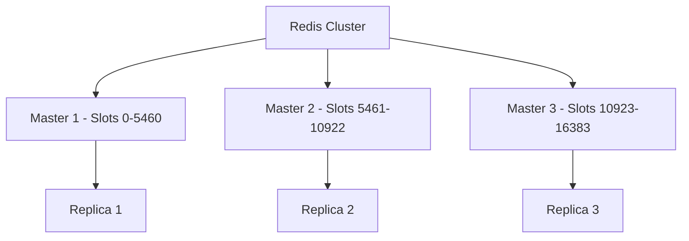

# How to Use Ansible to Set Up a Redis Cluster

Author: [nawazdhandala](https://www.github.com/nawazdhandala)

Tags: Ansible, Redis, Clustering, Caching, High Availability

Description: Deploy a production-ready Redis Cluster with Ansible including data sharding, replication, automatic failover, and cluster health monitoring.

---

Redis Cluster distributes data across multiple nodes using hash slots. Each node owns a subset of the 16384 hash slots, and data is automatically sharded based on the key's hash. Combined with replication, Redis Cluster provides both horizontal scaling and high availability. Setting it up requires precise coordination between nodes, which Ansible handles well.

## Cluster Architecture

A minimum Redis Cluster needs 6 nodes: 3 masters and 3 replicas.



## Inventory

```yaml
# inventories/production/hosts.yml
all:
  children:
    redis_cluster:
      hosts:
        redis01.example.com:
          ansible_host: 10.0.3.10
          redis_port: 6379
        redis02.example.com:
          ansible_host: 10.0.3.11
          redis_port: 6379
        redis03.example.com:
          ansible_host: 10.0.3.12
          redis_port: 6379
        redis04.example.com:
          ansible_host: 10.0.3.13
          redis_port: 6379
        redis05.example.com:
          ansible_host: 10.0.3.14
          redis_port: 6379
        redis06.example.com:
          ansible_host: 10.0.3.15
          redis_port: 6379
```

```yaml
# inventories/production/group_vars/redis_cluster.yml
redis_version: "7.2"
redis_password: "{{ vault_redis_password }}"
redis_maxmemory: "{{ (ansible_memtotal_mb * 0.7) | int }}mb"
redis_maxmemory_policy: allkeys-lru
redis_cluster_replicas: 1
```

## Redis Role

```yaml
# roles/redis_cluster/tasks/main.yml
# Install and configure Redis for cluster mode

- name: Install Redis
  ansible.builtin.apt:
    name: redis-server
    state: present
    update_cache: yes

- name: Deploy Redis cluster configuration
  ansible.builtin.template:
    src: redis.conf.j2
    dest: /etc/redis/redis.conf
    owner: redis
    group: redis
    mode: '0640'
  notify: restart redis

- name: Set kernel parameters for Redis
  ansible.posix.sysctl:
    name: "{{ item.name }}"
    value: "{{ item.value }}"
    sysctl_set: yes
    state: present
  loop:
    - { name: vm.overcommit_memory, value: '1' }
    - { name: net.core.somaxconn, value: '65535' }

- name: Disable Transparent Huge Pages
  ansible.builtin.command: echo never > /sys/kernel/mm/transparent_hugepage/enabled
  changed_when: false

- name: Create cluster config directory
  ansible.builtin.file:
    path: /var/lib/redis/cluster
    state: directory
    owner: redis
    group: redis
    mode: '0750'

- name: Ensure Redis is running
  ansible.builtin.service:
    name: redis-server
    state: started
    enabled: yes

- name: Wait for Redis to accept connections
  ansible.builtin.wait_for:
    port: "{{ redis_port }}"
    delay: 3
    timeout: 30
```

```jinja2
{# roles/redis_cluster/templates/redis.conf.j2 #}
# Redis Cluster Configuration
bind {{ ansible_host }} 127.0.0.1
port {{ redis_port }}
protected-mode yes
requirepass {{ redis_password }}
masterauth {{ redis_password }}

# Cluster settings
cluster-enabled yes
cluster-config-file /var/lib/redis/cluster/nodes.conf
cluster-node-timeout 5000
cluster-announce-ip {{ ansible_host }}
cluster-announce-port {{ redis_port }}
cluster-announce-bus-port {{ redis_port | int + 10000 }}

# Memory
maxmemory {{ redis_maxmemory }}
maxmemory-policy {{ redis_maxmemory_policy }}

# Persistence
save 900 1
save 300 10
save 60 10000
appendonly yes
appendfsync everysec
dir /var/lib/redis

# Performance
tcp-backlog 65535
tcp-keepalive 300
timeout 0

# Logging
loglevel notice
logfile /var/log/redis/redis-server.log
```

## Cluster Initialization

```yaml
# roles/redis_cluster/tasks/create-cluster.yml
# Initialize the Redis Cluster (run once after all nodes are configured)

- name: Build cluster create command
  ansible.builtin.set_fact:
    cluster_nodes: "{{ groups['redis_cluster'] | map('extract', hostvars, ['ansible_host']) | zip(groups['redis_cluster'] | map('extract', hostvars, ['redis_port'])) | map('join', ':') | join(' ') }}"
  run_once: true

- name: Check if cluster already exists
  ansible.builtin.command:
    cmd: "redis-cli -a {{ redis_password }} -h {{ ansible_host }} cluster info"
  register: cluster_info
  changed_when: false
  no_log: true

- name: Create Redis Cluster
  ansible.builtin.command:
    cmd: >
      redis-cli -a {{ redis_password }}
      --cluster create {{ cluster_nodes }}
      --cluster-replicas {{ redis_cluster_replicas }}
      --cluster-yes
  when: "'cluster_state:ok' not in cluster_info.stdout"
  run_once: true
  no_log: true

- name: Wait for cluster to stabilize
  ansible.builtin.command:
    cmd: "redis-cli -a {{ redis_password }} -h {{ ansible_host }} cluster info"
  register: final_status
  until: "'cluster_state:ok' in final_status.stdout"
  retries: 30
  delay: 2
  changed_when: false
  no_log: true
```

## Cluster Verification

```yaml
# playbooks/verify-redis-cluster.yml
- name: Verify Redis Cluster
  hosts: redis_cluster[0]
  become: yes
  tasks:
    - name: Check cluster info
      ansible.builtin.command:
        cmd: "redis-cli -a {{ redis_password }} cluster info"
      register: cluster_info
      changed_when: false
      no_log: true

    - name: Display cluster info
      ansible.builtin.debug:
        msg: "{{ cluster_info.stdout_lines }}"

    - name: Check cluster nodes
      ansible.builtin.command:
        cmd: "redis-cli -a {{ redis_password }} cluster nodes"
      register: cluster_nodes
      changed_when: false
      no_log: true

    - name: Display cluster nodes
      ansible.builtin.debug:
        msg: "{{ cluster_nodes.stdout_lines }}"

    - name: Verify cluster state is OK
      ansible.builtin.assert:
        that:
          - "'cluster_state:ok' in cluster_info.stdout"
        fail_msg: "Redis cluster state is not OK"

    - name: Test write and read
      ansible.builtin.command:
        cmd: "redis-cli -a {{ redis_password }} -c SET test_key 'ansible_test_value'"
      changed_when: false
      no_log: true

    - name: Verify read from cluster
      ansible.builtin.command:
        cmd: "redis-cli -a {{ redis_password }} -c GET test_key"
      register: read_result
      changed_when: false
      no_log: true

    - name: Confirm data is accessible
      ansible.builtin.assert:
        that:
          - "'ansible_test_value' in read_result.stdout"
```

## Main Playbook

```yaml
# playbooks/redis-cluster.yml
- name: Configure all Redis nodes
  hosts: redis_cluster
  become: yes
  roles:
    - redis_cluster

- name: Initialize cluster
  hosts: redis_cluster
  become: yes
  tasks:
    - name: Create cluster
      ansible.builtin.include_tasks: roles/redis_cluster/tasks/create-cluster.yml

- name: Verify cluster
  ansible.builtin.import_playbook: verify-redis-cluster.yml
```

## Summary

Redis Cluster with Ansible deploys 6 nodes (3 masters, 3 replicas) with automatic data sharding across 16384 hash slots. Each master is backed by a replica for failover. The `redis-cli --cluster create` command handles slot assignment and replica pairing automatically. Ansible ensures consistent configuration across all nodes, proper kernel tuning, and cluster initialization in the correct order. The verification playbook confirms the cluster is operational and data is accessible from any node.
