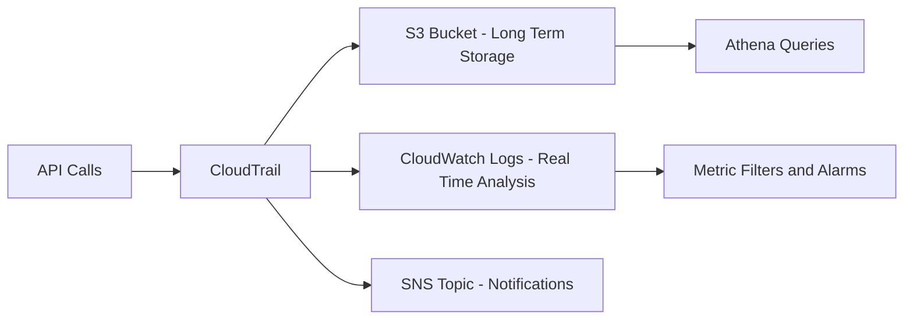

# How to Use Ansible to Set Up AWS CloudTrail

Author: [nawazdhandala](https://www.github.com/nawazdhandala)

Tags: Ansible, AWS, CloudTrail, Security, Compliance

Description: Configure AWS CloudTrail with Ansible to enable API activity logging, set up multi-region trails, and meet audit compliance requirements.

---

CloudTrail records every API call made in your AWS account. Who launched that instance at 3 AM? Who deleted the production S3 bucket? CloudTrail has the answers. It is one of the first services you should enable in any AWS account, and yet it is surprisingly common to find organizations that either have not enabled it or have it configured inconsistently. Ansible lets you set up CloudTrail as part of your account baseline, ensuring every account gets the same logging configuration.

## What CloudTrail Captures

CloudTrail logs contain the identity of the caller, the time of the call, the source IP, the request parameters, and the response. This data feeds into security investigations, compliance audits, and operational troubleshooting.



## Prerequisites

- Ansible 2.9+ with the `amazon.aws` collection
- AWS credentials with CloudTrail, S3, and IAM permissions
- An S3 bucket for log storage (or you can create one in the playbook)

```bash
# Install the required collection
ansible-galaxy collection install amazon.aws
```

## Creating the S3 Bucket for CloudTrail Logs

CloudTrail needs an S3 bucket with the right policy to accept log deliveries. Let's create that first:

```yaml
# create-cloudtrail-bucket.yml - Create and configure the S3 bucket for CloudTrail
---
- name: Create CloudTrail Log Bucket
  hosts: localhost
  connection: local
  gather_facts: false

  vars:
    aws_region: us-east-1
    account_id: "123456789012"
    bucket_name: "cloudtrail-logs-{{ account_id }}"

  tasks:
    - name: Create the S3 bucket for CloudTrail logs
      amazon.aws.s3_bucket:
        name: "{{ bucket_name }}"
        region: "{{ aws_region }}"
        state: present
        versioning: true
        encryption: "AES256"
        tags:
          Purpose: cloudtrail-logs
          ManagedBy: ansible
        policy: |
          {
            "Version": "2012-10-17",
            "Statement": [
              {
                "Sid": "AWSCloudTrailAclCheck",
                "Effect": "Allow",
                "Principal": {
                  "Service": "cloudtrail.amazonaws.com"
                },
                "Action": "s3:GetBucketAcl",
                "Resource": "arn:aws:s3:::{{ bucket_name }}"
              },
              {
                "Sid": "AWSCloudTrailWrite",
                "Effect": "Allow",
                "Principal": {
                  "Service": "cloudtrail.amazonaws.com"
                },
                "Action": "s3:PutObject",
                "Resource": "arn:aws:s3:::{{ bucket_name }}/AWSLogs/{{ account_id }}/*",
                "Condition": {
                  "StringEquals": {
                    "s3:x-amz-acl": "bucket-owner-full-control"
                  }
                }
              }
            ]
          }

    - name: Block public access on the bucket
      amazon.aws.s3_bucket:
        name: "{{ bucket_name }}"
        public_access:
          block_public_acls: true
          ignore_public_acls: true
          block_public_policy: true
          restrict_public_buckets: true
```

The bucket policy is critical. Without it, CloudTrail cannot write logs and will silently fail. The two statements grant CloudTrail permission to check the bucket ACL and to write log objects. Enabling versioning protects against accidental or malicious deletion of log files.

## Creating a Basic CloudTrail

Now create the trail itself:

```yaml
# setup-cloudtrail.yml - Create a CloudTrail trail with basic configuration
---
- name: Set Up CloudTrail
  hosts: localhost
  connection: local
  gather_facts: false

  vars:
    aws_region: us-east-1
    account_id: "123456789012"
    trail_name: "organization-trail"
    bucket_name: "cloudtrail-logs-{{ account_id }}"

  tasks:
    - name: Create the CloudTrail trail
      amazon.aws.cloudtrail:
        region: "{{ aws_region }}"
        name: "{{ trail_name }}"
        state: present
        s3_bucket_name: "{{ bucket_name }}"
        s3_key_prefix: "trails"
        is_logging: true
        is_multi_region_trail: true
        include_global_service_events: true
        enable_log_file_validation: true
        tags:
          Name: "{{ trail_name }}"
          ManagedBy: ansible
          Purpose: security-audit
      register: trail_result

    - name: Display trail details
      ansible.builtin.debug:
        msg: "Trail '{{ trail_name }}' is active. ARN: {{ trail_result.trail.trail_arn }}"
```

Let me explain the key parameters:

- `is_multi_region_trail: true` captures API calls from all AWS regions, not just the one where the trail is created. This is almost always what you want.
- `include_global_service_events: true` captures calls to global services like IAM, STS, and CloudFront. Without this, you miss important identity-related events.
- `enable_log_file_validation: true` creates digest files that let you verify log integrity. This is required for many compliance frameworks.

## Adding CloudWatch Logs Integration

Sending CloudTrail events to CloudWatch Logs enables real-time alerting:

```yaml
# cloudtrail-with-cloudwatch.yml - CloudTrail with CloudWatch Logs integration
---
- name: CloudTrail with CloudWatch Logs
  hosts: localhost
  connection: local
  gather_facts: false

  vars:
    aws_region: us-east-1
    account_id: "123456789012"
    trail_name: "organization-trail"
    log_group_name: "/aws/cloudtrail/{{ trail_name }}"
    role_name: "CloudTrail-CloudWatch-Role"

  tasks:
    - name: Create CloudWatch Log Group
      amazon.aws.cloudwatchlogs_log_group:
        region: "{{ aws_region }}"
        log_group_name: "{{ log_group_name }}"
        retention: 90
        state: present
        tags:
          ManagedBy: ansible

    - name: Create IAM role for CloudTrail to write to CloudWatch
      amazon.aws.iam_role:
        name: "{{ role_name }}"
        assume_role_policy_document: |
          {
            "Version": "2012-10-17",
            "Statement": [
              {
                "Effect": "Allow",
                "Principal": {
                  "Service": "cloudtrail.amazonaws.com"
                },
                "Action": "sts:AssumeRole"
              }
            ]
          }
        state: present
      register: iam_role

    - name: Attach inline policy for CloudWatch Logs access
      amazon.aws.iam_policy:
        iam_type: role
        iam_name: "{{ role_name }}"
        policy_name: "CloudTrailToCloudWatch"
        policy_json: |
          {
            "Version": "2012-10-17",
            "Statement": [
              {
                "Effect": "Allow",
                "Action": [
                  "logs:CreateLogStream",
                  "logs:PutLogEvents"
                ],
                "Resource": "arn:aws:logs:{{ aws_region }}:{{ account_id }}:log-group:{{ log_group_name }}:*"
              }
            ]
          }
        state: present

    - name: Update trail with CloudWatch Logs configuration
      amazon.aws.cloudtrail:
        region: "{{ aws_region }}"
        name: "{{ trail_name }}"
        state: present
        cloud_watch_logs_log_group_arn: "arn:aws:logs:{{ aws_region }}:{{ account_id }}:log-group:{{ log_group_name }}:*"
        cloud_watch_logs_role_arn: "{{ iam_role.arn }}"
```

## Setting Up CloudWatch Alarms for Security Events

With events flowing into CloudWatch Logs, you can create metric filters and alarms for suspicious activity:

```yaml
# cloudtrail-alarms.yml - Create alarms for important CloudTrail events
---
- name: CloudTrail Security Alarms
  hosts: localhost
  connection: local
  gather_facts: false

  vars:
    aws_region: us-east-1
    log_group_name: "/aws/cloudtrail/organization-trail"
    sns_topic_arn: "arn:aws:sns:us-east-1:123456789012:security-alerts"
    metric_filters:
      - name: "UnauthorizedAPICalls"
        pattern: '{ ($.errorCode = "*UnauthorizedAccess*") || ($.errorCode = "AccessDenied*") }'
        metric_name: "UnauthorizedAPICallCount"
        description: "Alert on unauthorized API call attempts"
      - name: "RootAccountUsage"
        pattern: '{ $.userIdentity.type = "Root" && $.userIdentity.invokedBy NOT EXISTS && $.eventType != "AwsServiceEvent" }'
        metric_name: "RootAccountUsageCount"
        description: "Alert when root account is used"
      - name: "ConsoleSignInFailures"
        pattern: '{ ($.eventName = "ConsoleLogin") && ($.errorMessage = "Failed authentication") }'
        metric_name: "ConsoleSignInFailureCount"
        description: "Alert on failed console login attempts"
      - name: "SecurityGroupChanges"
        pattern: '{ ($.eventName = "AuthorizeSecurityGroupIngress") || ($.eventName = "RevokeSecurityGroupIngress") || ($.eventName = "CreateSecurityGroup") || ($.eventName = "DeleteSecurityGroup") }'
        metric_name: "SecurityGroupChangeCount"
        description: "Alert on security group modifications"

  tasks:
    - name: Create metric filters
      amazon.aws.cloudwatchlogs_log_group_metric_filter:
        region: "{{ aws_region }}"
        log_group_name: "{{ log_group_name }}"
        filter_name: "{{ item.name }}"
        filter_pattern: "{{ item.pattern }}"
        metric_transformation:
          metric_name: "{{ item.metric_name }}"
          metric_namespace: "CloudTrailMetrics"
          metric_value: "1"
        state: present
      loop: "{{ metric_filters }}"

    - name: Create CloudWatch alarms for each metric
      amazon.aws.cloudwatch_metric_alarm:
        region: "{{ aws_region }}"
        alarm_name: "CloudTrail-{{ item.name }}"
        description: "{{ item.description }}"
        namespace: "CloudTrailMetrics"
        metric_name: "{{ item.metric_name }}"
        statistic: Sum
        period: 300
        evaluation_periods: 1
        threshold: 1
        comparison_operator: GreaterThanOrEqualToThreshold
        alarm_actions:
          - "{{ sns_topic_arn }}"
        state: present
      loop: "{{ metric_filters }}"
```

These four alarms cover the most critical security events: unauthorized API calls, root account usage, failed console logins, and security group changes. The CIS AWS Foundations Benchmark recommends all of these.

## Enabling Data Events

By default, CloudTrail only logs management events (control plane operations). To capture data events like S3 object-level operations or Lambda function invocations, you need additional configuration:

```yaml
# cloudtrail-data-events.yml - Enable data event logging
---
- name: Enable CloudTrail Data Events
  hosts: localhost
  connection: local
  gather_facts: false

  vars:
    aws_region: us-east-1
    trail_name: "organization-trail"

  tasks:
    - name: Enable S3 and Lambda data events
      amazon.aws.cloudtrail:
        region: "{{ aws_region }}"
        name: "{{ trail_name }}"
        state: present
        event_selectors:
          - read_write_type: All
            include_management_events: true
            data_resources:
              - type: AWS::S3::Object
                values:
                  - "arn:aws:s3"
              - type: AWS::Lambda::Function
                values:
                  - "arn:aws:lambda"
      register: updated_trail

    - name: Confirm data events are enabled
      ansible.builtin.debug:
        msg: "Data events enabled for S3 and Lambda on trail {{ trail_name }}"
```

Be careful with data events for S3. If you have high-traffic buckets, the volume of events can be massive and expensive. Consider targeting specific buckets instead of using the wildcard ARN.

## Verifying Your CloudTrail Setup

After deploying, verify everything is working:

```yaml
# verify-cloudtrail.yml - Verify CloudTrail is properly configured
---
- name: Verify CloudTrail Setup
  hosts: localhost
  connection: local
  gather_facts: false

  vars:
    aws_region: us-east-1
    trail_name: "organization-trail"

  tasks:
    - name: Get trail status
      amazon.aws.cloudtrail_info:
        region: "{{ aws_region }}"
        trail_names:
          - "{{ trail_name }}"
      register: trail_info

    - name: Verify critical settings
      ansible.builtin.assert:
        that:
          - trail_info.trail_list[0].is_multi_region_trail == true
          - trail_info.trail_list[0].log_file_validation_enabled == true
          - trail_info.trail_list[0].include_global_service_events == true
        fail_msg: "CloudTrail configuration does not meet security requirements"
        success_msg: "CloudTrail is properly configured"
```

## Summary

Setting up CloudTrail with Ansible ensures consistent, auditable security logging across all your AWS accounts. The essential configuration includes multi-region trail logging, log file validation, CloudWatch Logs integration for real-time monitoring, and metric-based alarms for critical security events. By codifying this setup in Ansible, you can apply the same security baseline to every account in your organization, whether you are onboarding a new team or standing up a disaster recovery environment.
