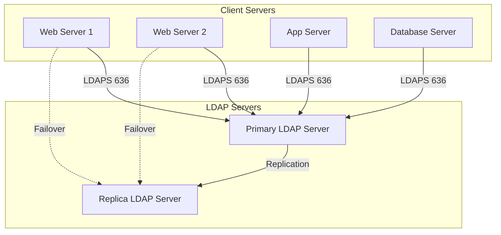

# How to Use Ansible to Set Up Centralized Authentication (LDAP)

Author: [nawazdhandala](https://www.github.com/nawazdhandala)

Tags: Ansible, LDAP, Authentication, SSSD, Centralized Auth

Description: Deploy centralized LDAP authentication across your Linux servers using Ansible with SSSD for consistent user management and access control.

---

Managing user accounts on individual servers does not scale. Once you have more than a handful of servers, you need centralized authentication. LDAP (Lightweight Directory Access Protocol) is the standard for this. It provides a central directory where all user accounts, groups, and authentication credentials live. Servers query the LDAP directory to authenticate users instead of maintaining local accounts.

Setting up LDAP client configuration on each server manually is tedious and error-prone. Ansible lets you push consistent LDAP configuration to every server in your fleet, ensuring that authentication works the same way everywhere.

## Architecture Overview

In a typical LDAP setup, you have one or more LDAP servers (like OpenLDAP or Active Directory) and many client servers that authenticate against them.



We will focus on the client side: configuring servers to authenticate users against an existing LDAP directory using SSSD (System Security Services Daemon).

## Installing SSSD and LDAP Packages

SSSD is the modern way to handle LDAP authentication on Linux. It provides caching, offline support, and works with multiple backends.

This playbook installs SSSD and LDAP client packages:

```yaml
# install_ldap_client.yml - Install LDAP client packages
---
- name: Install LDAP client packages
  hosts: all
  become: true

  tasks:
    - name: Install SSSD and LDAP packages (Debian/Ubuntu)
      ansible.builtin.apt:
        name:
          - sssd
          - sssd-ldap
          - sssd-tools
          - ldap-utils
          - libpam-sss
          - libnss-sss
        state: present
        update_cache: true
      when: ansible_os_family == "Debian"

    - name: Install SSSD and LDAP packages (RHEL/CentOS)
      ansible.builtin.yum:
        name:
          - sssd
          - sssd-ldap
          - sssd-tools
          - openldap-clients
        state: present
      when: ansible_os_family == "RedHat"

    - name: Create SSSD configuration directory
      ansible.builtin.file:
        path: /etc/sssd
        state: directory
        owner: root
        group: root
        mode: '0711'
```

## Configuring SSSD for LDAP

SSSD is configured through `/etc/sssd/sssd.conf`. This file tells SSSD where the LDAP server is, how to connect, and how to map LDAP attributes to Linux user properties.

This playbook deploys the SSSD configuration:

```yaml
# configure_sssd.yml - Configure SSSD for LDAP authentication
---
- name: Configure SSSD for LDAP
  hosts: all
  become: true

  vars:
    ldap_uri: "ldaps://ldap.example.com"
    ldap_backup_uri: "ldaps://ldap-replica.example.com"
    ldap_search_base: "dc=example,dc=com"
    ldap_user_search_base: "ou=People,dc=example,dc=com"
    ldap_group_search_base: "ou=Groups,dc=example,dc=com"
    ldap_bind_dn: "cn=readonly,dc=example,dc=com"
    ldap_bind_password: "{{ vault_ldap_bind_password }}"
    ldap_tls_cacert: /etc/ssl/certs/ca-certificates.crt
    ldap_default_shell: /bin/bash
    ldap_home_dir_template: /home/%u
    sssd_cache_timeout: 600
    sssd_offline_timeout: 86400

  tasks:
    - name: Deploy SSSD configuration
      ansible.builtin.template:
        src: sssd.conf.j2
        dest: /etc/sssd/sssd.conf
        owner: root
        group: root
        mode: '0600'
      notify: restart sssd

    - name: Enable and start SSSD
      ansible.builtin.service:
        name: sssd
        state: started
        enabled: true

  handlers:
    - name: restart sssd
      ansible.builtin.service:
        name: sssd
        state: restarted
```

The SSSD configuration template:

```ini
# templates/sssd.conf.j2 - SSSD configuration for LDAP
# Managed by Ansible

[sssd]
config_file_version = 2
services = nss, pam, sudo
domains = LDAP

[nss]
filter_groups = root
filter_users = root
reconnection_retries = 3

[pam]
reconnection_retries = 3
offline_credentials_expiration = 7

[domain/LDAP]
id_provider = ldap
auth_provider = ldap
chpass_provider = ldap
sudo_provider = ldap

# LDAP connection settings
ldap_uri = {{ ldap_uri }}
ldap_backup_uri = {{ ldap_backup_uri }}
ldap_search_base = {{ ldap_search_base }}
ldap_user_search_base = {{ ldap_user_search_base }}
ldap_group_search_base = {{ ldap_group_search_base }}

# Bind credentials
ldap_default_bind_dn = {{ ldap_bind_dn }}
ldap_default_authtok = {{ ldap_bind_password }}

# TLS settings
ldap_id_use_start_tls = false
ldap_tls_reqcert = demand
ldap_tls_cacert = {{ ldap_tls_cacert }}

# User/group attribute mapping
ldap_user_object_class = posixAccount
ldap_user_name = uid
ldap_user_uid_number = uidNumber
ldap_user_gid_number = gidNumber
ldap_user_home_directory = homeDirectory
ldap_user_shell = loginShell
ldap_user_gecos = cn
ldap_group_object_class = posixGroup
ldap_group_name = cn
ldap_group_gid_number = gidNumber

# Default shell and home directory
default_shell = {{ ldap_default_shell }}
override_homedir = {{ ldap_home_dir_template }}

# Cache settings
cache_credentials = true
entry_cache_timeout = {{ sssd_cache_timeout }}
ldap_connection_expire_timeout = 600
ldap_opt_timeout = 30

# Enumeration (disable for large directories)
enumerate = false

# Access control
access_provider = ldap
ldap_access_filter = (&(objectClass=posixAccount)(!(loginDisabled=TRUE)))
```

## Configuring NSS and PAM

The Name Service Switch (NSS) and PAM need to be configured to use SSSD for user lookups and authentication.

This playbook configures NSS and PAM to use SSSD:

```yaml
# configure_nss_pam.yml - Configure NSS and PAM for LDAP
---
- name: Configure NSS and PAM
  hosts: all
  become: true

  tasks:
    - name: Configure NSS to use SSSD
      ansible.builtin.lineinfile:
        path: /etc/nsswitch.conf
        regexp: "^{{ item.db }}:"
        line: "{{ item.db }}:{{ item.value }}"
      loop:
        - { db: "passwd", value: "         files sss" }
        - { db: "group", value: "          files sss" }
        - { db: "shadow", value: "         files sss" }
        - { db: "sudoers", value: "        files sss" }

    - name: Configure PAM for SSSD (Debian)
      ansible.builtin.command: pam-auth-update --enable sss --force
      when: ansible_os_family == "Debian"
      changed_when: true

    - name: Configure PAM common-session for home directory creation
      ansible.builtin.lineinfile:
        path: /etc/pam.d/common-session
        line: "session required pam_mkhomedir.so skel=/etc/skel/ umask=0077"
        insertafter: "session.*pam_unix.so"
      when: ansible_os_family == "Debian"
```

## Deploying LDAP CA Certificate

For LDAPS connections, the server needs the CA certificate that signed the LDAP server's certificate.

This playbook deploys the LDAP CA certificate:

```yaml
# deploy_ldap_ca.yml - Deploy LDAP CA certificate
---
- name: Deploy LDAP CA certificate
  hosts: all
  become: true

  vars:
    ldap_ca_cert_source: files/ldap-ca.crt

  tasks:
    - name: Deploy LDAP CA certificate
      ansible.builtin.copy:
        src: "{{ ldap_ca_cert_source }}"
        dest: /usr/local/share/ca-certificates/ldap-ca.crt
        owner: root
        group: root
        mode: '0644'
      when: ansible_os_family == "Debian"
      notify: update ca certificates debian

    - name: Deploy LDAP CA certificate (RHEL)
      ansible.builtin.copy:
        src: "{{ ldap_ca_cert_source }}"
        dest: /etc/pki/ca-trust/source/anchors/ldap-ca.crt
        owner: root
        group: root
        mode: '0644'
      when: ansible_os_family == "RedHat"
      notify: update ca certificates rhel

  handlers:
    - name: update ca certificates debian
      ansible.builtin.command: update-ca-certificates
      changed_when: true

    - name: update ca certificates rhel
      ansible.builtin.command: update-ca-trust
      changed_when: true
```

## Configuring LDAP-Based sudo

SSSD can also pull sudo rules from LDAP, allowing centralized sudo management.

This playbook enables LDAP-based sudo:

```yaml
# ldap_sudo.yml - Configure sudo via LDAP
---
- name: Configure LDAP sudo
  hosts: all
  become: true

  vars:
    ldap_sudo_search_base: "ou=SUDOers,dc=example,dc=com"

  tasks:
    - name: Add sudo search base to SSSD config
      ansible.builtin.lineinfile:
        path: /etc/sssd/sssd.conf
        regexp: "^ldap_sudo_search_base"
        line: "ldap_sudo_search_base = {{ ldap_sudo_search_base }}"
        insertafter: "\\[domain/LDAP\\]"
      notify: restart sssd

    - name: Ensure sudo provider is set
      ansible.builtin.lineinfile:
        path: /etc/sssd/sssd.conf
        regexp: "^sudo_provider"
        line: "sudo_provider = ldap"
        insertafter: "\\[domain/LDAP\\]"
      notify: restart sssd

    - name: Configure nsswitch for sudo
      ansible.builtin.lineinfile:
        path: /etc/nsswitch.conf
        regexp: "^sudoers:"
        line: "sudoers:         files sss"

  handlers:
    - name: restart sssd
      ansible.builtin.service:
        name: sssd
        state: restarted
```

## Access Control by Group

Not every LDAP user should have access to every server. Use group-based access control.

This playbook restricts login to members of specific LDAP groups:

```yaml
# ldap_access_control.yml - Restrict access by LDAP group
---
- name: Configure LDAP access control
  hosts: all
  become: true

  vars:
    allowed_groups:
      webservers:
        - web-admins
        - sre-team
      databases:
        - dba-team
        - sre-team
      all:
        - infrastructure-team

  tasks:
    - name: Build access filter based on server groups
      ansible.builtin.set_fact:
        ldap_access_groups: >-
          
          
          
          
          {{ groups | unique }}

    - name: Update SSSD access filter
      ansible.builtin.lineinfile:
        path: /etc/sssd/sssd.conf
        regexp: "^ldap_access_filter"
        line: "ldap_access_filter = (&(objectClass=posixAccount)(|(memberOf=cn={{ g }},ou=Groups,dc=example,dc=com)( )))"
        insertafter: "access_provider"
      notify: restart sssd

  handlers:
    - name: restart sssd
      ansible.builtin.service:
        name: sssd
        state: restarted
```

## Testing LDAP Authentication

Always verify LDAP authentication is working after deployment:

```yaml
# test_ldap.yml - Test LDAP authentication
---
- name: Test LDAP authentication
  hosts: all
  become: true

  vars:
    test_ldap_user: testuser

  tasks:
    - name: Test LDAP user lookup
      ansible.builtin.command: "getent passwd {{ test_ldap_user }}"
      register: user_lookup
      changed_when: false
      failed_when: false

    - name: Report user lookup result
      ansible.builtin.debug:
        msg: "User {{ test_ldap_user }}: {{ user_lookup.stdout | default('NOT FOUND') }}"

    - name: Test LDAP group lookup
      ansible.builtin.command: "getent group web-admins"
      register: group_lookup
      changed_when: false
      failed_when: false

    - name: Test SSSD connectivity
      ansible.builtin.command: sss_cache -E
      register: cache_clear
      changed_when: false
      failed_when: false

    - name: Check SSSD status
      ansible.builtin.command: systemctl status sssd
      register: sssd_status
      changed_when: false

    - name: Test LDAP connectivity
      ansible.builtin.command: "ldapsearch -x -H ldaps://ldap.example.com -b dc=example,dc=com -s base"
      register: ldap_test
      changed_when: false
      failed_when: false
```

## Production Tips

1. **Always use LDAPS (TLS).** Never send LDAP traffic unencrypted. Use port 636 or StartTLS.
2. **Use a read-only bind account.** The SSSD bind credentials only need read access. Never use an admin account.
3. **Store bind passwords in Ansible Vault.** Never put LDAP credentials in plain text files.
4. **Enable caching.** SSSD caching means users can still log in if the LDAP server is temporarily unreachable.
5. **Configure multiple LDAP servers.** Always have a backup URI so authentication continues if the primary server goes down.
6. **Test before production.** LDAP misconfiguration can lock everyone out. Always test on a non-production server first, and keep a local admin account as a fallback.

Centralized LDAP authentication with Ansible gives you consistent identity management across your entire fleet. Users get a single set of credentials, and you get centralized control over who can access what.
