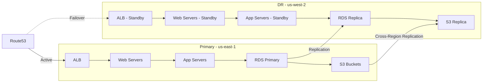

# How to Use Ansible to Set Up Disaster Recovery in the Cloud

Author: [nawazdhandala](https://www.github.com/nawazdhandala)

Tags: Ansible, Disaster Recovery, Cloud, Business Continuity, High Availability

Description: Build automated disaster recovery in the cloud with Ansible including cross-region failover, backup automation, and recovery testing.

---

Disaster recovery is something every organization needs but few test regularly. When your primary region goes down, you need a plan that works, not a dusty document that nobody has looked at in two years. Ansible makes DR actionable by automating the entire failover and recovery process. When disaster strikes, you run a playbook instead of scrambling through runbooks.

This guide covers building a cloud DR strategy with Ansible, from automated backups to cross-region failover and recovery testing.

## DR Architecture

A solid DR setup involves replicating your infrastructure and data to a secondary region, with automation to switch over when needed.



## DR Tiers and RTO/RPO

Not every application needs the same DR level. Define your tiers.

```yaml
# vars/dr_config.yml
---
dr_tiers:
  tier1_critical:
    rto_minutes: 15
    rpo_minutes: 5
    strategy: hot_standby
    auto_failover: true
    applications:
      - payment-service
      - auth-service
      - core-api

  tier2_important:
    rto_minutes: 60
    rpo_minutes: 30
    strategy: warm_standby
    auto_failover: false
    applications:
      - web-frontend
      - notification-service
      - reporting

  tier3_standard:
    rto_minutes: 240
    rpo_minutes: 60
    strategy: pilot_light
    auto_failover: false
    applications:
      - internal-tools
      - staging-env
      - dev-services
```

## Automated Backups

The foundation of any DR plan is reliable backups.

```yaml
# playbooks/dr-backups.yml
---
- name: Automated DR backup pipeline
  hosts: localhost
  gather_facts: true

  vars:
    aws_region: us-east-1
    dr_region: us-west-2
    backup_date: "{{ ansible_date_time.iso8601_basic_short }}"

  tasks:
    # Snapshot RDS databases
    - name: Create RDS snapshot
      amazon.aws.rds_snapshot:
        db_instance_identifier: myapp-prod-db
        db_snapshot_identifier: "myapp-prod-db-dr-{{ backup_date }}"
        region: "{{ aws_region }}"
        tags:
          Type: dr-backup
          Date: "{{ ansible_date_time.date }}"
        state: present
        wait: true
      register: rds_snapshot

    # Copy snapshot to DR region
    - name: Copy RDS snapshot to DR region
      amazon.aws.rds_snapshot:
        db_snapshot_identifier: "myapp-prod-db-dr-{{ backup_date }}"
        source_db_snapshot_identifier: "{{ rds_snapshot.db_snapshot_arn }}"
        source_region: "{{ aws_region }}"
        region: "{{ dr_region }}"
        tags:
          Type: dr-backup
          SourceRegion: "{{ aws_region }}"
        state: present
        wait: true

    # Create AMI from running web server
    - name: Create AMI from web server
      amazon.aws.ec2_ami:
        instance_id: i-0123456789abcdef0
        name: "myapp-web-dr-{{ backup_date }}"
        region: "{{ aws_region }}"
        tags:
          Type: dr-backup
        wait: true
      register: web_ami

    # Copy AMI to DR region
    - name: Copy AMI to DR region
      amazon.aws.ec2_ami_copy:
        source_image_id: "{{ web_ami.image_id }}"
        source_region: "{{ aws_region }}"
        region: "{{ dr_region }}"
        name: "myapp-web-dr-{{ backup_date }}"
        tags:
          Type: dr-backup
        wait: true

    # Verify S3 cross-region replication is working
    - name: Check S3 replication status
      amazon.aws.s3_bucket_info:
        name: myapp-data-prod
        region: "{{ aws_region }}"
      register: s3_info

    - name: Clean up old snapshots (keep last 7)
      amazon.aws.rds_snapshot:
        db_snapshot_identifier: "{{ item }}"
        region: "{{ dr_region }}"
        state: absent
      loop: "{{ old_snapshots_to_delete | default([]) }}"
```

## DR Infrastructure Setup

Pre-provision the DR infrastructure so it is ready when needed.

```yaml
# playbooks/setup-dr-infrastructure.yml
---
- name: Set up DR infrastructure in secondary region
  hosts: localhost
  gather_facts: false

  vars:
    dr_region: us-west-2
    project: myapp
    env: dr

  tasks:
    # Create VPC in DR region (mirror of production)
    - name: Create DR VPC
      amazon.aws.ec2_vpc_net:
        name: "{{ project }}-{{ env }}-vpc"
        cidr_block: 10.1.0.0/16
        region: "{{ dr_region }}"
        dns_support: true
        dns_hostnames: true
        tags:
          Project: "{{ project }}"
          Environment: dr
        state: present
      register: dr_vpc

    # Create subnets mirroring production
    - name: Create DR public subnets
      amazon.aws.ec2_vpc_subnet:
        vpc_id: "{{ dr_vpc.vpc.id }}"
        cidr: "10.1.{{ item.idx }}.0/24"
        az: "{{ item.az }}"
        region: "{{ dr_region }}"
        map_public: true
        tags:
          Name: "{{ project }}-{{ env }}-public-{{ item.idx }}"
        state: present
      loop:
        - { idx: 0, az: "us-west-2a" }
        - { idx: 1, az: "us-west-2b" }
      register: dr_public_subnets

    - name: Create DR private subnets
      amazon.aws.ec2_vpc_subnet:
        vpc_id: "{{ dr_vpc.vpc.id }}"
        cidr: "10.1.{{ item.idx }}.0/24"
        az: "{{ item.az }}"
        region: "{{ dr_region }}"
        tags:
          Name: "{{ project }}-{{ env }}-private-{{ item.idx }}"
        state: present
      loop:
        - { idx: 10, az: "us-west-2a" }
        - { idx: 11, az: "us-west-2b" }
      register: dr_private_subnets

    # Create RDS read replica in DR region
    - name: Create RDS read replica in DR region
      amazon.aws.rds_instance:
        db_instance_identifier: myapp-dr-replica
        source_db_instance_identifier: "arn:aws:rds:us-east-1:123456789012:db:myapp-prod-db"
        db_instance_class: db.r5.large
        region: "{{ dr_region }}"
        multi_az: false
        tags:
          Type: dr-replica
        state: present
        read_replica: true

    # Create security groups in DR region
    - name: Create DR security groups
      amazon.aws.ec2_security_group:
        name: "{{ project }}-{{ env }}-{{ item.name }}-sg"
        description: "{{ item.description }}"
        vpc_id: "{{ dr_vpc.vpc.id }}"
        region: "{{ dr_region }}"
        rules: "{{ item.rules }}"
        state: present
      loop:
        - name: web
          description: "Web tier"
          rules:
            - proto: tcp
              ports: [80, 443]
              cidr_ip: 0.0.0.0/0
        - name: app
          description: "App tier"
          rules:
            - proto: tcp
              ports: [8080]
              cidr_ip: 10.1.0.0/24
        - name: db
          description: "Database tier"
          rules:
            - proto: tcp
              ports: [5432]
              cidr_ip: 10.1.10.0/24
```

## Failover Playbook

This is the playbook you run when disaster strikes. It should be tested regularly.

```yaml
# playbooks/failover.yml
---
- name: Execute disaster recovery failover
  hosts: localhost
  gather_facts: true

  vars:
    primary_region: us-east-1
    dr_region: us-west-2
    project: myapp
    domain: myapp.com

  tasks:
    - name: Record failover start time
      ansible.builtin.set_fact:
        failover_start: "{{ ansible_date_time.iso8601 }}"

    # Step 1: Promote RDS read replica to standalone
    - name: Promote RDS replica to primary
      amazon.aws.rds_instance:
        db_instance_identifier: myapp-dr-replica
        region: "{{ dr_region }}"
        read_replica: false
        state: present
      register: promoted_db

    - name: Wait for RDS promotion to complete
      amazon.aws.rds_instance_info:
        db_instance_identifier: myapp-dr-replica
        region: "{{ dr_region }}"
      register: db_status
      until: db_status.instances[0].db_instance_status == "available"
      retries: 30
      delay: 30

    # Step 2: Launch web and app servers from DR AMIs
    - name: Launch web servers in DR region
      amazon.aws.ec2_instance:
        name: "{{ project }}-dr-web-{{ item }}"
        instance_type: t3.large
        image_id: "{{ dr_web_ami_id }}"
        key_name: deploy-key-dr
        vpc_subnet_id: "{{ dr_public_subnets[item | int % 2] }}"
        security_group: "{{ project }}-dr-web-sg"
        region: "{{ dr_region }}"
        tags:
          Project: "{{ project }}"
          Role: webserver
          Environment: dr-active
        state: running
        wait: true
      loop: ["0", "1", "2"]
      register: dr_web_servers

    - name: Launch app servers in DR region
      amazon.aws.ec2_instance:
        name: "{{ project }}-dr-app-{{ item }}"
        instance_type: t3.xlarge
        image_id: "{{ dr_app_ami_id }}"
        key_name: deploy-key-dr
        vpc_subnet_id: "{{ dr_private_subnets[item | int % 2] }}"
        security_group: "{{ project }}-dr-app-sg"
        region: "{{ dr_region }}"
        tags:
          Project: "{{ project }}"
          Role: appserver
          Environment: dr-active
        state: running
        wait: true
      loop: ["0", "1"]
      register: dr_app_servers

    # Step 3: Register instances with DR load balancer
    - name: Register web servers with DR target group
      community.aws.elb_target_group:
        name: "{{ project }}-dr-web-tg"
        region: "{{ dr_region }}"
        targets:
          - Id: "{{ item.instances[0].instance_id }}"
            Port: 80
        state: present
      loop: "{{ dr_web_servers.results }}"
      loop_control:
        label: "{{ item.instances[0].instance_id }}"

    # Step 4: Update DNS to point to DR region
    - name: Switch DNS to DR load balancer
      amazon.aws.route53:
        zone: "{{ domain }}"
        record: "{{ domain }}"
        type: A
        alias: true
        alias_hosted_zone_id: "{{ dr_alb_zone_id }}"
        value: "{{ dr_alb_dns_name }}"
        overwrite: true
        state: present

    - name: Switch API DNS
      amazon.aws.route53:
        zone: "{{ domain }}"
        record: "api.{{ domain }}"
        type: A
        alias: true
        alias_hosted_zone_id: "{{ dr_alb_zone_id }}"
        value: "{{ dr_alb_dns_name }}"
        overwrite: true
        state: present

    # Step 5: Verify failover
    - name: Wait for DNS propagation
      ansible.builtin.pause:
        seconds: 60

    - name: Verify application is accessible
      ansible.builtin.uri:
        url: "https://{{ domain }}/health"
        method: GET
        status_code: 200
        timeout: 30
      retries: 10
      delay: 15
      register: health_check

    - name: Calculate failover duration
      ansible.builtin.debug:
        msg: |
          Failover completed successfully!
          Started: {{ failover_start }}
          Completed: {{ ansible_date_time.iso8601 }}
          Health check status: {{ health_check.status }}
```

## Failback Playbook

Once the primary region is restored, fail back.

```yaml
# playbooks/failback.yml
---
- name: Fail back to primary region
  hosts: localhost
  gather_facts: false

  vars:
    primary_region: us-east-1
    dr_region: us-west-2
    domain: myapp.com

  tasks:
    # Sync data from DR back to primary
    - name: Create RDS snapshot from DR database
      amazon.aws.rds_snapshot:
        db_instance_identifier: myapp-dr-replica
        db_snapshot_identifier: "failback-snapshot-{{ ansible_date_time.iso8601_basic_short }}"
        region: "{{ dr_region }}"
        state: present
        wait: true
      register: failback_snapshot

    # Restore primary database from snapshot
    - name: Copy snapshot to primary region
      amazon.aws.rds_snapshot:
        db_snapshot_identifier: "failback-snapshot-{{ ansible_date_time.iso8601_basic_short }}"
        source_db_snapshot_identifier: "{{ failback_snapshot.db_snapshot_arn }}"
        source_region: "{{ dr_region }}"
        region: "{{ primary_region }}"
        state: present
        wait: true

    # Restore primary RDS from snapshot
    - name: Restore primary database
      amazon.aws.rds_instance:
        db_instance_identifier: myapp-prod-db
        db_snapshot_identifier: "failback-snapshot-{{ ansible_date_time.iso8601_basic_short }}"
        db_instance_class: db.r5.xlarge
        region: "{{ primary_region }}"
        multi_az: true
        state: present
      register: restored_db

    # Switch DNS back to primary
    - name: Switch DNS to primary load balancer
      amazon.aws.route53:
        zone: "{{ domain }}"
        record: "{{ domain }}"
        type: A
        alias: true
        alias_hosted_zone_id: "{{ primary_alb_zone_id }}"
        value: "{{ primary_alb_dns_name }}"
        overwrite: true
        state: present

    # Clean up DR active resources
    - name: Terminate DR active instances
      amazon.aws.ec2_instance:
        instance_ids: "{{ dr_active_instance_ids }}"
        region: "{{ dr_region }}"
        state: terminated
      when: dr_active_instance_ids is defined
```

## DR Testing Playbook

Test your DR plan regularly. This playbook runs a non-destructive DR test.

```yaml
# playbooks/dr-test.yml
---
- name: DR test - validate recovery procedures
  hosts: localhost
  gather_facts: true

  vars:
    dr_region: us-west-2
    test_domain: dr-test.myapp.com

  tasks:
    - name: Start DR test
      ansible.builtin.debug:
        msg: "Starting DR test at {{ ansible_date_time.iso8601 }}"

    # Verify DR backups exist and are recent
    - name: Check for recent RDS snapshots
      amazon.aws.rds_snapshot_info:
        db_instance_identifier: myapp-prod-db
        region: "{{ dr_region }}"
      register: dr_snapshots

    - name: Verify snapshot freshness
      ansible.builtin.assert:
        that:
          - dr_snapshots.snapshots | length > 0
        fail_msg: "No DR snapshots found in {{ dr_region }}"

    # Launch test instances
    - name: Launch DR test web server
      amazon.aws.ec2_instance:
        name: dr-test-web-01
        instance_type: t3.medium
        image_id: "{{ dr_web_ami_id }}"
        key_name: deploy-key-dr
        vpc_subnet_id: "{{ dr_test_subnet }}"
        region: "{{ dr_region }}"
        tags:
          Type: dr-test
        state: running
        wait: true
      register: test_instance

    # Restore database from snapshot for testing
    - name: Restore test database from DR snapshot
      amazon.aws.rds_instance:
        db_instance_identifier: dr-test-db
        db_snapshot_identifier: "{{ dr_snapshots.snapshots[0].db_snapshot_identifier }}"
        db_instance_class: db.r5.large
        region: "{{ dr_region }}"
        state: present
      register: test_db

    # Run health checks
    - name: Verify DR test instance is healthy
      ansible.builtin.uri:
        url: "http://{{ test_instance.instances[0].public_ip_address }}/health"
        method: GET
        status_code: 200
      retries: 10
      delay: 15

    # Generate test report
    - name: Generate DR test report
      ansible.builtin.copy:
        dest: "/tmp/dr-test-report-{{ ansible_date_time.date }}.txt"
        content: |
          DR Test Report - {{ ansible_date_time.date }}
          =============================================
          Test Region: {{ dr_region }}
          Snapshot Age: {{ dr_snapshots.snapshots[0].snapshot_create_time }}
          Web Server: PASS
          Database Restore: PASS
          Health Check: PASS
          =============================================
        mode: '0644'
      delegate_to: localhost

    # Clean up test resources
    - name: Terminate test instances
      amazon.aws.ec2_instance:
        instance_ids:
          - "{{ test_instance.instances[0].instance_id }}"
        region: "{{ dr_region }}"
        state: terminated

    - name: Delete test database
      amazon.aws.rds_instance:
        db_instance_identifier: dr-test-db
        region: "{{ dr_region }}"
        skip_final_snapshot: true
        state: absent
```

## DR Best Practices

1. **Test monthly, at minimum.** A DR plan that has never been tested is just a hope. Run automated DR tests on a schedule and review the results.
2. **Automate everything.** During a real disaster, stress levels are high and people make mistakes. The more automated your failover process is, the more reliable it will be.
3. **Monitor replication lag.** Your RPO is only as good as your replication. If database replication falls behind, you will lose data during failover. Alert on replication lag.
4. **Keep DR AMIs fresh.** Stale AMIs mean your DR servers will need extensive patching after failover, adding to your RTO. Update DR AMIs weekly.
5. **DNS TTL matters.** If your DNS records have a 24-hour TTL, it will take up to 24 hours for all clients to see the failover. Keep TTLs low (60-300 seconds) on records that might change during DR.
6. **Document the decision criteria.** When should you declare a disaster and trigger failover? Who has the authority to make that call? Write this down and make sure everyone knows.
7. **Budget for DR.** Running a hot standby in another region costs money. Make sure the business understands the cost/risk trade-off for each DR tier.

Disaster recovery with Ansible transforms an anxiety-inducing manual process into a tested, automated workflow. When the worst happens, you run a playbook and watch it work, not scramble through a wiki page hoping the instructions are still accurate.
