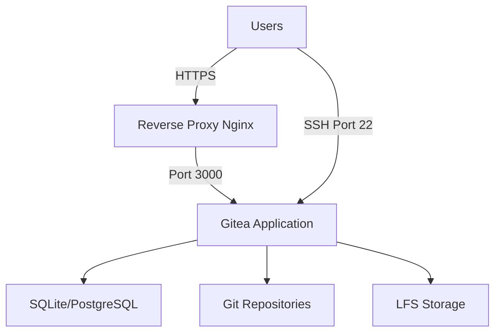

# How to Use Ansible to Set Up Gitea Server

Author: [nawazdhandala](https://www.github.com/nawazdhandala)

Tags: Ansible, Gitea, Git, Self-Hosted

Description: Learn how to use Ansible to install and configure Gitea, a lightweight self-hosted Git service with web interface, API, and CI/CD integration support.

---

Gitea is a lightweight, self-hosted Git service that provides a web interface, repository management, issue tracking, pull requests, and an API. Unlike GitLab, Gitea is written in Go and has minimal resource requirements, making it perfect for small teams, homelab setups, or environments where you want Git hosting without the overhead.

## Installing Gitea with Ansible

```yaml
# playbook-gitea-install.yml
# Installs Gitea from the official binary release
- name: Install Gitea
  hosts: git_servers
  become: true
  vars:
    gitea_version: "1.21.4"
    gitea_user: gitea
    gitea_home: /opt/gitea
    gitea_domain: "git.example.com"

  tasks:
    - name: Install prerequisites
      ansible.builtin.apt:
        name:
          - git
          - sqlite3
        state: present
        update_cache: true

    - name: Create Gitea system user
      ansible.builtin.user:
        name: "{{ gitea_user }}"
        home: "{{ gitea_home }}"
        system: true
        create_home: true
        shell: /bin/bash

    - name: Create Gitea directories
      ansible.builtin.file:
        path: "{{ item }}"
        state: directory
        owner: "{{ gitea_user }}"
        group: "{{ gitea_user }}"
        mode: "0750"
      loop:
        - "{{ gitea_home }}/custom"
        - "{{ gitea_home }}/custom/conf"
        - "{{ gitea_home }}/data"
        - "{{ gitea_home }}/log"
        - /var/lib/gitea/repositories

    - name: Download Gitea binary
      ansible.builtin.get_url:
        url: "https://dl.gitea.io/gitea/{{ gitea_version }}/gitea-{{ gitea_version }}-linux-amd64"
        dest: /usr/local/bin/gitea
        mode: "0755"

    - name: Verify Gitea binary
      ansible.builtin.shell: gitea --version
      register: gitea_installed_version
      changed_when: false

    - name: Show installed version
      ansible.builtin.debug:
        msg: "{{ gitea_installed_version.stdout }}"
```

## Configuring Gitea

```yaml
# playbook-gitea-config.yml
# Creates the Gitea configuration file and systemd service
- name: Configure Gitea
  hosts: git_servers
  become: true
  vars:
    gitea_domain: "git.example.com"
    gitea_http_port: 3000
    gitea_ssh_port: 22
    gitea_secret: "{{ lookup('password', '/dev/null length=32 chars=ascii_letters,digits') }}"
    gitea_db_type: sqlite3

  tasks:
    - name: Create Gitea configuration
      ansible.builtin.copy:
        content: |
          ; Gitea configuration - managed by Ansible
          APP_NAME = Gitea: Git with a cup of tea
          RUN_MODE = prod
          RUN_USER = gitea

          [server]
          DOMAIN           = {{ gitea_domain }}
          HTTP_PORT        = {{ gitea_http_port }}
          ROOT_URL         = https://{{ gitea_domain }}/
          SSH_DOMAIN       = {{ gitea_domain }}
          SSH_PORT         = {{ gitea_ssh_port }}
          LFS_START_SERVER = true
          OFFLINE_MODE     = false

          [database]
          DB_TYPE  = {{ gitea_db_type }}
          PATH     = /opt/gitea/data/gitea.db

          [repository]
          ROOT = /var/lib/gitea/repositories

          [security]
          SECRET_KEY         = {{ gitea_secret }}
          INSTALL_LOCK       = true
          MIN_PASSWORD_LENGTH = 10

          [service]
          DISABLE_REGISTRATION = false
          REQUIRE_SIGNIN_VIEW  = false
          REGISTER_EMAIL_CONFIRM = false

          [log]
          MODE      = file
          LEVEL     = info
          ROOT_PATH = /opt/gitea/log
        dest: /opt/gitea/custom/conf/app.ini
        owner: gitea
        group: gitea
        mode: "0640"
      notify: Restart Gitea

    - name: Create systemd service
      ansible.builtin.copy:
        content: |
          [Unit]
          Description=Gitea
          After=syslog.target
          After=network.target

          [Service]
          Type=simple
          User=gitea
          Group=gitea
          WorkingDirectory=/opt/gitea
          ExecStart=/usr/local/bin/gitea web --config /opt/gitea/custom/conf/app.ini
          Restart=always
          Environment=USER=gitea HOME=/opt/gitea GITEA_WORK_DIR=/opt/gitea

          [Install]
          WantedBy=multi-user.target
        dest: /etc/systemd/system/gitea.service

    - name: Enable and start Gitea
      ansible.builtin.systemd:
        name: gitea
        state: started
        enabled: true
        daemon_reload: true

  handlers:
    - name: Restart Gitea
      ansible.builtin.systemd:
        name: gitea
        state: restarted
```

## Gitea Architecture



## Nginx Reverse Proxy

```yaml
# playbook-gitea-nginx.yml
# Configures Nginx as a reverse proxy with SSL for Gitea
- name: Configure Nginx for Gitea
  hosts: git_servers
  become: true

  tasks:
    - name: Install Nginx and Certbot
      ansible.builtin.apt:
        name:
          - nginx
          - certbot
          - python3-certbot-nginx
        state: present

    - name: Create Nginx config for Gitea
      ansible.builtin.copy:
        content: |
          server {
              listen 80;
              server_name git.example.com;

              location / {
                  proxy_pass http://127.0.0.1:3000;
                  proxy_set_header Host $host;
                  proxy_set_header X-Real-IP $remote_addr;
                  proxy_set_header X-Forwarded-For $proxy_add_x_forwarded_for;
                  proxy_set_header X-Forwarded-Proto $scheme;

                  # WebSocket support for live updates
                  proxy_http_version 1.1;
                  proxy_set_header Upgrade $http_upgrade;
                  proxy_set_header Connection "upgrade";

                  # Increase buffer for large Git operations
                  client_max_body_size 512M;
                  proxy_buffering off;
              }
          }
        dest: /etc/nginx/sites-available/gitea
      notify: Reload Nginx

    - name: Enable site
      ansible.builtin.file:
        src: /etc/nginx/sites-available/gitea
        dest: /etc/nginx/sites-enabled/gitea
        state: link
      notify: Reload Nginx

    - name: Obtain SSL certificate
      ansible.builtin.shell: |
        certbot --nginx -d git.example.com --non-interactive --agree-tos -m admin@example.com
      args:
        creates: /etc/letsencrypt/live/git.example.com/fullchain.pem

  handlers:
    - name: Reload Nginx
      ansible.builtin.systemd:
        name: nginx
        state: reloaded
```

## Using PostgreSQL Instead of SQLite

For production with multiple users, use PostgreSQL:

```yaml
# playbook-gitea-postgres.yml
# Sets up Gitea with PostgreSQL as the database backend
- name: Configure Gitea with PostgreSQL
  hosts: git_servers
  become: true

  tasks:
    - name: Install PostgreSQL
      ansible.builtin.apt:
        name:
          - postgresql
          - postgresql-contrib
          - python3-psycopg2
        state: present

    - name: Create Gitea database
      community.postgresql.postgresql_db:
        name: gitea
        encoding: UTF-8
      become_user: postgres

    - name: Create Gitea database user
      community.postgresql.postgresql_user:
        name: gitea
        password: "{{ lookup('env', 'GITEA_DB_PASSWORD') }}"
        db: gitea
        priv: ALL
      become_user: postgres

    - name: Update Gitea config for PostgreSQL
      ansible.builtin.ini_file:
        path: /opt/gitea/custom/conf/app.ini
        section: database
        option: "{{ item.key }}"
        value: "{{ item.value }}"
      loop:
        - { key: "DB_TYPE", value: "postgres" }
        - { key: "HOST", value: "127.0.0.1:5432" }
        - { key: "NAME", value: "gitea" }
        - { key: "USER", value: "gitea" }
        - { key: "PASSWD", value: "{{ lookup('env', 'GITEA_DB_PASSWORD') }}" }
      notify: Restart Gitea

  handlers:
    - name: Restart Gitea
      ansible.builtin.systemd:
        name: gitea
        state: restarted
```

## Backup Configuration

```yaml
# playbook-gitea-backup.yml
# Sets up automated daily backups of Gitea data
- name: Configure Gitea backups
  hosts: git_servers
  become: true

  tasks:
    - name: Create backup script
      ansible.builtin.copy:
        content: |
          #!/bin/bash
          # Gitea backup script - managed by Ansible
          BACKUP_DIR="/opt/gitea-backups"
          DATE=$(date +%Y%m%d-%H%M%S)

          mkdir -p "$BACKUP_DIR"

          # Create Gitea dump
          su - gitea -c "cd /opt/gitea && /usr/local/bin/gitea dump --config /opt/gitea/custom/conf/app.ini --file $BACKUP_DIR/gitea-dump-$DATE.zip"

          # Clean old backups (keep 14 days)
          find "$BACKUP_DIR" -name "gitea-dump-*.zip" -mtime +14 -delete

          echo "Backup completed: gitea-dump-$DATE.zip"
        dest: /opt/gitea/backup.sh
        mode: "0755"
        owner: root

    - name: Schedule daily backup
      ansible.builtin.cron:
        name: "Gitea backup"
        minute: "30"
        hour: "2"
        job: "/opt/gitea/backup.sh >> /var/log/gitea-backup.log 2>&1"
```

## Creating Repositories via API

```yaml
# playbook-gitea-repos.yml
# Creates repositories on Gitea using the REST API
- name: Create repositories via Gitea API
  hosts: localhost
  gather_facts: false
  vars:
    gitea_url: "https://git.example.com"
    gitea_token: "{{ lookup('env', 'GITEA_TOKEN') }}"
    repositories:
      - name: frontend
        description: "Frontend web application"
        private: false
      - name: backend
        description: "Backend API service"
        private: true
      - name: infrastructure
        description: "Infrastructure as code"
        private: true

  tasks:
    - name: Create repositories
      ansible.builtin.uri:
        url: "{{ gitea_url }}/api/v1/user/repos"
        method: POST
        headers:
          Authorization: "token {{ gitea_token }}"
        body_format: json
        body:
          name: "{{ item.name }}"
          description: "{{ item.description }}"
          private: "{{ item.private }}"
          auto_init: true
          default_branch: main
        status_code: [201, 409]
      loop: "{{ repositories }}"
      loop_control:
        label: "{{ item.name }}"
```

## Summary

Gitea is an excellent lightweight alternative to GitLab for self-hosted Git. With Ansible, you can automate the entire setup: download the binary, create the configuration, set up the systemd service, configure Nginx as a reverse proxy with SSL, and schedule backups. Gitea runs comfortably on a machine with just 1GB of RAM, making it perfect for small teams and resource-constrained environments. Use SQLite for small installations and PostgreSQL for larger ones. The REST API makes it easy to automate repository creation and user management as part of your Ansible workflow.
