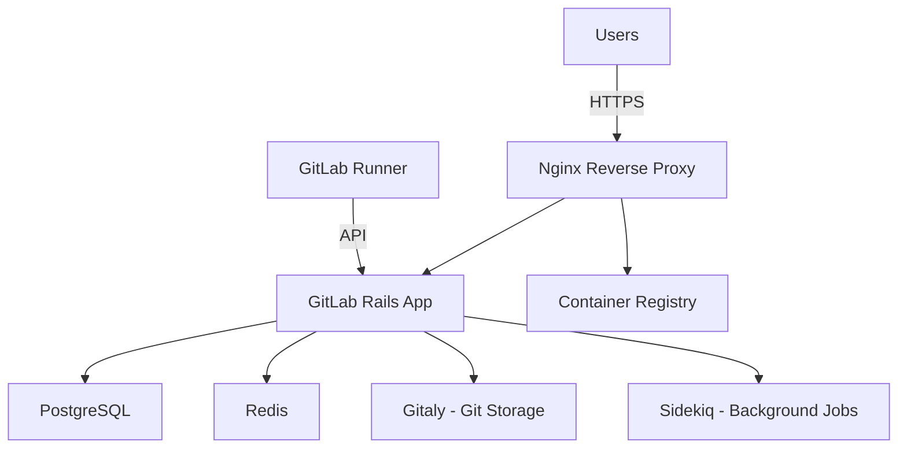

# How to Use Ansible to Set Up GitLab Server

Author: [nawazdhandala](https://www.github.com/nawazdhandala)

Tags: Ansible, GitLab, Git, DevOps

Description: Learn how to use Ansible to install and configure a self-hosted GitLab server including HTTPS, SMTP, backup configuration, and runner registration.

---

GitLab is the most feature-rich self-hosted Git platform available. It includes a web interface, CI/CD pipelines, issue tracking, container registry, and much more. Setting it up with Ansible makes the installation repeatable and the configuration manageable. This post walks through deploying GitLab Community Edition with Ansible.

## Installing GitLab CE

GitLab provides official packages. Here is the Ansible playbook to install it on Ubuntu/Debian:

```yaml
# playbook-gitlab-install.yml
# Installs GitLab Community Edition on Ubuntu using the official repository
- name: Install GitLab CE
  hosts: gitlab_servers
  become: true
  vars:
    gitlab_domain: "gitlab.example.com"
    gitlab_external_url: "https://{{ gitlab_domain }}"

  tasks:
    - name: Install prerequisites
      ansible.builtin.apt:
        name:
          - curl
          - openssh-server
          - ca-certificates
          - tzdata
          - perl
          - postfix
        state: present
        update_cache: true

    - name: Add GitLab package repository
      ansible.builtin.shell: |
        curl -sS https://packages.gitlab.com/install/repositories/gitlab/gitlab-ce/script.deb.sh | bash
      args:
        creates: /etc/apt/sources.list.d/gitlab_gitlab-ce.list

    - name: Install GitLab CE
      ansible.builtin.apt:
        name: gitlab-ce
        state: present
      environment:
        EXTERNAL_URL: "{{ gitlab_external_url }}"
```

## Configuring GitLab

GitLab's main configuration file is `/etc/gitlab/gitlab.rb`. Use a template to manage it:

```yaml
# playbook-gitlab-config.yml
# Configures GitLab settings including URL, SMTP, backups, and performance tuning
- name: Configure GitLab
  hosts: gitlab_servers
  become: true
  vars:
    gitlab_domain: "gitlab.example.com"
    gitlab_email_from: "gitlab@example.com"
    smtp_address: "smtp.example.com"
    smtp_port: 587
    smtp_user: "{{ lookup('env', 'SMTP_USER') }}"
    smtp_password: "{{ lookup('env', 'SMTP_PASSWORD') }}"

  tasks:
    - name: Configure gitlab.rb
      ansible.builtin.template:
        src: gitlab.rb.j2
        dest: /etc/gitlab/gitlab.rb
        mode: "0600"
      notify: Reconfigure GitLab

    - name: Create gitlab.rb from inline content
      ansible.builtin.copy:
        content: |
          # GitLab configuration - managed by Ansible
          external_url 'https://{{ gitlab_domain }}'

          # SSL
          letsencrypt['enable'] = true
          letsencrypt['contact_emails'] = ['admin@example.com']

          # SMTP configuration
          gitlab_rails['smtp_enable'] = true
          gitlab_rails['smtp_address'] = "{{ smtp_address }}"
          gitlab_rails['smtp_port'] = {{ smtp_port }}
          gitlab_rails['smtp_user_name'] = "{{ smtp_user }}"
          gitlab_rails['smtp_password'] = "{{ smtp_password }}"
          gitlab_rails['smtp_authentication'] = "login"
          gitlab_rails['smtp_enable_starttls_auto'] = true
          gitlab_rails['gitlab_email_from'] = '{{ gitlab_email_from }}'

          # Backup configuration
          gitlab_rails['backup_keep_time'] = 604800
          gitlab_rails['backup_path'] = "/var/opt/gitlab/backups"

          # Performance tuning
          puma['worker_processes'] = 4
          postgresql['shared_buffers'] = "512MB"
          postgresql['max_worker_processes'] = 8

          # Container Registry
          registry_external_url 'https://registry.{{ gitlab_domain }}'

          # Monitoring
          prometheus_monitoring['enable'] = true
          grafana['enable'] = true
        dest: /etc/gitlab/gitlab.rb
        mode: "0600"
      notify: Reconfigure GitLab

  handlers:
    - name: Reconfigure GitLab
      ansible.builtin.shell: gitlab-ctl reconfigure
```

## GitLab Architecture



## Setting Up GitLab Runners

GitLab Runners execute CI/CD pipelines:

```yaml
# playbook-gitlab-runner.yml
# Installs and registers a GitLab Runner for CI/CD pipeline execution
- name: Set up GitLab Runner
  hosts: gitlab_runners
  become: true
  vars:
    gitlab_url: "https://gitlab.example.com"
    runner_token: "{{ lookup('env', 'GITLAB_RUNNER_TOKEN') }}"

  tasks:
    - name: Add GitLab Runner repository
      ansible.builtin.shell: |
        curl -L https://packages.gitlab.com/install/repositories/runner/gitlab-runner/script.deb.sh | bash
      args:
        creates: /etc/apt/sources.list.d/runner_gitlab-runner.list

    - name: Install GitLab Runner
      ansible.builtin.apt:
        name: gitlab-runner
        state: present
        update_cache: true

    - name: Register runner
      ansible.builtin.shell: |
        gitlab-runner register \
          --non-interactive \
          --url "{{ gitlab_url }}" \
          --token "{{ runner_token }}" \
          --executor "docker" \
          --docker-image "alpine:latest" \
          --description "ansible-managed-runner-{{ inventory_hostname }}"
      args:
        creates: /etc/gitlab-runner/config.toml

    - name: Configure runner concurrency
      ansible.builtin.lineinfile:
        path: /etc/gitlab-runner/config.toml
        regexp: '^concurrent ='
        line: 'concurrent = 4'
      notify: Restart GitLab Runner

  handlers:
    - name: Restart GitLab Runner
      ansible.builtin.systemd:
        name: gitlab-runner
        state: restarted
```

## Configuring Backups

```yaml
# playbook-gitlab-backup.yml
# Sets up automated daily backups of GitLab data and configuration
- name: Configure GitLab backups
  hosts: gitlab_servers
  become: true

  tasks:
    - name: Create backup script
      ansible.builtin.copy:
        content: |
          #!/bin/bash
          # GitLab backup script - managed by Ansible
          set -e

          echo "Starting GitLab backup at $(date)"

          # Create application backup
          gitlab-backup create CRON=1

          # Backup configuration files
          tar czf /var/opt/gitlab/backups/gitlab-config-$(date +%Y%m%d).tar.gz \
            /etc/gitlab/gitlab.rb \
            /etc/gitlab/gitlab-secrets.json

          # Copy to remote storage
          if command -v aws &> /dev/null; then
            aws s3 sync /var/opt/gitlab/backups/ s3://gitlab-backups/$(hostname)/
          fi

          # Clean old backups (keep 7 days)
          find /var/opt/gitlab/backups/ -name "*.tar" -mtime +7 -delete
          find /var/opt/gitlab/backups/ -name "gitlab-config-*.tar.gz" -mtime +7 -delete

          echo "Backup completed at $(date)"
        dest: /opt/gitlab-backup.sh
        mode: "0755"

    - name: Schedule daily backup at 2 AM
      ansible.builtin.cron:
        name: "GitLab backup"
        minute: "0"
        hour: "2"
        job: "/opt/gitlab-backup.sh >> /var/log/gitlab-backup.log 2>&1"
        user: root
```

## Security Hardening

```yaml
# playbook-gitlab-security.yml
# Applies security hardening settings to the GitLab installation
- name: Harden GitLab installation
  hosts: gitlab_servers
  become: true

  tasks:
    - name: Disable sign-up (admin creates accounts)
      ansible.builtin.shell: |
        gitlab-rails runner "ApplicationSetting.last.update(signup_enabled: false)"
      changed_when: false

    - name: Set password requirements
      ansible.builtin.shell: |
        gitlab-rails runner "ApplicationSetting.last.update(
          password_number_required: true,
          password_uppercase_required: true,
          password_lowercase_required: true,
          minimum_password_length: 12
        )"
      changed_when: false

    - name: Configure firewall
      ansible.posix.firewalld:
        port: "{{ item }}"
        permanent: true
        state: enabled
      loop:
        - 80/tcp
        - 443/tcp
        - 22/tcp
      notify: Reload firewall

  handlers:
    - name: Reload firewall
      ansible.builtin.systemd:
        name: firewalld
        state: reloaded
```

## Health Monitoring

```yaml
# playbook-gitlab-health.yml
# Checks the health status of all GitLab components
- name: Monitor GitLab health
  hosts: gitlab_servers
  become: true

  tasks:
    - name: Check GitLab status
      ansible.builtin.shell: gitlab-ctl status
      register: gitlab_status
      changed_when: false

    - name: Check GitLab health endpoint
      ansible.builtin.uri:
        url: "https://gitlab.example.com/-/health"
        validate_certs: true
        status_code: 200
      register: health_check

    - name: Check readiness
      ansible.builtin.uri:
        url: "https://gitlab.example.com/-/readiness"
        validate_certs: true
        status_code: 200
      register: readiness_check

    - name: Report status
      ansible.builtin.debug:
        msg: |
          GitLab Status:
          {{ gitlab_status.stdout }}

          Health: {{ health_check.status }}
          Readiness: {{ readiness_check.status }}
```

## Summary

Deploying GitLab with Ansible gives you a fully automated, repeatable installation process. The key steps are: install the package, configure `gitlab.rb` with your settings, and run `gitlab-ctl reconfigure`. Set up runners for CI/CD pipeline execution, configure automated backups, and apply security hardening. For production environments, tune the PostgreSQL and Puma settings based on your server resources. GitLab is resource-intensive, so plan for at least 4GB of RAM (8GB recommended) and adequate CPU. Use the health check endpoints for monitoring and integrate them with your alerting system.
