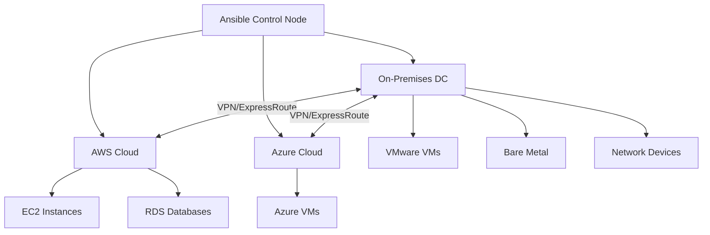

# How to Use Ansible to Set Up Hybrid Cloud Infrastructure

Author: [nawazdhandala](https://www.github.com/nawazdhandala)

Tags: Ansible, Hybrid Cloud, On-Premises, Cloud Migration, Infrastructure

Description: Set up and manage hybrid cloud infrastructure with Ansible bridging on-premises data centers and public cloud environments.

---

Hybrid cloud is not just a buzzword. Many organizations have real reasons for keeping some workloads on-premises while running others in the public cloud. Compliance requirements, latency-sensitive applications, legacy systems, and cost optimization all drive hybrid architectures. The challenge is managing both environments consistently. Ansible handles this well because it does not care where a server lives, only that it can reach it over SSH or WinRM.

This guide covers setting up a hybrid cloud infrastructure with Ansible, including connectivity, inventory management, and consistent configuration across on-premises and cloud resources.

## Hybrid Cloud Architecture



## Connectivity Requirements

The first thing to solve is network connectivity. Your Ansible control node needs to reach servers in both environments.

```yaml
# For on-premises, Ansible connects directly
# For cloud, you have several options:
# 1. VPN tunnel from on-prem to cloud (best for production)
# 2. SSH jump host / bastion
# 3. Ansible control node in the cloud with VPN back to on-prem

# ansible.cfg
[defaults]
inventory = inventory/
host_key_checking = False
timeout = 30
forks = 20

[ssh_connection]
ssh_args = -o ControlMaster=auto -o ControlPersist=60s
pipelining = True
```

For environments behind a bastion host, configure SSH ProxyJump.

```yaml
# inventory/group_vars/cloud_servers.yml
---
ansible_ssh_common_args: '-o ProxyJump=bastion@bastion.example.com'
```

## Inventory Structure

A well-organized inventory separates physical location from logical role.

```yaml
# inventory/hybrid.yml
---
all:
  children:
    # Location-based groups
    on_premises:
      children:
        dc_east:
          hosts:
            onprem-web-01:
              ansible_host: 10.0.1.10
            onprem-web-02:
              ansible_host: 10.0.1.11
            onprem-db-01:
              ansible_host: 10.0.1.20
        dc_west:
          hosts:
            onprem-app-01:
              ansible_host: 10.1.1.10
      vars:
        location: on_premises
        ansible_user: deploy
        ansible_ssh_private_key_file: ~/.ssh/onprem-deploy

    cloud_aws:
      hosts:
        aws-web-01:
          ansible_host: 172.16.1.10
        aws-web-02:
          ansible_host: 172.16.1.11
        aws-app-01:
          ansible_host: 172.16.2.10
      vars:
        location: aws
        ansible_user: ubuntu
        ansible_ssh_private_key_file: ~/.ssh/aws-deploy

    cloud_azure:
      hosts:
        azure-web-01:
          ansible_host: 172.17.1.10
        azure-app-01:
          ansible_host: 172.17.2.10
      vars:
        location: azure
        ansible_user: deploy
        ansible_ssh_private_key_file: ~/.ssh/azure-deploy

    # Role-based groups that span locations
    webservers:
      hosts:
        onprem-web-01:
        onprem-web-02:
        aws-web-01:
        aws-web-02:
        azure-web-01:

    appservers:
      hosts:
        onprem-app-01:
        aws-app-01:
        azure-app-01:

    databases:
      hosts:
        onprem-db-01:
```

## VPN Connectivity Setup

Use Ansible to configure the VPN tunnels that connect your environments.

```yaml
# playbooks/setup-vpn.yml
---
- name: Configure site-to-site VPN
  hosts: localhost
  gather_facts: false

  tasks:
    # Create AWS VPN Gateway
    - name: Create VPN Gateway in AWS
      amazon.aws.ec2_vpc_vgw:
        vpc_id: vpc-0123456789abcdef0
        name: hybrid-vpn-gateway
        type: ipsec.1
        region: us-east-1
        state: present
      register: vpn_gw

    # Create Customer Gateway (represents the on-prem side)
    - name: Create Customer Gateway
      amazon.aws.ec2_customer_gateway:
        ip_address: 203.0.113.1
        name: onprem-datacenter
        bgp_asn: 65000
        region: us-east-1
        state: present
      register: customer_gw

    # Create the VPN connection
    - name: Create VPN Connection
      amazon.aws.ec2_vpc_vpn:
        vpn_gateway_id: "{{ vpn_gw.vgw.id }}"
        customer_gateway_id: "{{ customer_gw.gateway.customer_gateway_id }}"
        type: ipsec.1
        static_only: true
        routes:
          - 10.0.0.0/8
        region: us-east-1
        state: present
        tags:
          Name: hybrid-vpn-connection
      register: vpn_connection

- name: Configure on-premises VPN endpoint
  hosts: vpn_gateway
  become: true

  tasks:
    # Configure StrongSwan on the on-prem side
    - name: Install StrongSwan
      ansible.builtin.apt:
        name:
          - strongswan
          - strongswan-pki
        state: present

    - name: Configure IPSec connection
      ansible.builtin.template:
        src: ipsec.conf.j2
        dest: /etc/ipsec.conf
        mode: '0600'
      notify: restart strongswan

    - name: Configure IPSec secrets
      ansible.builtin.template:
        src: ipsec.secrets.j2
        dest: /etc/ipsec.secrets
        mode: '0600'
      notify: restart strongswan

  handlers:
    - name: restart strongswan
      ansible.builtin.service:
        name: strongswan-starter
        state: restarted
```

## Consistent Base Configuration

Apply the same base configuration everywhere, regardless of location.

```yaml
# playbooks/base-config-hybrid.yml
---
- name: Apply base configuration to all hybrid infrastructure
  hosts: all
  become: true

  vars:
    # NTP servers differ by location
    ntp_servers:
      on_premises:
        - 10.0.0.1
        - 10.0.0.2
      aws:
        - 169.254.169.123
      azure:
        - time.windows.com

  tasks:
    - name: Update packages
      ansible.builtin.apt:
        update_cache: true
        cache_valid_time: 3600
      when: ansible_os_family == "Debian"

    - name: Install common packages
      ansible.builtin.apt:
        name:
          - curl
          - wget
          - vim
          - htop
          - net-tools
          - jq
          - ntp
        state: present
      when: ansible_os_family == "Debian"

    # Configure NTP based on location
    - name: Configure NTP servers
      ansible.builtin.template:
        src: ntp.conf.j2
        dest: /etc/ntp.conf
        mode: '0644'
      vars:
        ntp_server_list: "{{ ntp_servers[location] }}"
      notify: restart ntp

    # Centralized logging to on-prem SIEM
    - name: Configure rsyslog forwarding
      ansible.builtin.copy:
        dest: /etc/rsyslog.d/50-central-logging.conf
        content: |
          # Forward all logs to central syslog server
          *.* @@syslog.internal.example.com:514
        mode: '0644'
      notify: restart rsyslog

    # Set up monitoring agent
    - name: Install monitoring agent
      ansible.builtin.apt:
        name: prometheus-node-exporter
        state: present

    - name: Configure node exporter
      ansible.builtin.service:
        name: prometheus-node-exporter
        state: started
        enabled: true

  handlers:
    - name: restart ntp
      ansible.builtin.service:
        name: ntp
        state: restarted
    - name: restart rsyslog
      ansible.builtin.service:
        name: rsyslog
        state: restarted
```

## Application Deployment Across Environments

Deploy the same application to servers in both environments.

```yaml
# playbooks/deploy-app-hybrid.yml
---
- name: Deploy application across hybrid infrastructure
  hosts: webservers
  become: true
  serial: "{{ '50%' if location == 'on_premises' else '1' }}"

  vars:
    app_version: "{{ lookup('env', 'APP_VERSION') | default('latest') }}"

  tasks:
    - name: Download application package
      ansible.builtin.get_url:
        url: "https://releases.myapp.com/v{{ app_version }}/myapp.tar.gz"
        dest: /tmp/myapp.tar.gz
        mode: '0644'

    - name: Extract application
      ansible.builtin.unarchive:
        src: /tmp/myapp.tar.gz
        dest: /opt/myapp/
        remote_src: true
      notify: restart myapp

    # Configuration varies slightly by environment
    - name: Deploy environment-specific config
      ansible.builtin.template:
        src: app-config.yml.j2
        dest: /opt/myapp/config.yml
        mode: '0640'
      vars:
        db_host: "{{ 'onprem-db-01.internal' if location == 'on_premises' else 'db-' + location + '.rds.amazonaws.com' }}"
        cache_host: "{{ 'redis.internal' if location == 'on_premises' else 'redis.' + location + '.cache.amazonaws.com' }}"
      notify: restart myapp

  handlers:
    - name: restart myapp
      ansible.builtin.service:
        name: myapp
        state: restarted
```

## Service Discovery Between Environments

When services span locations, you need cross-environment service discovery.

```yaml
# playbooks/configure-service-discovery.yml
---
- name: Configure Consul for hybrid service discovery
  hosts: all
  become: true

  vars:
    consul_datacenter: "{{ location | replace('_', '-') }}"
    consul_wan_join:
      - consul-server.dc-east.internal
      - consul-server.aws.internal
      - consul-server.azure.internal

  tasks:
    - name: Install Consul
      ansible.builtin.apt:
        name: consul
        state: present

    - name: Configure Consul agent
      ansible.builtin.template:
        src: consul-config.json.j2
        dest: /etc/consul.d/config.json
        mode: '0640'
        owner: consul
      notify: restart consul

    - name: Start Consul
      ansible.builtin.service:
        name: consul
        state: started
        enabled: true

  handlers:
    - name: restart consul
      ansible.builtin.service:
        name: consul
        state: restarted
```

## Health Checks Across Environments

Monitor that connectivity and services are working across all environments.

```yaml
# playbooks/hybrid-health-check.yml
---
- name: Hybrid infrastructure health check
  hosts: all
  become: true

  tasks:
    # Check VPN connectivity
    - name: Test connectivity to on-prem services
      ansible.builtin.command:
        cmd: "ping -c 3 -W 2 {{ item }}"
      loop:
        - 10.0.1.10
        - 10.0.1.20
      changed_when: false
      failed_when: false
      register: onprem_ping
      when: location != "on_premises"

    # Check service availability
    - name: Test database connectivity
      ansible.builtin.command:
        cmd: "pg_isready -h {{ db_host }} -p 5432"
      changed_when: false
      when: "'appservers' in group_names"

    # Check DNS resolution across environments
    - name: Test cross-environment DNS
      ansible.builtin.command:
        cmd: "dig +short {{ item }}"
      loop:
        - db.internal.example.com
        - api.example.com
        - redis.internal.example.com
      changed_when: false
      register: dns_checks

    - name: Report DNS results
      ansible.builtin.debug:
        msg: "{{ item.item }}: {{ item.stdout_lines }}"
      loop: "{{ dns_checks.results }}"
      loop_control:
        label: "{{ item.item }}"
```

## Disaster Recovery Failover

Automate failover between on-premises and cloud during a disaster.

```yaml
# playbooks/failover-to-cloud.yml
---
- name: Failover from on-premises to cloud
  hosts: localhost
  gather_facts: false

  tasks:
    # Scale up cloud instances
    - name: Increase cloud web server count
      amazon.aws.ec2_instance:
        name: "failover-web-{{ item }}"
        instance_type: t3.large
        image_id: ami-0c55b159cbfafe1f0
        key_name: deploy-key
        vpc_subnet_id: subnet-0123456789abcdef0
        security_group: sg-0123456789abcdef0
        state: running
        wait: true
      loop: ["01", "02", "03", "04"]

    # Update DNS to point to cloud
    - name: Update DNS for failover
      amazon.aws.route53:
        zone: example.com
        record: api.example.com
        type: A
        value:
          - "172.16.1.10"
          - "172.16.1.11"
        ttl: 60
        overwrite: true
        state: present
```

## Lessons from Running Hybrid

1. **Latency between environments is real.** A database call that takes 1ms on-premises will take 10-50ms over a VPN. Design your application architecture to minimize cross-environment calls.
2. **DNS is the glue.** Use split-horizon DNS so the same service name resolves to the nearest endpoint. On-premises servers should resolve `db.internal` to the local database, while cloud servers resolve it to the cloud replica.
3. **Monitor the VPN tunnel.** A flapping VPN connection will cause intermittent failures that are hard to debug. Set up alerts on tunnel state and packet loss.
4. **Start with a single source of truth.** Your Ansible inventory should be the definitive list of all infrastructure, regardless of where it runs. This single view is invaluable during incidents.
5. **Test failover regularly.** A disaster recovery plan that has never been tested is not a plan. Schedule quarterly failover drills and automate them with Ansible.

Hybrid cloud with Ansible works because Ansible treats every server the same. Whether it is a VMware VM in your datacenter or an EC2 instance in us-east-1, the same playbooks apply the same configuration. That consistency is what makes hybrid manageable at scale.
